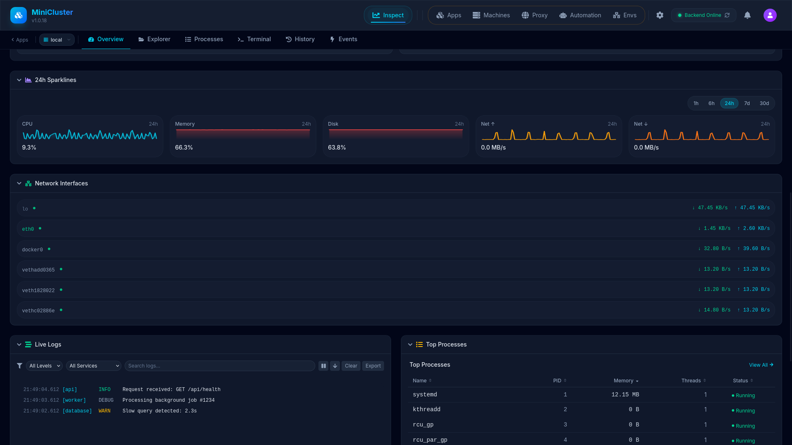
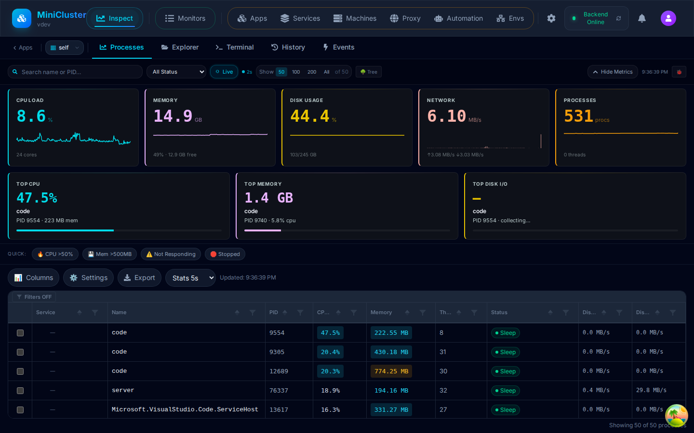
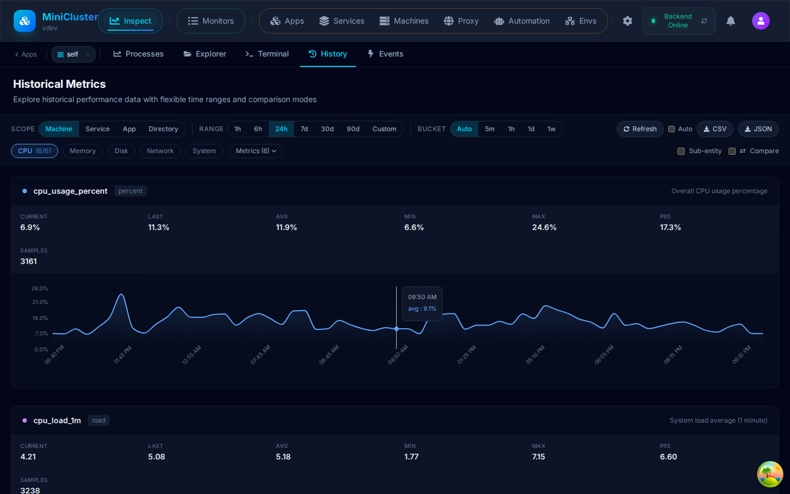
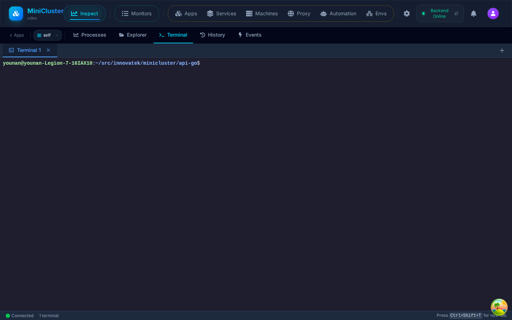
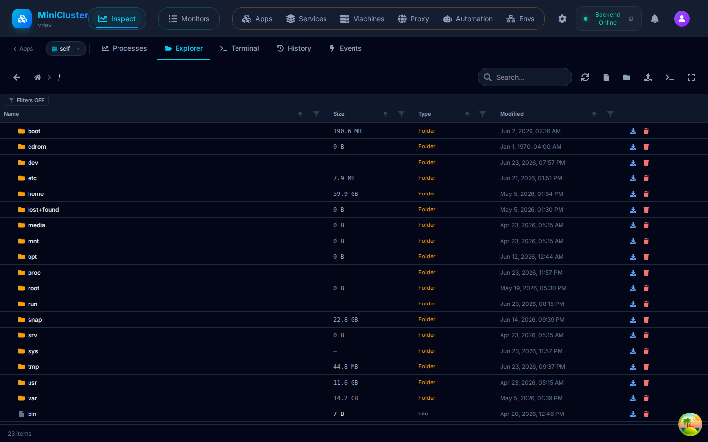

<div align="center">

# ⚡ MiniCluster

**The lightweight platform to deploy, manage, and monitor all your processes — from a beautiful web dashboard or CLI.**

[](https://github.com/innovatekswd/mini-cluster/releases/latest)
[](https://github.com/innovatekswd/mini-cluster)
[](https://github.com/innovatekswd/mini-cluster#-quick-start)
[](https://github.com/innovatekswd/mini-cluster#-quick-start)

<br>

[Quick Start](#-quick-start) • [See It In Action](#-see-it-in-action) • [CLI Reference](#-cli--mc) • [Downloads](#-downloads)

</div>

---

## 🚀 Quick Start

### One-command install. Open your browser. Done.

**Linux:**
```bash
curl -fsSL https://raw.githubusercontent.com/innovatekswd/mini-cluster/main/install.sh | bash
```

**Windows (PowerShell as Administrator):**
```powershell
irm https://raw.githubusercontent.com/innovatekswd/mini-cluster/main/install.ps1 | iex
```

> Open **http://localhost:2016** — you're in.

| Customize | Linux | Windows |
|-----------|-------|---------|
| Custom port | `MINICLUSTER_PORT=9000 curl ... \| bash` | `$env:MINICLUSTER_PORT="9000"; irm ... \| iex` |
| Specific version | `MINICLUSTER_VERSION=1.0.20 curl ... \| bash` | `$env:MINICLUSTER_VERSION="1.0.20"; irm ... \| iex` |

---

## 🖥️ See It In Action

### Operations Cockpit — System overview at a glance



Widget-based dashboard with live system metrics (CPU, memory, disk, network), top consumers, service health, process list with service-linked prioritization, recent events, and sparkline trends. All metrics via REST polling at 2-second cadence.


### Process Manager — Every process, every metric, in real time



CPU, memory, I/O, threads, file descriptors — sort, filter, and inspect every process on the machine. Drill into services, kill rogue processes, adjust priorities.

---

### File Explorer — Browse, edit, upload, download


Navigate the server filesystem from your browser. Syntax-highlighted code editor, upload/download with progress, create folders, delete files — no SSH needed.

---

### Historical Metrics — Analyze performance over time



Flexible time ranges (1h → 90d), selectable metrics, comparison mode vs previous day/week/month. Export to CSV or JSON. Powered by time-bucketed aggregation for fast queries.

---

### Web Terminal — Full PTY in your browser



Interactive terminal session right in the dashboard. Run commands, edit configs, tail logs — everything you'd do over SSH, now in one place.

---

### Directory Explorer — Track folder sizes over time



Monitor directory growth, file counts, and storage trends. Set up watched directories and view historical size data.

---

## 🎯 What is MiniCluster?

MiniCluster is a **self-hosted** platform that gives you complete control over your applications, services, and containers:

| | |
|---|---|
| 🖥️ **Web Dashboard** | Manage everything from a modern, reactive browser UI |
| ⌨️ **`mc` CLI** | Full-featured command-line tool for automation and scripting |
| ⚙️ **Process Manager** | Auto-restart, health checks, log capture, environment management |
| 📊 **Real-Time Metrics** | CPU, memory, disk, network — historical charts and live monitoring |
| 📦 **Package Registry** | Build, publish, and deploy `.mcpkg` packages |
| 🐳 **Docker Integration** | Container-type services with image, volume, and network management |
| 🔐 **JWT Authentication** | Role-based access (Admin, Operator, Viewer) out of the box |
| 🐧🪟 **Cross-Platform** | First-class Linux and Windows support |
| 🪶 **Lightweight** | Single binary, SQLite storage, minimal resource footprint |

---

## 🎯 First Steps with the CLI

Once MiniCluster is running, the `mc` CLI gives you full control:

```bash
# 1. Log in
mc login --server http://localhost:2016

# 2. Verify connection
mc version

# 3. Create your first app
mc app create my-api --type web --dir /path/to/app

# 4. Start it
mc service start my-api

# 5. Watch live logs
mc service logs my-api -f

# 6. See everything running
mc service list
```

> 💡 CLI config is at `~/.minicluster/config.yaml`. Use **contexts** to manage multiple servers.

## 🏗️ Architecture

```
┌─────────────────────────────────────────────────┐
│               MiniCluster Server                 │
│  ┌──────────────┐     ┌──────────────────────┐  │
│  │   Web UI     │     │   Process Manager    │  │
│  │  (Dashboard) │     │  (apps / services /  │  │
│  │              │     │   containers)        │  │
│  └──────┬───────┘     └──────────┬───────────┘  │
│         └────────────┬───────────┘              │
│                REST API (:2016)                 │
└──────────────────────┬──────────────────────────┘
                       │
          ┌────────────┴────────────┐
          │                         │
     ┌────┴────┐              ┌─────┴─────┐
     │  Web    │              │  mc CLI   │
     │ Browser │              │ (terminal) │
     └─────────┘              └───────────┘
```

---

## 📦 Downloads

### Quick Download — v1.0.25

| Platform | Download |
|----------|----------|
| 🐧 Linux (.deb) | [minicluster_1.0.25_amd64.deb](https://github.com/innovatekswd/mini-cluster/releases/download/v1.0.25/minicluster_1.0.25_amd64.deb) |
| 🐧 Linux (.tar.gz amd64) | [minicluster-api-1.0.25-linux-amd64.tar.gz](https://github.com/innovatekswd/mini-cluster/releases/download/v1.0.25/minicluster-api-1.0.25-linux-amd64.tar.gz) |
| 🐧 CLI (standalone) | [mc-linux-amd64](https://github.com/innovatekswd/mini-cluster/releases/download/v1.0.25/mc-linux-amd64) |

> 📂 **Browse all releases** on the [GitHub Releases page](https://github.com/innovatekswd/mini-cluster/releases).

### Package Contents

| Platform | Package | Contents |
|----------|---------|----------|
| 🐧 Linux (deb) | `minicluster_<version>_amd64.deb` | API server + CLI — installs as systemd service |
| 🐧 Linux (tar) amd64 | `minicluster-api-<version>-linux-amd64.tar.gz` | API server + CLI + config + systemd unit |
| 🐧 Linux (tar) arm64 | `minicluster-api-<version>-linux-arm64.tar.gz` | API server + CLI + config + systemd unit |
| 🪟 Windows | `minicluster-<version>-windows-amd64.zip` | API server + CLI + PowerShell installer |

### Direct Download URLs

Replace `<version>` with any release number (e.g. `1.0.18`):

```
# Linux .deb
https://github.com/innovatekswd/mini-cluster/releases/download/v<version>/minicluster_<version>_amd64.deb

# Linux tarball (amd64)
https://github.com/innovatekswd/mini-cluster/releases/download/v<version>/minicluster-api-<version>-linux-amd64.tar.gz

# Linux tarball (arm64)
https://github.com/innovatekswd/mini-cluster/releases/download/v<version>/minicluster-api-<version>-linux-arm64.tar.gz

# Windows ZIP
https://github.com/innovatekswd/mini-cluster/releases/download/v<version>/minicluster-<version>-windows-amd64.zip

# CLI (standalone)
https://github.com/innovatekswd/mini-cluster/releases/download/v<version>/mc-linux-amd64
```

---

## 🔧 Installation Details

### Linux — Debian/Ubuntu (.deb)

```bash
# Download & install
wget https://github.com/innovatekswd/mini-cluster/releases/download/v1.0.18/minicluster_1.0.18_amd64.deb
sudo dpkg -i minicluster_1.0.18_amd64.deb

# Start & check
sudo systemctl start minicluster
sudo systemctl status minicluster
```

**After install:**

| Item | Path / URL |
|------|------------|
| Dashboard | http://localhost:2016 |
| Config file | `/etc/minicluster/config.yaml` |
| Data directory | `/var/lib/minicluster` |
| Logs | `journalctl -u minicluster -f` |

### Linux — Tarball (manual)

```bash
wget https://github.com/innovatekswd/mini-cluster/releases/download/v1.0.18/minicluster-api-1.0.18-linux-amd64.tar.gz
tar -xzf minicluster-api-1.0.18-linux-amd64.tar.gz
cd minicluster

# Run directly
chmod +x minicluster-api mc
./minicluster-api

# Or install system-wide
sudo cp minicluster-api mc /usr/local/bin/
```

### Windows

**Option 1 — Installer (recommended)**

1. Download `minicluster-<version>-windows-amd64.zip`
2. Extract the ZIP
3. Right-click PowerShell → **Run as Administrator**

```powershell
cd minicluster-<version>-windows-amd64
.\install.ps1
```

Installer parameters:

```powershell
.\install.ps1 -Port 9000                        # custom port
.\install.ps1 -InstallDir "C:\mc"               # custom install path
.\install.ps1 -DataDir "D:\mc-data"             # custom data directory
.\install.ps1 -Uninstall                        # remove
```

**After install:**

| Item | Path / URL |
|------|------------|
| Dashboard | http://localhost:2016 |
| Config | `%ProgramFiles%\MiniCluster\config.yaml` |
| Data | `%ProgramData%\MiniCluster` |
| Binaries | Added to system `PATH` |

**Option 2 — Run directly (no install)**

```powershell
.\minicluster-api.exe
# Open http://localhost:2016
```

---

## ⚙️ Configuration

### Environment Variables

All config values can be overridden with environment variables using the `MINICLUSTER_` prefix:

| Variable | Default | Description |
|----------|---------|-------------|
| `MINICLUSTER_PORT` | `2016` | HTTP port for the API and dashboard |
| `MINICLUSTER_DATA_DIR` | `/var/lib/minicluster` | Data directory for persistent storage |
| `MINICLUSTER_AUTHENTICATION_ENABLED` | `true` | Enable/disable authentication |
| `MINICLUSTER_AUTHENTICATION_JWT_SECRET` | *(auto-generated)* | JWT signing secret |

**Example:**

```bash
MINICLUSTER_PORT=9000 MINICLUSTER_DATA_DIR=/srv/mc ./minicluster-api
```

### Changing the Port (Linux .deb)

```bash
# Option 1: Edit config file
sudo nano /etc/minicluster/config.yaml   # set port: 9000
sudo systemctl restart minicluster

# Option 2: Environment variable
sudo systemctl edit minicluster
# Add under [Service]:
# Environment=MINICLUSTER_PORT=9000
sudo systemctl restart minicluster
```

---

## ⚡ CLI — `mc`

The `mc` command-line tool is your primary interface to MiniCluster from the terminal, scripts, and CI/CD pipelines. It's included in every package and communicates with the MiniCluster API server over HTTP.

### Authentication

Before using any command, you must authenticate with the server:

```bash
# Interactive login (prompts for username and password)
mc login

# Login with username (prompts for password securely)
mc login --username admin

# Login to a specific server
mc login --server http://192.168.1.100:2016

# Use an existing JWT token directly
mc login --token eyJhbGciOiJIUzI1NiIsInR5cCI6...

# Check current authentication status
mc login --status

# Logout (remove stored credentials)
mc logout

# Logout from all servers
mc logout --all
```

**How it works:** Credentials are stored in `~/.minicluster/credentials.json`. The token is automatically attached to all subsequent API requests.

### Multi-Server Management (Contexts)

Manage connections to multiple MiniCluster servers using named contexts:

```bash
# View all configuration
mc config get

# List all available contexts
mc config contexts

# Add and switch to a staging server
mc config set-context staging --server http://staging-host:2016
mc config use-context staging

# Show the currently active context
mc config current-context

# Switch back to default
mc config use-context default
```

**Example config file** (`~/.minicluster/config.yaml`):

```yaml
context: production
contexts:
  production:
    server:
      url: https://prod.example.com:2016
    auth:
      token: eyJhbGciOi...
  staging:
    server:
      url: https://staging.example.com:2016
    auth:
      token: eyJhbGciOi...
  local:
    server:
      url: http://localhost:2016
    auth:
      token: local-dev-token
output:
  format: table
  no_color: false
```

### App Management

Apps are logical groupings for related services (e.g., "Backend", "Frontend", "Monitoring"):

```bash
# List all apps with service statistics
mc app list
mc app list -o json

# Get detailed information about an app
mc app get my-app
mc app get "My App" -o json

# Create a new app
mc app create "Backend Services"
mc app create "Frontend" --description "Web applications" --icon "🌐" --color "#3b82f6"

# Update app settings
mc app update my-app --description "Updated description"

# Delete an app (services become unassigned, not deleted)
mc app delete my-app
mc app delete my-app --yes    # skip confirmation prompt

# Clone an app with all its services
mc app clone my-app
```

**Output example** (`mc app list`):

```
NAME              SERVICES  RUNNING  STOPPED  CREATED
────────────────  ────────  ───────  ───────  ──────────────────
Backend Services  5         4        1        2026-01-15 10:30:00
Frontend          3         3        0        2026-01-16 14:22:00
Monitoring        2         2        0        2026-02-01 09:00:00
```

### Service Control

Services are the core unit of MiniCluster. Each service represents a managed process or container with lifecycle control, auto-restart, health checks, and log capture:

```bash
# List all services with current status
mc service list
mc service list -o json

# Get detailed information about a service
mc service get my-api
mc service get "API Server" -o json

# Start a stopped service
mc service start my-api
mc service start "API Server"

# Stop a running service
mc service stop my-api

# Restart a service (stop then start)
mc service restart my-api

# Get runtime status of all services
mc service status

# Get status of a specific service
mc service status my-api

# Clone a service with its full configuration
mc service clone my-api

# Delete a service (must be stopped first)
mc service delete my-api
mc service delete my-api --yes
```

**Services can be identified by name or ID** — both work interchangeably in all commands.

### Streaming Logs

View and stream real-time logs from any service:

```bash
# View the last 100 lines of logs
mc service logs my-api

# Follow/stream logs in real-time (like tail -f)
mc service logs my-api -f

# Show last N lines
mc service logs my-api --tail 500

# Combine with --no-color for piping to files
mc service logs my-api --tail 1000 --no-color > api-logs.txt
```

**Tips:**
- Use `-f` (follow) to stream logs live — press `Ctrl+C` to stop
- Use `--tail N` to control how many historical lines are shown before streaming begins
- Logs include both stdout and stderr from the managed process
- Logs are persisted in the server's SQLite database and survive service restarts

### Container Management

MiniCluster has deep Docker integration for managing container-type services, images, volumes, and networks.

#### Container Runtime & Info

```bash
# Show Docker runtime information (version, containers, images)
mc container runtime

# List all containers
mc container list

# Start, stop, or restart a container
mc container start my-container
mc container stop my-container
mc container restart my-container

# Stream container logs
mc container logs my-container -f
```

#### Docker Images

```bash
# List local Docker images
mc container images list

# Pull an image from a registry
mc container images pull nginx:latest
mc container images pull postgres:16

# Remove a local image
mc container images remove nginx:latest
mc container images rm nginx:latest    # shorthand
```

#### Container Configuration for Services

Each service can have a container configuration that defines how it runs as a Docker container:

```bash
# View the container config for a service
mc container config get my-service

# Set container configuration
mc container config set my-service \
  --image nginx \
  --tag latest \
  --ports "8080:80,8443:443" \
  --volumes "/data:/usr/share/nginx/html:ro" \
  --network my-network \
  --memory 512 \
  --cpu 1.0 \
  --entrypoint "/docker-entrypoint.sh" \
  --command "nginx -g 'daemon off;'" \
  --user "nginx" \
  --workdir "/usr/share/nginx/html" \
  --privileged=false \
  --read-only=true \
  --remove-on-stop=true \
  --labels "app=web,env=production"

# Delete container config (service reverts to process mode)
mc container config delete my-service
mc container config rm my-service
```

**Container config flags:**

| Flag | Description |
|------|-------------|
| `--image` | Docker image name |
| `--tag` | Image tag (default: `latest`) |
| `--registry` | Private registry URL |
| `--pull-policy` | Pull policy: `always`, `missing`, `never` |
| `--ports` | Port mappings (comma-separated `host:container`) |
| `--volumes` | Volume mounts (comma-separated `host:container[:options]`) |
| `--network` | Docker network name |
| `--memory` | Memory limit in MB |
| `--cpu` | CPU limit (e.g., `1.5` for 1.5 cores) |
| `--entrypoint` | Container entrypoint override |
| `--command` | Container command override |
| `--user` | Run as user |
| `--workdir` | Working directory inside container |
| `--privileged` | Run in privileged mode |
| `--read-only` | Read-only root filesystem |
| `--remove-on-stop` | Remove container when service stops |
| `--labels` | Docker labels (comma-separated `key=value`) |

#### Container Stats & Exec

```bash
# Show CPU/memory/network stats for a container
mc container stats my-service

# Execute a command inside a running container
mc container exec my-service ls -la /app
mc container exec my-service cat /etc/nginx/nginx.conf
mc container exec my-service sh -c "echo hello"
```

#### Docker Volumes & Networks

```bash
# List all Docker volumes
mc container volumes list

# Create a named volume
mc container volumes create my-data
mc container volumes create my-data --driver local --label "backup=daily"

# Remove a volume
mc container volumes remove my-data

# List all Docker networks
mc container networks list

# Create a network
mc container networks create my-network
mc container networks create my-network --driver bridge --subnet "172.20.0.0/16"

# Remove a network
mc container networks remove my-network
```

### File Management

Upload, download, and manage files on the MiniCluster server:

```bash
# List files in the root directory
mc file list

# List files in a specific folder
mc file list prod
mc file list backup/2026-01

# Upload a file
mc file upload ./config.json prod
mc file upload ~/data.csv backup/data

# Upload multiple files with a glob pattern
mc file upload-bulk "*.json" prod
mc file upload-bulk "./data/*.csv" backup/data

# Download a file
mc file download prod/config.json ./config.json
mc file download backup/data/data.csv ~/downloads/

# Download an entire folder (downloaded as zip and extracted)
mc file download prod/configs ./local-configs
mc file download backup/2026-01 ~/backups/january
```

**Notes:**
- File paths with spaces should be quoted: `mc file upload "./my file.json" prod`
- Folder downloads are automatically zipped server-side and extracted locally
- The `--no-progress` flag disables the upload/download progress bar for scripting

### Package Registry

MiniCluster includes a built-in package registry for publishing, discovering, and installing heterogeneous multi-component packages (`.mcpkg`):

```bash
# List all packages in the registry
mc registry list

# Filter by name
mc registry list --name my-package

# Filter by tag
mc registry list --tag production

# Show all versions of a package
mc registry versions my-package

# Show details of a specific version
mc registry show my-package
mc registry show my-package@1.2.0

# Search packages by keyword
mc registry search "web server"

# Install the latest version
mc install my-package

# Install a specific version
mc install my-package@1.2.0

# List installed packages
mc registry installs

# Uninstall a package
mc registry uninstall <installation-id>

# Delete a package version from the registry
mc registry delete my-package@1.0.0
mc registry delete my-package          # delete all versions
```

#### Publishing Packages

```bash
# Publish a directory (reads name/version from manifest.json)
mc registry push ./my-package-dir

# Publish with overrides
mc registry push ./my-package-dir \
  --name my-package \
  --version 1.0.0 \
  --description "My awesome package" \
  --author "Your Name" \
  --tags "web,api,server"

# Publish a pre-built .mcpkg file
mc registry push my-package-1.0.0.mcpkg \
  --name my-package \
  --version 1.0.0
```

**Directory structure for publishing:**

```
my-package-dir/
├── manifest.json        # Required: defines components and metadata
├── .mcignore           # Optional: patterns to exclude from package
├── frontend/
│   └── ...
├── backend/
│   └── ...
└── config/
    └── ...
```

### Package Building & Inspection

Build and validate `.mcpkg` packages locally before publishing:

```bash
# Initialize a new package directory with a template manifest.json
mc package init
mc package init ./my-package

# Validate a package directory
mc package validate
mc package validate ./my-package

# Build a .mcpkg file from a directory
mc package build
mc package build ./my-package

# Push (build + publish in one step)
mc package push ./my-package

# Inspect a .mcpkg file — show components and required env vars
mc inspect my-package-1.0.0.mcpkg
mc inspect my-package@1.2.0          # inspect from registry
```

### Output Formats

All commands that produce output support multiple formats via the `--output` (`-o`) flag:

```bash
# Human-readable table (default)
mc app list
mc app list -o table

# JSON output — ideal for scripting and jq processing
mc app list -o json

# YAML output
mc app list -o yaml

# Quiet mode — only essential output (useful for CI/CD)
mc service start my-api -o quiet
```

**Scripting example:**

```bash
# Get all running service names
mc service list -o json | jq -r '.[] | select(.status == "Running") | .name'

# Stop all services in an app
mc app get "Backend" -o json | jq -r '.services[].name' | while read svc; do
  mc service stop "$svc" -y
done

# Check if a service is healthy
status=$(mc service status my-api -o json | jq -r '.health')
if [ "$status" = "healthy" ]; then
  echo "Service is healthy!"
fi
```

### Global Flags

These flags are available on every command:

| Flag | Short | Default | Description |
|------|-------|---------|-------------|
| `--config` | `-c` | `~/.minicluster/config.yaml` | Path to configuration file |
| `--server` | `-s` | `http://localhost:2016` | MiniCluster API server URL |
| `--token` | `-t` | *(from credentials)* | Authentication token override |
| `--output` | `-o` | `table` | Output format: `table`, `json`, `yaml`, `quiet` |
| `--context` | | *(active context)* | Named context from config file |
| `--no-color` | | `false` | Disable colored output |
| `--verbose` | `-v` | `false` | Show additional detail in output |
| `--debug` | | `false` | Show raw HTTP API calls for troubleshooting |
| `--timeout` | | `30s` | Request timeout duration |
| `--yes` | `-y` | `false` | Skip confirmation prompts (non-interactive mode) |

**Environment variables:** You can also configure the CLI using environment variables:

| Variable | Equivalent Flag |
|----------|----------------|
| `MC_SERVER_URL` | `--server` |
| `MC_AUTH_TOKEN` | `--token` |
| `MC_OUTPUT_FORMAT` | `--output` |
| `MC_CONTEXT` | `--context` |

### Shell Completions

Generate auto-completion scripts for popular shells:

```bash
# Bash
mc completion bash > /etc/bash_completion.d/mc
# Or for current session:
source <(mc completion bash)

# Zsh
mc completion zsh > "${fpath[1]}/_mc"

# Fish
mc completion fish > ~/.config/fish/completions/mc.fish
```

After installing completions, you can tab-complete commands, flags, and in some cases service/app names.

### Command Reference

| Command | Description |
|---------|-------------|
| `mc app` | Manage applications |
| `mc service` | Manage services (start/stop/logs/deploy) |
| `mc container` | Manage container-type services and Docker resources |
| `mc file` | Remote file manager (upload/download/list) |
| `mc package` | Build `.mcpkg` deployment packages |
| `mc registry` | Browse, search, and install from the package registry |
| `mc install` | Install a package from registry or file |
| `mc inspect` | Inspect `.mcpkg` package contents |
| `mc login` / `mc logout` | Authentication |
| `mc config` | Manage CLI configuration and contexts |
| `mc server-config` | View server configuration |
| `mc version` | Print client and server version info |
| `mc completion` | Generate shell completion scripts |

> 💡 Run `mc <command> --help` for full details on any command.

---

## 🗑️ Uninstall

### Linux (.deb)

```bash
sudo systemctl stop minicluster
sudo dpkg -r minicluster
# Data is preserved at /var/lib/minicluster — remove manually if needed
sudo rm -rf /var/lib/minicluster
```

### Windows

```powershell
# Run as Administrator
.\install.ps1 -Uninstall
```

---

## 🐛 Troubleshooting

| Problem | Solution |
|---------|----------|
| `Connection refused` on :2016 | Check service status: `sudo systemctl status minicluster` |
| Port already in use | Change port in config or set `MINICLUSTER_PORT` env var |
| `mc: command not found` | Ensure install directory is in `$PATH` |
| Authentication errors | Re-login: `mc login --server http://localhost:2016` |
| Permission denied on logs | Use `sudo journalctl -u minicluster -f` |
| Windows: script not allowed | Run `Set-ExecutionPolicy RemoteSigned -Scope CurrentUser` first |

### Viewing Logs

```bash
# Linux (systemd)
sudo journalctl -u minicluster -f

# Linux (tarball — when running directly)
./minicluster-api 2>&1 | tee minicluster.log

# Windows (PowerShell)
Get-Content -Tail 50 -Wait "$env:ProgramData\MiniCluster\logs\*.log"
```

---

## 💬 Support

- **Issues:** [github.com/innovatekswd/mini-cluster/issues](https://github.com/innovatekswd/mini-cluster/issues)
- **Source:** [github.com/innovatekswd/mini-cluster](https://github.com/innovatekswd/mini-cluster)
- **Releases:** Browse all versions in [`releases/`](releases/)
