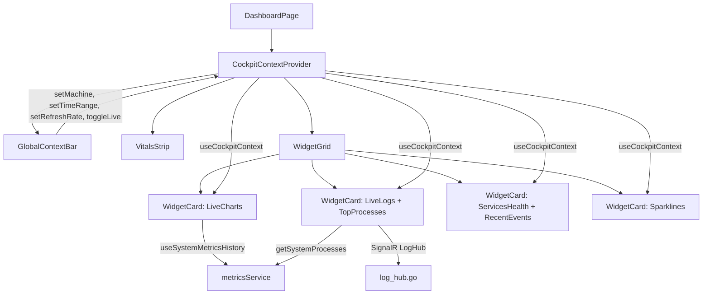

# Operations Cockpit Widget Grid — Detailed Implementation Plan

## Overview

Transform the MiniCluster Operations Cockpit from a tabbed interface into an **information-dense widget grid dashboard** with a **Global Context Bar** that cascades machine scope, time range, refresh rate, and live mode to all widgets simultaneously.

**Design Documents**:
- [`plans/ui-redesign-operations-cockpit.md`](plans/ui-redesign-operations-cockpit.md) — Full design spec (Sections 2.2, 2.3, 2.3b, 3.3)
- [`plans/cockpit-implementation-guide.md`](plans/cockpit-implementation-guide.md) — Implementation guide summary
- [`plans/cockpit-widget-grid-plan.md`](plans/cockpit-widget-grid-plan.md) — Widget grid plan

---

## Architecture Overview

### Component Hierarchy



### Data Flow

1. **CockpitContext** provides global state (machineId, timeRange, refreshRate, isLive)
2. **GlobalContextBar** renders controls and calls context setters
3. **Widgets** consume context via `useCockpitContext()` hook
4. **URL sync** keeps state in search params for shareability

---

## Implementation Steps

### Task 1: CockpitContext (ui/app/context/CockpitContext.tsx)

**Purpose**: Central state management for cockpit-wide settings.

**Interface**:
```typescript
interface TimeRange {
  type: 'relative' | 'absolute';
  value: string;  // '5m' | '15m' | '1h' | '6h' | '24h' | '7d' | '30d' | 'custom'
  from?: Date;    // Only for 'absolute' type
  to?: Date;      // Only for 'absolute' type
}

interface CockpitContextType {
  machineId: string;              // 'local' in single-machine, selected machine in multi-machine
  timeRange: TimeRange;
  refreshRate: number;            // milliseconds, 0 = off
  isLive: boolean;                // sliding window vs frozen
  setMachine: (id: string) => void;
  setTimeRange: (range: TimeRange) => void;
  setRefreshRate: (ms: number) => void;
  toggleLive: () => void;
}
```

**Implementation Details**:
- **Default values**: `machineId='local'`, `timeRange={type:'relative', value:'1h'}`, `refreshRate=5000`, `isLive=true`
- **URL sync**: Use `useSearchParams()` from React Router to persist state in URL: `/?machine=local&range=1h&refresh=5s&live=true`
- **Provider placement**: Wrap entire Operations Cockpit page at route level
- **Hook**: `useCockpitContext()` — consumed by all widgets

**Key Behaviors**:
- Parse URL params on mount to initialize state
- Update URL when state changes (debounced to avoid excessive re-renders)
- In single-machine mode, `machineId` is always `'local'` (use `useIsSingleMachine()` hook)
- In multi-machine mode, `machineId` can be `'all'` (cluster aggregate) or a specific machine ID

**Helper Functions**:
```typescript
// Convert TimeRange to Date objects for API calls
function getTimeRangeDates(timeRange: TimeRange): { from: Date; to: Date } {
  const to = new Date();
  let from: Date;
  
  if (timeRange.type === 'absolute') {
    return { from: timeRange.from || from, to: timeRange.to || to };
  }
  
  // Relative time range
  const minutes = {
    '5m': 5,
    '15m': 15,
    '1h': 60,
    '6h': 360,
    '24h': 1440,
    '7d': 10080,
    '30d': 43200,
  }[timeRange.value] || 60;
  
  from = new Date(to.getTime() - minutes * 60 * 1000);
  return { from, to };
}

// Convert refresh rate ms to URL-friendly string
function refreshRateToString(ms: number): string {
  if (ms === 0) return 'off';
  if (ms < 1000) return `${ms}ms`;
  return `${ms / 1000}s`;
}

// Parse URL refresh rate string to ms
function parseRefreshRate(str: string): number {
  if (str === 'off') return 0;
  if (str.endsWith('ms')) return parseInt(str);
  if (str.endsWith('s')) return parseInt(str) * 1000;
  if (str.endsWith('m')) return parseInt(str) * 60 * 1000;
  return 5000; // default
}
```

**Testing Considerations**:
- Test URL parsing and serialization
- Test default values when URL params are missing
- Test single-machine vs multi-machine behavior

---

### Task 2: GlobalContextBar (ui/app/components/GlobalContextBar.tsx)

**Purpose**: Render controls for machine scope, time range, refresh rate, and live mode.

**Layout**:
```
[🖥 local ▾]  [⏱ Last 1h ▾]  [🔄 5s ▾]  [🔴 LIVE]
```

**Components**:

#### 2a. Machine Scope Selector
- **Single-machine mode**: Hide dropdown, show static "🖥 local" label
- **Multi-machine mode**: Dropdown with:
  - "All Machines (Cluster)" → `machineId='all'`
  - Individual machine names from `useMachinesQuery()`
- **Implementation**: Use `useIsSingleMachine()` hook to conditionally render

#### 2b. Time Range Picker
- **Options**: `5m`, `15m`, `1h`, `6h`, `24h`, `7d`, `30d`, `Custom`
- **Custom option**: Opens date range picker (future enhancement)
- **Display format**: "Last 1h", "Last 24h", etc.

#### 2c. Refresh Rate Selector
- **Options**: `Off`, `5s`, `15s`, `30s`, `1m`
- **Display format**: "5s", "15s", "Off"
- **Behavior**: Controls polling interval for all widgets

#### 2d. Live Mode Toggle
- **States**: 
  - 🔴 LIVE (ON) — sliding window, charts auto-scroll
  - ⏸ FROZEN (OFF) — fixed window, charts frozen
- **Implementation**: Button with icon and label

**Styling**:
- Horizontal flex layout with gap
- Dropdowns use native `<select>` or custom dropdown component
- Active state styling for LIVE button (red dot when active)
- Responsive: stack vertically on mobile

**Data Flow**:
- All state comes from `useCockpitContext()`
- No independent state — purely controlled component
- Call context setters on change

---

### Task 3: VitalsStrip (ui/app/components/VitalsStrip.tsx)

**Purpose**: Compact horizontal bar showing current system vitals.

**Layout**:
```
CPU: 45% ████████░░  Mem: 62% ██████████░░  Disk: 38% ██████░░░░
Net: ↑12 MB/s ↓45 MB/s   Svc: 🟢12 🟡1 🔴1   Alerts: ⚠️ 2
```

**Data Sources**:
- **CPU/Memory/Disk**: `useSystemMetricsHistory().current`
- **Network rates**: `current.totalNetworkSendRate`, `current.totalNetworkReceiveRate`
- **Service counts**: `useAppsWithStatsQuery()` — aggregate running/stopped/failed
- **Alert count**: Future enhancement (events API)

**Components**:

#### 3a. Progress Bars
- **CPU**: `current.cpuUsagePercent` — color-coded (green <60%, amber 60-80%, red >80%)
- **Memory**: `current.memoryUsagePercent` — same color coding
- **Disk**: `current.disks[0].usagePercent` — same color coding
- **Width**: Fixed width progress bars (e.g., 150px)

#### 3b. Network Rates
- **Format**: `formatBytesPerSecond(rate)` from `metricsService`
- **Display**: "↑12 MB/s ↓45 MB/s"

#### 3c. Service Counts
- **Aggregate**: Sum running/stopped/failed from `useAppsWithStatsQuery()`
- **Display**: "🟢12 🟡1 🔴1"

#### 3d. Alert Count
- **Placeholder**: "⚠️ 2" (future: events API)

**Styling**:
- Horizontal flex layout
- Compact typography (text-xs or text-sm)
- Progress bars with gradient fills
- Color-coded status indicators

**Reactivity**:
- Consumes `useCockpitContext()` for `machineId` (future multi-machine)
- Updates at `refreshRate` from context

---

### Task 4: LiveChartsWidget (ui/app/components/widgets/LiveChartsWidget.tsx)

**Purpose**: 2×2 grid of real-time charts (CPU, Memory, Network I/O, Disk I/O).

**Layout**:
```
┌─ CPU Usage ───────────────┐  ┌─ Memory Usage ────────────┐
│         ╭─╮               │  │      ▓▓▓▓▓▓▓▓▓▓▓▓        │
│   ╭─╮  ╭╯ ╰╮             │  │ ▓▓▓▓▓▓▓▓▓▓▓▓▓▓▓▓▓▓▓      │
│ ╭─╯ ╰──╯    ╰──          │  │ ▓▓▓▓▓▓▓▓▓▓▓▓▓▓▓▓▓▓▓      │
│ Avg: 45% │ Peak: 92%     │  │ Avg: 62% │ Peak: 81%      │
│ [View All →]             │  │ [View All →]              │
└──────────────────────────┘  └───────────────────────────┘

┌─ Network I/O ─────────────┐  ┌─ Disk I/O ────────────────┐
│  ↑12 MB/s   ↓45 MB/s     │  │  R: 45 MB/s  W: 12 MB/s   │
│  [dual-line chart]        │  │  IOPS: 1,230              │
│  [View All →]             │  │  [View All →]             │
└──────────────────────────┘  └───────────────────────────┘
```

**Data Sources**:
- `useSystemMetricsHistory()` provides:
  - `cpuHistory`, `memoryHistory`, `diskHistory` — percentage arrays
  - `networkSendHistory`, `networkReceiveHistory` — MB/s arrays
  - `timestamps` — ISO strings for X-axis
  - `current` — latest snapshot for current values

**Components**:

#### 4a. Chart Cards (4 instances)
Each chart card wraps a `RichChart` component:

1. **CPU Usage Chart**
   - Data: `cpuHistory`
   - Color: `'blue'`
   - Max value: `100`
   - Stats: avg/peak from `calcStats(cpuHistory)`
   - Link: `/machines/local/resources`

2. **Memory Usage Chart**
   - Data: `memoryHistory`
   - Color: `'violet'`
   - Max value: `100`
   - Stats: avg/peak from `calcStats(memoryHistory)`
   - Link: `/machines/local/resources`

3. **Network I/O Chart**
   - Data: `networkSendHistory` (green) + `networkReceiveHistory` (cyan)
   - **Implementation**: Two stacked `RichChart` components or single dual-line chart
   - Stats: peak for each
   - Link: `/machines/local/network`

4. **Disk I/O Chart**
   - Data: `diskHistory`
   - Color: `'amber'`
   - Max value: `100`
   - Stats: avg/peak
   - Link: `/machines/local/disks`

**RichChart Props**:
```typescript
<RichChart
  data={cpuHistory}
  timestamps={timestamps}
  color="blue"
  height={120}
  maxValue={100}
  showTimeAxis={true}
  showValueAxis={true}
  showGrid={true}
  label="CPU Usage"
  unit="%"
/>
```

**X-Axis Adaptation**:
- Time range from `useCockpitContext().timeRange`
- Label format based on time range:
  - ≤15m: `HH:mm:ss`
  - ≤6h: `HH:mm`
  - ≤7d: `ddd HH:mm`
  - 30d: `MM/dd`
- **Implementation**: Modify `RichChart` to accept `timeRange` prop and adjust label format

**Live Mode Behavior**:
- **LIVE (isLive=true)**: Sliding window — charts auto-scroll as new data arrives
- **FROZEN (isLive=false)**: Fixed window — charts show historical range, no auto-update
- **Implementation**: When `isLive=false`, pause polling in `useSystemMetricsHistory()` or use historical API

**Stats Calculation**:
```typescript
function calcStats(data: number[]) {
  if (data.length === 0) return { min: 0, max: 0, avg: 0 };
  const min = Math.min(...data);
  const max = Math.max(...data);
  const avg = data.reduce((sum, val) => sum + val, 0) / data.length;
  return { min, max, avg };
}
```

**Responsive**:
- 2-column grid on desktop (`grid-cols-2`)
- 1-column on mobile (`grid-cols-1` at `sm` breakpoint)

**"View All" Links**:
- CPU/Memory: `/machines/local/resources`
- Network: `/machines/local/network`
- Disk: `/machines/local/disks`

---

### Task 5: WidgetGrid + WidgetCard (ui/app/components/WidgetGrid.tsx)

**Purpose**: Container component arranging widgets in designed layout + reusable wrapper.

**Layout**:
```
┌── LIVE CHARTS (2×2 grid, full width) ─────────────────────────────────────┐
│  [CPU] [Memory]                                                           │
│  [Network] [Disk]                                                         │
└──────────────────────────────────────────────────────────────────────────┘

┌── LIVE LOGS + TOP PROCESSES (side-by-side, 50/50) ───────────────────────┐
│  [Live Logs]              [Top Processes]                                 │
└──────────────────────────────────────────────────────────────────────────┘

┌── SERVICES + EVENTS (side-by-side, 50/50) ──────────────────────────────┐
│  [Services Health]        [Recent Events]                                 │
└──────────────────────────────────────────────────────────────────────────┘

┌── 24h SPARKLINES (full width, compact) ─────────────────────────────────┐
│  [CPU] [Memory] [Errors] [Requests] [Disk]                               │
└──────────────────────────────────────────────────────────────────────────┘
```

**Components**:

#### 5a. WidgetGrid Container
- **Layout**: Vertical sections with CSS Grid or Flexbox
- **Sections**:
  1. Live Charts (full width)
  2. Live Logs + Top Processes (side-by-side)
  3. Services Health + Recent Events (side-by-side)
  4. Sparklines (full width)
- **Responsive**: Side-by-side sections stack vertically on mobile

#### 5b. WidgetCard Wrapper
Reusable wrapper for each widget with common behaviors:

**Props**:
```typescript
interface WidgetCardProps {
  title: string;
  icon?: React.ReactNode;
  viewAllLink?: string;
  viewAllLabel?: string;
  children: React.ReactNode;
  isLoading?: boolean;
  error?: string | null;
  onRetry?: () => void;
  collapsible?: boolean;
}
```

**Features**:
1. **Collapsible header**: Click to collapse to title-only (store state in localStorage)
2. **Loading skeleton**: Shimmer animation while `isLoading=true`
3. **Error state**: "Failed to load" message with retry button
4. **Empty state**: "No data available" with contextual message
5. **"View All →" link**: Navigate to detail page
6. **Styling**: Consistent card design with border, padding, shadow

**Skeleton Implementation**:
```typescript
function WidgetSkeleton() {
  return (
    <div className="animate-pulse space-y-3">
      <div className="h-4 bg-slate-700 rounded w-1/3"></div>
      <div className="h-32 bg-slate-800 rounded"></div>
      <div className="h-3 bg-slate-700 rounded w-2/3"></div>
    </div>
  );
}
```

**Error State**:
```typescript
function WidgetError({ message, onRetry }: { message: string; onRetry?: () => void }) {
  return (
    <div className="flex flex-col items-center justify-center h-32 text-center">
      <FaExclamationTriangle className="text-rose-400 text-2xl mb-2" />
      <p className="text-sm text-slate-400">{message}</p>
      {onRetry && (
        <button onClick={onRetry} className="mt-2 text-xs text-cyan-400 hover:text-cyan-300">
          Retry
        </button>
      )}
    </div>
  );
}
```

**Collapse State**:
```typescript
const [isCollapsed, setIsCollapsed] = useState(() => {
  const stored = localStorage.getItem(`widget-${title}-collapsed`);
  return stored === 'true';
});

useEffect(() => {
  localStorage.setItem(`widget-${title}-collapsed`, String(isCollapsed));
}, [title, isCollapsed]);
```

---

### Task 6: LiveLogsWidget (ui/app/components/widgets/LiveLogsWidget.tsx)

**Purpose**: Streaming log feed via SignalR with filters and auto-scroll.

**Layout**:
```
┌─────────────────────────────────────────────────┐
│  FILTER: [All Levels ▾] [All Services ▾] [🔍]  │
│─────────────────────────────────────────────────│
│  12:01:03.412  [api]      INFO   Started req... │
│  12:01:01.201  [database] WARN   Slow query 2.. │
│  12:00:58.891  [web]      ERROR  Connection r.. │
│  12:00:55.102  [api]      INFO   GET /api/hea.. │
│  12:00:52.445  [worker]   DEBUG  Processing b.. │
│  ...                                             │
│  [View All Logs →]              [⏸ Pause] [⏬]  │
└─────────────────────────────────────────────────┘
```

**Data Source**:
- **Current implementation**: `useLogStream(serviceId)` connects to service-specific log group
- **Required**: Machine-wide log stream (all services on a machine)
- **Implementation**: Extend `useLogStream` or create `useMachineLogStream(machineId)`

**SignalR Integration**:
- **Hub**: `/loghub` (from `SignalRConnectionContext`)
- **Current methods**: `JoinAppGroup(serviceId)`, `LeaveAppGroup(serviceId)`
- **Required**: `JoinMachineGroup(machineId)` or similar (backend enhancement needed)
- **Fallback**: Poll logs API endpoint (less real-time)

**Components**:

#### 6a. Log Entry Component
```typescript
interface LogEntry {
  timestamp: string;
  serviceId: string;
  serviceName: string;
  level: 'DEBUG' | 'INFO' | 'WARN' | 'ERROR' | 'FATAL';
  message: string;
}
```

**Color coding**:
- DEBUG: gray
- INFO: green
- WARN: amber
- ERROR: red
- FATAL: red bold

#### 6b. Filters
- **Level filter**: Dropdown with All, DEBUG, INFO, WARN, ERROR, FATAL
- **Service filter**: Dropdown with all services from `useAppsQuery()`
- **Search**: Text input to filter log content

#### 6c. Auto-Scroll
- **Behavior**: Auto-scroll to bottom when new logs arrive
- **Pause-on-hover**: Pause auto-scroll when user hovers over log container
- **Manual pause**: Button to toggle auto-scroll

**Implementation**:
```typescript
const logContainerRef = useRef<HTMLDivElement>(null);
const [isPaused, setIsPaused] = useState(false);
const [isHovering, setIsHovering] = useState(false);

useEffect(() => {
  if (isPaused || isHovering) return;
  logContainerRef.current?.scrollTo({
    top: logContainerRef.current.scrollHeight,
    behavior: 'smooth'
  });
}, [logs, isPaused, isHovering]);
```

#### 6d. Export Button
- **Functionality**: Download filtered logs as text file
- **Format**: Timestamp + service + level + message (tab-separated)

**Data Flow**:
1. Subscribe to machine-wide log stream via SignalR
2. Store logs in local state (last 1000 entries)
3. Apply filters (level, service, search)
4. Render filtered logs with auto-scroll

**Time Range Integration**:
- When `isLive=false` (frozen), fetch historical logs for `timeRange`
- When `isLive=true`, stream real-time logs

**"View All Logs" Link**: `/machines/local/logs`

---

### Task 7: TopProcessesWidget (ui/app/components/widgets/TopProcessesWidget.tsx)

**Purpose**: Compact table of top 10 processes by CPU%.

**Layout**:
```
┌─────────────────────────────────────────────────┐
│  SORT: [CPU% ▾]   VIEW: (● My Processes) ( All)│
│─────────────────────────────────────────────────│
│  Name        PID    CPU%    Mem%    State  Svc  │
│  node        1234   23.4 ▲  12.1    S      api  │
│  postgres    5678   15.2    28.3 ▲  S      db   │
│  nginx       9012   8.1     2.4     S      web  │
│  redis       3456   4.2     1.8     S      cache│
│  ...                                             │
│  [View All Processes →]        [Kill Selected]  │
└─────────────────────────────────────────────────┘
```

**Data Source**:
- **API**: `metricsService.getSystemProcesses(sortBy, limit)`
- **Existing**: Returns `SystemProcessInfo[]` with PID, name, CPU%, Mem%, etc.
- **Hook**: Create `useProcessQueries.ts` with `useSystemProcessesQuery(sortBy, limit)`

**Components**:

#### 7a. Process Table
- **Columns**: Name, PID, CPU%, Mem%, State, Service
- **Sortable**: Click column headers to sort (CPU%, Mem%, PID, Name)
- **Default sort**: CPU% descending
- **Limit**: Top 10 processes

#### 7b. Service Linkage
- **Data**: Match process to service via PID or name heuristics
- **Implementation**: Future enhancement (backend provides service mapping)
- **Fallback**: Show "—" for unknown service

#### 7c. State Indicators
- **S**: Sleeping (gray)
- **R**: Running (green)
- **Z**: Zombie (red)
- **T**: Stopped (yellow)

**Sorting**:
```typescript
const [sortBy, setSortBy] = useState<'cpu' | 'mem' | 'pid' | 'name'>('cpu');
const [sortDir, setSortDir] = useState<'asc' | 'desc'>('desc');

function handleSort(column: string) {
  if (sortBy === column) {
    setSortDir(sortDir === 'asc' ? 'desc' : 'asc');
  } else {
    setSortBy(column);
    setSortDir('desc');
  }
}
```

**Context Menu** (future):
- Right-click process row → Kill, View Service, Send Signal
- **Implementation**: Use `ContextMenu` component from Explorer

**Reactivity**:
- Refreshes at `refreshRate` from `useCockpitContext()`
- Respects `isLive` mode (pause when frozen)

**"View All Processes" Link**: `/machines/local/processes`

---

## Integration with Existing Code

### Hooks to Reuse

| Hook | File | Purpose |
|------|------|---------|
| `useSystemMetricsHistory` | [`ui/app/hooks/useSystemMetricsHistory.ts`](ui/app/hooks/useSystemMetricsHistory.ts) | CPU/Memory/Disk/Network history + current snapshot |
| `useMachinesQuery` | [`ui/app/hooks/useMachinesQueries.ts`](ui/app/hooks/useMachinesQueries.ts) | Machine list for scope selector |
| `useAppsQuery` | [`ui/app/hooks/useServiceQueries.ts`](ui/app/hooks/useServiceQueries.ts) | Service list for filters |
| `useAppsWithStatsQuery` | [`ui/app/hooks/useAppsQueries.ts`](ui/app/hooks/useAppsQueries.ts) | Apps with running/stopped/failed counts |
| `useLogStream` | [`ui/app/hooks/useLogStream.ts`](ui/app/hooks/useLogStream.ts) | SignalR log streaming pattern |
| `useTabVisible` | [`ui/app/hooks/useTabVisible.ts`](ui/app/hooks/useTabVisible.ts) | Pause polling when tab hidden |

### Services to Reuse

| Service | File | Purpose |
|---------|------|---------|
| `metricsService` | [`ui/app/services/metricsService.ts`](ui/app/services/metricsService.ts) | System metrics, processes, history |
| `serviceService` | [`ui/app/services/appService.ts`](ui/app/services/appService.ts) | Service list and status |
| `machineService` | [`ui/app/services/machineService.ts`](ui/app/services/machineService.ts) | Machine list |

### Components to Reuse

| Component | File | Purpose |
|-----------|------|---------|
| `RichChart` | [`ui/app/components/RichChart.tsx`](ui/app/components/RichChart.tsx) | SVG chart rendering |
| `Modal` | [`ui/app/components/Modal.tsx`](ui/app/components/Modal.tsx) | Date range picker modal |

### Contexts to Integrate

| Context | File | Purpose |
|---------|------|---------|
| `AppStatusContext` | [`ui/app/context/AppStatusContext.tsx`](ui/app/context/AppStatusContext.tsx) | Batch service statuses |
| `SignalRConnectionContext` | [`ui/app/context/SignalRConnectionContext.tsx`](ui/app/context/SignalRConnectionContext.tsx) | SignalR connection for logs |

---

## Route Integration

### File to Modify: `ui/app/routes/home.tsx`

**Current**: Renders `HomePage` with charts and stats.

**New**: Wrap with `CockpitContextProvider` and render new components:

```typescript
import { CockpitContextProvider } from '~/context/CockpitContext';
import { GlobalContextBar } from '~/components/GlobalContextBar';
import { VitalsStrip } from '~/components/VitalsStrip';
import { WidgetGrid } from '~/components/WidgetGrid';

export default function HomePage() {
  return (
    <CockpitContextProvider>
      <div className="h-full overflow-auto">
        <div className="p-6 space-y-6">
          <GlobalContextBar />
          <VitalsStrip />
          <WidgetGrid />
        </div>
      </div>
    </CockpitContextProvider>
  );
}
```

**Note**: The existing `HomePage` has extensive logic (live metrics, session correlation, charts). Consider:
- **Option A**: Replace entirely with new cockpit layout
- **Option B**: Keep existing home page, add new route `/cockpit` for new layout
- **Recommendation**: Replace entirely (per design doc Section 2.2)

---

## Backend Enhancements Needed

### 1. Machine-Wide Log Streaming

**Current**: SignalR `LogHub` supports service-specific groups (`JoinAppGroup(serviceId)`).

**Required**: Machine-wide log stream (all services on a machine).

**Implementation**:
- Add `JoinMachineGroup(machineId)` method to `LogHub`
- Backend aggregates logs from all services on that machine
- Frontend subscribes to machine group

**Fallback**: Poll `/api/logs?machineId=local` endpoint (less real-time).

### 2. Process-to-Service Mapping

**Current**: `SystemProcessInfo` has PID, name, but no service linkage.

**Required**: Map processes to services (which service owns this process).

**Implementation**:
- Backend tracks service PIDs
- Add `serviceId` field to `SystemProcessInfo`
- Frontend displays service name and links to service workspace

### 3. Events API

**Current**: No events API (alerts, warnings, deployments).

**Required**: Recent events feed for `RecentEventsWidget`.

**Implementation**:
- Create `/api/events` endpoint
- Events: service crashes, deployments, backups, resource warnings
- Frontend polls or subscribes via SignalR

---

## Acceptance Criteria

- [ ] Operations Cockpit shows all widgets simultaneously — no tab switching required
- [ ] Global Context Bar time range change updates all charts, logs, and events simultaneously
- [ ] Global Context Bar refresh rate controls polling interval for all widgets
- [ ] Live Mode toggle switches between sliding window and frozen view
- [ ] Machine scope selector hidden in single-machine mode, active in multi-machine
- [ ] URL search params sync with Context Bar state (shareable links)
- [ ] Every widget has loading skeleton, error state with retry, and "View All →" deep-dive link
- [ ] Widget grid is responsive (2-column → 1-column on mobile)
- [ ] Widgets react to machine scope changes in multi-machine mode
- [ ] All existing functionality preserved (Quick Actions, navigation, etc.)

---

## Implementation Priority

1. **CockpitContext** — Foundation, everything depends on this
2. **GlobalContextBar** — Controls for context
3. **VitalsStrip** — Quick win, reuses existing hooks
4. **LiveChartsWidget** — Reuses `RichChart` + `useSystemMetricsHistory`
5. **WidgetGrid + WidgetCard** — Layout shell
6. **LiveLogsWidget** — SignalR integration (may need backend work)
7. **TopProcessesWidget** — Table with sorting
8. **Route integration** — Wire everything together in `home.tsx`

---

## Testing Strategy

### Unit Tests
- **CockpitContext**: Test URL parsing, state updates, default values
- **WidgetCard**: Test collapse/expand, loading/error states
- **calcStats**: Test min/max/avg calculation

### Integration Tests
- **GlobalContextBar**: Test that changes cascade to widgets
- **LiveChartsWidget**: Test that charts update when time range changes
- **URL sync**: Test that URL changes update context and widgets

### E2E Tests
- Navigate to `/` and verify all widgets render
- Change time range and verify charts update
- Toggle live mode and verify behavior
- Test responsive layout at different breakpoints

---

## Future Enhancements

1. **Multi-Machine Support**: Machine dropdown, cluster aggregate data
2. **Custom Time Range**: Date picker modal for absolute ranges
3. **Events Widget**: Recent events feed from events API
4. **Sparklines Widget**: 24h trend sparklines
5. **Services Health Widget**: Status counts + mini-list
6. **Widget Customization**: Drag-and-drop reorder, show/hide widgets
7. **Widget Persistence**: Save widget layout and collapse state per user

---

## Conclusion

This implementation plan provides a clear, step-by-step guide to building the Operations Cockpit Widget Grid. Each task is self-contained and can be implemented independently, with clear data sources, component structures, and integration points. The plan leverages existing hooks, services, and components while identifying backend enhancements needed for full functionality.