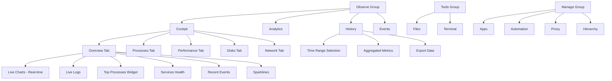

# Cockpit & Resources Merge Plan

## Problem Analysis

### Current Issues:
1. **404 Links**: Widgets reference non-existent routes (`/machines/local/processes`, `/machines/local/resources`, etc.)
2. **CPU/Memory not live**: LiveChartsWidget uses historical DB data, not real-time SignalR
3. **Redundancy**: Resources tab duplicates Cockpit content
4. **History mixed in**: History tab is inside TaskManager (Resources), should be separate

### Current Route Structure:
```
/ → home.tsx (Cockpit with widgets)
/observe → layout with tabs
  /observe/cockpit → re-exports home.tsx
  /observe/analytics → placeholder
  /observe/resources → TaskManager (processes, performance, disks, network, history)
  /observe/events → events page
/monitor/:tab? → monitor.tsx (also uses TaskManager)
```

### Widget viewAllLink Issues:
- `LiveChartsWidget`: CPU/Memory → `/machines/local/resources` (404)
- `LiveChartsWidget`: Network → `/machines/local/network` (404)
- `LiveChartsWidget`: Disk → `/machines/local/disks` (404)
- `TopProcessesWidget`: → `/machines/local/processes` (404)
- `LiveLogsWidget`: → `/machines/local/logs` (404)
- `RecentEventsWidget`: → `/analytics` (should be `/observe/analytics`)

## Proposed New Structure

### Navigation Groups:
```
Observe (Cyan):
  - Cockpit (/observe/cockpit or /)
  - Analytics (/observe/analytics)
  - History (/observe/history) ← NEW: moved from Resources
  - Events (/observe/events)

Tools (Green):
  - Files (/explorer)
  - Terminal (/terminal)

Manage (Orange):
  - Apps (/apps)
  - Automation (/automation)
  - Proxy (/proxy)
  - Hierarchy (/hierarchy)
```

### Cockpit Content (merged from Resources):
The Cockpit page will have internal sections/tabs:
1. **Overview** (current widgets): Live Charts, Logs, Processes, Services, Events, Sparklines
2. **Processes** (from TaskManager): Sortable process table
3. **Performance** (from TaskManager): Real-time CPU, Memory, Network charts
4. **Disks** (from TaskManager): Disk I/O details
5. **Network** (from TaskManager): Network interface stats

### History Page (new):
- Historical metrics exploration
- Time range selection
- Aggregated data views
- Export functionality

## Implementation Tasks

### Task 1: Fix 404 Links in Widgets
**Files**: `ui/app/components/widgets/LiveChartsWidget.tsx`, `ui/app/routes/home.tsx`
- Update all `viewAllLink` props to point to correct routes
- `/machines/local/processes` → `/observe/cockpit`
- `/machines/local/resources` → `/observe/cockpit`
- `/machines/local/network` → `/observe/cockpit`
- `/machines/local/disks` → `/observe/cockpit`
- `/machines/local/logs` → `/observe/cockpit`
- `/analytics` → `/observe/analytics`

### Task 2: Make CPU/Memory Live Diagrams
**Files**: `ui/app/components/widgets/LiveChartsWidget.tsx`
- Currently uses `useSystemMetricsHistory()` (polls DB for historical data)
- Need to add real-time SignalR updates (like TaskManager does)
- Keep historical data for sparklines, but make main charts real-time
- OR: Replace LiveChartsWidget with TaskManager's Performance tab content

### Task 3: Create History Route
**Files**: `ui/app/routes/observe.history.tsx`, `ui/app/routes.ts`
- Create new route `/observe/history`
- Move HistoryTab content from TaskManager to this page
- Add time range selection, aggregation options
- Register in routes.ts

### Task 4: Merge Resources into Cockpit
**Files**: `ui/app/routes/home.tsx`, `ui/app/routes/observe.cockpit.tsx`
- Add internal tab navigation to Cockpit (Overview, Processes, Performance, Disks, Network)
- Move TaskManager content (processes table, performance charts, disks, network) into Cockpit
- Keep current widgets in Overview tab

### Task 5: Remove Resources Tab
**Files**: `ui/app/routes.ts`, `ui/app/components/NavigationBar.tsx`, `ui/app/routes/observe.tsx`
- Remove `observe.resources.tsx` file
- Remove "resources" from observe route children in routes.ts
- Remove "Resources" from NavigationBar NAV_ITEMS
- Remove "resources" from OBSERVE_TABS in observe.tsx

### Task 6: Update Routes Configuration
**Files**: `ui/app/routes.ts`
```typescript
route("observe", "routes/observe.tsx", [
  index("routes/observe._index.tsx"),
  route("cockpit", "routes/observe.cockpit.tsx"),
  route("analytics", "routes/observe.analytics.tsx"),
  route("history", "routes/observe.history.tsx"), // NEW
  route("events", "routes/observe.events.tsx"),
]),
```

### Task 7: Update NavigationBar
**Files**: `ui/app/components/NavigationBar.tsx`
- Remove Resources item
- Add History item: `{ icon: <FaHistory />, label: "History", to: "/observe/history", group: "observe" }`

## File Changes Summary

| File | Action | Description |
|------|--------|-------------|
| `ui/app/routes.ts` | Modify | Add history route, remove resources |
| `ui/app/components/NavigationBar.tsx` | Modify | Remove Resources, add History |
| `ui/app/routes/observe.tsx` | Modify | Remove resources from OBSERVE_TABS, add history |
| `ui/app/routes/observe.resources.tsx` | Delete | No longer needed |
| `ui/app/routes/observe.history.tsx` | Create | New history page |
| `ui/app/routes/home.tsx` | Modify | Add internal tabs, merge TaskManager content |
| `ui/app/routes/observe.cockpit.tsx` | Modify | May need to wrap home.tsx with tabs |
| `ui/app/components/widgets/LiveChartsWidget.tsx` | Modify | Fix viewAllLink, make charts real-time |

## Mermaid Diagram



## Acceptance Criteria

1. No 404 errors when clicking any navigation item or widget link
2. CPU and Memory charts show real-time data (not just historical)
3. History is accessible as a separate tab in Observe group
4. Cockpit contains all Resources content (processes, performance, disks, network)
5. Resources tab is removed from navigation
6. All routes work correctly: /, /observe/cockpit, /observe/analytics, /observe/history, /observe/events
