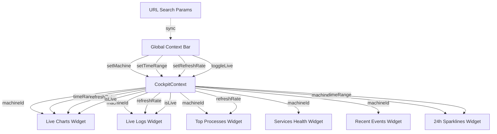
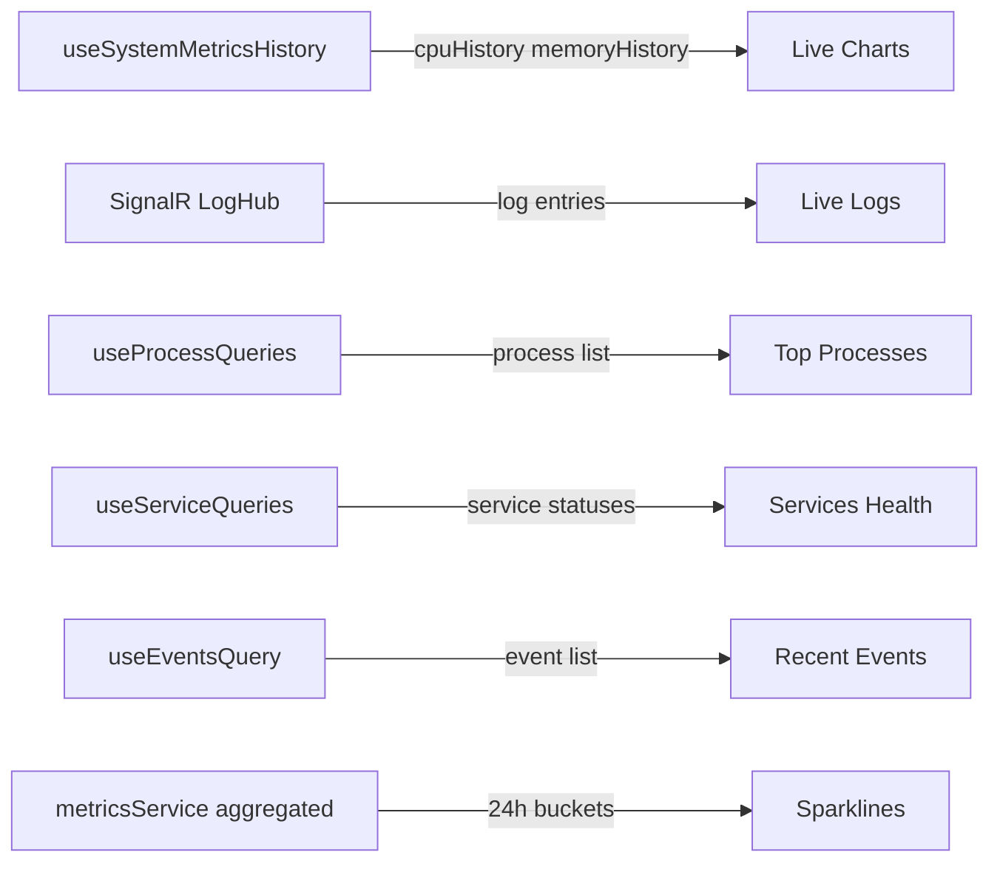

# Cockpit Widget Grid + Global Context Bar — Implementation Plan

## Overview

Replace the tabbed Focus Panel in [`plans/ui-redesign-operations-cockpit.md`](plans/ui-redesign-operations-cockpit.md) Sections 2.2 and 2.3 with an **information-dense widget grid dashboard** and a **Global Context Bar** that cascades machine scope, time range, refresh rate, and live mode to all widgets. Add a competitor design rationale section documenting the design decisions.

---

## Sections to Modify

### 1. Section 2.2 — Operations Cockpit Layout (line 116–155)

Replace the ASCII diagram and key features list with the new widget grid layout:

```
┌─────────────────────────────────────────────────────────────────────────────┐
│  HEADER: MiniCluster · 🟢 Connected · v1.4.2 · Uptime: 14d 3h             │
├─────────────────────────────────────────────────────────────────────────────┤
│  GLOBAL CONTEXT BAR                                                         │
│  [🖥️ local] [⏱ Last 1h ▾] [🔄 5s ▾] [🔴 LIVE]                           │
├─────────────────────────────────────────────────────────────────────────────┤
│  VITALS STRIP (always visible, compact)                                     │
│  CPU: 45% ████████░░  Mem: 62% ██████████░░  Disk: 38% ██████░░░░         │
│  Net: ↑12 MB/s ↓45 MB/s   Svc: 🟢12 🟡1 🔴1   Alerts: ⚠️ 2              │
├─────────────────────────────────────────────────────────────────────────────┤
│  QUICK ACTIONS                                                              │
│  [📁 Files] [💻 Terminal] [📊 Resources] [📈 Analytics] [🔧 Services]     │
│  [📋 Logs] [⏰ Automation] [🌐 Proxy]                                       │
├─────────────────────────────────────────────────────────────────────────────┤
│  WIDGET GRID (scrollable, always-visible, no tabs)                          │
│  ┌── LIVE CHARTS (2×2 grid) ─────────────────────────────────────────────┐ │
│  │  ┌─ CPU ──────────────────┐  ┌─ Memory ────────────────┐             │ │
│  │  │ ▁▂▃▅▇█▇▅▃▂▁▂▃▅▇█     │  │ ▓▓▓▓▓▓▓▓▓▓▓▓▓▓▓▓▓▓     │             │ │
│  │  │ Avg: 45% Peak: 92%     │  │ Avg: 62% Peak: 81%      │             │ │
│  │  │ [View All →]           │  │ [View All →]            │             │ │
│  │  └────────────────────────┘  └─────────────────────────┘             │ │
│  │  ┌─ Network I/O ──────────┐  ┌─ Disk I/O ──────────────┐            │ │
│  │  │ ↑ 12 MB/s  ↓ 45 MB/s  │  │ R: 45 MB/s W: 12 MB/s   │            │ │
│  │  │ [View All →]           │  │ [View All →]            │            │ │
│  │  └────────────────────────┘  └─────────────────────────┘            │ │
│  └──────────────────────────────────────────────────────────────────────┘ │
│  ┌── LIVE LOGS + TOP PROCESSES (side-by-side) ──────────────────────────┐ │
│  │  ┌─ Live Logs ───────────────┐  ┌─ Top Processes (by CPU) ────────┐ │ │
│  │  │ 12:01:03 [api] INFO ...   │  │ node     23.4%  12.1%   api    │ │ │
│  │  │ 12:01:01 [db]  WARN ...   │  │ postgres 15.2%  28.3%   db     │ │ │
│  │  │ 12:00:58 [web] ERROR ...  │  │ nginx    8.1%   2.4%    web    │ │ │
│  │  │ [View All Logs →]         │  │ [View All Processes →]         │ │ │
│  │  └───────────────────────────┘  └─────────────────────────────────┘ │ │
│  └──────────────────────────────────────────────────────────────────────┘ │
│  ┌── SERVICES + EVENTS (side-by-side) ──────────────────────────────────┐ │
│  │  ┌─ Services Health ─────────┐  ┌─ Recent Events ─────────────────┐ │ │
│  │  │ 🟢 Running: 12            │  │ ⚠️ CPU spike 92%      2h ago   │ │ │
│  │  │ 🟡 Restarting: 1          │  │ ℹ️ Deploy completed   4h ago   │ │ │
│  │  │ 🔴 Failed: 1              │  │ ⚠️ Memory warning     6h ago   │ │ │
│  │  │ [View All Services →]     │  │ [View All Events →]           │ │ │
│  │  └───────────────────────────┘  └─────────────────────────────────┘ │ │
│  └──────────────────────────────────────────────────────────────────────┘ │
│  ┌── 24h SPARKLINES ────────────────────────────────────────────────────┐ │
│  │  CPU ▁▂▃▅▇█▇▅▃▂▁  Mem ▅▅▅▆▆▇▇▇▆▅  Err ▁▁▁▃▅▇▁▁▁▁  Req ▂▃▅▅▇▇▅▃▂  │ │
│  └──────────────────────────────────────────────────────────────────────┘ │
└─────────────────────────────────────────────────────────────────────────────┘
```

### 2. Section 2.3 — Replace Focus Panel Tabs with Widget Descriptions (line 156–259)

Replace all 5 tab sections (Performance, Processes, Disks, Network, History) with widget descriptions:

- **Live Charts Widget** (2×2 grid): CPU, Memory, Network I/O, Disk I/O — each uses `RichChart` component, consumes `CockpitContext` for time range and refresh rate
- **Live Logs Widget**: Streaming via SignalR `LogHub`, auto-scrolling, filterable by level/service
- **Top Processes Widget**: Top 10 processes by CPU, sortable, with "Kill" quick action
- **Services Health Widget**: Service status counts + mini list, click-through to `/machines/local/services`
- **Recent Events Widget**: Last 10 events with severity badges and timestamps
- **24h Sparklines Widget**: Compact sparkline strip showing CPU, Memory, Error Rate, Requests, Disk trends over 24h

Each widget has:
- A "View All →" link to the corresponding deep-dive page
- A collapsible header (user can collapse to title-only)
- A loading skeleton state
- An error state with retry button

### 3. New Section 2.3b — Global Context Bar

```
┌─────────────────────────────────────────────────────────────────────────────┐
│  [🖥️ ▼ machine]  [⏱ Last 1h ▾]  [🔄 5s ▾]  [🔴 LIVE]                    │
└─────────────────────────────────────────────────────────────────────────────┘
```

**Machine Scope Selector**:
- Single-machine mode: Hidden entirely (shows only "local" label, no dropdown)
- Multi-machine mode: Dropdown with "All Machines (Cluster)" + individual machines
- Selected machine cascades to all widgets

**Time Range Picker**:

| Option | Value | X-Axis Format | Log Window | Bucket Size |
|--------|-------|---------------|------------|-------------|
| Last 5 min | `5m` | `HH:mm:ss` | 5 min | 5s (raw) |
| Last 15 min | `15m` | `HH:mm:ss` | 15 min | 15s |
| Last 1 hour | `1h` | `HH:mm` | 1 hour | 1m |
| Last 6 hours | `6h` | `HH:mm` | 6 hours | 5m |
| Last 24 hours | `24h` | `HH:mm` | 24 hours | 15m |
| Last 7 days | `7d` | `ddd HH:mm` | 7 days | 1h |
| Last 30 days | `30d` | `MM/dd` | 30 days | 6h |
| Custom | `custom` | varies | varies | varies |

**Refresh Rate Selector**: `Off` | `5s` | `15s` | `30s` | `1m`

**Live Mode Toggle**:
- ON: Sliding window — time range slides forward with each refresh tick
- OFF: Frozen window — time range is pinned, user must manually advance

**CockpitContext React Architecture**:

```typescript
interface TimeRange {
  type: 'relative' | 'absolute';
  value: string;  // '5m' | '15m' | '1h' | '6h' | '24h' | '7d' | '30d' | 'custom'
  from?: Date;    // Only for 'absolute' type
  to?: Date;      // Only for 'absolute' type
}

interface CockpitContextType {
  machineId: string;              // 'local' in single-machine mode
  timeRange: TimeRange;
  refreshRate: number;            // ms, 0 = off
  isLive: boolean;                // sliding window vs frozen
  setMachine: (id: string) => void;
  setTimeRange: (range: TimeRange) => void;
  setRefreshRate: (ms: number) => void;
  toggleLive: () => void;
}

const CockpitContext = createContext<CockpitContextType>({...});

function useCockpitContext(): CockpitContextType {
  return useContext(CockpitContext);
}
```

**URL State Sync**: Context bar state persists in URL search params:
- `/?machine=local&range=1h&refresh=5s&live=true`
- Enables shareable links and bookmark-ability

### 4. New Section — Competitor Design Rationale

Add as Section 2.7 (after single-machine detection, before multi-machine section):

| Design Decision | Learned From | Rationale |
|-----------------|-------------|-----------|
| Everything visible on one screen | **PM2 monit** | PM2's terminal dashboard shows all processes, CPU, memory, logs simultaneously — no tab switching. Operators need situational awareness without clicking. |
| Global time range picker cascading to all widgets | **Grafana** | Grafana's global time picker in the top bar propagates to every panel on the dashboard. This is the gold standard for time-series UX. |
| Machine scope selector | **Datadog** | Datadog's scope selectors (`host:web-01`, `env:production`) let you narrow all visualizations at once. Same pattern for machine scoping. |
| Live tail toggle | **Datadog** | Datadog's "Live Tail" button for logs inspired our Live Mode toggle — operators need to switch between real-time streaming and historical analysis. |
| Process list with inline metrics | **PM2 monit** | PM2 shows PID, name, CPU%, memory in a dense table with color-coded severity. Same pattern for our Top Processes widget. |
| Simple status overview | **Supervisor** | Supervisor's web UI shows process groups with status (RUNNING/STOPPED/EXITED). Inspired our compact Services Health widget. |
| Refresh rate control | **Grafana** | Grafana's auto-refresh dropdown (5s, 10s, 30s, 1m, 5m, off) is the standard pattern for real-time dashboards. |
| Widget "View All" deep-dive links | **Grafana + Datadog** | Both tools use drill-down from overview panels to detailed views. Keeps the cockpit clean while maintaining access to depth. |

**What MiniCluster does differently**:
- PM2 has no web UI (terminal only) — MiniCluster provides the same density in a browser
- Supervisor's web UI is read-only and ugly — MiniCluster adds actionable controls (Quick Actions, Kill, Restart)
- Grafana requires manual dashboard setup — MiniCluster's cockpit is pre-built and zero-config
- Datadog costs $15+/host/month — MiniCluster includes everything in the free tier

### 5. Section 3.3 — Multi-Machine Cockpit (line 350–396)

Update to reflect:
- Global Context Bar gains visible machine dropdown
- Widget Grid shows cluster-aggregate data when "All Machines" is selected
- Widget Grid shows machine-specific data when a single machine is selected
- Fleet Overview zone (machine cards) sits above the widget grid
- All widgets react to machine scope changes via `CockpitContext`

---

## Mermaid Diagrams

### CockpitContext Data Flow



### Widget Data Sources



---

## Implementation Sequence

1. **Rewrite Section 2.2** — Replace ASCII diagram with widget grid layout
2. **Rewrite Section 2.3** — Replace tab descriptions with widget descriptions
3. **Add Section 2.3b** — Global Context Bar with CockpitContext architecture
4. **Add Section 2.7** — Competitor Design Rationale
5. **Update Section 3.3** — Reflect widget grid in multi-machine cockpit
6. **Update Component Hierarchy** — Add CockpitContext provider to Section 17
