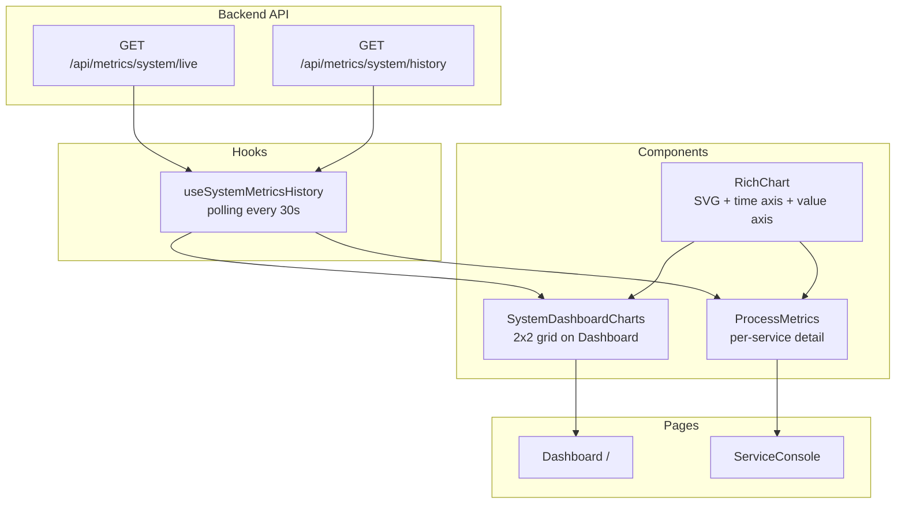

# Dashboard Chart Enhancement Plan

## Summary

Two parallel enhancements:
1. **Upgrade `SimpleChart`** in `ProcessMetrics.tsx` to include time axis labels, value axis labels, and grid lines
2. **Add system-level historical charts** to the main Dashboard page (`/`)

---

## A. Upgrade ProcessMetrics SimpleChart → RichChart with Time Labels

### Current State

[`SimpleChart`](ui/app/components/ProcessMetrics.tsx:482) renders a plain SVG polyline:
- No time axis labels
- No value axis labels
- No grid lines
- No indication x-axis represents time
- `preserveAspectRatio="none"` stretches the line

### Changes Required

#### A1. Create `RichChart` reusable component (`ui/app/components/RichChart.tsx`)

A generic, reusable SVG chart component that can be used by both `ProcessMetrics` and dashboard:

```typescript
interface RichChartProps {
  data: number[];
  timestamps?: string[];       // optional time labels for x-axis
  color: 'blue' | 'green' | 'violet' | 'cyan' | 'amber';
  height: number;
  maxValue?: number;
  showTimeAxis?: boolean;       // renders time labels below chart
  showValueAxis?: boolean;      // renders value labels on left
  showGrid?: boolean;           // renders horizontal grid lines
  label?: string;               // metric label for value axis
  unit?: string;                // unit suffix for values
}
```

Features:
- **Time axis labels**: Show 4-6 evenly spaced time labels formatted as `HH:MM:SS`
- **Value axis labels**: Show 3-5 evenly spaced value labels on the left
- **Grid lines**: Horizontal dashed lines at each value label point
- **Preserve existing line+fill rendering** (same color scheme)
- **ARIA labels** for accessibility

#### A2. Update [`ProcessMetrics.tsx`](ui/app/components/ProcessMetrics.tsx:362)

- Replace `<SimpleChart>` with `<RichChart>` in both Memory and CPU chart sections
- Pass `timestamps` from `historicalData.map(d => d.timestamp)` to enable time axis
- Enable `showTimeAxis`, `showValueAxis`, `showGrid` props
- Remove the old `SimpleChart` component definition

#### A3. Remove old `SimpleChart` component

Delete lines 474-532 of ProcessMetrics.tsx after replacement.

---

## B. Add System-Level Historical Charts to Dashboard

### Current State

[`DashboardPage`](ui/app/routes/dashboard.tsx:299) shows an empty state when no service is selected:
```
No Service Selected — Select a service from the sidebar
```
This is wasted screen real estate. We'll replace it with live system metrics charts.

### Changes Required

#### B1. Create `SystemDashboardCharts` component (`ui/app/components/SystemDashboardCharts.tsx`)

A new component that displays real-time system metrics over time:

**Data Sources:**
- [`useSystemMetricsHistory`](ui/app/hooks/useSystemMetricsHistory.ts:22) — Already provides CPU, memory, disk history arrays with timestamps
- Uses polling (SignalR or fallback) for live updates

**Layout — 2×2 grid of RichCharts:**

```
┌─────────────────┐  ┌─────────────────┐
│   CPU Usage %   │  │  Memory Usage   │
│   [chart]       │  │  [chart]         │
│   avg: 45%      │  │  used: 8.2 GB   │
│   max: 78%      │  │  total: 16 GB   │
└─────────────────┘  └─────────────────┘
┌─────────────────┐  ┌─────────────────┐
│  Network I/O    │  │   Disk I/O      │
│   [chart]       │  │   [chart]       │
│   ↓ 1.2 MB/s    │  │   read: 50 MB/s │
│   ↑ 340 KB/s    │  │   write: 30 MB/s│
└─────────────────┘  └─────────────────┘
```

Each chart:
- Uses `RichChart` with `showTimeAxis`, `showValueAxis`, `showGrid`
- Shows min/avg/max stats below the chart
- Updates every 30 seconds (polling)
- Shows last 15 minutes by default

#### B2. Update [`DashboardPage`](ui/app/routes/dashboard.tsx:299)

Replace the empty state (lines 299-330):

```tsx
// Before (line 299):
{mode === "view" ? (
  <div className="flex flex-col items-center justify-center h-full fade-in">
    <div className="w-20 h-20 mx-auto mb-6 rounded-2xl ...">
      <FaRocket className="w-8 h-8 text-slate-500" />
    </div>
    <h3 className="text-xl font-semibold text-slate-300 mb-2">No Service Selected</h3>
    ...
  </div>
) : null}

// After:
{mode === "view" && !selectedServiceId ? (
  <SystemDashboardCharts />
) : null}
```

Also, when a service IS selected (line 287), the `ServiceConsole` already shows `ProcessMetrics` with the upgraded `RichChart` — so that path is covered.

---

## Files to Modify/Create

| Action | File | Description |
|--------|------|-------------|
| **Create** | `ui/app/components/RichChart.tsx` | Reusable SVG chart with time/value axis labels, grids |
| **Modify** | `ui/app/components/ProcessMetrics.tsx` | Replace SimpleChart with RichChart + pass timestamps |
| **Create** | `ui/app/components/SystemDashboardCharts.tsx` | System-level 2×2 metrics grid using RichChart |
| **Modify** | `ui/app/routes/dashboard.tsx` | Integrate SystemDashboardCharts in empty state |

---

## Mermaid: Data Flow



---

## Priority Order

1. **`RichChart` component** — Foundation for everything else
2. **`ProcessMetrics` upgrade** — Replace SimpleChart with RichChart
3. **`SystemDashboardCharts`** — New system metrics grid
4. **`DashboardPage` integration** — Wire into the empty state
