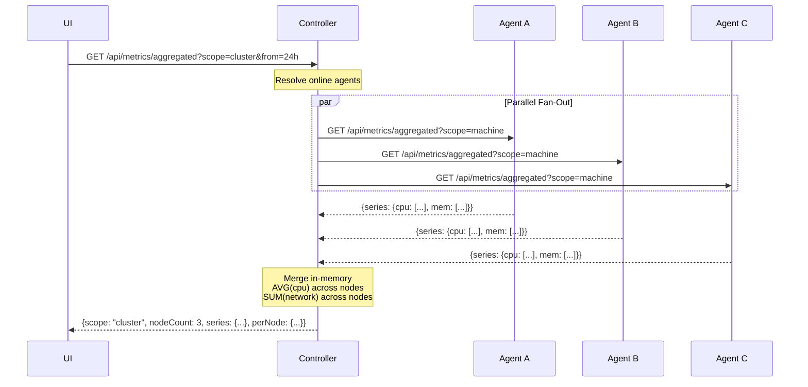
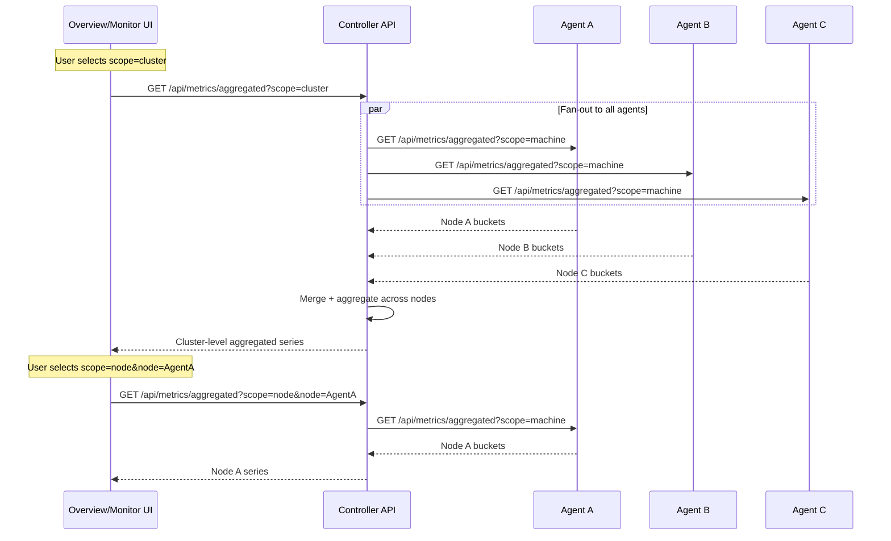
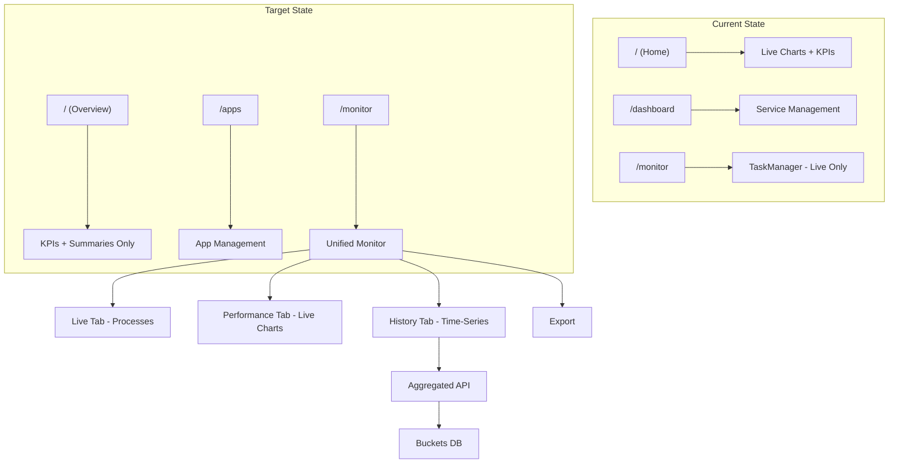
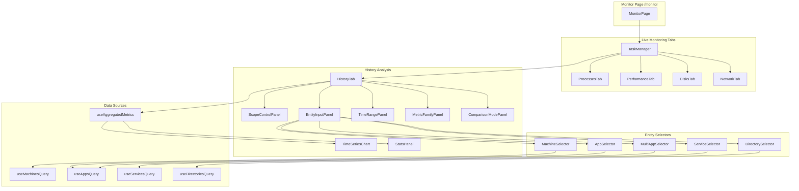
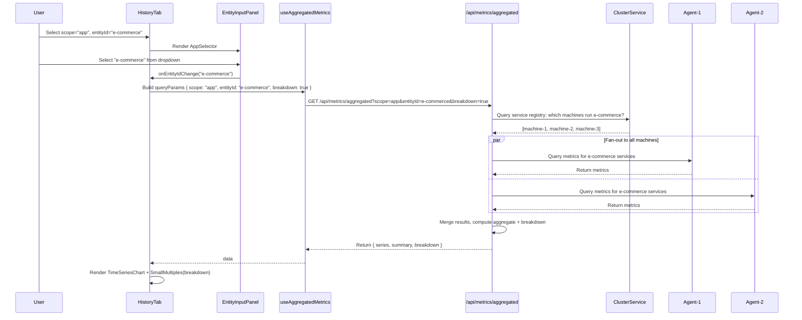

# Dashboard & Monitor Architecture Analysis

> **Date:** 2026-06-14
> **Author:** Zoo (Architect)
> **Context:** Review of Spec 028 (Performance Monitoring) implementation and dashboard/monitor architecture
> **Multi-Node Ready:** Yes, with documented extension points

---

## Clarification: "Each Agent Keeps Its Own DB"

### What This Means

In MiniCluster's multi-node architecture (from Spec 010), each **agent node** is a full MiniCluster instance running in agent mode. Each agent:

1. **Runs its own metrics collector** (every 5 seconds)
2. **Stores raw metrics in its own `logs.db`**
3. **Runs its own aggregator** (every minute)
4. **Stores aggregated buckets in its own `metrics-aggregated.db`**

### Why Not Centralize All Metrics?

```
┌─────────────────────────────────────────────────────────────────────────────┐
│                    OPTION A: CENTRALIZED (NOT CHOSEN)                         │
├─────────────────────────────────────────────────────────────────────────────┤
│                                                                               │
│  Agent A ──────┐                                                              │
│                │                                                              │
│  Agent B ──────┼────► Control Plane ────► ONE BIG metrics-aggregated.db      │
│                │      (receives all)     (all nodes' data in one place)       │
│  Agent C ──────┘                                                              │
│                                                                               │
│  Problems:                                                                    │
│  ❌ Single point of failure (if controller DB fails, all history lost)       │
│  ❌ Network bandwidth (streaming all raw/aggregated data to controller)      │
│  ❌ Controller outage = no metrics collection at all                         │
│  ❌ Write contention (all agents writing to same DB)                         │
│                                                                               │
└─────────────────────────────────────────────────────────────────────────────┘

┌─────────────────────────────────────────────────────────────────────────────┐
│                    OPTION B: DISTRIBUTED (CHOSEN)                              │
├─────────────────────────────────────────────────────────────────────────────┤
│                                                                               │
│  Agent A ──► logs.db + metrics-aggregated.db (Node A's data only)            │
│                                                                               │
│  Agent B ──► logs.db + metrics-aggregated.db (Node B's data only)            │
│                                                                               │
│  Agent C ──► logs.db + metrics-aggregated.db (Node C's data only)            │
│                                                                               │
│  Control Plane ──► Queries agents on-demand for cluster view                  │
│                    (No central storage, aggregates in-memory)                 │
│                                                                               │
│  Benefits:                                                                    │
│  ✅ Agents survive controller outages (keep collecting locally)              │
│  ✅ No network bandwidth for streaming metrics                               │
│  ✅ No write contention (each agent writes to its own DB)                    │
│  ✅ Distributed failure domain (one agent DB failure doesn't affect others)  │
│                                                                               │
└─────────────────────────────────────────────────────────────────────────────┘
```

### How It Works in Practice

#### Scenario 1: Single-Node (Current)

```
┌─────────────────────────────────────────┐
│  MiniCluster (Primary/Controller)       │
│                                         │
│  ┌─────────────────┐                   │
│  │ Collector (5s)  │                   │
│  └────────┬────────┘                   │
│           │                             │
│  ┌────────▼────────┐                   │
│  │ logs.db         │  ← Raw metrics   │
│  └────────┬────────┘                   │
│           │                             │
│  ┌────────▼────────┐                   │
│  │ Aggregator (1m) │                   │
│  └────────┬────────┘                   │
│           │                             │
│  ┌────────▼────────┐                   │
│  │ metrics-        │  ← Aggregated    │
│  │ aggregated.db   │    buckets        │
│  └─────────────────┘                   │
│                                         │
│  machine_id = "local-machine-uuid"     │
└─────────────────────────────────────────┘
```

#### Scenario 2: Multi-Node (Future)

```
┌─────────────────────────────────────────────────────────────────────────────┐
│                         CONTROL PLANE (Primary Node)                          │
├─────────────────────────────────────────────────────────────────────────────┤
│                                                                               │
│  UI Request: "Show me cluster CPU for last 24h"                              │
│                                                                               │
│  ┌─────────────────────────────────────────────────────────────────────────┐│
│  │ Cluster API:                                                             ││
│  │ 1. Query Agent A: GET /api/metrics/aggregated?scope=machine&from=...    ││
│  │ 2. Query Agent B: GET /api/metrics/aggregated?scope=machine&from=...    ││
│  │ 3. Query Agent C: GET /api/metrics/aggregated?scope=machine&from=...    ││
│  │ 4. Merge results in-memory                                               ││
│  │ 5. Return aggregated cluster view to UI                                  ││
│  └─────────────────────────────────────────────────────────────────────────┘│
│                                                                               │
└─────────────────────────────────────────────────────────────────────────────┘
        │                     │                     │
        │ HTTPS               │ HTTPS               │ HTTPS
        ▼                     ▼                     ▼
┌───────────────┐     ┌───────────────┐     ┌───────────────┐
│   AGENT A     │     │   AGENT B     │     │   AGENT C     │
│               │     │               │     │               │
│ logs.db       │     │ logs.db       │     │ logs.db       │
│ (Node A raw)  │     │ (Node B raw)  │     │ (Node C raw)  │
│               │     │               │     │               │
│ metrics-      │     │ metrics-      │     │ metrics-      │
│ aggregated.db │     │ aggregated.db │     │ aggregated.db │
│ (Node A only) │     │ (Node B only) │     │ (Node C only) │
│               │     │               │     │               │
│ machine_id=   │     │ machine_id=   │     │ machine_id=   │
│ "node-a-uuid" │     │ "node-b-uuid" │     │ "node-c-uuid" │
└───────────────┘     └───────────────┘     └───────────────┘
```

### Key Points

| Aspect | Explanation |
|--------|-------------|
| **Why each agent has its own DB?** | Agents are stateful and can operate independently. If the controller goes down, agents keep collecting metrics locally. |
| **Does the controller store cluster metrics?** | No, the controller aggregates on-the-fly when UI requests cluster view. This avoids data duplication. |
| **What about performance?** | For real-time queries, controller fans out to agents (parallel HTTP calls). For historical queries, agents respond quickly from their local aggregated buckets. |
| **What if an agent is offline?** | Controller shows that node as "offline" and returns data from available nodes only. No data loss for online nodes. |
| **How do agents sync with controller?** | Agents send heartbeats with current status. Controller pulls metrics on-demand (not pushed). |

### Alternative: Central Time-Series Database (Future Option)

If the cluster grows large (50+ nodes), you might want a centralized time-series database like **TimescaleDB** or **VictoriaMetrics**:

```
┌─────────────────────────────────────────────────────────────────────────────┐
│                    FUTURE: CENTRALIZED TIME-SERIES DB                         │
├─────────────────────────────────────────────────────────────────────────────┤
│                                                                               │
│  Agent A ──┐                                                                  │
│            │                                                                  │
│  Agent B ──┼────► TimescaleDB ────► Control Plane queries central DB         │
│            │     (or VictoriaMetrics)                                         │
│  Agent C ──┘                                                                  │
│                                                                               │
│  This would be an OPTIONAL add-on for large clusters.                        │
│  Small clusters (1-10 nodes) work fine with distributed SQLite.              │
│                                                                               │
└─────────────────────────────────────────────────────────────────────────────┘
```

But for MiniCluster's target market (SMB, 5-20 servers), the distributed SQLite approach is sufficient and simpler.

---

## Hybrid Approach: Agent Sync to Controller (Recommended)

### The Idea

Instead of pure fan-out on every query, agents **push their aggregated buckets to the controller** periodically. The controller maintains a **local copy of all nodes' data**, enabling instant local queries while agents remain the authoritative source.

```
┌─────────────────────────────────────────────────────────────────────────────┐
│                    HYBRID: LOCAL + SYNCED ARCHITECTURE                        │
├─────────────────────────────────────────────────────────────────────────────┤
│                                                                               │
│  Agent A                    Agent B                    Agent C               │
│  ┌─────────────┐           ┌─────────────┐           ┌─────────────┐        │
│  │ Collector   │           │ Collector   │           │ Collector   │        │
│  │ (5s tick)   │           │ (5s tick)   │           │ (5s tick)   │        │
│  └──────┬──────┘           └──────┬──────┘           └──────┬──────┘        │
│         │                         │                         │                │
│  ┌──────▼──────┐           ┌──────▼──────┐           ┌──────▼──────┐        │
│  │ Aggregator  │           │ Aggregator  │           │ Aggregator  │        │
│  │ (1m tick)   │           │ (1m tick)   │           │ (1m tick)   │        │
│  └──────┬──────┘           └──────┬──────┘           └──────┬──────┘        │
│         │                         │                         │                │
│  ┌──────▼──────┐           ┌──────▼──────┐           ┌──────▼──────┐        │
│  │ metrics-    │           │ metrics-    │           │ metrics-    │        │
│  │ aggregated  │           │ aggregated  │           │ aggregated  │        │
│  │ .db         │           │ .db         │           │ .db         │        │
│  │ (local)     │           │ (local)     │           │ (local)     │        │
│  └──────┬──────┘           └──────┬──────┘           └──────┬──────┘        │
│         │                         │                         │                │
│         │  PUSH buckets           │  PUSH buckets           │  PUSH buckets  │
│         │  (every 1m)             │  (every 1m)             │  (every 1m)    │
│         │                         │                         │                │
│         └─────────────────────────┼─────────────────────────┘                │
│                                   │                                          │
│                                   ▼                                          │
│  ┌─────────────────────────────────────────────────────────────────────┐    │
│  │                    CONTROL PLANE                                      │    │
│  │                                                                       │    │
│  │  ┌───────────────────────────────────────────────────────────────┐   │    │
│  │  │  Sync Receiver                                                │   │    │
│  │  │  POST /api/sync/metrics                                       │   │    │
│  │  │  { machineId: "node-a", buckets: [...] }                     │   │    │
│  │  └──────────────────────────────┬────────────────────────────────┘   │    │
│  │                                 │                                     │    │
│  │  ┌──────────────────────────────▼────────────────────────────────┐   │    │
│  │  │  cluster-metrics.db (Controller Local)                        │   │    │
│  │  │                                                                │   │    │
│  │  │  buckets table (same schema as agents)                         │   │    │
│  │  │  machine_id = "node-a"  ← synced from Agent A                │   │    │
│  │  │  machine_id = "node-b"  ← synced from Agent B                │   │    │
│  │  │  machine_id = "node-c"  ← synced from Agent C                │   │    │
│  │  │  machine_id = "local"   ← controller's own data               │   │    │
│  │  │                                                                │   │    │
│  │  │  ✅ All cluster data queryable locally                        │   │    │
│  │  └────────────────────────────────────────────────────────────────┘   │    │
│  └───────────────────────────────────────────────────────────────────────┘    │
│                                                                               │
└─────────────────────────────────────────────────────────────────────────────┘
```

### How It Works

#### Phase 1: Agent Collects Locally (unchanged)

Each agent continues to:
1. Collect raw metrics every 5s → `logs.db`
2. Aggregate into 1m/5m/15m/1h/1d buckets → `metrics-aggregated.db`
3. Apply retention policy locally

#### Phase 2: Agent Pushes New Buckets to Controller (new)

After each aggregation cycle, the agent pushes **new bucket rows** to the controller:

```go
// Agent-side: after aggregation completes
func (a *MetricsAggregator) syncToController() {
    // Get buckets created since last sync
    var newBuckets []models.Bucket
    a.aggDB.Where("created_at > ?", a.lastSyncTime).Find(&newBuckets)
    
    if len(newBuckets) == 0 {
        return
    }
    
    // Push to controller
    resp, err := a.controllerClient.Post("/api/sync/metrics", SyncPayload{
        MachineID: a.machineID,
        Buckets:   newBuckets,
        SyncTime:  time.Now(),
    })
    
    if err != nil {
        // Controller offline — queue for later
        a.pendingSync = append(a.pendingSync, newBuckets...)
        log.Warn("Controller sync failed, queued for retry", "count", len(newBuckets))
        return
    }
    
    a.lastSyncTime = time.Now()
    a.pendingSync = nil  // Clear queue
}
```

#### Phase 3: Controller Receives and Stores Locally (new)

```go
// Controller-side: receives synced buckets
func (h *SyncHandler) ReceiveMetrics(c *gin.Context) {
    var payload SyncPayload
    c.BindJSON(&payload)
    
    // Upsert buckets into local cluster-metrics.db
    for _, bucket := range payload.Buckets {
        bucket.MachineID = payload.MachineID  // Tag with source node
        
        h.clusterDB.Where(
            "machine_id = ? AND bucket_time = ? AND bucket_size = ? AND scope = ? AND metric = ?",
            bucket.MachineID, bucket.BucketTime, bucket.BucketSize, bucket.Scope, bucket.Metric,
        ).Assign(bucket).FirstOrCreate(&bucket)
    }
    
    // Update node last-seen timestamp
    h.machineRegistry.UpdateLastSeen(payload.MachineID, payload.SyncTime)
    
    c.JSON(200, gin.H{"status": "ok", "received": len(payload.Buckets)})
}
```

### Query Flow Comparison

#### Pure Fan-Out (Current Design)

```
UI → Controller → Fan-out to 3 agents → Wait → Merge → Response
Latency: ~100-300ms (depends on agent response time)
```

#### Hybrid with Local Sync (Recommended)

```
UI → Controller → Query local cluster-metrics.db → Response
Latency: ~10-50ms (local SQLite query)
```

**10x faster queries** because all data is local.

### When Does Fan-Out Still Happen?

| Query Type | Source | Why |
|------------|--------|-----|
| Historical aggregated data | **Local DB** | Synced from agents |
| Cluster overview/KPIs | **Local DB** | Synced from agents |
| Per-node breakdown | **Local DB** | Synced from agents |
| Live real-time metrics | **Fan-out or SignalR** | Too frequent to sync (every 5s) |
| Agent just came online | **Fan-out** | Catch up on missed sync window |
| Directory monitoring | **Agent direct** | Node-local, not synced |

### Sync Strategy

```
┌─────────────────────────────────────────────────────────────────────────────┐
│                         SYNC TIMELINE                                         │
├─────────────────────────────────────────────────────────────────────────────┤
│                                                                               │
│  Agent A:                                                                     │
│  t=0:00  Collect raw metrics                                                  │
│  t=0:01  Aggregate 5m buckets                                                │
│  t=0:01  Push new buckets to controller  ◄── SYNC                            │
│  t=0:05  Aggregate next 5m bucket                                            │
│  t=0:05  Push new bucket to controller   ◄── SYNC                            │
│  ...                                                                         │
│                                                                               │
│  Controller:                                                                  │
│  t=0:01  Receive Agent A buckets → store in cluster-metrics.db               │
│  t=0:01  Receive Agent B buckets → store in cluster-metrics.db               │
│  t=0:01  Receive Agent C buckets → store in cluster-metrics.db               │
│  t=0:02  UI queries cluster-metrics.db → instant response                    │
│                                                                               │
│  Data freshness: ~1-2 minutes behind real-time (acceptable for history)       │
│  Live metrics: still via SignalR (real-time, not synced)                      │
│                                                                               │
└─────────────────────────────────────────────────────────────────────────────┘
```

### What Gets Synced?

| Data | Synced? | Frequency | Reason |
|------|---------|-----------|--------|
| 5m buckets | ✅ Yes | Every 1 minute | Core aggregated data |
| 1h buckets | ✅ Yes | At hour boundary | Rolled-up data |
| 1d buckets | ✅ Yes | At day boundary | Long-term data |
| Raw metrics (5s) | ❌ No | Never | Too much data, agents own raw |
| Live snapshots | ❌ No | N/A | Via SignalR in real-time |
| Directory snapshots | ❌ No | Never | Node-local, query on-demand |
| Watched directories config | ✅ Yes | On change | Controller needs directory list |

### Offline Handling

```
Agent A goes offline at t=10:00
  t=10:00  Controller stops receiving sync from Agent A
  t=10:01  Controller marks Agent A as "stale" (last seen: 10:00)
  t=10:05  Controller marks Agent A as "offline" (>5 min no sync)
  
  UI query: scope=cluster
  Response: {
    scope: "cluster",
    nodeCount: 3,
    onlineNodes: 2,
    staleNodes: ["node-a"],  ← Data exists but is stale
    series: {...}             ← Includes Agent A's last synced data
  }

Agent A comes back online at t=10:30
  t=10:30  Agent A pushes pending sync (buckets from 10:00-10:30)
  t=10:30  Controller receives and stores → cluster data is complete again
```

**No data loss** — agent queues sync while offline, pushes catch-up when reconnected.

### Benefits vs Pure Fan-Out

| Aspect | Pure Fan-Out | Hybrid (Sync + Local) |
|--------|-------------|----------------------|
| **Query latency** | 100-300ms | 10-50ms |
| **Agent offline impact** | No data from that agent | Stale data available |
| **Network load** | Query-time burst | Steady 1m interval |
| **Controller resilience** | Must fan-out every time | Can serve from local DB |
| **Historical queries** | Depends on agent availability | Always available locally |
| **Data freshness** | Real-time | ~1-2 min delay (acceptable) |
| **Storage on controller** | None | Moderate (aggregated only) |

### Storage Impact on Controller

For a 10-node cluster:
- Each node: ~8,640 rows/day (5m buckets) + ~8,760 rows/year (1h buckets)
- 10 nodes: ~86,400 rows/day + ~87,600 rows/year
- At ~200 bytes/row: ~17 MB/day raw, ~17 MB/year hourly
- **Total: ~100-200 MB for a year of 10-node cluster data**

This is trivial for SQLite. The controller's `cluster-metrics.db` stays small because:
- Only aggregated buckets are synced (not raw 5s samples)
- Retention policy applies (same as agents)
- Aggregated data compresses well

### Recommendation

**Adopt the hybrid approach.** It gives you:

1. ✅ **Fast queries** — all data local on controller
2. ✅ **Resilience** — agents survive controller outages (still have local DB)
3. ✅ **No data loss** — agents queue sync when controller is offline
4. ✅ **Offline tolerance** — stale data available even when agents are down
5. ✅ **Low network overhead** — steady 1m push, not query-time burst
6. ✅ **Simple architecture** — same bucket schema, just add sync endpoint

The only trade-off is ~1-2 minute data freshness delay for historical queries, which is perfectly acceptable for monitoring dashboards.

---

## How Queries Work: Fan-Out Query Pattern

### The Query Flow Problem

If each agent has its own `metrics-aggregated.db`, how does the controller answer questions like:
- "Show me CPU usage across the entire cluster"
- "Compare Node A vs Node B memory usage"
- "What's the total network throughput of all nodes?"

### Solution: Controller as Query Coordinator

The controller acts as a **query coordinator** — it fans out requests to all agents in parallel, collects responses, and merges them in-memory.

```
┌─────────────────────────────────────────────────────────────────────────────┐
│                          QUERY FLOW: CLUSTER VIEW                             │
├─────────────────────────────────────────────────────────────────────────────┤
│                                                                               │
│  ┌──────────────┐                                                             │
│  │     UI       │                                                             │
│  │   (Browser)  │                                                             │
│  └──────┬───────┘                                                             │
│         │  GET /api/metrics/aggregated?scope=cluster&from=24h                 │
│         ▼                                                                     │
│  ┌──────────────────────────────────────────────────────────────────────┐    │
│  │                    CONTROL PLANE (Query Coordinator)                   │    │
│  │                                                                       │    │
│  │  1. Resolve agent list from MachineRegistry                           │    │
│  │     agents = [AgentA, AgentB, AgentC]                                 │    │
│  │                                                                       │    │
│  │  2. Fan-out parallel HTTP requests to all agents                      │    │
│  │     ┌─────────────────────────────────────────────────────────────┐  │    │
│  │     │ goroutine 1: GET agentA:5147/api/metrics/aggregated?scope=  │  │    │
│  │     │              machine&from=24h&bucket=1h                     │  │    │
│  │     │ goroutine 2: GET agentB:5147/api/metrics/aggregated?...     │  │    │
│  │     │ goroutine 3: GET agentC:5147/api/metrics/aggregated?...     │  │    │
│  │     └─────────────────────────────────────────────────────────────┘  │    │
│  │                                                                       │    │
│  │  3. Wait for all responses (with timeout)                             │    │
│  │     results = [agentA_response, agentB_response, agentC_response]     │    │
│  │                                                                       │    │
│  │  4. Merge results in-memory                                           │    │
│  │     - Group by bucket_time                                            │    │
│  │     - For each time bucket: SUM/AVG across all agents                 │    │
│  │     - Preserve per-node breakdown if requested                        │    │
│  │                                                                       │    │
│  │  5. Return aggregated response to UI                                  │    │
│  └──────────────────────────────────────────────────────────────────────┘    │
│                                                                               │
└─────────────────────────────────────────────────────────────────────────────┘
```

### Detailed Code Flow (Go Pseudocode)

```go
// In controller's metrics handler
func (h *ClusterMetricsHandler) GetAggregatedMetrics(c *gin.Context) {
    scope := c.Query("scope")  // "cluster", "node", "machine"
    from := c.Query("from")
    to := c.Query("to")
    bucket := c.Query("bucket")
    
    if scope == "cluster" {
        h.getClusterMetrics(c, from, to, bucket)
    } else if scope == "node" {
        nodeID := c.Query("node")
        h.getNodeMetrics(c, nodeID, from, to, bucket)
    } else {
        // scope == "machine" — query local DB only
        h.getLocalMachineMetrics(c, from, to, bucket)
    }
}

func (h *ClusterMetricsHandler) getClusterMetrics(c *gin.Context, from, to, bucket string) {
    // 1. Get all registered agents
    agents, _ := h.machineRegistry.GetOnlineAgents()
    // agents = [
    //   {ID: "node-a", URL: "https://192.168.1.10:5147", APIKey: "..."},
    //   {ID: "node-b", URL: "https://192.168.1.11:5147", APIKey: "..."},
    //   {ID: "node-c", URL: "https://192.168.1.12:5147", APIKey: "..."},
    // ]
    
    // 2. Fan-out parallel requests with timeout
    ctx, cancel := context.WithTimeout(c.Request.Context(), 10*time.Second)
    defer cancel()
    
    type agentResult struct {
        nodeID string
        data   *AggregatedResponse
        err    error
    }
    
    results := make(chan agentResult, len(agents))
    
    for _, agent := range agents {
        go func(ag Agent) {
            resp, err := h.agentClient.GetAggregatedMetrics(ctx, ag.URL, ag.APIKey, from, to, bucket)
            results <- agentResult{nodeID: ag.ID, data: resp, err: err}
        }(agent)
    }
    
    // 3. Collect all results
    var allResults []agentResult
    for i := 0; i < len(agents); i++ {
        result := <-results
        allResults = append(allResults, result)
    }
    
    // 4. Merge results in-memory
    merged := mergeClusterMetrics(allResults)
    
    // 5. Return to UI
    c.JSON(200, merged)
}

func mergeClusterMetrics(results []agentResult) *ClusterAggregatedResponse {
    // Group by time bucket
    // For each bucket: compute SUM/AVG/MAX/MIN across all agents
    
    clusterSeries := make(map[string][]BucketPoint)  // metric -> time series
    
    for _, result := range results {
        if result.err != nil {
            // Agent offline — skip but log warning
            log.Warn("Agent offline", "nodeID", result.nodeID, "error", result.err)
            continue
        }
        
        for metric, series := range result.data.Series {
            for _, point := range series {
                // Add this node's data to the cluster aggregate
                clusterSeries[metric] = mergeBucketPoint(
                    clusterSeries[metric],
                    point,
                    result.nodeID,
                )
            }
        }
    }
    
    return &ClusterAggregatedResponse{
        Scope:       "cluster",
        NodeCount:   len(results),
        OnlineNodes: countOnline(results),
        Series:      clusterSeries,
        PerNode:     extractPerNodeBreakdown(results),  // Optional: per-node detail
    }
}

func mergeBucketPoint(existing []BucketPoint, newPoint BucketPoint, nodeID string) []BucketPoint {
    // Find or create bucket for this timestamp
    for i, ep := range existing {
        if ep.Timestamp == newPoint.Timestamp {
            // Merge: AVG for cpu_percent, SUM for net_send_rate, etc.
            existing[i].Avg = weightedAvg(existing[i], newPoint)
            existing[i].Sum = existing[i].Sum + newPoint.Sum
            existing[i].Max = max(existing[i].Max, newPoint.Max)
            existing[i].Min = min(existing[i].Min, newPoint.Min)
            return existing
        }
    }
    // New timestamp — append
    return append(existing, newPoint)
}
```

### Query Scenarios

#### Scenario 1: Single Node Query (Current Behavior)

```
UI: GET /api/metrics/aggregated?scope=machine&from=24h
        │
        ▼
Controller: Reads from LOCAL metrics-aggregated.db
        │
        ▼
Response: {scope: "machine", series: {...}, machine_id: "local-uuid"}
```

No fan-out needed — controller queries its own local database.

#### Scenario 2: Specific Node Query (Future)

```
UI: GET /api/metrics/aggregated?scope=node&node=node-b-uuid&from=24h
        │
        ▼
Controller:
  1. Resolves node-b-uuid → Agent B (192.168.1.11:5147)
  2. Proxies request: GET agentB:5147/api/metrics/aggregated?scope=machine&from=24h
  3. Returns Agent B's response directly
        │
        ▼
Response: {scope: "node", node: "node-b-uuid", series: {...}}
```

Single agent query — no merging needed.

#### Scenario 3: Cluster Query (Future)

```
UI: GET /api/metrics/aggregated?scope=cluster&from=24h
        │
        ▼
Controller:
  1. Gets all online agents: [A, B, C]
  2. Parallel requests to all agents
  3. Merges responses:
     - For each time bucket: AVG(cpu_percent) across all nodes
     - For each time bucket: SUM(net_send_rate) across all nodes
  4. Returns cluster-level aggregate
        │
        ▼
Response: {
  scope: "cluster",
  nodeCount: 3,
  onlineNodes: 3,
  series: {
    cpu_percent: [{timestamp: "...", avg: 45.2, ...}],  // AVG across nodes
    net_send_rate: [{timestamp: "...", sum: 15.3, ...}],  // SUM across nodes
  },
  perNode: {  // Optional breakdown
    "node-a": {...},
    "node-b": {...},
    "node-c": {...}
  }
}
```

### Aggregation Logic by Metric Type

Different metrics require different aggregation strategies:

| Metric | Aggregation | Example |
|--------|-------------|---------|
| `cpu_percent` | AVG across nodes | Node A: 20%, Node B: 30%, Node C: 40% → Cluster: 30% |
| `mem_used_percent` | AVG across nodes | Same as CPU |
| `net_send_rate` | SUM across nodes | Node A: 5 MB/s, Node B: 3 MB/s → Cluster: 8 MB/s |
| `disk_read_rate` | SUM across nodes | Same as network |
| `process_count` | SUM across nodes | Node A: 150, Node B: 200 → Cluster: 350 |
| `uptime_seconds` | MIN across nodes | Cluster uptime = shortest uptime (weakest link) |

### Performance Considerations

| Concern | Mitigation |
|---------|------------|
| **Latency of fan-out** | Parallel goroutines, 10s timeout, return partial results if some agents slow |
| **Agent offline** | Skip offline agents, return `onlineNodes: 2/3` in response |
| **Large time ranges** | Agents return pre-aggregated buckets (1h/1d), not raw data |
| **Network bandwidth** | Aggregated buckets are small (~100 rows for 24h at 1h bucket) |
| **Caching** | Controller can cache cluster-level 1h/1d buckets for 5 minutes |

### What If an Agent Is Offline?

```
UI: GET /api/metrics/aggregated?scope=cluster&from=24h

Controller:
  1. Gets agents: [A, B, C]
  2. Fan-out:
     - Agent A: ✅ Responds (200 OK)
     - Agent B: ✅ Responds (200 OK)
     - Agent C: ❌ Timeout / Connection refused
  
  3. Merge available results (A + B only)
  
  4. Return:
     {
       scope: "cluster",
       nodeCount: 3,
       onlineNodes: 2,        ← Indicates partial data
       offlineNodes: ["node-c"],
       series: {...},          ← Aggregated from A + B only
       warning: "Node C is offline, data incomplete"
     }
```

The UI can display a warning badge: "⚠️ 2/3 nodes online — showing partial data"

### Caching Strategy (Optional Optimization)

For frequently accessed cluster views, the controller can maintain a **cluster-level cache**:

```
┌─────────────────────────────────────────────────────────────────────────────┐
│                    OPTIONAL: CLUSTER-LEVEL CACHE                              │
├─────────────────────────────────────────────────────────────────────────────┤
│                                                                               │
│  Control Plane                                                                │
│  ├── cluster-metrics-cache.db (optional)                                     │
│  │   └── Stores pre-merged cluster buckets for 1h and 1d granularity        │
│  │       (refreshed every 5 minutes from agent fan-out)                      │
│  │                                                                           │
│  ├── For 1h/1d queries: Check cache first, refresh if stale                  │
│  ├── For 5m/15m queries: Always fan-out to agents (real-time)               │
│  │                                                                           │
│  └── Trade-off: Faster queries vs. slightly stale data                      │
│                                                                               │
└─────────────────────────────────────────────────────────────────────────────┘
```

This is **optional** and only needed for large clusters (20+ nodes) where fan-out latency becomes noticeable.

### Sequence Diagram: Cluster Query



### Summary: Query Flow

| Query Type | Controller Action | Latency |
|------------|-------------------|---------|
| `scope=machine` | Query local DB only | ~10ms |
| `scope=node&node=X` | Proxy to specific agent | ~50-100ms |
| `scope=cluster` | Fan-out to all agents + merge | ~100-300ms (parallel) |
| `scope=cluster` (cached) | Return from cache | ~10ms |

The fan-out pattern is efficient because:
1. **Parallel requests** — all agents queried simultaneously
2. **Pre-aggregated data** — agents return small bucket responses, not raw data
3. **Timeout handling** — slow/offline agents don't block the entire query
4. **Graceful degradation** — partial results returned if some agents offline

---

## Multi-Node / Cluster Readiness Analysis

### Current State: Single-Node Only, But Schema-Ready

The monitoring system is **designed for multi-node** but not yet implemented. Here's the readiness breakdown:

### Backend Readiness ✅

| Component | Status | Multi-Node Support |
|-----------|--------|-------------------|
| **Bucket Schema** | ✅ Ready | `machine_id` column exists, indexes for multi-node queries |
| **Aggregation Worker** | ✅ Ready | Tags all rows with `machine_id` (currently local only) |
| **API Endpoints** | ✅ Ready | `?node=` and `?nodes=` parameters defined (ignored in v1) |
| **Scope Resolution** | ✅ Ready | `cluster` scope defined, fan-out logic documented |
| **Directory Monitoring** | ✅ Ready | Node-local by design (directories don't span nodes) |

### What's Missing for Multi-Node ❌

| Component | Current | Required for Multi-Node |
|-----------|---------|------------------------|
| **Live Metrics** | Local SignalR only | Fan-out to agent SignalR hubs |
| **Agent Metrics API** | Not implemented | Agents expose `/api/metrics/live` and `/api/metrics/aggregated` |
| **Controller Aggregation** | Not implemented | Controller queries all agents, merges results |
| **Node Selector UI** | Not implemented | Dropdown/selector for Local / Node A / Node B / All |
| **Cluster Overview** | Not implemented | Aggregate KPIs across all nodes |
| **Node Health Panel** | Not implemented | Show online/offline/degraded per node |

### Target Multi-Node Architecture

```
┌─────────────────────────────────────────────────────────────────────────────┐
│                         CLUSTER MONITORING ARCHITECTURE                       │
├─────────────────────────────────────────────────────────────────────────────┤
│                                                                               │
│  ┌─────────────────────────────────────────────────────────────────────┐    │
│  │                    CONTROL PLANE (Primary Node)                       │    │
│  │                                                                       │    │
│  │  ┌──────────────┐  ┌──────────────┐  ┌─────────────────────────┐   │    │
│  │  │ Cluster API  │  │ Aggregator   │  │ SignalR Hub             │   │    │
│  │  │              │  │              │  │                         │   │    │
│  │  │ Fan-out to   │  │ Merge agent  │  │ Broadcast cluster-wide  │   │    │
│  │  │ agents for   │  │ metrics into │  │ metrics + per-node      │   │    │
│  │  │ live data    │  │ cluster view │  │ updates                 │   │    │
│  │  └──────┬───────┘  └──────┬───────┘  └────────────┬────────────┘   │    │
│  │         │                  │                       │                 │    │
│  │         └──────────────────┼───────────────────────┘                 │    │
│  │                            ▼                                         │    │
│  │                  ┌──────────────────┐                                │    │
│  │                  │ metrics-aggregated│  ← Cluster-level buckets      │    │
│  │                  │ .db              │    (scope=cluster, machine_id=*)│    │
│  │                  └──────────────────┘                                │    │
│  └──────────────────────────────┬───────────────────────────────────────┘    │
│                                 │ HTTPS + API Key                             │
│           ┌─────────────────────┼─────────────────────┐                       │
│           │                     │                     │                        │
│  ┌────────▼────────┐  ┌────────▼────────┐  ┌────────▼────────┐              │
│  │   NODE A        │  │   NODE B        │  │   NODE C        │              │
│  │   (Agent)       │  │   (Agent)       │  │   (Agent)       │              │
│  │                 │  │                 │  │                 │              │
│  │ ┌─────────────┐ │  │ ┌─────────────┐ │  │ ┌─────────────┐ │              │
│  │ │ Collector   │ │  │ │ Collector   │ │  │ │ Collector   │ │              │
│  │ │ (5s tick)   │ │  │ │ (5s tick)   │ │  │ │ (5s tick)   │ │              │
│  │ └──────┬──────┘ │  │ └──────┬──────┘ │  │ └──────┬──────┘ │              │
│  │        │        │  │        │        │  │        │        │              │
│  │ ┌──────▼──────┐ │  │ ┌──────▼──────┐ │  │ ┌──────▼──────┐ │              │
│  │ │ Aggregator  │ │  │ │ Aggregator  │ │  │ │ Aggregator  │ │              │
│  │ │ (1m tick)   │ │  │ │ (1m tick)   │ │  │ │ (1m tick)   │ │              │
│  │ └──────┬──────┘ │  │ └──────┬──────┘ │  │ └──────┬──────┘ │              │
│  │        │        │  │        │        │  │        │        │              │
│  │ ┌──────▼──────┐ │  │ ┌──────▼──────┐ │  │ ┌──────▼──────┐ │              │
│  │ │ logs.db     │ │  │ │ logs.db     │ │  │ │ logs.db     │ │              │
│  │ │ (raw)       │ │  │ │ (raw)       │ │  │ │ (raw)       │ │              │
│  │ └─────────────┘ │  │ └─────────────┘ │  │ └─────────────┘ │              │
│  │ ┌─────────────┐ │  │ ┌─────────────┐ │  │ ┌─────────────┐ │              │
│  │ │ metrics-    │ │  │ │ metrics-    │ │  │ │ metrics-    │ │              │
│  │ │ aggregated  │ │  │ │ aggregated  │ │  │ │ aggregated  │ │              │
│  │ │ .db         │ │  │ │ .db         │ │  │ │ .db         │ │              │
│  │ │ (buckets)   │ │  │ │ (buckets)   │ │  │ │ (buckets)   │ │              │
│  │ └─────────────┘ │  │ └─────────────┘ │  │ └─────────────┘ │              │
│  └─────────────────┘  └─────────────────┘  └─────────────────┘              │
│                                                                               │
└─────────────────────────────────────────────────────────────────────────────┘
```

### Multi-Node Data Flow



### UI Changes for Multi-Node

#### Overview Page (`/`) — Cluster View

```
┌─────────────────────────────────────────────────────────────────────────────┐
│  ⚡ Overview — Cluster                           3 nodes • 2 online • 1 warn │
├─────────────────────────────────────────────────────────────────────────────┤
│                                                                               │
│  ┌─ Cluster Health ───────────────────────────────────────────────────────┐ │
│  │                                                                         │ │
│  │  ┌─────────────────────┐  ┌─────────────────────┐  ┌─────────────────┐ │ │
│  │  │ 🟢 Node A (Primary) │  │ 🟢 Node B           │  │ ⚠️ Node C       │ │ │
│  │  │ 192.168.1.10        │  │ 192.168.1.11        │  │ 192.168.1.12    │ │ │
│  │  │ CPU: 23% | Mem: 67% │  │ CPU: 45% | Mem: 78% │  │ CPU: 89% | ⚠️   │ │ │
│  │  │ 12 services running │  │ 8 services running  │  │ 3 services ⚠️   │ │ │
│  │  └─────────────────────┘  └─────────────────────┘  └─────────────────┘ │ │
│  │                                                                         │ │
│  └─────────────────────────────────────────────────────────────────────────┘ │
│                                                                               │
│  ┌─ Cluster Totals ───────────────────────────────────────────────────────┐ │
│  │                                                                         │ │
│  │  Total CPU: 52% (avg)    Total Memory: 74% (avg)                       │ │
│  │  Total Services: 23      Total Apps: 8                                 │ │
│  │  Total Processes: 4,281  Total Threads: 12,847                         │ │
│  │                                                                         │ │
│  └─────────────────────────────────────────────────────────────────────────┘ │
│                                                                               │
│  ┌─ Top Consumers (Cluster-Wide) ─────────────────────────────────────────┐ │
│  │                                                                         │ │
│  │  🔥 CPU:                                                            │ │
│  │  1. api-gateway (Node A)      45.2%  →                                │ │
│  │  2. data-processor (Node B)   38.1%  →                                │ │
│  │  3. auth-service (Node C)     28.7%  →                                │ │
│  │                                                                         │ │
│  │  💾 Memory:                                                         │ │
│  │  1. data-processor (Node B)   4.2 GB  →                               │ │
│  │  2. api-gateway (Node A)      2.1 GB  →                               │ │
│  │  3. cache-service (Node C)    1.8 GB  →                               │ │
│  │                                                                         │ │
│  └─────────────────────────────────────────────────────────────────────────┘ │
│                                                                               │
└─────────────────────────────────────────────────────────────────────────────┘
```

#### Monitor Page (`/monitor`) — Node Selector

```
┌─────────────────────────────────────────────────────────────────────────────┐
│  System Monitor                                                               │
├─────────────────────────────────────────────────────────────────────────────┤
│                                                                               │
│  ┌─ Node ────────────┐  ┌─ Scope ───────────┐  ┌─ Time Range ─────────┐   │
│  │ [🟢 All Nodes ▼] │  │ ○ Machine         │  │ [24h ▼]              │   │
│  │                   │  │ ○ Service         │  │ 1h 6h 24h 7d 30d     │   │
│  │ 🟢 Node A (local) │  │ ○ App             │  │                      │   │
│  │ 🟢 Node B         │  │ ○ Multi-App       │  │                      │   │
│  │ ⚠️ Node C         │  │ ○ Directory       │  │                      │   │
│  └───────────────────┘  └───────────────────┘  └──────────────────────┘   │
│                                                                               │
│  When "All Nodes" selected:                                                   │
│  - Shows aggregated cluster metrics                                           │
│  - Charts show sum/avg across nodes                                           │
│  - Can drill down to per-node breakdown                                       │
│                                                                               │
│  When specific node selected:                                                 │
│  - Shows that node's metrics only                                             │
│  - Can drill down to services on that node                                    │
│                                                                               │
└─────────────────────────────────────────────────────────────────────────────┘
```

### API Extensions for Multi-Node

#### Current API (v1 — Single-Node)

```
GET /api/metrics/aggregated
    ?scope=machine|service|app|multi-app|directory
    &entityId=
    &from=
    &to=
    &bucket=auto
    &metrics=cpu_percent,mem_used_percent
```

#### Extended API (v2 — Multi-Node)

```
GET /api/metrics/aggregated
    ?scope=machine|node|cluster|service|app|multi-app|directory
    &entityId=
    &node=                    # Filter to specific machine_id (future)
    &nodes=node1,node2        # Filter to multiple nodes (future)
    &from=
    &to=
    &bucket=auto
    &metrics=cpu_percent,mem_used_percent
```

**Node Filtering Behavior:**

| Scenario | Behavior |
|----------|----------|
| Single-node (v1) | `?node=` ignored, returns local data |
| Multi-node, no filter | Returns local node data (backward compatible) |
| Multi-node, `?node=A` | Returns Node A data only |
| Multi-node, `?nodes=A,B` | Returns separate series per node |
| Multi-node, `?scope=cluster` | Aggregates across all nodes |

#### New Endpoints for Multi-Node

```
GET /api/nodes                    → List all nodes with health status
GET /api/nodes/:id                → Get specific node details
GET /api/nodes/:id/metrics/live   → Get live metrics from specific node
GET /api/nodes/:id/health         → Get node health (heartbeat, last seen)
POST /api/nodes/:id/exec/start    → Start service on specific node
POST /api/nodes/:id/exec/stop     → Stop service on specific node
```

### SignalR Extensions for Multi-Node

#### Current Events (Single-Node)

```typescript
SystemMetrics(snapshot)           // Local node only
AllProcessMetrics(snapshot[])     // Local node only
```

#### Extended Events (Multi-Node)

```typescript
SystemMetrics(snapshot, nodeId?)           // With node identifier
AllProcessMetrics(snapshot[], nodeId?)     // With node identifier
NodeStatusChanged(nodeId, status)          // Node online/offline/degraded
NodeHeartbeat(nodeId, timestamp, metrics)  // Periodic node health
```

### Implementation Phases for Multi-Node

| Phase | Work | Status |
|-------|------|--------|
| **Phase 0** | Schema with `machine_id` column | ✅ Done (Spec 028) |
| **Phase 1** | Agent exposes metrics API | ❌ Not started (Spec 010) |
| **Phase 2** | Controller fan-out to agents | ❌ Not started |
| **Phase 3** | Cluster-level aggregation | ❌ Not started |
| **Phase 4** | Node selector UI | ❌ Not started |
| **Phase 5** | Cluster overview page | ❌ Not started |
| **Phase 6** | Per-node drill-down in Monitor | ❌ Not started |

### Key Design Decisions

1. **Each agent keeps its own `metrics-aggregated.db`**
   - No central time-series database required
   - Agents survive controller outages
   - Controller queries agents on-demand

2. **Controller does NOT store cluster-wide buckets**
   - Avoids data duplication
   - Controller aggregates on-the-fly from agent responses
   - Exception: could cache cluster-level 1h/1d buckets for performance

3. **Live metrics fan-out via SignalR**
   - Each agent has its own SignalR hub
   - Controller subscribes to all agent hubs
   - Controller broadcasts merged events to UI

4. **Node selector is additive**
   - Single-node users see no node selector (or "Local" only)
   - Multi-node users see node dropdown
   - UI adapts based on `/api/nodes` response count

---

## Overview Page Design (`/`) — Post-Change

---

## Overview Page Design (`/`) — Post-Change

### First Viewport — Operational Triage

```
┌─────────────────────────────────────────────────────────────────────────────┐
│  ⚡ Overview                                           yhost • Ubuntu 22.04 │
│                                                        Uptime: 14d 3h 22m   │
├─────────────────────────────────────────────────────────────────────────────┤
│                                                                               │
│  ┌─ Health Status ────────────────────────────────────────────────────────┐ │
│  │  ┌──────────┐  ┌──────────┐  ┌──────────┐  ┌──────────┐              │ │
│  │  │ 🟢 12    │  │ ⚫ 3     │  │ 🔴 1     │  │ ⚠️ 2     │              │ │
│  │  │ Running  │  │ Stopped  │  │ Failed   │  │ Degraded │              │ │
│  │  └──────────┘  └──────────┘  └──────────┘  └──────────┘              │ │
│  └─────────────────────────────────────────────────────────────────────────┘ │
│                                                                               │
│  ┌─ System Snapshot ─────────────────────────────────────────────────────┐ │
│  │  CPU          Memory       Disk         Network      Processes        │ │
│  │  ━━━━━━━━    ━━━━━━━━    ━━━━━━━━    ━━━━━━━━    ━━━━━━━━           │ │
│  │  23.4%       67.2%       78.1%       2.3 MB/s    142/2847           │ │
│  │  8 cores     12.4 GB     456 GB free  ↑1.2 ↓1.1  2,847 threads      │ │
│  │  [→ Monitor] [→ Monitor] [→ Monitor] [→ Monitor] [→ Monitor]        │ │
│  └─────────────────────────────────────────────────────────────────────────┘ │
│                                                                               │
│  ┌─ Top Consumers ──────────────────┐  ┌─ Recent Events ─────────────────┐ │
│  │  🔥 CPU:                         │  │  09:03  🟢 api-gateway started  │ │
│  │  1. api-gateway      45.2%  →   │  │  09:01  🔴 worker-3 failed      │ │
│  │  2. data-processor   23.8%  →   │  │  08:58  ⚠️ cache-service restart│ │
│  │  3. auth-service     12.1%  →   │  │  08:55  🟢 scheduler started    │ │
│  │                                   │  │  08:50  ⚫ db-backup stopped    │ │
│  │  💾 Memory:                      │  │  08:45  🟢 auth-service started │ │
│  │  1. data-processor   2.1 GB  →   │  │  08:40  🔴 api-gateway crashed  │ │
│  │  2. api-gateway      1.8 GB  →   │  │                                  │ │
│  │  3. auth-service     856 MB  →   │  │  [View All Events →]           │ │
│  └───────────────────────────────────┘  └──────────────────────────────────┘ │
│                                                                               │
│  ┌─ Quick Actions ────────────────────────────────────────────────────────┐ │
│  │  [📦 Apps] [🖥️ Services] [📊 Monitor] [🌐 Proxy]                     │ │
│  │  [⏰ Automation] [📁 Explorer] [⚙️ Settings] [💻 Terminal]            │ │
│  └─────────────────────────────────────────────────────────────────────────┘ │
└─────────────────────────────────────────────────────────────────────────────┘
```

### What Stays in Overview vs Moves to Monitor

| Component | Current | After Change | Reason |
|-----------|---------|--------------|--------|
| Health Status Panel | Not present | **Added to Overview** | First-viewport triage |
| KPI Tiles (CPU/Mem/Disk/Net/Proc) | Present | **Keep as compact tiles** | High-signal summary |
| CPU & Memory Area Chart | Present | **→ Move to Monitor** | Dense chart |
| Network Area Chart | Present | **→ Move to Monitor** | Dense chart |
| Top CPU Consumers | Present | **Keep** | Operational context |
| Top Memory Consumers | Present | **Keep** | Operational context |
| Service Status Pie | Present | **Replace with Health Panel** | Clearer signal |
| Session Timeline | Present | **Keep** | "What changed" context |
| Recent Events Feed | Present | **Keep** | "What changed" context |
| Disk Storage (top 5) | Present | **Keep summary only** | Full view in Monitor |
| Quick Actions | Present | **Keep** | Navigation |

### Design Principles

1. **First viewport answers: what is broken, what is busy, what changed**
2. **No dense charts** — only compact tiles and lists
3. **Every KPI links to Monitor** for deep-dive
4. **Health Status panel is prominent** — failed/degraded immediately visible
5. **Top consumers link to service detail** in Monitor

---

## Executive Summary

After reviewing the current implementation and specs (027 Operations Cockpit, 028 Performance Monitoring), I've identified significant architectural overlap and opportunities for consolidation. The current state has **three separate pages** with overlapping responsibilities, while the specs envision a cleaner two-page model.

---

## Current State Audit

### Three Separate Pages Today

| Route | Component | Purpose | What It Shows |
|-------|-----------|---------|---------------|
| [`/`](ui/app/routes/home.tsx) | HomePage | Dashboard/Overview | Live system metrics, charts, session timeline, service status, quick stats |
| [`/dashboard/:appName?/:serviceName?`](ui/app/routes/dashboard.tsx) | DashboardPage | Service Management | Service list, service console, add/edit forms |
| [`/monitor`](ui/app/routes/monitor.tsx) | MonitorPage (TaskManager) | System Monitor | Processes, performance, disks, network tabs |

### Problems Identified

#### 1. **Route Confusion**
- `/` and `/dashboard` both show "dashboard-like" content
- `/dashboard` is actually a service management page (misleading name)
- Users expect `/dashboard` to be the main overview page

#### 2. **Dashboard vs Monitor Overlap**
- Home page (`/`) shows live CPU/memory/network charts
- Monitor page (`/monitor`) shows similar live metrics in different tabs
- Spec 028 adds a **History tab** to TaskManager with time-series data
- Both pages poll metrics (duplication of API calls)

#### 3. **Missing Spec 027 Alignment**
Spec 027 defines this target architecture:
```
/              → Overview (operational summary, triage)
/apps          → App management
/services      → Global service inventory
/monitor       → System and process monitor (with SignalR, history)
```

But current implementation has:
```
/              → Dashboard (mixed content)
/dashboard     → Service management (should be /apps or /services)
/monitor       → TaskManager (live only, no history tab yet)
```

#### 4. **Spec 028 History Tab Not Integrated**
- [`HistoryTab.tsx`](ui/app/components/HistoryTab.tsx) exists but is not wired into TaskManager tabs
- [`DirectoryManager.tsx`](ui/app/components/DirectoryManager.tsx) exists but not exposed
- Time-series aggregation backend is implemented but UI doesn't use it

---

## What the Specs Envision

### Spec 027: Operations Cockpit Target Routes

```typescript
// Target canonical routes
/                                      Overview (operational triage)
/apps                                  App management
/apps/:appSlug                         App workspace
/apps/:appSlug/services/:serviceSlug   Service workspace
/services                              Global service inventory
/monitor                               System and process monitor
/machines                              Machine/infrastructure view
```

**Key insight:** Spec 027 does NOT have `/dashboard` as a canonical route. It redirects `/dashboard` → `/apps` or `/services`.

### Spec 027: Overview Page Purpose

From [`spec.md`](specs/spec/027-operations-cockpit-ux-realtime/spec.md:204):
> **Overview Page `/`**
> - Show high-signal cards only: total apps/services, running/stopped/failed counts
> - Top CPU/memory consumers
> - Recent lifecycle events
> - Quick actions
> - **Dense charts should move below the first viewport or into Monitor**

### Spec 027: Monitor Page Purpose

From [`spec.md`](specs/spec/027-operations-cockpit-ux-realtime/spec.md:327):
> **Monitor Page `/monitor`**
> - Use SignalR as primary live transport
> - Add process search
> - Add pinned watched processes
> - Add CSV export for metrics history
> - Make sort indicators obvious

### Spec 028: Time-Series History

From [`spec.md`](specs/spec/028-performance-monitoring/spec.md:726):
> **Monitor Page Redesign**
> The current `/monitor` page (TaskManager) gains a new **"History"** tab alongside the existing live tabs.

---

## Recommended Architecture

### Option A: Merge Dashboard and Monitor (Recommended)

**Rationale:** The current "Dashboard" (`/dashboard`) is actually a service management page, not a dashboard. The Home page (`/`) is the real dashboard. Merging Home + Monitor into a unified monitoring experience makes sense.

```
┌─────────────────────────────────────────────────────────────────────────────┐
│                         TARGET ARCHITECTURE                                   │
├─────────────────────────────────────────────────────────────────────────────┤
│                                                                               │
│  /                    Overview Dashboard                                      │
│  ├─ High-level KPIs (apps, services, status counts)                         │
│  ├─ System health snapshot (CPU, memory, network)                           │
│  ├─ Recent events & alerts                                                  │
│  ├─ Quick actions                                                           │
│  └─ "View Details" links to /monitor                                        │
│                                                                               │
│  /monitor             Unified Monitor (expanded TaskManager)                 │
│  ├─ [Live] Processes tab (with search, pin)                                 │
│  ├─ [Live] Performance tab (CPU, memory, disks, network)                    │
│  ├─ [History] Time-series charts (Spec 028) ← NEW                          │
│  │   ├─ Scope selector (machine/service/app/directory)                      │
│  │   ├─ Time range picker                                                   │
│  │   ├─ Aggregated charts (min/max/avg/p95)                                 │
│  │   └─ Directory monitoring                                                │
│  └─ [Export] CSV/PNG/JSON                                                   │
│                                                                               │
│  /apps                App Management (current /dashboard moved here)        │
│  ├─ App list with filters                                                   │
│  ├─ App workspace (services, logs, config)                                  │
│  └─ Bulk operations                                                         │
│                                                                               │
│  /services            Service Inventory                                       │
│  └─ Global service list with filters                                        │
│                                                                               │
└─────────────────────────────────────────────────────────────────────────────┘
```

### Why Merge?

| Factor | Separate | Merged |
|--------|----------|--------|
| **User mental model** | Confusing - "where do I find metrics?" | Clear - "/monitor is THE place for all metrics" |
| **SignalR efficiency** | Two pages subscribing to metrics | One page, single connection |
| **Code duplication** | Home + Monitor both fetch metrics | Monitor owns all metrics UI |
| **Navigation** | Users bounce between pages | Single destination for operational data |
| **Spec alignment** | Partially aligned | Fully aligned with Spec 027 + 028 |

### Option B: Keep Separate (Not Recommended)

Keep Home as lightweight overview and Monitor as deep-dive. This creates:
- Duplicated metric fetching logic
- User confusion about where to find historical data
- More complex state management

---

## Current Dashboard Coverage Analysis

### What Home Page (`/`) Currently Shows

| Section | Component | Data Source | Assessment |
|---------|-----------|-------------|------------|
| Header | Machine info, uptime | `systemMetrics` | ✅ Good |
| Quick Stats | CPU, Memory, Disk, Network, Apps, Processes | `systemMetrics`, `apps` | ✅ Good |
| CPU & Memory Chart | AreaChart | `useSystemMetricsHistory` | ⚠️ Live only, no history |
| Network Chart | AreaChart | `useSystemMetricsHistory` | ⚠️ Live only, no history |
| Session Timeline | SessionTimeline | `sessionsService` | ✅ Good |
| Service Status | PieChart | `apps` | ✅ Good |
| Disk Storage | Progress bars | `systemMetrics.disks` | ⚠️ Top 5 only |
| Top Memory | Bar list | `liveMetrics` | ✅ Good |
| Top CPU | BarChart | `liveMetrics` | ✅ Good |
| Recent Events | ActiveSessionsFeed | `sessionsService` | ✅ Good |
| Quick Actions | Navigation buttons | Static | ✅ Good |

### What's Missing (Per Spec 028)

| Feature | Status | Where It Should Live |
|---------|--------|---------------------|
| Time-series history (1h, 24h, 7d, etc.) | ❌ Not in UI | `/monitor` History tab |
| Aggregated metrics (min/max/avg/p95) | ❌ Not in UI | `/monitor` History tab |
| Scope selection (service/app/directory) | ❌ Not in UI | `/monitor` History tab |
| Directory monitoring | ❌ Not in UI | `/monitor` Directory manager |
| Comparison mode (today vs last week) | ❌ Not in UI | `/monitor` History tab |
| Export (CSV/PNG/JSON) | ❌ Not in UI | `/monitor` History tab |

### What Should Move from Home to Monitor

Per Spec 027: "Dense charts should move below the first viewport or into Monitor"

| Component | Current Location | Recommended Location |
|-----------|-----------------|---------------------|
| CPU & Memory Chart | Home `/` | Monitor `/monitor` Performance tab |
| Network Chart | Home `/` | Monitor `/monitor` Performance tab |
| Session Timeline | Home `/` | Keep in Home (it's operational context) |
| Top CPU/Memory | Home `/` | Keep in Home (top-N summary), full list in Monitor |
| Disk Storage (top 5) | Home `/` | Keep summary in Home, full view in Monitor |

---

## Implementation Plan

### Phase 1: Route Cleanup (Spec 027 Alignment)

1. **Rename current `/dashboard` → `/apps/:appName?/:serviceName?`**
   - Keep backward compatibility redirect: `/dashboard/*` → `/apps/*`
   - Update navigation to use `/apps` for app management

2. **Update navigation labels**
   - "Dashboard" → "Overview" (for `/`)
   - "Apps" → points to `/apps`
   - Remove duplicate "Dashboard" nav item

### Phase 2: Integrate Spec 028 History Tab

1. **Wire HistoryTab into TaskManager**
   - Add "History" tab alongside Live, Performance, Disks, Network
   - Load history data from `/api/metrics/aggregated`

2. **Add Directory Manager**
   - Create route `/monitor/directories` or modal from History tab
   - Wire DirectoryService CRUD API

### Phase 3: Home Page Simplification

1. **Remove dense charts from Home**
   - Move CPU/Memory/Network area charts to Monitor Performance tab
   - Keep only high-level KPI cards and summaries

2. **Add "View in Monitor" links**
   - Each KPI card links to `/monitor?scope=machine&metric=<name>`
   - Top CPU/Memory links to Monitor with scope pre-selected

### Phase 4: Monitor Page Enhancement

1. **Add Performance tab (live charts)**
   - Move dense charts from Home here
   - Use SignalR for live updates (reduce polling)

2. **Enhance History tab**
   - Scope selector (machine/service/app/multi-app/directory)
   - Time range picker (1h, 6h, 24h, 7d, 30d, 90d)
   - Aggregated charts with min/max/avg/p95 bands
   - Comparison mode

3. **Add Export functionality**
   - CSV export button in History tab
   - PNG export for charts
   - JSON export for raw data

---

## Architecture Diagram



---

## Key Recommendations

### 1. **Merge Dashboard + Monitor Concept**
Don't literally merge the pages, but:
- Home (`/`) = **Overview** (lightweight, high-signal)
- Monitor (`/monitor`) = **Deep-dive** (live + history + export)

### 2. **Rename `/dashboard` Route**
The current `/dashboard` is a service management page, not a dashboard. Rename to `/apps` to match Spec 027.

### 3. **Wire Spec 028 History Tab**
The backend is ready. Wire the HistoryTab component into TaskManager to unlock time-series monitoring.

### 4. **Reduce Polling with SignalR**
Per Spec 027, use SignalR as primary transport for live metrics. Current implementation polls every 5s even when SignalR is connected.

### 5. **Add Directory Monitoring UI**
Backend is implemented. Expose DirectoryManager in the Monitor page.

---

## Questions for Discussion

1. **Should we keep Session Timeline in Home or move to Monitor?**
   - Home: Operational context, "what happened recently"
   - Monitor: Deeper analysis of session patterns

2. **Should Performance (live) and History (aggregated) be separate tabs or one tab with toggle?**
   - Separate tabs: Clearer separation, matches Spec 028
   - One tab with toggle: Fewer clicks, unified view

3. **Priority: Route cleanup vs History tab integration?**
   - Route cleanup first: Aligns with Spec 027, reduces confusion
   - History tab first: Unlocks Spec 028 capabilities immediately

---

## Complete User Journey for Performance Analysis

This section maps all user scenarios for performance monitoring across single-node and multi-node clusters, documenting the page navigation flow, controls, and what's currently missing.

---

### Scenario Matrix

| Scenario | Entry Point | Primary Page | Scope | Multi-Node? | Status |
|----------|-------------|--------------|-------|-------------|--------|
| A: Machine health over time | `/monitor` → History tab | Monitor | `machine` | No | ✅ Ready |
| B: Compare two machines | `/monitor` → History tab | Monitor | `machine` (×2) | Yes | ❌ Missing |
| C: Service performance history | `/monitor` → History tab | Monitor | `service` | No | ✅ Ready |
| D: Distributed app performance | `/apps/:appSlug` → Monitor | Monitor | `app` | Yes | ⚠️ Partial |
| E: Period comparison (this week vs last) | `/monitor` → History tab | Monitor | Any | No | ✅ Ready |
| F: Cross-entity comparison (service vs service) | `/monitor` → History tab | Monitor | `multi-app` | Maybe | ⚠️ Partial |
| G: Directory monitoring | `/monitor` → History tab | Monitor | `directory` | No | ✅ Ready |
| H: Cluster overview | `/` (Overview) | Overview | Cluster-wide | Yes | ❌ Missing |

---

### Scenario A: Machine Health Over Time

**User Question**: "How has my machine's CPU and memory performed over the last 24 hours?"

#### Current Journey (Single-Node)

```
┌─────────────────────────────────────────────────────────────────────────────┐
│ STEP 1: Navigate to Monitor                                                   │
│                                                                               │
│   User clicks "Monitor" in navigation rail                                    │
│   → Routes to /monitor                                                        │
│   → TaskManager component loads                                               │
│   → Shows live system metrics (CPU, Memory, Disk, Network)                   │
└─────────────────────────────────────────────────────────────────────────────┘
                                    ↓
┌─────────────────────────────────────────────────────────────────────────────┐
│ STEP 2: Switch to History Tab                                                 │
│                                                                               │
│   User clicks "History" tab                                                   │
│   → HistoryTab component renders                                              │
│   → Default scope: "machine"                                                  │
│   → Default time range: "24h"                                                 │
│   → Default metrics: cpu_usage_percent                                        │
│   → API call: GET /api/metrics/aggregated?scope=machine&from=...&to=...      │
└─────────────────────────────────────────────────────────────────────────────┘
                                    ↓
┌─────────────────────────────────────────────────────────────────────────────┐
│ STEP 3: Select Metric Families                                                │
│                                                                               │
│   User clicks "Memory" family button                                          │
│   → Adds memory_used_bytes, memory_available_bytes, memory_usage_percent      │
│   → Charts render for each selected metric                                   │
│   → Stats panel shows: Current, Avg, Min, Max, P95, Samples                  │
└─────────────────────────────────────────────────────────────────────────────┘
                                    ↓
┌─────────────────────────────────────────────────────────────────────────────┐
│ STEP 4: Adjust Time Range (optional)                                          │
│                                                                               │
│   User clicks "7d" button                                                     │
│   → Time range updates to last 7 days                                         │
│   → Bucket size auto-adjusts to "1h"                                          │
│   → API re-queries with new parameters                                       │
│   → Charts re-render with ~168 data points                                   │
└─────────────────────────────────────────────────────────────────────────────┘
                                    ↓
┌─────────────────────────────────────────────────────────────────────────────┐
│ STEP 5: Export Data (optional)                                                │
│                                                                               │
│   User clicks "CSV" or "JSON" button                                          │
│   → Browser downloads metrics-{scope}-{date}.{csv|json}                      │
│   → File contains: timestamp, metric, min, avg, max, p95, count, sum         │
└─────────────────────────────────────────────────────────────────────────────┘
```

**Status**: ✅ Fully implemented in [`HistoryTab.tsx`](ui/app/components/HistoryTab.tsx:1-909)

**What Works**:
- Scope selector (machine, service, app, multi-app, directory)
- Time range presets (1h, 6h, 24h, 7d, 30d, 90d, custom)
- Bucket size control (auto, 1m, 5m, 15m, 1h, 1d, 1w)
- Metric family selection (CPU, Memory, Disk, Network, Process, Directory, System)
- Sub-metric selection within families
- Time-series charts with min/max band and average line
- Stats panel (Current, Avg, Min, Max, P95, Samples)
- Export to CSV and JSON

**What's Missing**:
- Multi-node support (machine_id selector)
- Machine comparison mode
- Cluster-wide aggregation

---

### Scenario B: Compare Two Machines

**User Question**: "Which machine has higher CPU usage - production or staging?"

#### Target Journey (Multi-Node)

```
┌─────────────────────────────────────────────────────────────────────────────┐
│ STEP 1: Navigate to Monitor                                                   │
│   → /monitor → History tab                                                   │
└─────────────────────────────────────────────────────────────────────────────┘
                                    ↓
┌─────────────────────────────────────────────────────────────────────────────┐
│ STEP 2: Enable Machine Comparison Mode                                        │
│                                                                               │
│   User clicks "Compare Machines" toggle                                       │
│   → UI shows two machine selectors:                                           │
│     ┌─ Machine A ──────────┐  ┌─ Machine B ──────────┐                     │
│     │ [production ▼]       │  │ [staging ▼]          │                     │
│     └──────────────────────┘  └──────────────────────┘                     │
│   → Both machines default to same time range and metrics                    │
└─────────────────────────────────────────────────────────────────────────────┘
                                    ↓
┌─────────────────────────────────────────────────────────────────────────────┐
│ STEP 3: Select Metrics and Time Range                                         │
│                                                                               │
│   User selects "CPU" family, time range "24h"                                │
│   → API calls (parallel):                                                    │
│     1. GET /api/metrics/aggregated?scope=machine&machineId=prod&...         │
│     2. GET /api/metrics/aggregated?scope=machine&machineId=staging&...      │
└─────────────────────────────────────────────────────────────────────────────┘
                                    ↓
┌─────────────────────────────────────────────────────────────────────────────┐
│ STEP 4: View Side-by-Side Charts                                              │
│                                                                               │
│   Charts render with two overlaid lines:                                     │
│     - Production (solid cyan line)                                           │
│     - Staging (dashed amber line)                                            │
│                                                                               │
│   Stats panel shows two columns:                                             │
│     ┌─ Production ──────────┐  ┌─ Staging ──────────┐                      │
│     │ Avg: 45.2%           │  │ Avg: 23.8%          │                      │
│     │ Max: 89.1%           │  │ Max: 67.3%          │                      │
│     │ P95: 78.4%           │  │ P95: 54.2%          │                      │
│     └──────────────────────┘  └──────────────────────┘                      │
└─────────────────────────────────────────────────────────────────────────────┘
```

**Status**: ❌ Not implemented

**What's Needed**:
1. **API Extension**: Add `machineId` parameter to `/api/metrics/aggregated`
   ```
   GET /api/metrics/aggregated?scope=machine&machineId=prod&from=...&to=...&metrics=cpu_usage_percent
   ```
2. **UI Component**: Machine comparison mode in [`HistoryTab.tsx`](ui/app/components/HistoryTab.tsx:15)
   - Toggle button "Compare Machines"
   - Two machine dropdowns (populated from cluster registry)
   - Dual-line chart rendering
   - Side-by-side stats panel
3. **Backend**: Fan-out query to multiple agents (see [Hybrid Sync section](#hybrid-sync-approach))

---

### Scenario C: Service Performance History

**User Question**: "What was the memory usage of my payment service over the last week?"

#### Current Journey

```
┌─────────────────────────────────────────────────────────────────────────────┐
│ STEP 1: Navigate to Monitor                                                   │
│   → /monitor → History tab                                                   │
└─────────────────────────────────────────────────────────────────────────────┘
                                    ↓
┌─────────────────────────────────────────────────────────────────────────────┐
│ STEP 2: Switch Scope to "Service"                                             │
│                                                                               │
│   User clicks "Service" scope button                                          │
│   → Entity ID input appears                                                  │
│   → User types service ID or uses dropdown (if implemented)                 │
└─────────────────────────────────────────────────────────────────────────────┘
                                    ↓
┌─────────────────────────────────────────────────────────────────────────────┐
│ STEP 3: Select Metrics and Time Range                                         │
│                                                                               │
│   User selects "Process" family → proc_memory, proc_cpu                      │
│   User selects "7d" time range                                               │
│   → API: GET /api/metrics/aggregated?scope=service&entityId=payment-svc&...│
└─────────────────────────────────────────────────────────────────────────────┘
                                    ↓
┌─────────────────────────────────────────────────────────────────────────────┐
│ STEP 4: View Results                                                          │
│                                                                               │
│   Charts show service-level metrics:                                         │
│     - Process memory (working set, private, virtual)                         │
│     - Process CPU usage                                                      │
│     - Thread count, handle count                                             │
│     - Network and disk I/O for the process                                   │
└─────────────────────────────────────────────────────────────────────────────┘
```

**Status**: ✅ Implemented (single-node only)

**What Works**:
- Scope selector for "service"
- Entity ID input (manual entry)
- Process-level metrics (proc_cpu, proc_memory, proc_net, proc_disk)
- Time range and bucket controls

**What's Missing**:
- Service dropdown populated from app registry (currently manual ID entry)
- Multi-node support for services running on different machines
- Service-to-service comparison

**Enhancement Needed**:
```typescript
// Replace manual entity ID input with searchable dropdown
<Select
  value={entityId}
  onChange={setEntityId}
  options={services.map(s => ({ label: s.name, value: s.id }))}
  placeholder="Search services..."
  searchable
/>
```

---

### Scenario D: Distributed App Performance

**User Question**: "My e-commerce app runs on 3 machines - show me the total CPU and memory usage across all instances."

#### Target Journey (Multi-Node)

```
┌─────────────────────────────────────────────────────────────────────────────┐
│ STEP 1: Navigate to Apps Page                                                 │
│                                                                               │
│   User clicks "Apps" in navigation rail                                       │
│   → Routes to /apps                                                           │
│   → Shows list of apps with live status                                      │
└─────────────────────────────────────────────────────────────────────────────┘
                                    ↓
┌─────────────────────────────────────────────────────────────────────────────┐
│ STEP 2: Select App                                                            │
│                                                                               │
│   User clicks "e-commerce" app card                                           │
│   → Routes to /apps/e-commerce                                                │
│   → Shows app details: services, instances, health                           │
│   → Instance list shows:                                                     │
│     ┌─ Instances ─────────────────────────────────────────────────────┐    │
│     │ ✓ production-1 (us-east-1a)  │ CPU: 45% │ Mem: 2.3 GB │        │    │
│     │ ✓ production-2 (us-east-1b)  │ CPU: 38% │ Mem: 2.1 GB │        │    │
│     │ ✓ production-3 (us-west-2a)  │ CPU: 52% │ Mem: 2.5 GB │        │    │
│     └─────────────────────────────────────────────────────────────────┘    │
└─────────────────────────────────────────────────────────────────────────────┘
                                    ↓
┌─────────────────────────────────────────────────────────────────────────────┐
│ STEP 3: Open App Monitor                                                      │
│                                                                               │
│   User clicks "Monitor" button in app workspace                              │
│   → Routes to /monitor?scope=app&entityId=e-commerce                         │
│   → HistoryTab loads with app scope pre-selected                             │
└─────────────────────────────────────────────────────────────────────────────┘
                                    ↓
┌─────────────────────────────────────────────────────────────────────────────┐
│ STEP 4: View Aggregated Metrics                                               │
│                                                                               │
│   Charts show AGGREGATED metrics across all instances:                       │
│     - Total CPU: sum of all instance CPUs                                    │
│     - Total Memory: sum of all instance memory                               │
│     - Average CPU: mean across instances                                     │
│     - Per-instance breakdown (toggleable)                                    │
│                                                                               │
│   Stats panel shows:                                                         │
│     ┌─ Cluster Total ──────────┐  ┌─ Per Instance Avg ─────┐              │
│     │ Total CPU: 135%          │  │ Avg CPU: 45%           │              │
│     │ Total Memory: 6.9 GB     │  │ Avg Memory: 2.3 GB     │              │
│     │ Instances: 3             │  │ Max CPU: 52% (prod-3)  │              │
│     └──────────────────────────┘  └────────────────────────┘              │
└─────────────────────────────────────────────────────────────────────────────┘
                                    ↓
┌─────────────────────────────────────────────────────────────────────────────┐
│ STEP 5: Drill Down to Specific Instance (optional)                            │
│                                                                               │
│   User clicks "Show per-instance breakdown" toggle                           │
│   → Charts split into small multiples:                                       │
│     ┌─ production-1 ────┐  ┌─ production-2 ────┐  ┌─ production-3 ────┐   │
│     │ CPU: 45%          │  │ CPU: 38%          │  │ CPU: 52%          │   │
│     │ [chart]           │  │ [chart]           │  │ [chart]           │   │
│     └───────────────────┘  └───────────────────┘  └───────────────────┘   │
│                                                                               │
│   User can click any instance to filter to that machine only                │
└─────────────────────────────────────────────────────────────────────────────┘
```

**Status**: ⚠️ Partially implemented

**What Works**:
- App scope in HistoryTab
- Multi-app aggregation (backend supports `entityIds` parameter)
- Time-series charts and stats

**What's Missing**:
1. **App Workspace Integration**: Link from `/apps/:appSlug` to `/monitor?scope=app&entityId=...`
2. **Instance Breakdown**: Toggle to show per-machine charts
3. **Multi-Node Backend**: Aggregation across agents (see [Query Flow](#query-flow))
4. **Machine Selector**: Dropdown to filter by specific machine within the app

**API Extension Needed**:
```
# Current (single-node)
GET /api/metrics/aggregated?scope=app&entityId=e-commerce&from=...&to=...

# Extended (multi-node)
GET /api/metrics/aggregated?scope=app&entityId=e-commerce&machines=prod-1,prod-2,prod-3&from=...&to=...&breakdown=true
```

**Response Shape (with breakdown)**:
```json
{
  "scope": "app",
  "entityId": "e-commerce",
  "series": {
    "cpu_usage_percent": [
      { "timestamp": "...", "avg": 45.2, "min": 12.1, "max": 89.3 }
    ]
  },
  "breakdown": {
    "prod-1": { "cpu_usage_percent": [...] },
    "prod-2": { "cpu_usage_percent": [...] },
    "prod-3": { "cpu_usage_percent": [...] }
  }
}
```

---

### Scenario E: Period Comparison

**User Question**: "How does this week's performance compare to last week?"

#### Current Journey

```
┌─────────────────────────────────────────────────────────────────────────────┐
│ STEP 1: Navigate to Monitor → History tab                                     │
└─────────────────────────────────────────────────────────────────────────────┘
                                    ↓
┌─────────────────────────────────────────────────────────────────────────────┐
│ STEP 2: Select Scope and Metrics                                              │
│                                                                               │
│   User selects scope "machine", metrics "CPU, Memory"                        │
│   User selects time range "7d"                                               │
└─────────────────────────────────────────────────────────────────────────────┘
                                    ↓
┌─────────────────────────────────────────────────────────────────────────────┐
│ STEP 3: Enable Comparison Mode                                                │
│                                                                               │
│   User checks "Compare with previous period"                                 │
│   → Comparison preset selector appears                                       │
│   → User selects "Previous Week"                                             │
│                                                                               │
│   → Two parallel API calls:                                                  │
│     1. Primary: GET /api/metrics/aggregated?from=2026-06-07&to=2026-06-14  │
│     2. Comparison: GET /api/metrics/aggregated?from=2026-05-31&to=2026-06-07│
└─────────────────────────────────────────────────────────────────────────────┘
                                    ↓
┌─────────────────────────────────────────────────────────────────────────────┐
│ STEP 4: View Comparison Charts                                                │
│                                                                               │
│   Charts render with two lines:                                              │
│     - Current period (solid cyan)                                            │
│     - Previous period (dashed amber)                                         │
│                                                                               │
│   Stats panel shows side-by-side:                                            │
│     ┌─ Current Period ───────┐  ┌─ Previous Period ──────┐                │
│     │ Avg: 45.2%             │  │ Avg: 38.7%             │                │
│     │ Max: 89.1%             │  │ Max: 76.4%             │                │
│     │ P95: 78.4%             │  │ P95: 65.2%             │                │
│     └────────────────────────┘  └────────────────────────┘                │
│                                                                               │
│   Delta indicators:                                                          │
│     Avg: +6.5% ↑  |  Max: +12.7% ↑  |  P95: +13.2% ↑                     │
└─────────────────────────────────────────────────────────────────────────────┘
```

**Status**: ✅ Fully implemented in [`HistoryTab.tsx`](ui/app/components/HistoryTab.tsx:442-667)

**What Works**:
- Comparison mode toggle
- Presets: previous day, previous week, previous month, custom (same duration before)
- Dual-line chart rendering (solid vs dashed)
- Side-by-side stats panel
- Automatic time range calculation for comparison period

**What's Missing**:
- Delta indicators (% change with arrows)
- Color-coded change indicators (green for improvement, red for degradation)
- Comparison across different entities (e.g., machine A this week vs machine B last week)

---

### Scenario F: Cross-Entity Comparison

**User Question**: "Compare the CPU usage of my payment service vs my order service over the last 24 hours."

#### Target Journey

```
┌─────────────────────────────────────────────────────────────────────────────┐
│ STEP 1: Navigate to Monitor → History tab                                     │
└─────────────────────────────────────────────────────────────────────────────┘
                                    ↓
┌─────────────────────────────────────────────────────────────────────────────┐
│ STEP 2: Switch to "Multi-App" Scope                                           │
│                                                                               │
│   User clicks "Multi-App" scope button                                       │
│   → Multi-select input appears                                               │
│   → User selects: "payment-service", "order-service"                         │
└─────────────────────────────────────────────────────────────────────────────┘
                                    ↓
┌─────────────────────────────────────────────────────────────────────────────┐
│ STEP 3: Select Metrics                                                        │
│                                                                               │
│   User selects "Process" family → proc_cpu, proc_memory                      │
│   User selects time range "24h"                                              │
│                                                                               │
│   → API: GET /api/metrics/aggregated?scope=multi-app&entityIds=payment,order│
└─────────────────────────────────────────────────────────────────────────────┘
                                    ↓
┌─────────────────────────────────────────────────────────────────────────────┐
│ STEP 4: View Overlay Charts                                                   │
│                                                                               │
│   Charts render with multiple lines (one per service):                       │
│     - payment-service (solid cyan)                                           │
│     - order-service (solid violet)                                           │
│                                                                               │
│   Legend shows:                                                              │
│     ☑ payment-service (avg: 23.4%)                                           │
│     ☑ order-service (avg: 18.7%)                                             │
│                                                                               │
│   User can click legend items to toggle visibility                          │
└─────────────────────────────────────────────────────────────────────────────┘
```

**Status**: ⚠️ Partially implemented

**What Works**:
- Multi-app scope in HistoryTab
- Backend supports `entityIds` parameter (comma-separated)
- Time-series charts

**What's Missing**:
1. **Multi-select UI**: Currently manual comma-separated input, needs searchable multi-select dropdown
2. **Per-entity lines**: Charts currently aggregate all entities, need separate lines per entity
3. **Color coding**: Assign distinct colors to each entity
4. **Interactive legend**: Click to toggle entity visibility

**UI Enhancement**:
```typescript
// Replace manual input with multi-select
<MultiSelect
  value={entityIds}
  onChange={setEntityIds}
  options={services.map(s => ({ label: s.name, value: s.id }))}
  placeholder="Select services to compare..."
  maxSelections={5}
/>
```

**Chart Enhancement**:
```typescript
// Render separate lines for each entity
{entityIds.map((entityId, i) => (
  <Line
    key={entityId}
    data={series[entityId]}
    stroke={colors[i % colors.length]}
    label={entityId}
  />
))}
```

---

## Monitor Page UI Rework - Complete Implementation Plan

This section provides the complete implementation plan for reworking the Monitor page to support all 8 scenarios (A-H) across single-node and multi-node deployments.

---

### Component Architecture



---

### File Structure

```
ui/app/
├── components/
│   ├── monitor/
│   │   ├── MonitorPage.tsx              # Main monitor route wrapper
│   │   ├── TaskManager.tsx              # Live monitoring tabs (existing, refactor)
│   │   ├── HistoryTab.tsx               # History analysis (existing, major refactor)
│   │   │
│   │   ├── controls/
│   │   │   ├── ScopeControlPanel.tsx    # Scope selector (machine/service/app/etc)
│   │   │   ├── EntityInputPanel.tsx     # Dynamic entity selector based on scope
│   │   │   ├── TimeRangePanel.tsx       # Time range + bucket size controls
│   │   │   ├── MetricFamilyPanel.tsx    # Metric family + sub-metric selection
│   │   │   ├── ComparisonModePanel.tsx  # Period comparison toggle + controls
│   │   │   └── ExportControls.tsx       # CSV/JSON/PNG export buttons
│   │   │
│   │   ├── selectors/
│   │   │   ├── MachineSelector.tsx      # Single machine dropdown (searchable)
│   │   │   ├── MachineCompareSelector.tsx # Side-by-side machine comparison
│   │   │   ├── ServiceSelector.tsx      # Service dropdown (searchable, grouped by app)
│   │   │   ├── AppSelector.tsx          # App dropdown (searchable)
│   │   │   ├── MultiAppSelector.tsx     # Multi-select with checkboxes
│   │   │   └── DirectorySelector.tsx    # Directory dropdown + manage button
│   │   │
│   │   ├── charts/
│   │   │   ├── TimeSeriesChart.tsx      # Enhanced chart with min/max/p95 bands
│   │   │   ├── MultiLineChart.tsx       # Overlay multiple entities on same chart
│   │   │   ├── ComparisonChart.tsx      # Current vs previous period overlay
│   │   │   ├── SmallMultiples.tsx       # Per-instance breakdown grid
│   │   │   └── ChartTooltip.tsx         # Rich tooltip with all stats
│   │   │
│   │   └── panels/
│   │       ├── StatsPanel.tsx           # Current/Avg/Min/Max/P95/Samples
│   │       ├── ComparisonStatsPanel.tsx # Side-by-side period comparison
│   │       ├── DeltaIndicators.tsx      # % change with color-coded arrows
│   │       └── BreakdownPanel.tsx        # Per-machine/service breakdown table
│   │
│   └── DirectoryManager.tsx             # Existing, keep as-is
│
├── hooks/
│   ├── useAggregatedMetrics.ts          # NEW: Fetch aggregated metrics with caching
│   ├── useMetricCatalog.ts              # NEW: Fetch and cache metric catalog
│   ├── useClusterHealth.ts              # NEW: Fetch cluster-wide health (multi-node)
│   └── useMachinesQueries.ts            # Existing, extend with machine metrics
│
├── services/
│   ├── metricsService.ts                # Existing, extend with cluster endpoints
│   └── directoryService.ts              # Existing, keep as-is
│
└── types/
    └── monitor.ts                       # NEW: All monitor-related TypeScript types
```

---

### Scenario Coverage Matrix

| Scenario | Components Used | Data Flow | Status |
|----------|----------------|-----------|--------|
| **A: Machine health** | MachineSelector + TimeRangePanel + MetricFamilyPanel + TimeSeriesChart + StatsPanel | `useMachinesQuery` → `useAggregatedMetrics` | ✅ Refactor existing |
| **B: Machine comparison** | MachineCompareSelector + ComparisonChart + ComparisonStatsPanel | `useMachinesQuery` → 2× `useAggregatedMetrics` | 🆕 New components |
| **C: Service history** | ServiceSelector + TimeRangePanel + MetricFamilyPanel + TimeSeriesChart | `useServicesQuery` → `useAggregatedMetrics` | ✅ Refactor existing |
| **D: Distributed app** | AppSelector + BreakdownPanel + SmallMultiples | `useAppsQuery` → `useAggregatedMetrics(breakdown=true)` | 🆕 New components |
| **E: Period comparison** | ComparisonModePanel + ComparisonChart + ComparisonStatsPanel + DeltaIndicators | 2× `useAggregatedMetrics` (different time ranges) | ✅ Refactor existing |
| **F: Cross-entity** | MultiAppSelector + MultiLineChart + StatsPanel | `useAppsQuery` → N× `useAggregatedMetrics` | 🆕 New components |
| **G: Directory monitoring** | DirectorySelector + TimeRangePanel + TimeSeriesChart | `useDirectoriesQuery` → `useAggregatedMetrics` | ✅ Refactor existing |
| **H: Cluster overview** | ClusterHealthPanel + NodeCards + MachineSelector | `useClusterHealth` → `useMachinesQuery` | 🆕 New page |

---

### Implementation Phases

#### Phase 1: Foundation (Controls & Selectors)

**Goal**: Build reusable control components that all scenarios depend on.

##### 1.1 ScopeControlPanel.tsx

```typescript
// ui/app/components/monitor/controls/ScopeControlPanel.tsx

interface ScopeControlPanelProps {
  scope: Scope;
  onScopeChange: (scope: Scope) => void;
  multiNodeEnabled: boolean; // Hide machine/cluster options if single-node
}

type Scope = "machine" | "service" | "app" | "multi-app" | "directory" | "cluster";

export function ScopeControlPanel({ scope, onScopeChange, multiNodeEnabled }: ScopeControlPanelProps) {
  const scopes: { value: Scope; label: string; icon: IconType }[] = [
    { value: "machine", label: "Machine", icon: FaDesktop },
    ...(multiNodeEnabled ? [
      { value: "cluster", label: "Cluster", icon: FaNetworkWired }
    ] : []),
    { value: "service", label: "Service", icon: FaCog },
    { value: "app", label: "App", icon: FaLayerGroup },
    { value: "multi-app", label: "Multi-App", icon: FaLayerGroup },
    { value: "directory", label: "Directory", icon: FaFolder },
  ];

  return (
    <div className="flex items-center gap-2">
      <label className="text-sm font-medium text-slate-300">Scope:</label>
      <div className="flex gap-1 p-1 bg-slate-800/50 rounded-lg border border-slate-700/50">
        {scopes.map(s => (
          <button
            key={s.value}
            onClick={() => onScopeChange(s.value)}
            aria-pressed={scope === s.value}
            className={`
              flex items-center gap-1.5 px-3 py-1.5 rounded-md text-sm transition-colors
              ${scope === s.value
                ? "bg-cyan-500/20 text-cyan-400 border border-cyan-500/50"
                : "text-slate-400 hover:text-slate-200 hover:bg-slate-700/50 border border-transparent"
              }
            `}
          >
            <s.icon className="w-3.5 h-3.5" />
            {s.label}
          </button>
        ))}
      </div>
    </div>
  );
}
```

##### 1.2 EntityInputPanel.tsx

```typescript
// ui/app/components/monitor/controls/EntityInputPanel.tsx

interface EntityInputPanelProps {
  scope: Scope;
  entityId: string;
  entityIds: string[]; // For multi-app
  machineId: string;
  compareMode: boolean; // For machine comparison
  onEntityIdChange: (id: string) => void;
  onEntityIdsChange: (ids: string[]) => void;
  onMachineIdChange: (id: string) => void;
  onCompareModeChange: (enabled: boolean) => void;
}

export function EntityInputPanel({ scope, ... }: EntityInputPanelProps) {
  // Render appropriate selector based on scope
  switch (scope) {
    case "machine":
      return compareMode ? (
        <MachineCompareSelector
          machineA={entityId}
          machineB={machineId}
          onChangeA={onEntityIdChange}
          onChangeB={onMachineIdChange}
        />
      ) : (
        <MachineSelector value={entityId} onChange={onEntityIdChange} />
      );
    
    case "service":
      return <ServiceSelector value={entityId} onChange={onEntityIdChange} />;
    
    case "app":
      return <AppSelector value={entityId} onChange={onEntityIdChange} />;
    
    case "multi-app":
      return <MultiAppSelector values={entityIds} onChange={onEntityIdsChange} />;
    
    case "directory":
      return <DirectorySelector value={entityId} onChange={onEntityIdChange} />;
    
    case "cluster":
      return null; // No entity selector for cluster-wide view
    
    default:
      return null;
  }
}
```

##### 1.3 MachineSelector.tsx

```typescript
// ui/app/components/monitor/selectors/MachineSelector.tsx

import { useMachinesQuery } from "~/hooks/useMachinesQueries";

interface MachineSelectorProps {
  value: string;
  onChange: (machineId: string) => void;
  placeholder?: string;
}

export function MachineSelector({ value, onChange, placeholder = "Select machine..." }: MachineSelectorProps) {
  const { data: machines = [], isLoading } = useMachinesQuery();

  return (
    <div className="flex items-center gap-2">
      <label className="text-sm text-slate-400">Machine:</label>
      <select
        value={value}
        onChange={(e) => onChange(e.target.value)}
        disabled={isLoading}
        className="
          flex-1 max-w-md px-3 py-1.5 bg-slate-800/50 border border-slate-700/50
          rounded text-sm text-slate-200 disabled:opacity-50
        "
      >
        <option value="">{placeholder}</option>
        {machines.map(m => (
          <option key={m.id} value={m.id}>
            {m.name} {m.isLocal ? "(local)" : ""}
          </option>
        ))}
      </select>
    </div>
  );
}
```

##### 1.4 useAggregatedMetrics.ts

```typescript
// ui/app/hooks/useAggregatedMetrics.ts

import { useQuery } from "@tanstack/react-query";
import { metricsService } from "~/services/metricsService";
import type { AggregatedMetricsParams } from "~/services/metricsService";

export function useAggregatedMetrics(params: AggregatedMetricsParams, enabled = true) {
  return useQuery({
    queryKey: ["aggregatedMetrics", params],
    queryFn: () => metricsService.getAggregatedMetricsNew(params),
    enabled: enabled && params.metrics.length > 0,
    staleTime: 30 * 1000, // 30 seconds
    refetchOnWindowFocus: false,
  });
}
```

---

#### Phase 2: History Tab Refactor

**Goal**: Refactor HistoryTab to use new control components and support all scenarios.

##### 2.1 HistoryTab.tsx (Refactored Structure)

```typescript
// ui/app/components/monitor/HistoryTab.tsx

export function HistoryTab({ onSelectService }: HistoryTabProps) {
  // State management
  const [scope, setScope] = useState<Scope>("machine");
  const [entityId, setEntityId] = useState<string>("");
  const [entityIds, setEntityIds] = useState<string[]>([]);
  const [machineId, setMachineId] = useState<string>(""); // For comparison
  const [compareMode, setCompareMode] = useState(false);
  
  const [timeRange, setTimeRange] = useState<TimeRange>("24h");
  const [bucketSize, setBucketSize] = useState<BucketSize>("auto");
  const [customFrom, setCustomFrom] = useState<string>("");
  const [customTo, setCustomTo] = useState<string>("");
  
  const [selectedMetrics, setSelectedMetrics] = useState<string[]>(["cpu_usage_percent"]);
  const [selectedFamilies, setSelectedFamilies] = useState<Set<string>>(new Set(["cpu"]));
  
  const [comparisonEnabled, setComparisonEnabled] = useState(false);
  const [comparisonPreset, setComparisonPreset] = useState<ComparisonPreset>("previous-day");
  
  const [showBreakdown, setShowBreakdown] = useState(false);

  // Build query params
  const queryParams = useMemo(() => ({
    scope,
    entityId: scope === "multi-app" ? undefined : entityId,
    entityIds: scope === "multi-app" ? entityIds : undefined,
    from: calculateFrom(timeRange, customFrom),
    to: calculateTo(timeRange, customTo),
    bucket: bucketSize,
    metrics: selectedMetrics,
    breakdown: showBreakdown,
  }), [scope, entityId, entityIds, timeRange, bucketSize, customFrom, customTo, selectedMetrics, showBreakdown]);

  // Fetch primary data
  const { data, isLoading, error } = useAggregatedMetrics(queryParams);

  // Fetch comparison data (if enabled)
  const comparisonParams = useMemo(() => {
    if (!comparisonEnabled) return null;
    const { from, to } = calculateComparisonRange(queryParams.from, queryParams.to, comparisonPreset);
    return { ...queryParams, from, to };
  }, [comparisonEnabled, comparisonPreset, queryParams]);

  const { data: comparisonData } = useAggregatedMetrics(comparisonParams!, comparisonEnabled && !!comparisonParams);

  return (
    <div className="flex flex-col h-full">
      {/* Control Panels */}
      <div className="p-4 border-b border-slate-700/50 space-y-4">
        <ScopeControlPanel
          scope={scope}
          onScopeChange={setScope}
          multiNodeEnabled={true} // TODO: Detect from cluster config
        />

        <EntityInputPanel
          scope={scope}
          entityId={entityId}
          entityIds={entityIds}
          machineId={machineId}
          compareMode={compareMode}
          onEntityIdChange={setEntityId}
          onEntityIdsChange={setEntityIds}
          onMachineIdChange={setMachineId}
          onCompareModeChange={setCompareMode}
        />

        <TimeRangePanel
          timeRange={timeRange}
          bucketSize={bucketSize}
          customFrom={customFrom}
          customTo={customTo}
          onTimeRangeChange={setTimeRange}
          onBucketSizeChange={setBucketSize}
          onCustomFromChange={setCustomFrom}
          onCustomToChange={setCustomTo}
        />

        <MetricFamilyPanel
          selectedFamilies={selectedFamilies}
          selectedMetrics={selectedMetrics}
          onFamiliesChange={setSelectedFamilies}
          onMetricsChange={setSelectedMetrics}
        />

        <div className="flex items-center gap-4">
          <ComparisonModePanel
            enabled={comparisonEnabled}
            preset={comparisonPreset}
            onEnabledChange={setComparisonEnabled}
            onPresetChange={setComparisonPreset}
          />

          {(scope === "app" || scope === "service") && (
            <label className="flex items-center gap-2 text-sm text-slate-300">
              <input
                type="checkbox"
                checked={showBreakdown}
                onChange={(e) => setShowBreakdown(e.target.checked)}
                className="rounded"
              />
              Show per-instance breakdown
            </label>
          )}

          <ExportControls data={data} scope={scope} />
        </div>
      </div>

      {/* Chart Area */}
      <div className="flex-1 overflow-auto p-4">
        {isLoading && <LoadingState />}
        {error && <ErrorState error={error} />}
        
        {!isLoading && !error && data && (
          <div className="space-y-6">
            {selectedMetrics.map(metricName => (
              <MetricChartSection
                key={metricName}
                metricName={metricName}
                data={data}
                comparisonData={comparisonData}
                comparisonEnabled={comparisonEnabled}
                showBreakdown={showBreakdown}
              />
            ))}
          </div>
        )}
      </div>
    </div>
  );
}

// MetricChartSection renders chart + stats for a single metric
function MetricChartSection({ metricName, data, comparisonData, comparisonEnabled, showBreakdown }) {
  const series = data.series[metricName];
  const summary = data.summary[metricName];
  const breakdown = data.breakdown?.[metricName];

  return (
    <div className="space-y-2">
      <h3 className="text-lg font-semibold text-slate-200">
        {metricName} <span className="text-sm text-slate-400">({catalog[metricName]?.unit})</span>
      </h3>

      {/* Stats Panel */}
      {comparisonEnabled && comparisonData ? (
        <ComparisonStatsPanel
          primary={summary}
          comparison={comparisonData.summary[metricName]}
          primaryLabel="Current Period"
          comparisonLabel="Previous Period"
        />
      ) : (
        <StatsPanel summary={summary} series={series} />
      )}

      {/* Delta Indicators (for period comparison) */}
      {comparisonEnabled && comparisonData && (
        <DeltaIndicators
          primary={summary}
          comparison={comparisonData.summary[metricName]}
        />
      )}

      {/* Chart */}
      {comparisonEnabled && comparisonData ? (
        <ComparisonChart
          primary={series}
          comparison={comparisonData.series[metricName]}
          unit={catalog[metricName]?.unit}
        />
      ) : showBreakdown && breakdown ? (
        <SmallMultiples
          breakdown={breakdown}
          unit={catalog[metricName]?.unit}
        />
      ) : (
        <TimeSeriesChart
          data={series}
          unit={catalog[metricName]?.unit}
        />
      )}
    </div>
  );
}
```

---

#### Phase 3: Enhanced Chart Components

**Goal**: Build chart components that support multi-line overlay, comparison mode, and breakdown views.

##### 3.1 TimeSeriesChart.tsx (Enhanced)

```typescript
// ui/app/components/monitor/charts/TimeSeriesChart.tsx

interface TimeSeriesChartProps {
  data: AggregatedDataPoint[];
  unit?: string;
  showMinMaxBand?: boolean;
  showP95Line?: boolean;
}

export function TimeSeriesChart({
  data,
  unit,
  showMinMaxBand = true,
  showP95Line = false
}: TimeSeriesChartProps) {
  // Use Recharts or custom SVG
  return (
    <div className="h-64 bg-slate-800/30 rounded-lg border border-slate-700/50 p-4">
      <ResponsiveContainer width="100%" height="100%">
        <AreaChart data={data} margin={{ top: 10, right: 10, left: 0, bottom: 0 }}>
          <defs>
            <linearGradient id="avgGradient" x1="0" y1="0" x2="0" y2="1">
              <stop offset="5%" stopColor="#06b6d4" stopOpacity={0.3}/>
              <stop offset="95%" stopColor="#06b6d4" stopOpacity={0}/>
            </linearGradient>
          </defs>
          
          <CartesianGrid strokeDasharray="3 3" stroke="rgba(100, 116, 139, 0.2)" />
          <XAxis dataKey="timestamp" tickFormatter={formatTimestamp} />
          <YAxis tickFormatter={(v) => formatValue(v, unit)} />
          
          <Tooltip content={<ChartTooltip unit={unit} />} />
          
          {/* Min/Max band */}
          {showMinMaxBand && (
            <Area
              type="monotone"
              dataKey="max"
              stroke="none"
              fill="#06b6d4"
              fillOpacity={0.1}
            />
          )}
          
          {/* Average line */}
          <Area
            type="monotone"
            dataKey="avg"
            stroke="#06b6d4"
            strokeWidth={2}
            fill="url(#avgGradient)"
          />
          
          {/* P95 line (optional) */}
          {showP95Line && (
            <Line
              type="monotone"
              dataKey="p95"
              stroke="#fbbf24"
              strokeWidth={2}
              strokeDasharray="5 5"
              dot={false}
            />
          )}
        </AreaChart>
      </ResponsiveContainer>
    </div>
  );
}
```

##### 3.2 ComparisonChart.tsx

```typescript
// ui/app/components/monitor/charts/ComparisonChart.tsx

interface ComparisonChartProps {
  primary: AggregatedDataPoint[];
  comparison: AggregatedDataPoint[];
  unit?: string;
}

export function ComparisonChart({ primary, comparison, unit }: ComparisonChartProps) {
  // Normalize comparison timestamps to align with primary
  const normalizedComparison = normalizeTimestamps(comparison, primary);

  return (
    <div className="h-64 bg-slate-800/30 rounded-lg border border-slate-700/50 p-4">
      <ResponsiveContainer width="100%" height="100%">
        <LineChart margin={{ top: 10, right: 10, left: 0, bottom: 0 }}>
          <CartesianGrid strokeDasharray="3 3" stroke="rgba(100, 116, 139, 0.2)" />
          <XAxis dataKey="timestamp" tickFormatter={formatTimestamp} />
          <YAxis tickFormatter={(v) => formatValue(v, unit)} />
          
          <Tooltip content={<ChartTooltip unit={unit} />} />
          
          {/* Primary (solid cyan) */}
          <Line
            data={primary}
            type="monotone"
            dataKey="avg"
            stroke="#06b6d4"
            strokeWidth={2}
            dot={false}
          />
          
          {/* Comparison (dashed amber) */}
          <Line
            data={normalizedComparison}
            type="monotone"
            dataKey="avg"
            stroke="#fbbf24"
            strokeWidth={2}
            strokeDasharray="6 3"
            dot={false}
            opacity={0.7}
          />
        </LineChart>
      </ResponsiveContainer>
      
      {/* Legend */}
      <div className="flex items-center gap-4 mt-2 text-xs">
        <span className="flex items-center gap-1">
          <span className="inline-block w-4 h-0.5 bg-cyan-400 rounded"></span>
          <span className="text-slate-400">Current</span>
        </span>
        <span className="flex items-center gap-1">
          <span className="inline-block w-4 h-0.5 bg-amber-400 rounded border-dashed"></span>
          <span className="text-slate-400">Comparison</span>
        </span>
      </div>
    </div>
  );
}
```

##### 3.3 SmallMultiples.tsx (Per-Instance Breakdown)

```typescript
// ui/app/components/monitor/charts/SmallMultiples.tsx

interface SmallMultiplesProps {
  breakdown: Record<string, AggregatedDataPoint[]>;
  unit?: string;
}

export function SmallMultiples({ breakdown, unit }: SmallMultiplesProps) {
  const instances = Object.keys(breakdown);

  return (
    <div className="grid grid-cols-1 md:grid-cols-2 lg:grid-cols-3 gap-4">
      {instances.map(instanceId => (
        <div key={instanceId} className="bg-slate-800/30 rounded-lg border border-slate-700/50 p-3">
          <h4 className="text-sm font-medium text-slate-200 mb-2">{instanceId}</h4>
          <div className="h-32">
            <ResponsiveContainer width="100%" height="100%">
              <AreaChart data={breakdown[instanceId]}>
                <Area
                  type="monotone"
                  dataKey="avg"
                  stroke="#06b6d4"
                  strokeWidth={1.5}
                  fill="#06b6d4"
                  fillOpacity={0.2}
                />
                <XAxis dataKey="timestamp" hide />
                <YAxis hide />
                <Tooltip content={<ChartTooltip unit={unit} compact />} />
              </AreaChart>
            </ResponsiveContainer>
          </div>
          <div className="mt-2 text-xs text-slate-400">
            Avg: {formatValue(avg(breakdown[instanceId]), unit)}
          </div>
        </div>
      ))}
    </div>
  );
}
```

---

#### Phase 4: Multi-Node Support

**Goal**: Add cluster-wide views and machine comparison (Scenarios B, D, H).

##### 4.1 API Extensions (Backend)

```go
// api-go/internal/handlers/metrics.go

// Extend aggregated endpoint with machineId parameter
func (h *MetricsHandler) aggregated(w http.ResponseWriter, r *http.Request) {
  // ... existing code ...
  
  machineId := q.Get("machineId")
  machineIds := q.Get("machineIds") // For comparison
  breakdown := q.Get("breakdown") == "true"
  
  // If machineId specified, query specific agent
  if machineId != "" {
    // Route to agent via cluster service
    result, err := h.clusterService.QueryAgentMetrics(machineId, params)
    // ...
  }
  
  // If machineIds specified (comparison mode)
  if machineIds != "" {
    ids := strings.Split(machineIds, ",")
    results := make(map[string]*AggregatedResponse)
    
    // Fan-out to all machines in parallel
    var wg sync.WaitGroup
    for _, id := range ids {
      wg.Add(1)
      go func(machineId string) {
        defer wg.Done()
        result, _ := h.clusterService.QueryAgentMetrics(machineId, params)
        results[machineId] = result
      }(id)
    }
    wg.Wait()
    
    // Return breakdown
    writeJSON(w, http.StatusOK, map[string]any{
      "breakdown": results,
    })
    return
  }
  
  // ... existing single-node logic ...
}
```

##### 4.2 ClusterHealthPanel.tsx (Scenario H)

```typescript
// ui/app/components/monitor/ClusterHealthPanel.tsx

interface ClusterHealthPanelProps {
  onSelectMachine: (machineId: string) => void;
}

export function ClusterHealthPanel({ onSelectMachine }: ClusterHealthPanelProps) {
  const { data: clusterHealth } = useClusterHealth();
  const { data: machines } = useMachinesQuery();

  if (!clusterHealth) return <LoadingState />;

  return (
    <div className="p-4 space-y-6">
      {/* Cluster Summary */}
      <div className="bg-slate-800/50 border border-slate-700/50 rounded-xl p-6">
        <h2 className="text-xl font-semibold text-slate-100 mb-4">Cluster Health</h2>
        <div className="grid grid-cols-2 md:grid-cols-4 gap-4">
          <div>
            <div className="text-sm text-slate-400">Nodes Online</div>
            <div className="text-2xl font-bold text-emerald-400">
              {clusterHealth.online}/{clusterHealth.total}
            </div>
          </div>
          <div>
            <div className="text-sm text-slate-400">Total CPU</div>
            <div className="text-2xl font-bold text-cyan-400">
              {formatPercent(clusterHealth.totalCpu)}
            </div>
          </div>
          <div>
            <div className="text-sm text-slate-400">Avg CPU</div>
            <div className="text-2xl font-bold text-cyan-400">
              {formatPercent(clusterHealth.avgCpu)}
            </div>
          </div>
          <div>
            <div className="text-sm text-slate-400">Total Memory</div>
            <div className="text-2xl font-bold text-violet-400">
              {formatBytes(clusterHealth.totalMemory)}
            </div>
          </div>
        </div>
      </div>

      {/* Node Cards */}
      <div>
        <h3 className="text-lg font-semibold text-slate-100 mb-3">Nodes</h3>
        <div className="grid grid-cols-1 md:grid-cols-2 lg:grid-cols-3 gap-4">
          {machines?.map(machine => (
            <NodeCard
              key={machine.id}
              machine={machine}
              onClick={() => onSelectMachine(machine.id)}
            />
          ))}
        </div>
      </div>
    </div>
  );
}

function NodeCard({ machine, onClick }: { machine: Machine; onClick: () => void }) {
  const { data: metrics } = useMachineLiveMetrics(machine.id);

  return (
    <button
      onClick={onClick}
      className="
        text-left bg-slate-800/50 border border-slate-700/50 rounded-xl p-4
        hover:bg-slate-800/70 hover:border-slate-600/50 transition-colors
      "
    >
      <div className="flex items-center justify-between mb-3">
        <div className="flex items-center gap-2">
          <FaServer className="text-slate-400" />
          <span className="font-medium text-slate-100">{machine.name}</span>
        </div>
        <span className={`
          px-2 py-0.5 rounded text-xs font-medium
          ${machine.status === "online"
            ? "bg-emerald-500/20 text-emerald-400"
            : "bg-slate-700 text-slate-400"
          }
        `}>
          {machine.status}
        </span>
      </div>
      
      {metrics && (
        <div className="space-y-2 text-sm">
          <div className="flex justify-between">
            <span className="text-slate-400">CPU</span>
            <span className="text-cyan-400">{formatPercent(metrics.cpuUsagePercent)}</span>
          </div>
          <div className="flex justify-between">
            <span className="text-slate-400">Memory</span>
            <span className="text-violet-400">{formatBytes(metrics.usedPhysicalMemory)}</span>
          </div>
        </div>
      )}
    </button>
  );
}
```

---

### Data Flow Diagram



---

### Implementation Checklist

#### Phase 1: Foundation
- [ ] Create `ui/app/components/monitor/controls/` directory
- [ ] Implement `ScopeControlPanel.tsx`
- [ ] Implement `EntityInputPanel.tsx`
- [ ] Implement `TimeRangePanel.tsx`
- [ ] Implement `MetricFamilyPanel.tsx`
- [ ] Implement `ComparisonModePanel.tsx`
- [ ] Implement `ExportControls.tsx`
- [ ] Create `ui/app/components/monitor/selectors/` directory
- [ ] Implement `MachineSelector.tsx`
- [ ] Implement `ServiceSelector.tsx`
- [ ] Implement `AppSelector.tsx`
- [ ] Implement `MultiAppSelector.tsx`
- [ ] Implement `DirectorySelector.tsx`
- [ ] Create `useAggregatedMetrics.ts` hook
- [ ] Create `useMetricCatalog.ts` hook

#### Phase 2: History Tab Refactor
- [ ] Refactor `HistoryTab.tsx` to use new control components
- [ ] Wire up all entity selectors
- [ ] Implement comparison mode logic
- [ ] Add breakdown toggle for app/service scopes
- [ ] Test Scenario A (Machine health)
- [ ] Test Scenario C (Service history)
- [ ] Test Scenario E (Period comparison)
- [ ] Test Scenario G (Directory monitoring)

#### Phase 3: Enhanced Charts
- [ ] Create `ui/app/components/monitor/charts/` directory
- [ ] Implement `TimeSeriesChart.tsx` with Recharts
- [ ] Implement `ComparisonChart.tsx` for period overlay
- [ ] Implement `MultiLineChart.tsx` for cross-entity comparison
- [ ] Implement `SmallMultiples.tsx` for per-instance breakdown
- [ ] Implement `ChartTooltip.tsx` with rich stats
- [ ] Implement `StatsPanel.tsx`
- [ ] Implement `ComparisonStatsPanel.tsx`
- [ ] Implement `DeltaIndicators.tsx`
- [ ] Test Scenario E (Period comparison with delta indicators)

#### Phase 4: Multi-Node Support
- [ ] Extend backend `/api/metrics/aggregated` with `machineId` parameter
- [ ] Implement fan-out query pattern in ClusterService
- [ ] Implement `MachineCompareSelector.tsx`
- [ ] Implement `ClusterHealthPanel.tsx`
- [ ] Implement `NodeCard.tsx`
- [ ] Create `useClusterHealth.ts` hook
- [ ] Add `/api/cluster/health` endpoint
- [ ] Test Scenario B (Machine comparison)
- [ ] Test Scenario D (Distributed app with breakdown)
- [ ] Test Scenario F (Cross-entity comparison)
- [ ] Test Scenario H (Cluster overview)

#### Phase 5: Integration & Polish
- [ ] Wire deep links from App workspace → Monitor
- [ ] Wire deep links from Machine detail → Monitor
- [ ] Add URL query params for shareable views
- [ ] Add loading skeletons
- [ ] Add error boundaries
- [ ] Performance optimization (memoization, virtualization)
- [ ] Accessibility audit (ARIA labels, keyboard navigation)
- [ ] Write E2E tests for all 8 scenarios

---


### Scenario G: Directory Monitoring

**User Question**: "How has the size of my /var/log directory grown over the last month?"

#### Current Journey

```
┌─────────────────────────────────────────────────────────────────────────────┐
│ STEP 1: Navigate to Monitor → History tab                                     │
└─────────────────────────────────────────────────────────────────────────────┘
                                    ↓
┌─────────────────────────────────────────────────────────────────────────────┐
│ STEP 2: Switch to "Directory" Scope                                           │
│                                                                               │
│   User clicks "Directory" scope button                                       │
│   → "Manage Directories" button appears                                      │
│   → Entity ID input for directory ID                                         │
└─────────────────────────────────────────────────────────────────────────────┘
                                    ↓
┌─────────────────────────────────────────────────────────────────────────────┐
│ STEP 3: Manage Directories (if needed)                                        │
│                                                                               │
│   User clicks "Manage Directories"                                           │
│   → DirectoryManager modal opens                                             │
│   → Shows list of watched directories:                                       │
│     ┌─ Monitored Directories ─────────────────────────────────────┐        │
│     │ /var/log        │ App Logs   │ 2.3 GB  │ [+History]        │        │
│     │ /data/uploads   │ Uploads    │ 45.1 GB │ [+History]        │        │
│     └─────────────────────────────────────────────────────────────┘        │
│   → User clicks "+History" for /var/log                                     │
│   → Modal closes, entityId pre-filled with directory ID                     │
└─────────────────────────────────────────────────────────────────────────────┘
                                    ↓
┌─────────────────────────────────────────────────────────────────────────────┐
│ STEP 4: View Directory Metrics                                                │
│                                                                               │
│   User selects "Directory" metric family                                     │
│   → dir_size_bytes, dir_file_count, dir_growth_rate                          │
│   User selects time range "30d"                                              │
│                                                                               │
│   → API: GET /api/metrics/aggregated?scope=directory&entityId=/var/log&...  │
│                                                                               │
│   Charts show:                                                               │
│     - Directory size over time (area chart)                                  │
│     - File count over time                                                   │
│     - Growth rate (derivative)                                               │
└─────────────────────────────────────────────────────────────────────────────┘
```

**Status**: ✅ Fully implemented

**What Works**:
- Directory scope in HistoryTab
- DirectoryManager component for managing watched directories
- Directory-specific metrics (dir_size, dir_file_count, dir_growth_rate)
- "View History" action in DirectoryManager pre-fills entity ID

**What's Missing**:
- Directory dropdown populated from watched directories list (currently manual ID entry)
- Sub-directory breakdown (if recursive monitoring enabled)

---

### Scenario H: Cluster Overview

**User Question**: "Show me the health of my entire 5-node cluster at a glance."

#### Target Journey (Multi-Node)

```
┌─────────────────────────────────────────────────────────────────────────────┐
│ STEP 1: Navigate to Overview                                                  │
│                                                                               │
│   User clicks home icon or "/" in navigation                                 │
│   → Routes to / (Overview page)                                              │
│   → Shows cluster-wide health dashboard                                      │
└─────────────────────────────────────────────────────────────────────────────┘
                                    ↓
┌─────────────────────────────────────────────────────────────────────────────┐
│ STEP 2: View Cluster Health Panel                                             │
│                                                                               │
│   Top section shows aggregate health:                                        │
│     ┌─ Cluster Health ──────────────────────────────────────────────────┐  │
│     │ ✓ 5/5 nodes online  │  Total CPU: 234%  │  Total Memory: 18.4 GB │  │
│     │                     │  Avg CPU: 46.8%   │  Avg Memory: 3.7 GB    │  │
│     └───────────────────────────────────────────────────────────────────┘  │
│                                                                               │
│   Below shows node cards:                                                    │
│     ┌─ production-1 ─┐  ┌─ production-2 ─┐  ┌─ staging ───────┐           │
│     │ ✓ Online       │  │ ✓ Online       │  │ ✓ Online        │           │
│     │ CPU: 45%       │  │ CPU: 38%       │  │ CPU: 12%        │           │
│     │ Mem: 4.2 GB    │  │ Mem: 3.8 GB    │  │ Mem: 2.1 GB     │           │
│     │ [View Details] │  │ [View Details] │  │ [View Details]  │           │
│     └────────────────┘  └────────────────┘  └─────────────────┘           │
└─────────────────────────────────────────────────────────────────────────────┘
                                    ↓
┌─────────────────────────────────────────────────────────────────────────────┐
│ STEP 3: Drill Down to Node (optional)                                         │
│                                                                               │
│   User clicks "View Details" on production-1 card                            │
│   → Routes to /machines/production-1                                         │
│   → Shows node detail page with live metrics and history link               │
└─────────────────────────────────────────────────────────────────────────────┘
                                    ↓
┌─────────────────────────────────────────────────────────────────────────────┐
│ STEP 4: View Node History (optional)                                          │
│                                                                               │
│   User clicks "View History" button                                          │
│   → Routes to /monitor?scope=machine&machineId=production-1                 │
│   → HistoryTab loads with machine pre-selected                               │
└─────────────────────────────────────────────────────────────────────────────┘
```

**Status**: ❌ Not implemented

**What's Needed**:
1. **Overview Page Redesign**: Transform [`home.tsx`](ui/app/routes/home.tsx:1-631) into cluster-aware dashboard
2. **Cluster Health API**: New endpoint for aggregate cluster metrics
   ```
   GET /api/cluster/health
   Response: {
     "nodes": 5,
     "online": 5,
     "totalCpu": 234.5,
     "avgCpu": 46.8,
     "totalMemory": 18432000000,
     "avgMemory": 3686400000
   }
   ```
3. **Node Cards Component**: Grid of machine cards with live status
4. **Machines Page**: `/machines` route showing all nodes (per Spec 027)
5. **Deep Links**: Navigation from cluster → node → service → history

---

### Complete Navigation Map

```
┌─────────────────────────────────────────────────────────────────────────────┐
│                          USER NAVIGATION FLOW                                │
│                                                                               │
│   ┌──────────┐         ┌──────────┐         ┌──────────┐                    │
│   │ Overview │────────▶│ Machines │────────▶│  Node    │                    │
│   │    /     │         │ /machines│         │  Detail  │                    │
│   └────┬─────┘         └──────────┘         └────┬─────┘                    │
│        │                                         │                           │
│        │         ┌──────────┐                    │                           │
│        ├────────▶│   Apps   │◀───────────────────┤                           │
│        │         │  /apps   │                    │                           │
│        │         └────┬─────┘                    │                           │
│        │              │                          │                           │
│        │              │                          │                           │
│        │         ┌────▼─────┐                    │                           │
│        │         │   App    │                    │                           │
│        │         │ Workspace│                    │                           │
│        │         │/apps/:id │                    │                           │
│        │         └────┬─────┘                    │                           │
│        │              │                          │                           │
│        │              │                          │                           │
│        │         ┌────▼─────┐                    │                           │
│        │         │ Monitor  │◀───────────────────┘                           │
│        └────────▶│ /monitor │                                                │
│                  └────┬─────┘                                                │
│                       │                                                      │
│                  ┌────▼─────┐                                                │
│                  │ History  │                                                │
│                  │   Tab    │                                                │
│                  └──────────┘                                                │
└─────────────────────────────────────────────────────────────────────────────┘
```

**Key Entry Points to Monitor History**:
1. **Direct**: `/monitor` → History tab
2. **From App**: `/apps/:appSlug` → "Monitor" button → `/monitor?scope=app&entityId=...`
3. **From Node**: `/machines/:machineId` → "View History" → `/monitor?scope=machine&machineId=...`
4. **From Service**: `/apps/:appSlug/services/:serviceId` → "History" → `/monitor?scope=service&entityId=...`

---

### Multi-Node Query Patterns

#### Pattern 1: Single Machine Query
```
User: Show me CPU usage for production-1 over 24h
API: GET /api/metrics/aggregated?scope=machine&machineId=production-1&from=...&to=...&metrics=cpu_usage_percent
Flow: Controller → production-1 agent → local query → response
```

#### Pattern 2: Cluster Aggregate Query
```
User: Show me total CPU usage across all machines
API: GET /api/metrics/aggregated?scope=cluster&from=...&to=...&metrics=cpu_usage_percent&aggregate=sum
Flow: Controller → fan-out to all agents → parallel queries → merge results → sum aggregation → response
```

#### Pattern 3: Machine Comparison Query
```
User: Compare CPU usage between production-1 and production-2
API: GET /api/metrics/aggregated?scope=machine&machineIds=production-1,production-2&from=...&to=...&metrics=cpu_usage_percent&breakdown=true
Flow: Controller → fan-out to both agents → parallel queries → merge results → return per-machine breakdown
```

#### Pattern 4: Distributed App Query
```
User: Show me memory usage for e-commerce app running on 3 machines
API: GET /api/metrics/aggregated?scope=app&entityId=e-commerce&from=...&to=...&metrics=proc_memory&breakdown=true
Flow:
  1. Controller queries service registry: which machines run e-commerce?
  2. Controller → fan-out to machines [prod-1, prod-2, prod-3]
  3. Each agent returns metrics for e-commerce services on that machine
  4. Controller merges and aggregates (sum for total, avg for per-instance)
  5. Response includes both aggregate and per-machine breakdown
```

---

### Implementation Priority Matrix

| Scenario | Business Value | Complexity | Dependencies | Priority |
|----------|---------------|------------|--------------|----------|
| A: Machine health | High | Low | None | ✅ Done |
| E: Period comparison | High | Low | None | ✅ Done |
| G: Directory monitoring | Medium | Low | None | ✅ Done |
| C: Service history | High | Medium | Service dropdown | P1 |
| F: Cross-entity comparison | Medium | Medium | Multi-select UI | P2 |
| D: Distributed app | High | High | Multi-node backend | P3 |
| B: Machine comparison | Medium | High | Multi-node backend | P3 |
| H: Cluster overview | High | High | Cluster API, node cards | P4 |

**Priority Key**:
- ✅ Done: Already implemented
- P1: Quick win (UI-only enhancement)
- P2: Medium effort (UI enhancement)
- P3: High effort (requires multi-node backend from Spec 010)
- P4: Highest effort (requires cluster API + UI)

---

### Next Steps

1. **Phase 1 (UI Enhancements)**: Implement P1 and P2 scenarios
   - Add service dropdown in HistoryTab
   - Add multi-select for cross-entity comparison
   - Add delta indicators for period comparison

2. **Phase 2 (Multi-Node Backend)**: Implement Spec 010 phases 2-4
   - Agent-to-controller sync (hybrid approach)
   - Fan-out query pattern
   - Cluster aggregation API

3. **Phase 3 (Multi-Node UI)**: Implement P3 and P4 scenarios
   - Machine selector in HistoryTab
   - Distributed app monitoring
   - Cluster overview page

4. **Phase 4 (Deep Linking)**: Wire navigation between pages
   - App workspace → Monitor
   - Machine detail → Monitor
   - Service detail → Monitor
   - Overview → Machines → Node detail

---

## Final Architecture Decisions

All open questions have been resolved. Here is the complete decision log.

### Decision Log

| # | Question | Decision | Rationale |
|---|----------|----------|-----------|
| 1 | Charting library | **Recharts** | Rich interactivity, tooltips, zoom, responsive. Replace custom SVG charts in HistoryTab. |
| 2 | Cluster scope UX | **Option A: Distinct scope button** | Clean mental model. Cluster is fundamentally different from one machine. |
| 3 | Route rename backward compat | **No redirect needed** | Clean break. `/dashboard` becomes `/apps` directly. |
| 4 | Phase ordering | **Single-node first** | Build Phases 1-3 now. Phase 4 multi-node later when Spec 010 is ready. |
| 5 | SignalR vs polling | **SignalR only** | Remove polling fallback. Rely solely on SignalR for live data per Spec 027. |
| 6 | History tab auto-refresh | **Auto-refresh + manual + user actions** | Auto-refresh when new buckets arrive based on bucket size. Manual refresh button. Trigger on filter change. |
| 7 | Controller retention policy | **Same as agent, configurable** | Default: 5m for 90d, 1h for 1y, 1d for 5y. Override via config. |
| 8 | PNG chart export | **Deferred** | Defer to Phase 5 or later. CSV and JSON export only in initial implementation. |
| 9 | Overview page design | **Triage-focused + adaptive** | Redesign home.tsx to health panel + KPI tiles + top consumers. Show cluster view when multi-node, single-machine view otherwise. |

### Decision 2 Detail: Cluster as Distinct Scope

```
Scope: [Machine] [Cluster] [Service] [App] [Multi-App] [Directory]

When Cluster is selected:
  - No entity selector needed
  - Charts show aggregated totals: sum of CPU, sum of Memory
  - Stats show: Total CPU, Avg CPU per node, Total Memory
  - Optional breakdown: per-node small multiples
  - Time range and bucket controls work the same

When Machine is selected:
  - Machine dropdown appears
  - Charts show that machine metrics only
  - Compare mode available for two machines
```

The `cluster` scope button only appears when the controller detects registered machines with more than 1 node or `cluster.enabled = true` in config.

Cluster scope API:
```
GET /api/metrics/aggregated?scope=cluster&from=...&to=...&bucket=auto&metrics=cpu_usage_percent,memory_used_bytes&breakdown=true
```

For cluster scope, `avg` is the sum across all nodes (total CPU percent), while `breakdown` gives per-node series.

### Updated Scope Type

```typescript
type Scope =
  | "machine"      // Single machine (requires machineId)
  | "cluster"      // All machines aggregated (no entity selector)
  | "service"      // Single service (requires serviceId)
  | "app"          // Single app, all its services (requires appId)
  | "multi-app"    // Multiple apps combined (requires appIds[])
  | "directory";   // Monitored directory (requires directoryId)
```

### Auto-Refresh Strategy for HistoryTab

```typescript
const autoRefreshIntervals: Record<BucketSize, number> = {
  "1m": 60 * 1000,     // Refresh every 60s
  "5m": 5 * 60 * 1000, // Refresh every 5 min
  "15m": 15 * 60 * 1000,
  "1h": 0,             // No auto-refresh for 1h+ buckets
  "1d": 0,
  "1w": 0,
  "auto": 0,           // Determined by time range
};
```

Plus manual refresh button and trigger on any filter change.

### SignalR-Only Live Data

Remove the 5-second `setInterval` polling from TaskManager. Keep only SignalR listeners:

```typescript
// KEEP: SignalR listeners only
useEffect(() => {
  if (!connection || !isConnected) return;
  connection.invoke("JoinAllMetrics");
  connection.invoke("JoinSystemMetrics");
  connection.on("AllProcessMetrics", handleAllMetrics);
  connection.on("SystemMetrics", handleSystemMetrics);
  // cleanup on unmount
}, [connection, isConnected]);

// REMOVE: polling interval
// const interval = setInterval(fetchData, 5000);  // DELETE THIS
```

### Adaptive Overview Page

```typescript
export default function HomePage() {
  const { data: machines } = useMachinesQuery();
  const isCluster = machines && machines.length > 1;

  return (
    <div className="p-6 space-y-6">
      <HealthStatusPanel isCluster={isCluster} />
      <KPITiles isCluster={isCluster} />
      {isCluster && <NodeCardsGrid machines={machines} />}
      {!isCluster && <SingleNodeCharts />}
      <TopConsumers isCluster={isCluster} />
      <RecentEvents />
      <QuickActions />
    </div>
  );
}
```

### What Changes in the Implementation Plan

| Area | Change |
|------|--------|
| Charts | Replace custom SVG TimeSeriesChart with Recharts |
| Scope types | Add cluster to Scope union type |
| ScopeControlPanel | Conditionally show Cluster button based on cluster config |
| EntityInputPanel | Return null for cluster scope (no entity selector) |
| TaskManager polling | Remove 5-second setInterval polling, rely solely on SignalR |
| HistoryTab refresh | Add auto-refresh timer based on bucket size + manual refresh button |
| Overview page | Redesign home.tsx to triage-focused layout with adaptive cluster/single-node view |
| Routes | Rename /dashboard to /apps without redirect |
| Export | Remove PNG export, keep CSV + JSON only |
| Phase 4 | Add cluster scope implementation (new endpoint + UI) |

---

### Complete Decision Summary

```
AGREED ARCHITECTURE DECISIONS

Data Layer:
  [x] Hybrid sync (agents push buckets to controller local DB)
  [x] Per-agent DB (each agent owns its SQLite)
  [x] REST API (not GraphQL)
  [x] Controller retention: same as agent, configurable

UI Framework:
  [x] Recharts (replace custom SVG)
  [x] SignalR-only live data (no polling fallback)
  [x] History auto-refresh based on bucket size
  [x] Manual refresh button on History tab
  [x] CSV + JSON export (PNG deferred)

Scope and Navigation:
  [x] cluster as distinct scope button
  [x] /dashboard becomes /apps (clean rename, no redirect)
  [x] Overview page: triage-focused, adaptive (cluster vs single)
  [x] Monitor page: 5 tabs (Processes, Performance, Disks, Network, History)

Implementation Strategy:
  [x] Single-node first (Phases 1-3), multi-node later (Phase 4)
  [x] 5 phases: Foundation, History Refactor, Charts, Multi-Node, Polish
```

**All decisions are finalized. Ready to move to Code mode for implementation.**

---

## Spec Readiness Report (Pre-Implementation Review)

This section documents the result of cross-referencing the specs (027 Operations Cockpit, 028 Performance Monitoring) against the actual current backend (`metrics.go`, `metrics_collector.go`, `metrics_aggregator.go`, `metrics_types.go`, `routes.ts`) to surface every mismatch that must be resolved before implementation begins.

### Executive Summary

| Category | Count |
|----------|-------|
| Metric naming mismatches (spec example vs backend catalog) | 4 |
| Missing API parameters in backend | 3 (deferred to multi-node) |
| Missing scope in backend | 2 (`node`, `cluster` — deferred) |
| Spec sections contradicting finalized decisions | 3 |
| Missing backend collection | 2 (per-core CPU, disk latency) |
| UI gaps vs spec acceptance criteria | 6 |

**Overall readiness: ~85% ready.** The remaining work is mostly naming alignment and spec text cleanup. No architectural blockers.

### 1. Metric Naming Mismatches

The spec 028 examples use shorthand names that do NOT match the actual backend catalog names. This will confuse implementation.

| Spec 028 Example | Backend Catalog Name | Action Required |
|------------------|---------------------|-----------------|
| `cpu_percent` | `cpu_usage_percent` | Update spec to use actual name OR add alias in backend |
| `mem_used_percent` | `memory_usage_percent` | Same |
| `net_send_rate` | `network_send_rate` | Same |
| `net_recv_rate` | `network_receive_rate` | Same |
| `net_send_total` | `network_bytes_sent` | Same |
| `net_recv_total` | `network_bytes_received` | Same |
| `disk_read_rate` | (not in catalog) | Add to catalog or drop |
| `disk_write_rate` | (not in catalog) | Add to catalog or drop |

**Recommendation:** Update spec 028 section 5.9 and section 6.1 examples to use the actual backend catalog names. Do NOT add aliases — it increases API surface for no value.

### 2. Missing API Parameters

The spec 028 section 5.9 defines parameters that are NOT yet implemented in [`metrics.go`](api-go/internal/handlers/metrics.go:140).

| Parameter | Spec Definition | Backend Status | Action |
|-----------|----------------|----------------|--------|
| `node` / `nodes` | Multi-node filter | Not implemented | **Defer to Phase 4** (multi-node) — document as future |
| `aggregates` | Filter which stats to return (min,max,avg,p95,sum) | Not implemented | **Defer** — always return all stats for now |
| `machineId` | Explicit machine ID for node scope | Not implemented | **Defer** — use `entityId` when scope=`node` |

### 3. Missing Scopes

The spec 028 defines 7 scopes. The backend currently supports 5.

| Scope | Spec | Backend | Action |
|-------|------|---------|--------|
| `machine` | ✅ | ✅ | No change |
| `node` | ✅ | ❌ | **Defer to Phase 4** |
| `cluster` | ✅ | ❌ | **Defer to Phase 4** |
| `service` | ✅ | ✅ | No change |
| `app` | ✅ | ✅ | No change |
| `multi-app` | ✅ | ✅ | No change |
| `directory` | ✅ | ✅ | No change |

### 4. Spec Text Contradicting Finalized Decisions

These sections of the spec must be updated (or annotated as superseded) because they contradict decisions we made in the Final Architecture Decisions section above.

| Spec Section | What It Says | Finalized Decision | Action |
|--------------|--------------|-------------------|--------|
| Spec 027 §"Compatibility redirects" (lines 147-157) | Old URLs keep working via redirects | **No backward compat** — clean rename | Remove redirects from spec, or mark as "rejected" |
| Spec 027 §"Overview Page /" (lines 204-225) | Generic "high-signal cards" | **Adaptive Overview** — cluster view vs single-node view | Update spec to describe adaptive behavior |
| Spec 028 §6.8 Export | CSV + PNG + JSON | **PNG deferred** per decision #8 | Update spec to say "CSV + JSON only; PNG deferred" |

### 5. Missing Backend Collection

These metrics are called for in spec 028 but are NOT currently collected by [`metrics_collector.go`](api-go/internal/workers/metrics_collector.go:1).

| Metric | Spec Reference | Collector Status | Action |
|--------|----------------|------------------|--------|
| **Per-core CPU percent** | 028 §5.4.1, §7.2 "CPU per-core percent collected" | ❌ Not collected | **Implement in Phase 2** (metrics expansion) — use `cpu.Percent(true, ...)` from gopsutil |
| **Disk latency** (read/write time per operation) | 028 §7.2 "Disk latency and queue depth" | ⚠️ Cumulative ms tracked but no rate | **Defer** or compute delta rate in collector |
| **Disk queue depth** | 028 §7.2 | ❌ Not collected | **Defer** — not available via gopsutil on all platforms |

### 6. UI Gaps vs Spec Acceptance Criteria

These are features the spec acceptance criteria call for that are NOT in the current UI.

| Feature | Spec Reference | Current Status | Action |
|---------|----------------|----------------|--------|
| Process search in Monitor | 027 §"Monitor Page" line 334 | ❌ Missing | Implement in Phase 5 |
| Pinned watched processes | 027 line 335 | ❌ Missing | Implement in Phase 5 |
| Sort indicators obvious | 027 line 337 | ⚠️ Arrows exist but not obvious | Improve in Phase 5 |
| SignalR-only (no duplicate polling) | 027 line 341 | ❌ TaskManager polls every 5s (lines 77-82) | **Remove polling in Phase 1** — already decided |
| Replace custom SVG with Recharts | Plan decision #1 | ❌ TimeSeriesChart uses raw SVG | Implement in Phase 3 |
| Add `cluster` scope to Scope type | Plan decision #2 | ❌ Missing from HistoryTab line 259 | Add in Phase 4 |

### 7. Route Mapping Verification

| Spec 027 Target | Current | Status |
|-----------------|---------|--------|
| `/` → Overview | `routes/home.tsx` (index) | ✅ Matches |
| `/apps` → App management | `routes/apps.tsx` | ✅ Matches |
| `/apps/:appSlug` | ❌ Missing | ⚠️ Only `dashboard/:appName?/:serviceName?` exists | **Implement as rename of dashboard** |
| `/services` | `routes/services.tsx` | ✅ Matches |
| `/machines` | `routes/infrastructure.tsx` | ❌ Wrong name | **Rename in Phase 1** |
| `/monitor` | `routes/monitor.tsx` | ✅ Matches |
| `/explorer` | `routes/explorer.tsx` | ✅ Matches |
| `/automation` | `routes/scheduling.tsx` | ❌ Wrong name | **Rename in Phase 1** |
| `/proxy` | `routes/proxy.tsx` | ✅ Matches |
| `/settings` | `routes/settings.tsx` | ✅ Matches |
| `/settings/environments` | `routes/settings/environments.tsx` | ✅ Exists |
| `/settings/users` | ❌ Missing | Defer to Auth spec |
| `/settings/system` | ❌ Missing | Defer |

### 8. Aggregator Alignment

The backend [`metrics_aggregator.go`](api-go/internal/workers/metrics_aggregator.go:83) implementation aligns with spec 028 §5.6-5.8:

- ✅ 5m buckets from raw rows (line 83-102)
- ✅ Cascade rollups 5m→1h→1d→1w (line 310-385)
- ✅ P95 nearest-rank method (line 388-473)
- ✅ Retention cleanup hourly
- ✅ Separate `metrics-aggregated.db`
- ✅ `sub_entity` column for per-core, per-disk, per-interface breakdown

No changes needed to the aggregator.

### 9. Action Items Before Implementation

These are the ONLY items that need to be resolved in the specs before Code mode starts. Everything else is implementation work.

#### Must Update in Specs (Architect Work)

1. **Spec 028 §5.9, §6.1, §6.5**: Replace shorthand metric names (`cpu_percent`, `mem_used_percent`, `net_send_rate`, etc.) with actual catalog names (`cpu_usage_percent`, `memory_usage_percent`, `network_send_rate`, etc.)
2. **Spec 027 §"Compatibility redirects"**: Mark section as "rejected per architecture decision — clean rename, no redirects"
3. **Spec 027 §"Overview Page"**: Add adaptive behavior description (cluster view when multi-node, single-machine view otherwise)
4. **Spec 028 §6.8**: Update export to "CSV + JSON; PNG deferred"
5. **Spec 028 §5.9**: Add note that `node`, `nodes`, `aggregates`, `machineId` parameters are **deferred to multi-node phase**

#### Must Implement in Code (Code Work — Phase 1)

1. Remove 5-second polling from [`TaskManager.tsx`](ui/app/components/TaskManager.tsx:77) (lines 77-82)
2. Rename route `dashboard` → `apps` in [`routes.ts`](ui/app/routes.ts:12)
3. Rename route `infrastructure` → `machines`
4. Rename route `scheduling` → `automation`
5. Add `cluster` scope string to [`HistoryTab.tsx`](ui/app/components/HistoryTab.tsx:259) (Phase 4 scope)

#### Must Implement in Code (Code Work — Phase 2)

1. Add per-core CPU collection to [`metrics_collector.go`](api-go/internal/workers/metrics_collector.go:1) using `cpu.Percent(true, ...)`
2. Add disk IOPS rate computation (readOpsRate, writeOpsRate)

### 10. Readiness Verdict

```
╔═══════════════════════════════════════════════════════════════╗
║  SPEC READINESS: GREEN (with minor updates needed)           ║
╠═══════════════════════════════════════════════════════════════╣
║  Architecture decisions:    ✅ All 9 finalized                ║
║  User journey design:       ✅ All 8 scenarios mapped         ║
║  Component architecture:    ✅ Designed with Mermaid          ║
║  Backend API:               ✅ Core works, naming fix needed  ║
║  Frontend route model:      ⚠️  3 renames needed              ║
║  Spec text cleanup:         ⚠️  5 sections need update        ║
║  Multi-node deferral:       ✅ Clearly scoped to Phase 4      ║
╚═══════════════════════════════════════════════════════════════╝
```

**The project is ready to move to Code mode.** The spec text updates listed in §9 "Must Update in Specs" can be done in parallel with Phase 1 implementation, or as a pre-flight Architect task.


