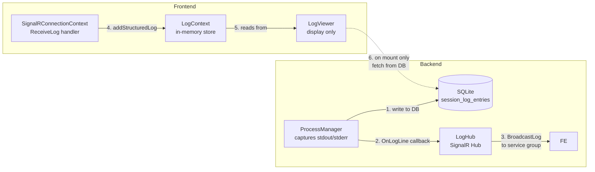

# Log Architecture Redesign

## Current Problems

1. **Race condition in LogViewer**: My recent `clearLogs` + DB fetch pattern wipes live SignalR logs before the DB fetch completes, causing flicker and data loss.

2. **useLogStream disconnects prematurely**: When a service stops, `useLogStream` leaves the SignalR group. But logs emitted during the brief "Starting"→"Running"→"Stopped" window may arrive after the leave, causing them to be missed entirely.

3. **DB fetch as primary source**: The LogViewer treats DB as the authoritative source and SignalR as secondary. It should be the opposite — SignalR is the real-time channel, DB is only for search/history.

4. **No session-aware replay**: The backend's `ReplayLogs` feature exists but isn't fully utilized in the frontend flow.

## Core Principle

> **"SignalR pushes, DB fills gaps."**

## Data Flow



## Architecture Rules

### Rule 1: SignalR is the SOLE real-time channel

- `useLogStream` activates when a service status is Running/Starting
- It joins the SignalR group for that service
- All logs are pushed via `ReceiveLog` → `addStructuredLog` → `LogContext`
- The `LogContext` already has dedup via `seenLinesRef` using `timestamp|line` keys
- Never clear `LogContext` in-flight logs (remove `clearLogs` from refresh flow)

### Rule 2: DB is for initial load and explicit search only

- On mount, if `LogContext` has zero logs for the service AND there's no active SignalR session, fetch once from DB
- The DB fetch ONLY appends — never replaces — live logs
- The dedup in `addStructuredLogs` prevents duplicates when same logs arrive via SignalR later

### Rule 3: Session-aware buffering

- The backend's `ReplayLogs` mechanism sends buffered logs to new joiners
- This handles the "service started and failed before I could join" scenario
- The `ReplayLogs` handler in `SignalRConnectionContext.tsx` already batches these into `addStructuredLogs`
- Together with dedup, this prevents duplicates

### Rule 4: Refresh never clears

- A "refresh" (from user clicking the button or from `handleServiceAction`) should:
  1. Increment the `refreshKey` to hint the LogViewer to check
  2. The LogViewer ONLY fetches from DB if `appLogs.length === 0` (no SignalR logs yet)
  3. If `appLogs.length > 0`, the DB fetch is skipped entirely — SignalR already has the data

## Component Responsibilities

### Backend — ProcessManager (unchanged)

```
captureLines:
  1. Write entry to DB (pm.logsDB.Create)
  2. Fire OnLogLine callback → LogHub.BroadcastLog
  
No changes needed here — the pattern is correct.
```

### Backend — LogHub

```
BroadcastLog(entry):
  → Clients().Group("app:" + entry.ServiceID).Send("LogEntry", entry)

SendServiceEvent(eventName, serviceID, sessionID):
  → Clients().All().Send(eventName, {serviceId, sessionId})
  
ReplayLogs(serviceID, lines):
  → Clients().Caller().Send("ReplayLogs", {serviceId, lines})
```

### Frontend — useLogStream

**Problem**: Currently leaves the group when service stops. Since `useEffect` cleanup fires on status change, this races with last log arrivals.

**Fix**: Stay in the group for a grace period after the service stops (e.g., 3 seconds). This ensures any last log lines arrive.

```typescript
// Proposed: add a grace timer before leaving the group
useEffect(() => {
  if (!serviceId) return;
  if (!isRunning) {
    // Don't leave immediately — wait for grace period to catch final logs
    const timer = setTimeout(() => leaveServiceGroup(serviceId), 3000);
    return () => clearTimeout(timer);
  }
  ...
}, [serviceId, ...]);
```

### Frontend — LogViewer

**Remove the DB fallback load entirely** — let SignalR handle it. Keep only:
- The `dbSearchMode` for explicit search queries
- The live log display from `LogContext`

If the user navigates to a service that just failed, the logs should already be in `LogContext` via SignalR. If not (e.g., page refresh), they can click the refresh button which triggers a one-time DB fetch.

```typescript
// Simplified LogViewer effect:
useEffect(() => {
  if (!appId) return;
  
  // Skip DB fetch if SignalR already delivered logs
  if (appLogs.length > 0) return;
  
  // One-time fallback: fetch from DB if no live logs
  const ctrl = new AbortController();
  fetchRecentFromDB(appId, ctrl.signal);
  return () => ctrl.abort();
}, [appId]);
```

### Frontend — SignalRConnectionContext

The `ReceiveLog` handler currently listens for `connection.on("ReceiveLog", ...)` but the backend broadcasts as `"LogEntry"`. Let me verify this...

Looking at `log_hub.go` line 68: `h.Clients().Group("app:"+entry.ServiceID).Send("LogEntry", entry)`
And `SignalRConnectionContext.tsx` line 92: `connection.on("ReceiveLog", ...)`

**BUG**: The backend sends `"LogEntry"` but the frontend listens for `"ReceiveLog"`. These don't match! This means SignalR log streaming has NEVER worked in the live path. The `ReplayLogs` handler (line 115) is the only working path.

This is a critical finding — the SignalR live log path is broken by a method name mismatch.

## Implementation Plan

### Step 1: Fix SignalR method name mismatch

Backend sends `"LogEntry"` but frontend listens for `"ReceiveLog"`. Fix one or the other.

**Change frontend** to listen for `"LogEntry"`:
```typescript
connection.on("LogEntry", (logData: any) => { ... });
```

### Step 2: Simplify LogViewer

Remove all DB fallback/refresh logic from the live log path. Only keep:
- Live display from `LogContext`
- DB search mode (explicit user action)
- A single `useEffect` to optionally load from DB on mount if `appLogs.length === 0`

### Step 3: Graceful disconnect in useLogStream

Add a 3-second grace timer before leaving the SignalR group after service stops.

### Step 4: Remove reactive refresh in ServiceConsole

Keep `handleServiceAction` for user-triggered refresh, but remove the `useEffect` on `realtimeStatus`.

### Step 5: Clean up unused code

- Remove `clearLogs` calls from refresh flows in LogViewer
- Remove `withRetry` DB fetch from LogViewer's live path
- Simplify `refreshKey` propagation

## File Changes Summary

| File | Change | Risk |
|------|--------|------|
| `ui/app/context/SignalRConnectionContext.tsx` | Change `"ReceiveLog"` → `"LogEntry"` | **HIGH** — core fix, this is the bug |
| `ui/app/hooks/useLogStream.ts` | Add 3s grace timer before leaving group | Low |
| `ui/app/components/LogViewer.tsx` | Remove DB fallback/refresh logic, simplify to SignalR-only | Medium |
| `ui/app/components/ServiceConsole.tsx` | Remove `useEffect` on `realtimeStatus`, keep only `handleServiceAction` | Low |
| `ui/app/context/LogContext.tsx` | No changes needed — dedup already works | None |
| `api-go/internal/hubs/log_hub.go` | No changes needed | None |
| `api-go/internal/services/process_manager.go` | No changes needed | None |
