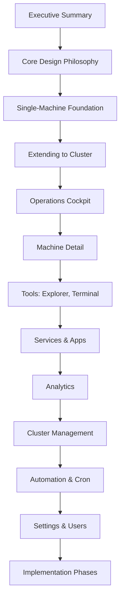

# Review: UI Redesign Operations Cockpit Document

**Document Reviewed**: [`plans/ui-redesign-operations-cockpit.md`](plans/ui-redesign-operations-cockpit.md)  
**Review Date**: 2026-06-14  
**Reviewer**: Architect Mode  

---

## Executive Summary

The current document provides comprehensive coverage of UI components, pages, and features. However, it has a **fundamental structural issue**: it presents multi-machine concepts (Fleet Overview, Machine Grid) before establishing the single-machine foundation. This contradicts the requirement to "start with ONE MACHINE (what minicluster agent can do), then extend to cluster and fleet."

Additionally, the document lacks explicit definition of **machine-level shortcuts and quick actions** that should be available on each machine card in the Operations Cockpit.

---

## 1. Structural Issues

### 1.1 Current Structure Problem

**Current Flow**:
```
Section 3: Operations Cockpit
  └─ Fleet Overview (multi-machine)
  └─ Machine Grid (multi-machine)
  └─ Alerts Feed

Section 4: Machine Detail (single machine deep-dive)
  ...
Section 9.10: Single-Machine Mode (buried in Analytics section)
```

**Issue**: The document leads with multi-machine concepts, making single-machine mode feel like an afterthought or fallback. This violates the progressive disclosure principle.

### 1.2 Recommended Restructure

**Proposed Flow**:
```
Section 1: Single-Machine Foundation (NEW)
  ├─ What MiniCluster Agent Can Do on ONE Machine
  ├─ Single-Machine Operations Cockpit
  ├─ Single-Machine Detail View
  └─ Single-Machine Tools (Explorer, Terminal, Services)

Section 2: Extending to Cluster (NEW)
  ├─ Multi-Machine Awareness
  ├─ Fleet Overview
  ├─ Machine Grid with Shortcuts
  └─ Cross-Machine Operations

Section 3: Operations Cockpit (Enhanced)
  └─ [Move current Section 3 here, with enhanced machine shortcuts]
```

---

## 2. Missing: Machine-Level Shortcuts & Quick Actions

### 2.1 Current State

Section 3.2 "Machine Grid" shows machine cards with basic buttons:
```
┌─────────────┐
│ 🟢 web-01   │
│ 45% CPU     │
│ 62% Mem     │
│ 5 services  │
│ [View] [>]  │  ← Only two generic buttons
└─────────────┘
```

### 2.2 What's Missing

**Explicit quick-action shortcuts** for common operations on each machine:

| Shortcut | Destination | Use Case |
|----------|-------------|----------|
| 📁 Files | `/explorer/:machineId` | Browse machine filesystem |
| 💻 Terminal | `/terminal/:machineId` | Open terminal on machine |
| 📊 Stats | `/machines/:machineId?tab=resources` | View resource metrics |
| 📈 Analytics | `/analytics?machine=:machineId` | Historical data for this machine |
| 🔧 Services | `/services?machine=:machineId` | Services on this machine |
| 📋 Logs | `/machines/:machineId?tab=logs` | Machine-wide logs |
| ⚙️ Settings | `/settings?machine=:machineId` | Machine-specific settings |

### 2.3 Recommended Enhancement

Add a **"Machine Quick Actions"** section to each machine card:

```
┌─────────────────────────────────────────┐
│ 🟢 web-01                               │
│ Ubuntu 22.04 · Agent v1.4.2             │
│                                         │
│ CPU: ████████░░░░ 45%                   │
│ Mem: ████████████░ 62% ⚠️               │
│ Svc: 5/6 running                        │
│                                         │
│ Quick Actions:                          │
│ [📁 Files] [💻 Terminal] [📊 Stats]     │
│ [📈 Analytics] [🔧 Services] [📋 Logs]  │
│                                         │
│ [View Detail →]                         │
└─────────────────────────────────────────┘
```

---

## 3. Missing: Single-Machine Foundation Section

### 3.1 What Should Be Added

A new **Section 1: Single-Machine Foundation** that answers:

> "What can MiniCluster Agent do on ONE machine, before any cluster concepts?"

### 3.2 Proposed Content Outline

```
## 1. Single-Machine Foundation (Free Tier)

### 1.1 What MiniCluster Agent Can Do

On a single machine, MiniCluster provides:

**System Monitoring**:
- CPU, Memory, Disk, Network metrics (real-time)
- Process list with CPU/Memory consumption
- Load average, context switches, interrupts
- Per-disk I/O statistics
- Per-interface network throughput

**Service Management**:
- Deploy and manage Process/Docker/Podman services
- Start/Stop/Restart services
- Service logs (real-time streaming)
- Service configuration management
- Environment variable management
- Health checks and auto-restart

**File Operations**:
- Browse filesystem
- View/Edit/Delete files
- Upload/Download files
- Search files

**Terminal Access**:
- Interactive shell access
- Multiple terminal sessions
- Command history

**Application Organization**:
- Group services into Apps
- App-level metrics aggregation
- Shared configuration
- Unified logs

**Authentication & Authorization**:
- User accounts with roles (Admin/Operator/Viewer)
- JWT authentication with refresh tokens
- First-run setup wizard

**Historical Data**:
- Metrics collection and aggregation
- Time-series exploration
- Anomaly detection
- Saved queries

### 1.2 Single-Machine Operations Cockpit

[Describe simplified cockpit without fleet overview]

### 1.3 Single-Machine Tools

[Describe Explorer, Terminal, Services without multi-machine context]

### 1.4 Single-Machine URL Structure

/                     → Operations Cockpit (single machine)
/analytics            → Historical data
/apps                 → App portfolio
/apps/:appSlug        → App workspace
/services             → Service catalog
/explorer             → File browser (no machine selector)
/terminal             → Terminal (no machine selector)
/settings             → Settings
/settings?tab=users   → User management (Admin only)
```

---

## 4. Missing: Backend Handler Coverage

### 4.1 Backend Handlers vs UI Pages

| Backend Handler | UI Page/Section | Coverage |
|-----------------|-----------------|----------|
| `/api/apps` | Section 8, 22 | ✅ Covered |
| `/api/auth` | Section 20 | ✅ Covered |
| `/api/cluster` | Section 3 | ⚠️ Partial (no cluster management UI) |
| `/api/containers` | Section 23.8 | ✅ Covered |
| `/api/cron` | Section 12.4 | ⚠️ Mentioned but not detailed |
| `/api/directories` | Section 5 | ✅ Covered |
| `/api/environments` | Section 23.9 | ✅ Covered |
| `/api/explorer` | Section 5 | ✅ Covered |
| `/api/groups` | - | ❌ Missing (no UI for groups) |
| `/api/health` | Section 3.2 | ✅ Covered |
| `/api/logs` | Section 4.8, 22.4, 23.4 | ✅ Covered |
| `/api/machines` | Section 3.2, 4 | ✅ Covered |
| `/api/metrics` | Section 9, 22.5, 23.6 | ✅ Covered |
| `/api/proxy` | Section 12.4 | ⚠️ Mentioned but not detailed |
| `/api/registry` | - | ❌ Missing (no UI for registry) |
| `/api/services` | Section 7, 22.3, 23 | ✅ Covered |
| `/api/sessions` | Section 23.5 | ✅ Covered |
| `/api/settings` | Section 22.8 | ✅ Covered |
| `/api/system` | Section 21.6 | ✅ Covered |
| `/api/versions` | - | ❌ Missing (no version info UI) |

### 4.2 Missing UI Pages

**1. Cluster Management** (for `/api/cluster`)
- Currently only shows cluster health in Cockpit
- Missing: Cluster settings, cluster-wide operations, node management

**2. Groups** (for `/api/groups`)
- No UI for managing service groups or app groups
- Could be useful for bulk operations

**3. Registry** (for `/api/registry`)
- No UI for container registry management
- Spec 019 and 026 cover registry features

**4. Cron/Scheduled Tasks** (for `/api/cron`)
- Section 12.4 mentions "Automation" but doesn't detail cron job management
- Should show: Scheduled jobs, execution history, enable/disable

**5. Proxy Configuration** (for `/api/proxy`)
- Section 12.4 mentions "Proxy" but doesn't detail reverse proxy management
- Should show: Proxy rules, SSL certificates, domain mapping

**6. Version Information** (for `/api/versions`)
- No UI showing MiniCluster version, agent versions, update availability

---

## 5. User/Admin Use Case Coverage

### 5.1 Current Coverage

| Use Case | Covered? | Location |
|----------|----------|----------|
| Login/Logout | ✅ | Section 20 |
| First-time setup | ✅ | Section 20.2 Flow 3 |
| View system health | ✅ | Section 3.2 |
| Investigate high CPU | ✅ | Section 3.4 |
| Manage services | ✅ | Section 7, 23 |
| Browse files | ✅ | Section 5 |
| Use terminal | ✅ | Section 6 |
| View historical data | ✅ | Section 9 |
| Compare machines | ✅ | Section 9.3 |
| Detect anomalies | ✅ | Section 9.4 |
| Manage users | ✅ | Section 21 |
| Manage apps | ✅ | Section 22 |
| Configure services | ✅ | Section 23.8 |

### 5.2 Missing Use Cases

**Admin-Specific**:
1. **View audit log** - Who did what and when (mentioned in 21.6 but not detailed)
2. **Manage API keys** - Create/revoke API keys for automation (mentioned in 21.5 but not detailed)
3. **Configure OIDC** - Set up external identity providers
4. **Manage cluster nodes** - Add/remove machines from cluster
5. **Configure alerts** - Set up alerting rules (Spec 023)
6. **View license/tier** - See current plan and usage limits

**Operator-Specific**:
1. **Deploy to specific machine** - Choose target machine for service
2. **Migrate services** - Move service from one machine to another
3. **Scale services** - Replicate service to multiple machines
4. **Backup/Restore** - Create snapshots (mentioned in 22.7 but not detailed)
5. **Manage cron jobs** - Schedule recurring tasks

**Viewer-Specific**:
1. **Read-only access enforcement** - Clear indication of read-only mode
2. **Export data** - Download metrics, logs, configs

---

## 6. Specific Recommendations

### 6.1 Add Section: "Machine Quick Actions"

Insert after Section 3.2 "Machine Grid":

```markdown
### 3.2.1 Machine Quick Actions

Each machine card in the grid provides quick-access shortcuts to common operations:

| Action | Icon | Destination | Description |
|--------|------|-------------|-------------|
| Files | 📁 | `/explorer/:machineId` | Browse machine filesystem |
| Terminal | 💻 | `/terminal/:machineId` | Open terminal session |
| Stats | 📊 | `/machines/:machineId?tab=resources` | View resource metrics |
| Analytics | 📈 | `/analytics?machine=:machineId` | Historical data exploration |
| Services | 🔧 | `/services?machine=:machineId` | View services on this machine |
| Logs | 📋 | `/machines/:machineId?tab=logs` | View machine-wide logs |
| Detail | → | `/machines/:machineId` | Full machine detail page |

**Card Layout with Quick Actions**:
```
┌─────────────────────────────────────────┐
│ 🟢 web-01                    [⋮ Menu]  │
│ Ubuntu 22.04 · Agent v1.4.2 · 14d up   │
│                                         │
│ CPU: ████████░░░░ 45%   Net: ↑12 ↓45   │
│ Mem: ████████████░ 62%  Disk: 38%      │
│ Svc: 🟢5 🔴1 ⚫0                        │
│                                         │
│ [📁] [💻] [📊] [📈] [🔧] [📋] [→]      │
└─────────────────────────────────────────┘
```

**Overflow Menu** (⋮):
- Restart Agent
- Drain Services
- Decommission
- View Agent Logs
```

### 6.2 Restructure Document Order

**New Section Order**:

1. Executive Summary
2. Core Design Philosophy
3. **Single-Machine Foundation (NEW)**
4. **Extending to Cluster (NEW)**
5. Information Architecture (routes)
6. Operations Cockpit (enhanced with quick actions)
7. Machine Detail Page
8. File Explorer
9. Terminal
10. Services Page
11. Apps Page
12. Analytics
13. Navigation & Layout
14. Responsive Design
15. URL State Persistence
16. Component Hierarchy
17. Data Flow
18. Accessibility
19. Implementation Priorities
20. Open Questions
21. Hivemind Grid Integration
22. Login & Authentication
23. User Management
24. App Workspace
25. Service Workspace
26. Summary

### 6.3 Add Missing Sections

**New Section: Cluster Management** (after Operations Cockpit)

```markdown
## X. Cluster Management

### X.1 Cluster Overview

**Route**: `/cluster` (Admin only)

**Purpose**: Manage the MiniCluster cluster configuration

**Layout**:
- List of registered machines
- Machine status (online/offline/degraded)
- Agent version per machine
- Quick actions: Add Machine, Remove Machine, Restart Agent

### X.2 Add Machine Flow

1. Generate agent registration token
2. Show installation command
3. Wait for agent to connect
4. Confirm registration

### X.3 Machine Actions

- **Restart Agent**: Remote restart of agent service
- **Drain Services**: Gracefully move services to other machines
- **Decommission**: Remove machine from cluster (requires service migration)
- **View Agent Logs**: Stream agent's own logs
```

**New Section: Cron/Scheduled Tasks**

```markdown
## Y. Automation & Cron (`/automation`)

### Y.1 Page Structure

**Layout**:
```
┌─────────────────────────────────────────────────────────────────────┐
│ Automation                                                          │
│ [+ Create Job]  [Filter: All/Active/Paused]                         │
│                                                                     │
│ ┌─────────────────────────────────────────────────────────────────┐│
│ │ Name              │ Schedule      │ Next Run    │ Status │ Last ││
│ │───────────────────┼───────────────┼─────────────┼────────┼──────││
│ │ Database Backup   │ 0 2 * * *     │ Tomorrow 2am│ Active │ OK   ││
│ │ Log Rotation      │ 0 0 * * 0     │ Sun midnight│ Active │ OK   ││
│ │ Health Check      │ */5 * * * *   │ 3 min       │ Active │ OK   ││
│ └─────────────────────────────────────────────────────────────────┘│
└─────────────────────────────────────────────────────────────────────┘
```

### Y.2 Create/Edit Job

- Name
- Schedule (cron expression with human-readable preview)
- Command/Script to execute
- Target machine (or all machines)
- Timeout
- Success/Failure notification settings
```

### 6.4 Enhance Single-Machine Mode Section

Move Section 9.10 to Section 3 (Single-Machine Foundation) and expand:

```markdown
## 3. Single-Machine Foundation (Free Tier)

### 3.1 Detection

Single-machine mode is detected when:
- `GET /api/machines` returns exactly 1 machine
- That machine's ID matches the local machine

### 3.2 UI Simplifications

| Feature | Multi-Machine | Single-Machine |
|---------|---------------|----------------|
| Machine Selector | Shown | Hidden |
| Machine Grid | Shown | Hidden |
| Cluster Health | Shown | System Health only |
| Machine column in grids | Shown | Hidden |
| URL machine params | Present | Absent |

### 3.3 Single-Machine Sidebar

```
┌─────────────────────────────────────────┐
│ 🏠 Cockpit                              │
│ 📊 Analytics                            │
│ 📦 Apps                                 │
│ 🔧 Services                             │
│ 📁 Files                                │
│ 💻 Terminal                             │
│ 🌐 Proxy                                │
│ ⏰ Automation                           │
│ 🌳 Hierarchy                            │
│ ─────────────────────────────────────── │
│ ⚙️ Settings                             │
│    ├─ General                           │
│    ├─ 👥 Users (Admin only)             │
│    └─ System                            │
└─────────────────────────────────────────┘
```

Note: "Machines" link removed - not needed for single machine.

### 3.4 Single-Machine Operations Cockpit

```
┌─────────────────────────────────────────────────────────────┐
│ HEADER: MiniCluster · 🟢 Connected · v1.4.2                 │
├─────────────────────────────────────────────────────────────┤
│                                                             │
│ SYSTEM HEALTH (single machine)                              │
│ ┌─────────────────────────────────────────────────────────┐│
│ │ CPU: 45% │ Memory: 62% │ Disk: 38% │ Services: 12/15   ││
│ └─────────────────────────────────────────────────────────┘│
│                                                             │
│ FOCUS PANEL (full width)                                    │
│ [Performance] [Processes] [Disks] [Network] [History]       │
│ ┌─────────────────────────────────────────────────────────┐│
│ │                                                         ││
│ │ Charts and tables for the local machine                 ││
│ │ (No machine selection needed)                           ││
│ │                                                         ││
│ └─────────────────────────────────────────────────────────┘│
└─────────────────────────────────────────────────────────────┘
```

### 3.5 What You Can Do on One Machine

| Capability | Description |
|------------|-------------|
| Monitor Resources | CPU, Memory, Disk, Network in real-time |
| Manage Services | Deploy, start, stop, configure services |
| Browse Files | Full filesystem access |
| Terminal | Interactive shell |
| View Logs | Real-time log streaming |
| Historical Data | Metrics, anomalies, trends |
| Manage Users | Create accounts, assign roles |
| Organize Apps | Group services into applications |
| Schedule Tasks | Cron jobs and automation |
| Configure Proxy | Reverse proxy rules |
```

---

## 7. Summary of Gaps

| Gap | Severity | Recommendation |
|-----|----------|----------------|
| Document structure is multi-machine first | **High** | Restructure to single-machine first |
| No machine quick actions defined | **High** | Add machine card shortcuts section |
| No single-machine foundation section | **High** | Add new Section 3 |
| Cluster management UI missing | Medium | Add cluster management section |
| Cron/Automation UI not detailed | Medium | Expand automation section |
| Registry UI missing | Medium | Add registry management (Spec 019/026) |
| Groups UI missing | Low | Add groups management |
| Version info UI missing | Low | Add version/about page |
| Proxy UI not detailed | Low | Expand proxy section |

---

## 8. Recommended Next Steps

1. **Restructure the document** to follow single-machine → cluster → fleet progression
2. **Add Machine Quick Actions** section to Operations Cockpit
3. **Create Single-Machine Foundation** section as the entry point
4. **Add missing sections** for Cluster Management, Automation, Registry
5. **Review with stakeholders** to validate the new structure
6. **Update implementation phases** to reflect new structure

---

## Appendix: Mermaid Diagram - Proposed Document Flow



---

**End of Review**
