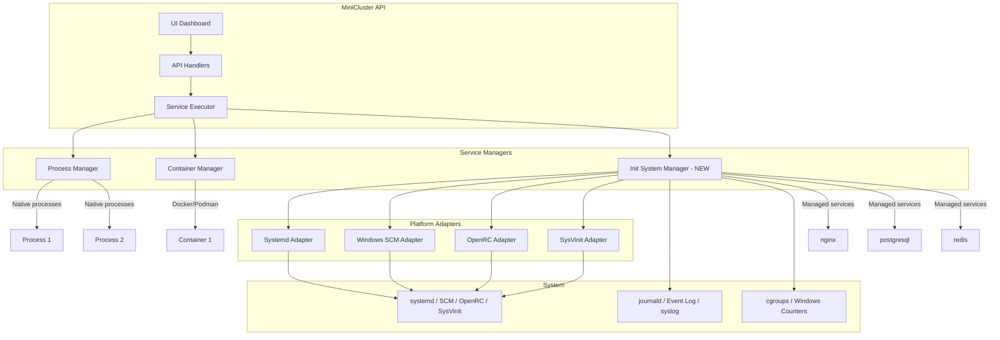
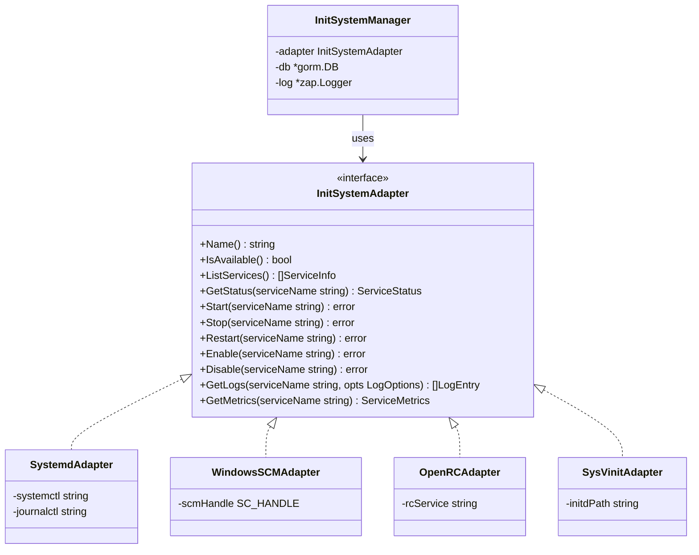
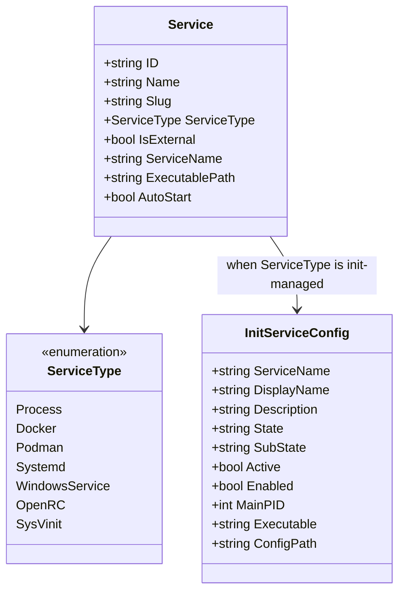

# Cross-Platform Service Management Architecture

> **Status:** Draft
> **Phase:** Service Management Enhancement
> **Priority:** HIGH
> **Author:** Zoo
> **Date:** 2026-06-16

---

## 1. Executive Summary

This document defines the architecture for **cross-platform service management** in MiniCluster. The system will support:

1. **MiniCluster's own service** - Install, uninstall, status monitoring (platform-specific)
2. **External services** - Full lifecycle management (start/stop/restart/enable/disable), log access, and metrics collection for services like nginx, postgresql, redis, etc.

### Platform Support

| Platform | Init System | Service Type | Status |
|----------|-------------|--------------|--------|
| **Linux (systemd)** | systemd | `systemd` | ✅ Primary target |
| **Windows** | SCM (Service Control Manager) | `windows-service` | ✅ Supported |
| **Alpine/Gentoo** | OpenRC | `openrc` | ✅ Supported |
| **Devuan/older Linux** | SysVinit | `sysvinit` | ✅ Supported |
| **Void Linux** | runit | `runit` | 🔵 Future |
| **macOS** | launchd | `launchd` | 🔵 Future |

The design uses a **platform abstraction layer** with adapters for each init system, allowing the same API and UI to work across all platforms.

---

## 2. Current State Analysis

### 2.1 Existing Service Management

| Component | File | Capability |
|-----------|------|------------|
| **Service Model** | [`api-go/internal/models/models.go`](api-go/internal/models/models.go:172) | `Service` struct with `IsExternal` flag, `ServiceType` (Process/Docker/Podman) |
| **Process Manager** | [`api-go/internal/services/process_manager.go`](api-go/internal/services/process_manager.go:39) | Manages native OS processes |
| **Container Manager** | [`api-go/internal/services/container_manager.go`](api-go/internal/services/container_manager.go) | Manages Docker/Podman containers |
| **Service Executor** | [`api-go/internal/services/service_executor.go`](api-go/internal/services/service_executor.go:15) | Unified entry point routing to correct manager |
| **System Handler** | [`api-go/internal/handlers/system.go`](api-go/internal/handlers/system.go:17) | MiniCluster's own systemd service install/uninstall |
| **Health Check Worker** | [`api-go/internal/workers/health_check.go`](api-go/internal/workers/health_check.go:20) | HTTP/TCP/Exec health probes |
| **Auto Restart Worker** | [`api-go/internal/workers/auto_restart.go`](api-go/internal/workers/auto_restart.go:28) | Restart policies for failed services |

### 2.2 Gaps Identified

| Gap | Description |
|-----|-------------|
| **No Systemd Manager** | No abstraction for managing arbitrary systemd services |
| **External services are passive** | `IsExternal=true` services are tracked but not controlled |
| **No journal log access** | Cannot read systemd journal logs for external services |
| **No systemd metrics** | No CPU/memory metrics from systemd cgroups |
| **No enable/disable** | Cannot control service boot startup for external services |

---

## 3. Architecture Design

### 3.1 High-Level Architecture



### 3.2 Platform Abstraction Layer



### 3.3 Service Type Hierarchy



---

## 4. Data Model Extensions

### 4.1 Extended Service Model

Add to [`api-go/internal/models/models.go`](api-go/internal/models/models.go):

```go
// Extend ServiceType enum
const (
    ServiceTypeProcess       ServiceType = "Process"
    ServiceTypeDocker        ServiceType = "Docker"
    ServiceTypePodman        ServiceType = "Podman"
    // Init system managed services (platform-specific)
    ServiceTypeSystemd       ServiceType = "Systemd"       // Linux with systemd
    ServiceTypeWindowsSvc    ServiceType = "WindowsService" // Windows SCM
    ServiceTypeOpenRC        ServiceType = "OpenRC"        // Alpine, Gentoo
    ServiceTypeSysVinit      ServiceType = "SysVinit"      // Devuan, older Linux
)

// InitServiceConfig holds configuration for init-system managed services
// This is a unified model that works across all platforms
type InitServiceConfig struct {
    ID        string `gorm:"type:text;primaryKey" json:"id"`
    ServiceID string `gorm:"type:text;not null;uniqueIndex" json:"serviceId"`
    
    // Service identification (platform-specific naming)
    ServiceName  string `gorm:"type:text;not null" json:"serviceName"` // nginx, nginx.service, etc.
    DisplayName  string `gorm:"type:text" json:"displayName"`          // Human-readable name
    Description  string `gorm:"type:text" json:"description"`
    
    // Runtime state (populated from platform-specific queries)
    ActiveState  string `gorm:"type:text" json:"activeState"`  // active/running, inactive/stopped, failed
    SubState     string `gorm:"type:text" json:"subState"`     // running, dead, exited, etc.
    LoadState    string `gorm:"type:text" json:"loadState"`    // loaded, not-found, masked (systemd)
    ConfigPath   string `gorm:"type:text" json:"configPath"`   // Path to unit/config file
    
    // Control
    Enabled      bool   `gorm:"not null;default:false" json:"enabled"` // Start at boot
    Static       bool   `gorm:"not null;default:false" json:"static"`  // Cannot be enabled/disabled
    
    // Process info
    MainPID      int    `gorm:"default:0" json:"mainPid"`
    Executable   string `gorm:"type:text" json:"executable"`
    
    // Platform-specific timestamps
    StateChangeTimestamp  *time.Time `json:"stateChangeTimestamp"`
    ActiveEnterTimestamp  *time.Time `json:"activeEnterTimestamp"`
    
    CreatedAt  time.Time `json:"createdAt"`
    ModifiedAt time.Time `json:"modifiedAt"`
    
    Service *Service `gorm:"foreignKey:ServiceID" json:"-"`
}
```

### 4.2 Service Metrics Model (Platform-Agnostic)

Add to [`api-go/internal/models/logs_models.go`](api-go/internal/models/logs_models.go):

```go
// InitServiceMetrics captures metrics for init-system managed services
// Source varies by platform: cgroups (systemd), Windows Performance Counters, /proc (OpenRC/SysVinit)
type InitServiceMetrics struct {
    ID        string    `gorm:"type:text;primaryKey" json:"id"`
    ServiceID string    `gorm:"type:text;not null;index" json:"serviceId"`
    Timestamp time.Time `gorm:"not null;index" json:"timestamp"`
    
    // CPU
    CpuUsagePercent   float64 `json:"cpuUsagePercent"`
    CpuUsageNanos     uint64  `json:"cpuUsageNanos"`
    
    // Memory
    MemoryCurrent     int64   `json:"memoryCurrent"`
    MemoryLimit       int64   `json:"memoryLimit"`
    MemoryUsagePercent float64 `json:"memoryUsagePercent"`
    
    // Tasks/Threads
    TasksCurrent      int     `json:"tasksCurrent"`
    TasksMax          int     `json:"tasksMax"`
    
    // IO (platform-dependent availability)
    IOReadBytes       uint64  `json:"ioReadBytes"`
    IOWriteBytes      uint64  `json:"ioWriteBytes"`
    IOReadOps         uint64  `json:"ioReadOps"`
    IOWriteOps        uint64  `json:"ioWriteOps"`
}
```

### 4.3 Service Log Model (Platform-Agnostic)

Add to [`api-go/internal/models/logs_models.go`](api-go/internal/models/logs_models.go):

```go
// InitServiceLogEntry represents a log entry from platform-specific log sources
// Source: journald (systemd), Event Log (Windows), syslog (OpenRC/SysVinit)
type SystemdJournalEntry struct {
    ID        string    `gorm:"type:text;primaryKey" json:"id"`
    ServiceID string    `gorm:"type:text;not null;index" json:"serviceId"`
    Timestamp time.Time `gorm:"not null;index" json:"timestamp"`
    
    // Journal fields
    Message     string `gorm:"type:text" json:"message"`
    Priority    int    `json:"priority"` // 0=emerg, 3=err, 4=warning, 6=info, 7=debug
    SyslogID    string `gorm:"type:text" json:"syslogId"`
    PID         int    `json:"pid"`
    UID         int    `json:"uid"`
    GID         int    `json:"gid"`
    
    // Source
    Unit        string `gorm:"type:text" json:"unit"`
    Slice       string `gorm:"type:text" json:"slice"`
    CGroup      string `gorm:"type:text" json:"cgroup"`
}
```

---

## 5. Init System Manager Implementation

### 5.1 Adapter Interface

Create `api-go/internal/services/init_adapter.go`:

```go
package services

import (
    "time"
)

// InitSystemAdapter defines the interface for platform-specific init system operations
type InitSystemAdapter interface {
    // Name returns the adapter name (e.g., "systemd", "windows-scm", "openrc")
    Name() string
    
    // IsAvailable checks if this init system is available on the current platform
    IsAvailable() bool
    
    // ListServices returns all services managed by this init system
    ListServices() ([]InitServiceInfo, error)
    
    // GetServiceInfo returns detailed info about a specific service
    GetServiceInfo(serviceName string) (*InitServiceInfo, error)
    
    // Start starts a service
    Start(serviceName string) error
    
    // Stop stops a service
    Stop(serviceName string) error
    
    // Restart restarts a service
    Restart(serviceName string) error
    
    // Reload reloads service configuration (if supported)
    Reload(serviceName string) error
    
    // Enable enables a service to start at boot
    Enable(serviceName string) error
    
    // Disable disables a service from starting at boot
    Disable(serviceName string) error
    
    // GetLogs retrieves logs for a service
    GetLogs(serviceName string, opts LogOptions) ([]LogEntry, error)
    
    // GetMetrics retrieves metrics for a service (if supported)
    GetMetrics(serviceName string) (*ServiceMetrics, error)
}

// InitServiceInfo represents service information across all platforms
type InitServiceInfo struct {
    Name        string    `json:"name"`        // Service name (nginx, nginx.service)
    DisplayName string    `json:"displayName"` // Human-readable name
    Description string    `json:"description"`
    State       string    `json:"state"`       // active, inactive, failed
    SubState    string    `json:"subState"`    // running, dead, exited
    Enabled     bool      `json:"enabled"`     // Start at boot
    MainPID     int       `json:"mainPid"`
    Executable  string    `json:"executable"`
    ConfigPath  string    `json:"configPath"`
    Since       time.Time `json:"since"`
}

// LogOptions specifies log retrieval options
type LogOptions struct {
    Lines  int       // Number of lines to return
    Since  time.Time // Start time
    Until  time.Time // End time
    Follow bool      // Stream logs
}

// LogEntry represents a single log entry
type LogEntry struct {
    Timestamp time.Time `json:"timestamp"`
    Message   string    `json:"message"`
    Priority  int       `json:"priority"` // 0=emerg, 3=err, 4=warning, 6=info, 7=debug
    PID       int       `json:"pid"`
}

// ServiceMetrics represents resource usage metrics
type ServiceMetrics struct {
    CpuUsagePercent    float64 `json:"cpuUsagePercent"`
    MemoryCurrent      int64   `json:"memoryCurrent"`
    MemoryLimit        int64   `json:"memoryLimit"`
    MemoryUsagePercent float64 `json:"memoryUsagePercent"`
    TasksCurrent       int     `json:"tasksCurrent"`
    TasksMax           int     `json:"tasksMax"`
}
```

### 5.2 Systemd Adapter

Create `api-go/internal/services/init_adapter_systemd.go`:

```go
package services

import (
    "fmt"
    "os/exec"
    "strconv"
    "strings"
    "time"
)

// SystemdAdapter implements InitSystemAdapter for systemd-based Linux systems
type SystemdAdapter struct{}

func NewSystemdAdapter() *SystemdAdapter {
    return &SystemdAdapter{}
}

func (a *SystemdAdapter) Name() string {
    return "systemd"
}

func (a *SystemdAdapter) IsAvailable() bool {
    _, err := exec.LookPath("systemctl")
    return err == nil
}

func (a *SystemdAdapter) ListServices() ([]InitServiceInfo, error) {
    out, err := exec.Command("systemctl", "list-units", "--type=service", "--all", "--no-pager", "--plain").Output()
    if err != nil {
        return nil, err
    }
    return a.parseListUnits(string(out))
}

func (a *SystemdAdapter) GetServiceInfo(serviceName string) (*InitServiceInfo, error) {
    props, err := a.getProperties(serviceName)
    if err != nil {
        return nil, err
    }
    
    enabled, _ := a.isEnabled(serviceName)
    pid, _ := strconv.Atoi(props["MainPID"])
    
    var since time.Time
    if ts := props["ActiveEnterTimestamp"]; ts != "" {
        since, _ = time.Parse("Mon 2006-01-02 15:04:05 MST", ts)
    }
    
    return &InitServiceInfo{
        Name:        serviceName,
        DisplayName: props["Description"],
        Description: props["Description"],
        State:       props["ActiveState"],
        SubState:    props["SubState"],
        Enabled:     enabled,
        MainPID:     pid,
        Executable:  props["ExecStart"],
        ConfigPath:  props["FragmentPath"],
        Since:       since,
    }, nil
}

func (a *SystemdAdapter) Start(serviceName string) error {
    _, err := exec.Command("systemctl", "start", serviceName).CombinedOutput()
    return err
}

func (a *SystemdAdapter) Stop(serviceName string) error {
    _, err := exec.Command("systemctl", "stop", serviceName).CombinedOutput()
    return err
}

func (a *SystemdAdapter) Restart(serviceName string) error {
    _, err := exec.Command("systemctl", "restart", serviceName).CombinedOutput()
    return err
}

func (a *SystemdAdapter) Reload(serviceName string) error {
    _, err := exec.Command("systemctl", "reload", serviceName).CombinedOutput()
    return err
}

func (a *SystemdAdapter) Enable(serviceName string) error {
    _, err := exec.Command("systemctl", "enable", serviceName).CombinedOutput()
    return err
}

func (a *SystemdAdapter) Disable(serviceName string) error {
    _, err := exec.Command("systemctl", "disable", serviceName).CombinedOutput()
    return err
}

func (a *SystemdAdapter) GetLogs(serviceName string, opts LogOptions) ([]LogEntry, error) {
    args := []string{"-u", serviceName, "--no-pager", "-o", "json"}
    if opts.Lines > 0 {
        args = append(args, "-n", strconv.Itoa(opts.Lines))
    }
    if !opts.Since.IsZero() {
        args = append(args, "--since", opts.Since.Format("2006-01-02 15:04:05"))
    }
    
    out, err := exec.Command("journalctl", args...).Output()
    if err != nil {
        return nil, err
    }
    return a.parseJournalOutput(string(out))
}

func (a *SystemdAdapter) GetMetrics(serviceName string) (*ServiceMetrics, error) {
    // Read from cgroup v2: /sys/fs/cgroup/system.slice/<service>.service/
    // Parse cpu.stat, memory.current, memory.max, pids.current, pids.max
    return a.readCgroupMetrics(serviceName)
}

// Helper methods
func (a *SystemdAdapter) getProperties(serviceName string) (map[string]string, error) {
    out, err := exec.Command("systemctl", "show", serviceName,
        "--property=Description,ActiveState,SubState,LoadState,MainPID,FragmentPath,ExecStart,ActiveEnterTimestamp").Output()
    if err != nil {
        return nil, err
    }
    
    props := make(map[string]string)
    for _, line := range strings.Split(string(out), "\n") {
        if idx := strings.Index(line, "="); idx > 0 {
            props[line[:idx]] = line[idx+1:]
        }
    }
    return props, nil
}

func (a *SystemdAdapter) isEnabled(serviceName string) (bool, error) {
    out, err := exec.Command("systemctl", "is-enabled", serviceName).Output()
    if err != nil {
        return false, err
    }
    return strings.TrimSpace(string(out)) == "enabled", nil
}

func (a *SystemdAdapter) parseListUnits(output string) ([]InitServiceInfo, error) {
    // Parse systemctl list-units output
    var services []InitServiceInfo
    lines := strings.Split(output, "\n")
    for _, line := range lines {
        fields := strings.Fields(line)
        if len(fields) >= 4 && strings.HasSuffix(fields[0], ".service") {
            name := strings.TrimSuffix(fields[0], ".service")
            services = append(services, InitServiceInfo{
                Name:    name,
                State:   fields[2], // active, inactive, failed
                SubState: fields[3], // running, dead, exited
                Enabled: true, // Would need separate check
            })
        }
    }
    return services, nil
}

func (a *SystemdAdapter) parseJournalOutput(output string) ([]LogEntry, error) {
    // Parse JSON lines from journalctl
    // Implementation omitted for brevity
    return nil, nil
}

func (a *SystemdAdapter) readCgroupMetrics(serviceName string) (*ServiceMetrics, error) {
    // Read from /sys/fs/cgroup/system.slice/<serviceName>.service/
    // Implementation omitted for brevity
    return nil, fmt.Errorf("not implemented")
}
```

### 5.3 Windows SCM Adapter

Create `api-go/internal/services/init_adapter_windows.go`:

```go
//go:build windows

package services

import (
    "fmt"
    "time"
    "unsafe"
    
    "golang.org/x/sys/windows"
    "golang.org/x/sys/windows/svc"
    "golang.org/x/sys/windows/svc/mgr"
)

// WindowsSCMAdapter implements InitSystemAdapter for Windows Service Control Manager
type WindowsSCMAdapter struct{}

func NewWindowsSCMAdapter() *WindowsSCMAdapter {
    return &WindowsSCMAdapter{}
}

func (a *WindowsSCMAdapter) Name() string {
    return "windows-scm"
}

func (a *WindowsSCMAdapter) IsAvailable() bool {
    return true // Always available on Windows
}

func (a *WindowsSCMAdapter) ListServices() ([]InitServiceInfo, error) {
    m, err := mgr.Connect()
    if err != nil {
        return nil, err
    }
    defer m.Disconnect()
    
    // Enumerate services using Windows API
    // Implementation uses Win32 API calls
    return a.enumerateServices(m)
}

func (a *WindowsSCMAdapter) GetServiceInfo(serviceName string) (*InitServiceInfo, error) {
    m, err := mgr.Connect()
    if err != nil {
        return nil, err
    }
    defer m.Disconnect()
    
    s, err := mgr.NewService(m, serviceName)
    if err != nil {
        return nil, err
    }
    defer s.Close()
    
    status, err := s.Query()
    if err != nil {
        return nil, err
    }
    
    config, err := s.Config()
    if err != nil {
        return nil, err
    }
    
    return &InitServiceInfo{
        Name:        serviceName,
        DisplayName: config.DisplayName,
        Description: config.Description,
        State:       a.mapState(status.State),
        SubState:    a.mapState(status.State),
        Enabled:     config.StartType == mgr.StartAutomatic,
        Executable:  config.BinaryPathName,
    }, nil
}

func (a *WindowsSCMAdapter) Start(serviceName string) error {
    m, err := mgr.Connect()
    if err != nil {
        return err
    }
    defer m.Disconnect()
    
    s, err := mgr.NewService(m, serviceName)
    if err != nil {
        return err
    }
    defer s.Close()
    
    return s.Start()
}

func (a *WindowsSCMAdapter) Stop(serviceName string) error {
    m, err := mgr.Connect()
    if err != nil {
        return err
    }
    defer m.Disconnect()
    
    s, err := mgr.NewService(m, serviceName)
    if err != nil {
        return err
    }
    defer s.Close()
    
    _, err = s.Control(svc.Stop)
    return err
}

func (a *WindowsSCMAdapter) Restart(serviceName string) error {
    if err := a.Stop(serviceName); err != nil {
        return err
    }
    time.Sleep(1 * time.Second)
    return a.Start(serviceName)
}

func (a *WindowsSCMAdapter) Reload(serviceName string) error {
    // Windows services don't have a standard reload mechanism
    return fmt.Errorf("reload not supported on Windows, use restart")
}

func (a *WindowsSCMAdapter) Enable(serviceName string) error {
    m, err := mgr.Connect()
    if err != nil {
        return err
    }
    defer m.Disconnect()
    
    s, err := mgr.NewService(m, serviceName)
    if err != nil {
        return err
    }
    defer s.Close()
    
    return s.SetStartType(mgr.StartAutomatic)
}

func (a *WindowsSCMAdapter) Disable(serviceName string) error {
    m, err := mgr.Connect()
    if err != nil {
        return err
    }
    defer m.Disconnect()
    
    s, err := mgr.NewService(m, serviceName)
    if err != nil {
        return err
    }
    defer s.Close()
    
    return s.SetStartType(mgr.StartDisabled)
}

func (a *WindowsSCMAdapter) GetLogs(serviceName string, opts LogOptions) ([]LogEntry, error) {
    // Read from Windows Event Log
    // Use golang.org/x/sys/windows/eventlog or winevt package
    return a.readEventLog(serviceName, opts)
}

func (a *WindowsSCMAdapter) GetMetrics(serviceName string) (*ServiceMetrics, error) {
    // Use Windows Performance Counters or GetProcessMemoryInfo
    return a.readPerformanceMetrics(serviceName)
}

func (a *WindowsSCMAdapter) mapState(state svc.State) string {
    switch state {
    case svc.Running:
        return "active"
    case svc.Stopped:
        return "inactive"
    case svc.StartPending:
        return "activating"
    case svc.StopPending:
        return "deactivating"
    default:
        return "unknown"
    }
}
```

### 5.4 OpenRC Adapter

Create `api-go/internal/services/init_adapter_openrc.go`:

```go
package services

import (
    "fmt"
    "os"
    "os/exec"
    "path/filepath"
    "strings"
)

// OpenRCAdapter implements InitSystemAdapter for OpenRC (Alpine, Gentoo)
type OpenRCAdapter struct {
    initdPath string // Usually /etc/init.d
    runlevelPath string // Usually /etc/runlevels
}

func NewOpenRCAdapter() *OpenRCAdapter {
    return &OpenRCAdapter{
        initdPath:    "/etc/init.d",
        runlevelPath: "/etc/runlevels",
    }
}

func (a *OpenRCAdapter) Name() string {
    return "openrc"
}

func (a *OpenRCAdapter) IsAvailable() bool {
    // Check for OpenRC presence
    _, err := exec.LookPath("rc-service")
    return err == nil
}

func (a *OpenRCAdapter) ListServices() ([]InitServiceInfo, error) {
    entries, err := os.ReadDir(a.initdPath)
    if err != nil {
        return nil, err
    }
    
    var services []InitServiceInfo
    for _, entry := range entries {
        if entry.IsDir() {
            continue
        }
        info, err := a.GetServiceInfo(entry.Name())
        if err != nil {
            continue
        }
        services = append(services, *info)
    }
    return services, nil
}

func (a *OpenRCAdapter) GetServiceInfo(serviceName string) (*InitServiceInfo, error) {
    scriptPath := filepath.Join(a.initdPath, serviceName)
    if _, err := os.Stat(scriptPath); os.IsNotExist(err) {
        return nil, fmt.Errorf("service %s not found", serviceName)
    }
    
    // Get status
    statusOut, _ := exec.Command("rc-service", serviceName, "status").Output()
    state := a.parseStatus(string(statusOut))
    
    // Check if enabled (in default runlevel)
    enabled := a.isEnabled(serviceName)
    
    return &InitServiceInfo{
        Name:       serviceName,
        State:      state,
        SubState:   state,
        Enabled:    enabled,
        ConfigPath: scriptPath,
    }, nil
}

func (a *OpenRCAdapter) Start(serviceName string) error {
    _, err := exec.Command("rc-service", serviceName, "start").CombinedOutput()
    return err
}

func (a *OpenRCAdapter) Stop(serviceName string) error {
    _, err := exec.Command("rc-service", serviceName, "stop").CombinedOutput()
    return err
}

func (a *OpenRCAdapter) Restart(serviceName string) error {
    _, err := exec.Command("rc-service", serviceName, "restart").CombinedOutput()
    return err
}

func (a *OpenRCAdapter) Reload(serviceName string) error {
    _, err := exec.Command("rc-service", serviceName, "reload").CombinedOutput()
    return err
}

func (a *OpenRCAdapter) Enable(serviceName string) error {
    _, err := exec.Command("rc-update", "add", serviceName, "default").CombinedOutput()
    return err
}

func (a *OpenRCAdapter) Disable(serviceName string) error {
    _, err := exec.Command("rc-update", "del", serviceName, "default").CombinedOutput()
    return err
}

func (a *OpenRCAdapter) GetLogs(serviceName string, opts LogOptions) ([]LogEntry, error) {
    // OpenRC typically logs to syslog
    return a.readSyslog(serviceName, opts)
}

func (a *OpenRCAdapter) GetMetrics(serviceName string) (*ServiceMetrics, error) {
    // Read from /proc for process metrics
    return a.readProcMetrics(serviceName)
}

func (a *OpenRCAdapter) parseStatus(output string) string {
    lower := strings.ToLower(output)
    if strings.Contains(lower, "started") {
        return "active"
    }
    if strings.Contains(lower, "stopped") {
        return "inactive"
    }
    return "unknown"
}

func (a *OpenRCAdapter) isEnabled(serviceName string) bool {
    // Check if service is in default runlevel
    defaultPath := filepath.Join(a.runlevelPath, "default", serviceName)
    _, err := os.Stat(defaultPath)
    return err == nil
}
```

### 5.5 SysVinit Adapter

Create `api-go/internal/services/init_adapter_sysvinit.go`:

```go
package services

import (
    "fmt"
    "os"
    "os/exec"
    "path/filepath"
    "strings"
)

// SysVinitAdapter implements InitSystemAdapter for SysVinit (Devuan, older Linux)
type SysVinitAdapter struct {
    initdPath string // Usually /etc/init.d
    rcPath    string // Usually /etc/rc*.d
}

func NewSysVinitAdapter() *SysVinitAdapter {
    return &SysVinitAdapter{
        initdPath: "/etc/init.d",
        rcPath:    "/etc",
    }
}

func (a *SysVinitAdapter) Name() string {
    return "sysvinit"
}

func (a *SysVinitAdapter) IsAvailable() bool {
    // Check for SysVinit presence (no systemd, no openrc)
    if _, err := exec.LookPath("systemctl"); err == nil {
        return false
    }
    if _, err := exec.LookPath("rc-service"); err == nil {
        return false
    }
    // Check for init.d scripts
    _, err := os.Stat(a.initdPath)
    return err == nil
}

func (a *SysVinitAdapter) ListServices() ([]InitServiceInfo, error) {
    entries, err := os.ReadDir(a.initdPath)
    if err != nil {
        return nil, err
    }
    
    var services []InitServiceInfo
    for _, entry := range entries {
        if entry.IsDir() {
            continue
        }
        info, err := a.GetServiceInfo(entry.Name())
        if err != nil {
            continue
        }
        services = append(services, *info)
    }
    return services, nil
}

func (a *SysVinitAdapter) GetServiceInfo(serviceName string) (*InitServiceInfo, error) {
    scriptPath := filepath.Join(a.initdPath, serviceName)
    if _, err := os.Stat(scriptPath); os.IsNotExist(err) {
        return nil, fmt.Errorf("service %s not found", serviceName)
    }
    
    // Get status using the script
    statusOut, _ := exec.Command(scriptPath, "status").Output()
    state := a.parseStatus(string(statusOut))
    
    enabled := a.isEnabled(serviceName)
    
    return &InitServiceInfo{
        Name:       serviceName,
        State:      state,
        SubState:   state,
        Enabled:    enabled,
        ConfigPath: scriptPath,
    }, nil
}

func (a *SysVinitAdapter) Start(serviceName string) error {
    _, err := exec.Command(filepath.Join(a.initdPath, serviceName), "start").CombinedOutput()
    return err
}

func (a *SysVinitAdapter) Stop(serviceName string) error {
    _, err := exec.Command(filepath.Join(a.initdPath, serviceName), "stop").CombinedOutput()
    return err
}

func (a *SysVinitAdapter) Restart(serviceName string) error {
    _, err := exec.Command(filepath.Join(a.initdPath, serviceName), "restart").CombinedOutput()
    return err
}

func (a *SysVinitAdapter) Reload(serviceName string) error {
    _, err := exec.Command(filepath.Join(a.initdPath, serviceName), "reload").CombinedOutput()
    return err
}

func (a *SysVinitAdapter) Enable(serviceName string) error {
    // Create symlinks in rc2.d, rc3.d, rc4.d, rc5.d
    for _, rc := range []string{"rc2.d", "rc3.d", "rc4.d", "rc5.d"} {
        linkPath := filepath.Join(a.rcPath, rc, "S20"+serviceName)
        target := filepath.Join(a.initdPath, serviceName)
        if err := os.Symlink(target, linkPath); err != nil && !os.IsExist(err) {
            return err
        }
    }
    return nil
}

func (a *SysVinitAdapter) Disable(serviceName string) error {
    // Remove symlinks from rc*.d
    for _, rc := range []string{"rc0.d", "rc1.d", "rc2.d", "rc3.d", "rc4.d", "rc5.d", "rc6.d"} {
        pattern := filepath.Join(a.rcPath, rc, "*"+serviceName)
        matches, _ := filepath.Glob(pattern)
        for _, match := range matches {
            os.Remove(match)
        }
    }
    return nil
}

func (a *SysVinitAdapter) GetLogs(serviceName string, opts LogOptions) ([]LogEntry, error) {
    return a.readSyslog(serviceName, opts)
}

func (a *SysVinitAdapter) GetMetrics(serviceName string) (*ServiceMetrics, error) {
    return a.readProcMetrics(serviceName)
}

func (a *SysVinitAdapter) parseStatus(output string) string {
    lower := strings.ToLower(output)
    if strings.Contains(lower, "running") {
        return "active"
    }
    if strings.Contains(lower, "stopped") || strings.Contains(lower, "not running") {
        return "inactive"
    }
    return "unknown"
}

func (a *SysVinitAdapter) isEnabled(serviceName string) bool {
    // Check for S* links in rc2.d
    pattern := filepath.Join(a.rcPath, "rc2.d", "S*"+serviceName)
    matches, _ := filepath.Glob(pattern)
    return len(matches) > 0
}
```

### 5.6 Init System Manager

Create `api-go/internal/services/init_manager.go`:

```go
package services

import (
    "runtime"
    "sync"
    "time"

    "github.com/innovatek/minicluster/internal/models"
    "go.uber.org/zap"
    "gorm.io/gorm"
)

// InitSystemManager manages services across different init systems
type InitSystemManager struct {
    mu      sync.RWMutex
    adapter InitSystemAdapter
    appDB   *gorm.DB
    logsDB  *gorm.DB
    log     *zap.Logger
    
    // Cache for service states
    states  map[string]*InitServiceInfo
    
    // Callbacks for events
    OnStateChanged func(serviceID, serviceName, newState string)
}

func NewInitSystemManager(appDB, logsDB *gorm.DB, log *zap.Logger) *InitSystemManager {
    adapter := detectInitSystem()
    
    return &InitSystemManager{
        adapter: adapter,
        appDB:   appDB,
        logsDB:  logsDB,
        log:     log,
        states:  make(map[string]*InitServiceInfo),
    }
}

// detectInitSystem returns the appropriate adapter for the current platform
func detectInitSystem() InitSystemAdapter {
    if runtime.GOOS == "windows" {
        return NewWindowsSCMAdapter()
    }
    
    // Linux: detect init system
    if adapter := NewSystemdAdapter(); adapter.IsAvailable() {
        return adapter
    }
    if adapter := NewOpenRCAdapter(); adapter.IsAvailable() {
        return adapter
    }
    if adapter := NewSysVinitAdapter(); adapter.IsAvailable() {
        return adapter
    }
    
    // Fallback: no init system management
    return nil
}

// IsAvailable returns true if an init system is detected
func (m *InitSystemManager) IsAvailable() bool {
    return m.adapter != nil && m.adapter.IsAvailable()
}

// AdapterName returns the name of the detected init system
func (m *InitSystemManager) AdapterName() string {
    if m.adapter == nil {
        return "none"
    }
    return m.adapter.Name()
}

// ListServices returns all services from the init system
func (m *InitSystemManager) ListServices() ([]InitServiceInfo, error) {
    if !m.IsAvailable() {
        return nil, fmt.Errorf("no init system available")
    }
    return m.adapter.ListServices()
}

// StartService starts a service
func (m *InitSystemManager) StartService(serviceID string) (string, error) {
    config, err := m.getConfig(serviceID)
    if err != nil {
        return "service config not found", err
    }
    
    if err := m.adapter.Start(config.ServiceName); err != nil {
        return err.Error(), err
    }
    
    m.log.Info("started service", zap.String("service", config.ServiceName))
    return "", nil
}

// StopService stops a service
func (m *InitSystemManager) StopService(serviceID string) error {
    config, err := m.getConfig(serviceID)
    if err != nil {
        return err
    }
    
    if err := m.adapter.Stop(config.ServiceName); err != nil {
        return err
    }
    
    m.log.Info("stopped service", zap.String("service", config.ServiceName))
    return nil
}

// RestartService restarts a service
func (m *InitSystemManager) RestartService(serviceID string) error {
    config, err := m.getConfig(serviceID)
    if err != nil {
        return err
    }
    
    if err := m.adapter.Restart(config.ServiceName); err != nil {
        return err
    }
    
    m.log.Info("restarted service", zap.String("service", config.ServiceName))
    return nil
}

// ReloadService reloads service configuration
func (m *InitSystemManager) ReloadService(serviceID string) error {
    config, err := m.getConfig(serviceID)
    if err != nil {
        return err
    }
    
    if err := m.adapter.Reload(config.ServiceName); err != nil {
        return err
    }
    
    m.log.Info("reloaded service", zap.String("service", config.ServiceName))
    return nil
}

// EnableService enables a service to start at boot
func (m *InitSystemManager) EnableService(serviceID string) error {
    config, err := m.getConfig(serviceID)
    if err != nil {
        return err
    }
    
    if err := m.adapter.Enable(config.ServiceName); err != nil {
        return err
    }
    
    m.log.Info("enabled service", zap.String("service", config.ServiceName))
    return nil
}

// DisableService disables a service from starting at boot
func (m *InitSystemManager) DisableService(serviceID string) error {
    config, err := m.getConfig(serviceID)
    if err != nil {
        return err
    }
    
    if err := m.adapter.Disable(config.ServiceName); err != nil {
        return err
    }
    
    m.log.Info("disabled service", zap.String("service", config.ServiceName))
    return nil
}

// GetStatus returns the current status of a service
func (m *InitSystemManager) GetStatus(serviceID string) string {
    state := m.getState(serviceID)
    if state == nil {
        return string(StatusStopped)
    }
    
    switch state.State {
    case "active":
        if state.SubState == "running" {
            return string(StatusRunning)
        }
        return "Active"
    case "failed":
        return string(StatusFailed)
    case "inactive":
        return string(StatusStopped)
    default:
        return state.State
    }
}

// RefreshState updates the cached state for a service
func (m *InitSystemManager) RefreshState(serviceID string) error {
    config, err := m.getConfig(serviceID)
    if err != nil {
        return err
    }
    
    info, err := m.adapter.GetServiceInfo(config.ServiceName)
    if err != nil {
        return err
    }
    
    m.mu.Lock()
    m.states[serviceID] = info
    m.mu.Unlock()
    
    return nil
}

// GetLogs retrieves logs for a service
func (m *InitSystemManager) GetLogs(serviceID string, lines int, since time.Time) ([]LogEntry, error) {
    config, err := m.getConfig(serviceID)
    if err != nil {
        return nil, err
    }
    
    return m.adapter.GetLogs(config.ServiceName, LogOptions{
        Lines: lines,
        Since: since,
    })
}

// GetMetrics retrieves metrics for a service
func (m *InitSystemManager) GetMetrics(serviceID string) (*ServiceMetrics, error) {
    config, err := m.getConfig(serviceID)
    if err != nil {
        return nil, err
    }
    
    return m.adapter.GetMetrics(config.ServiceName)
}

// Internal helpers
func (m *InitSystemManager) getConfig(serviceID string) (*models.InitServiceConfig, error) {
    var config models.InitServiceConfig
    err := m.appDB.Where("service_id = ?", serviceID).First(&config).Error
    if err != nil {
        return nil, err
    }
    return &config, nil
}

func (m *InitSystemManager) getState(serviceID string) *InitServiceInfo {
    m.mu.RLock()
    defer m.mu.RUnlock()
    return m.states[serviceID]
}
```

### 5.7 Extended Service Executor

Update [`api-go/internal/services/service_executor.go`](api-go/internal/services/service_executor.go):

```go
type ServiceExecutor struct {
    processManager   *ProcessManager
    containerManager *ContainerManager
    initManager      *InitSystemManager  // NEW: cross-platform init system manager
    appDB            *gorm.DB
    log              *zap.Logger
}

func NewServiceExecutor(pm *ProcessManager, cm *ContainerManager, im *InitSystemManager, appDB *gorm.DB, log *zap.Logger) *ServiceExecutor {
    return &ServiceExecutor{
        processManager:   pm,
        containerManager: cm,
        initManager:      im,  // NEW
        appDB:            appDB,
        log:              log,
    }
}

func (e *ServiceExecutor) StartService(serviceID string) (string, error) {
    svcType, err := e.getServiceType(serviceID)
    if err != nil {
        return "service not found", err
    }
    switch svcType {
    case models.ServiceTypeProcess:
        return e.processManager.StartService(serviceID)
    case models.ServiceTypeDocker, models.ServiceTypePodman:
        if e.containerManager == nil {
            return "no container runtime", fmt.Errorf("container runtime is not configured")
        }
        return e.containerManager.StartService(serviceID)
    // All init-managed types route to the same InitSystemManager
    case models.ServiceTypeSystemd, models.ServiceTypeWindowsSvc,
         models.ServiceTypeOpenRC, models.ServiceTypeSysVinit:
        if e.initManager == nil || !e.initManager.IsAvailable() {
            return "no init system", fmt.Errorf("no init system available on this platform")
        }
        return e.initManager.StartService(serviceID)
    default:
        return "unknown type", fmt.Errorf("unknown service type: %s", svcType)
    }
}

// StopService, GetStatus, etc. follow the same pattern
func (e *ServiceExecutor) StopService(serviceID string) error {
    svcType, err := e.getServiceType(serviceID)
    if err != nil {
        return err
    }
    switch svcType {
    case models.ServiceTypeProcess:
        return e.processManager.StopService(serviceID)
    case models.ServiceTypeDocker, models.ServiceTypePodman:
        return e.containerManager.StopService(serviceID)
    case models.ServiceTypeSystemd, models.ServiceTypeWindowsSvc,
         models.ServiceTypeOpenRC, models.ServiceTypeSysVinit:
        if e.initManager == nil {
            return fmt.Errorf("no init system available")
        }
        return e.initManager.StopService(serviceID)
    default:
        return fmt.Errorf("unknown service type: %s", svcType)
    }
}

func (e *ServiceExecutor) GetStatus(serviceID string) string {
    svcType, _ := e.getServiceType(serviceID)
    switch svcType {
    case models.ServiceTypeProcess:
        if s := e.processManager.GetStatus(serviceID); s != string(StatusStopped) {
            return s
        }
    case models.ServiceTypeDocker, models.ServiceTypePodman:
        if e.containerManager != nil {
            return e.containerManager.GetStatus(serviceID)
        }
    case models.ServiceTypeSystemd, models.ServiceTypeWindowsSvc,
         models.ServiceTypeOpenRC, models.ServiceTypeSysVinit:
        if e.initManager != nil {
            return e.initManager.GetStatus(serviceID)
        }
    }
    return string(StatusStopped)
}
```

---

## 6. API Design

### 6.1 New Init System Handler

Create `api-go/internal/handlers/init_system.go`:

```go
package handlers

import (
    "net/http"
    "time"

    "github.com/go-chi/chi/v5"
    "github.com/innovatek/minicluster/internal/services"
)

type InitSystemHandler struct {
    manager *services.InitSystemManager
}

func NewInitSystemHandler(manager *services.InitSystemManager) *InitSystemHandler {
    return &InitSystemHandler{manager: manager}
}

func (h *InitSystemHandler) Routes() chi.Router {
    r := chi.NewRouter()
    
    // System-level endpoints
    r.Get("/available", h.IsAvailable)
    r.Get("/info", h.GetInfo)           // Returns adapter name + capabilities
    r.Get("/services", h.ListServices)   // Browse all init-managed services
    
    // Per-service endpoints (mounted under /api/init/{serviceId})
    r.Route("/{serviceId}", func(r chi.Router) {
        r.Get("/status", h.GetStatus)
        r.Get("/info", h.GetServiceInfo)
        r.Get("/logs", h.GetLogs)
        r.Get("/metrics", h.GetMetrics)
        
        // Control actions
        r.Post("/start", h.Start)
        r.Post("/stop", h.Stop)
        r.Post("/restart", h.Restart)
        r.Post("/reload", h.Reload)
        r.Post("/enable", h.Enable)
        r.Post("/disable", h.Disable)
    })
    
    return r
}

// GET /api/init/available
func (h *InitSystemHandler) IsAvailable(w http.ResponseWriter, r *http.Request) {
    writeJSON(w, http.StatusOK, map[string]interface{}{
        "available": h.manager.IsAvailable(),
        "adapter":   h.manager.AdapterName(),
    })
}

// GET /api/init/info
func (h *InitSystemHandler) GetInfo(w http.ResponseWriter, r *http.Request) {
    writeJSON(w, http.StatusOK, map[string]interface{}{
        "available":      h.manager.IsAvailable(),
        "adapter":        h.manager.AdapterName(),
        "capabilities": map[string]bool{
            "start":   h.manager.IsAvailable(),
            "stop":    h.manager.IsAvailable(),
            "restart": h.manager.IsAvailable(),
            "reload":  h.manager.IsAvailable(), // May vary by adapter
            "enable":  h.manager.IsAvailable(),
            "logs":    h.manager.IsAvailable(),
            "metrics": h.manager.IsAvailable(), // May vary by adapter
        },
    })
}

// GET /api/init/services
func (h *InitSystemHandler) ListServices(w http.ResponseWriter, r *http.Request) {
    services, err := h.manager.ListServices()
    if err != nil {
        writeError(w, http.StatusInternalServerError, err.Error())
        return
    }
    writeJSON(w, http.StatusOK, services)
}

// GET /api/init/{serviceId}/status
func (h *InitSystemHandler) GetStatus(w http.ResponseWriter, r *http.Request) {
    serviceID := chi.URLParam(r, "serviceId")
    status := h.manager.GetStatus(serviceID)
    writeJSON(w, http.StatusOK, map[string]string{"status": status})
}

// GET /api/init/{serviceId}/info
func (h *InitSystemHandler) GetServiceInfo(w http.ResponseWriter, r *http.Request) {
    serviceID := chi.URLParam(r, "serviceId")
    config, err := h.manager.GetServiceConfig(serviceID)
    if err != nil {
        writeError(w, http.StatusNotFound, "service config not found")
        return
    }
    writeJSON(w, http.StatusOK, config)
}

// GET /api/init/{serviceId}/logs
func (h *InitSystemHandler) GetLogs(w http.ResponseWriter, r *http.Request) {
    serviceID := chi.URLParam(r, "serviceId")
    lines := 100
    since := time.Now().Add(-1 * time.Hour)
    
    // Parse query params for lines, since, until
    // ...
    
    entries, err := h.manager.GetLogs(serviceID, lines, since)
    if err != nil {
        writeError(w, http.StatusInternalServerError, err.Error())
        return
    }
    writeJSON(w, http.StatusOK, entries)
}

// GET /api/init/{serviceId}/metrics
func (h *InitSystemHandler) GetMetrics(w http.ResponseWriter, r *http.Request) {
    serviceID := chi.URLParam(r, "serviceId")
    metrics, err := h.manager.GetMetrics(serviceID)
    if err != nil {
        writeError(w, http.StatusInternalServerError, err.Error())
        return
    }
    writeJSON(w, http.StatusOK, metrics)
}

// POST /api/init/{serviceId}/start
func (h *InitSystemHandler) Start(w http.ResponseWriter, r *http.Request) {
    serviceID := chi.URLParam(r, "serviceId")
    errMsg, err := h.manager.StartService(serviceID)
    if err != nil {
        writeError(w, http.StatusInternalServerError, errMsg)
        return
    }
    writeJSON(w, http.StatusOK, map[string]string{"message": "Service started"})
}

// POST /api/init/{serviceId}/stop
func (h *InitSystemHandler) Stop(w http.ResponseWriter, r *http.Request) {
    serviceID := chi.URLParam(r, "serviceId")
    if err := h.manager.StopService(serviceID); err != nil {
        writeError(w, http.StatusInternalServerError, err.Error())
        return
    }
    writeJSON(w, http.StatusOK, map[string]string{"message": "Service stopped"})
}

// POST /api/init/{serviceId}/restart
func (h *InitSystemHandler) Restart(w http.ResponseWriter, r *http.Request) {
    serviceID := chi.URLParam(r, "serviceId")
    if err := h.manager.RestartService(serviceID); err != nil {
        writeError(w, http.StatusInternalServerError, err.Error())
        return
    }
    writeJSON(w, http.StatusOK, map[string]string{"message": "Service restarted"})
}

// POST /api/init/{serviceId}/reload
func (h *InitSystemHandler) Reload(w http.ResponseWriter, r *http.Request) {
    serviceID := chi.URLParam(r, "serviceId")
    if err := h.manager.ReloadService(serviceID); err != nil {
        writeError(w, http.StatusInternalServerError, err.Error())
        return
    }
    writeJSON(w, http.StatusOK, map[string]string{"message": "Service reloaded"})
}

// POST /api/init/{serviceId}/enable
func (h *InitSystemHandler) Enable(w http.ResponseWriter, r *http.Request) {
    serviceID := chi.URLParam(r, "serviceId")
    if err := h.manager.EnableService(serviceID); err != nil {
        writeError(w, http.StatusInternalServerError, err.Error())
        return
    }
    writeJSON(w, http.StatusOK, map[string]string{"message": "Service enabled"})
}

// POST /api/init/{serviceId}/disable
func (h *InitSystemHandler) Disable(w http.ResponseWriter, r *http.Request) {
    serviceID := chi.URLParam(r, "serviceId")
    if err := h.manager.DisableService(serviceID); err != nil {
        writeError(w, http.StatusInternalServerError, err.Error())
        return
    }
    writeJSON(w, http.StatusOK, map[string]string{"message": "Service disabled"})
}
```

### 6.2 Extended Services Handler

Update [`api-go/internal/handlers/services.go`](api-go/internal/handlers/services.go) to support systemd services:

```go
// In create handler, handle ServiceTypeSystemd
func (h *ServicesHandler) create(w http.ResponseWriter, r *http.Request) {
    // ... existing code ...
    
    svc := models.Service{
        // ... existing fields ...
        ServiceType: req.ServiceType, // Support "Systemd"
    }
    
    if err := h.db.Create(&svc).Error; err != nil {
        writeError(w, http.StatusInternalServerError, err.Error())
        return
    }
    
    // If systemd type, create the config
    if svc.ServiceType == models.ServiceTypeSystemd && req.SystemdUnitName != "" {
        config := models.SystemdServiceConfig{
            ID:        uuid.NewString(),
            ServiceID: svc.ID,
            UnitName:  req.SystemdUnitName,
            UnitType:  req.SystemdUnitType,
        }
        if config.UnitType == "" {
            config.UnitType = "service"
        }
        h.db.Create(&config)
    }
    
    writeJSON(w, http.StatusCreated, toServiceDto(&svc))
}
```

### 6.3 API Endpoints Summary

| Method | Endpoint | Description |
|--------|----------|-------------|
| GET | `/api/systemd/available` | Check if systemd is available |
| GET | `/api/systemd/units` | List all systemd units |
| GET | `/api/systemd/{serviceId}/status` | Get service status |
| GET | `/api/systemd/{serviceId}/properties` | Get all systemd properties |
| GET | `/api/systemd/{serviceId}/journal` | Get journal logs |
| POST | `/api/systemd/{serviceId}/start` | Start service |
| POST | `/api/systemd/{serviceId}/stop` | Stop service |
| POST | `/api/systemd/{serviceId}/restart` | Restart service |
| POST | `/api/systemd/{serviceId}/reload` | Reload service config |
| POST | `/api/systemd/{serviceId}/enable` | Enable at boot |
| POST | `/api/systemd/{serviceId}/disable` | Disable at boot |

---

## 7. Worker Integration

### 7.1 Init System State Collector Worker

Create `api-go/internal/workers/init_collector.go`:

```go
package workers

import (
    "context"
    "time"

    "github.com/innovatek/minicluster/internal/models"
    "github.com/innovatek/minicluster/internal/services"
    "go.uber.org/zap"
    "gorm.io/gorm"
)

// InitCollectorWorker periodically refreshes init-managed service states
type InitCollectorWorker struct {
    appDB    *gorm.DB
    manager  *services.InitSystemManager
    log      *zap.Logger
    interval time.Duration
}

func NewInitCollectorWorker(appDB *gorm.DB, manager *services.InitSystemManager, log *zap.Logger) *InitCollectorWorker {
    return &InitCollectorWorker{
        appDB:    appDB,
        manager:  manager,
        log:      log,
        interval: 10 * time.Second,
    }
}

func (w *InitCollectorWorker) Run(ctx context.Context) {
    ticker := time.NewTicker(w.interval)
    defer ticker.Stop()
    
    for {
        select {
        case <-ctx.Done():
            return
        case <-ticker.C:
            w.collectAll()
        }
    }
}

func (w *InitCollectorWorker) collectAll() {
    if !w.manager.IsAvailable() {
        return
    }
    
    var services []models.Service
    w.appDB.Where("service_type IN ?", []models.ServiceType{
        models.ServiceTypeSystemd,
        models.ServiceTypeWindowsSvc,
        models.ServiceTypeOpenRC,
        models.ServiceTypeSysVinit,
    }).Find(&services)
    
    for _, svc := range services {
        if err := w.manager.RefreshState(svc.ID); err != nil {
            w.log.Warn("failed to refresh service state",
                zap.String("service", svc.Name),
                zap.String("type", string(svc.ServiceType)),
                zap.Error(err))
        }
    }
}
```

### 7.2 Init Service Metrics Collector

Extend [`api-go/internal/workers/metrics_collector.go`](api-go/internal/workers/metrics_collector.go):

```go
// Add to MetricsCollector
func (c *MetricsCollector) collectInitServiceMetrics(ctx context.Context) {
    var services []models.Service
    c.appDB.Where("service_type IN ?", []models.ServiceType{
        models.ServiceTypeSystemd,
        models.ServiceTypeWindowsSvc,
        models.ServiceTypeOpenRC,
        models.ServiceTypeSysVinit,
    }).Find(&services)
    
    for _, svc := range services {
        metrics, err := c.initManager.GetMetrics(svc.ID)
        if err != nil {
            c.log.Warn("failed to collect service metrics",
                zap.String("service", svc.Name),
                zap.String("type", string(svc.ServiceType)),
                zap.Error(err))
            continue
        }
        
        c.logsDB.Create(&models.InitServiceMetrics{
            ID:                 uuid.NewString(),
            ServiceID:          svc.ID,
            Timestamp:          time.Now().UTC(),
            CpuUsagePercent:    metrics.CpuUsagePercent,
            MemoryCurrent:      metrics.MemoryCurrent,
            MemoryLimit:        metrics.MemoryLimit,
            MemoryUsagePercent: metrics.MemoryUsagePercent,
            TasksCurrent:       metrics.TasksCurrent,
            TasksMax:           metrics.TasksMax,
        })
    }
}
```

---

## 8. UI Design

### 8.1 Service Type Selection

Update [`ui/app/components/ServiceConfigForm.tsx`](ui/app/components/ServiceConfigForm.tsx):

```tsx
// Add init-managed service options to service type
<Select
  label="Service Type"
  value={formData.serviceType}
  onChange={(v) => setFormData({ ...formData, serviceType: v })}
  options={[
    { value: "Process", label: "Native Process" },
    { value: "Docker", label: "Docker Container" },
    { value: "Podman", label: "Podman Container" },
    { value: "Systemd", label: "Systemd Service (Linux)" },
    { value: "WindowsService", label: "Windows Service" },
    { value: "OpenRC", label: "OpenRC Service (Alpine/Gentoo)" },
    { value: "SysVinit", label: "SysVinit Service (Legacy Linux)" },
  ]}
/>

// Show init-system-specific fields when an init-managed type is selected
{isInitManagedType(formData.serviceType) && (
  <div className="space-y-4">
    <Input
      label="Service Name"
      value={formData.initServiceName}
      onChange={(v) => setFormData({ ...formData, initServiceName: v })}
      placeholder={getPlaceholder(formData.serviceType)}
    />
    <div className="bg-blue-500/10 border border-blue-500/30 rounded-lg p-4">
      <p className="text-sm text-blue-400">
        <FaInfoCircle className="inline mr-2" />
        {getInitSystemDescription(formData.serviceType)}
      </p>
    </div>
  </div>
)}

function isInitManagedType(type: string): boolean {
  return ["Systemd", "WindowsService", "OpenRC", "SysVinit"].includes(type);
}

function getPlaceholder(type: string): string {
  switch (type) {
    case "Systemd": return "nginx.service";
    case "WindowsService": return "wuauserv";
    case "OpenRC": return "nginx";
    case "SysVinit": return "nginx";
    default: return "service-name";
  }
}

function getInitSystemDescription(type: string): string {
  switch (type) {
    case "Systemd":
      return "Systemd services are managed by the system init process on Linux. MiniCluster will monitor and control the service via systemctl.";
    case "WindowsService":
      return "Windows services are managed by the Service Control Manager. MiniCluster will monitor and control the service via SCM APIs.";
    case "OpenRC":
      return "OpenRC services are managed by the OpenRC init system (Alpine, Gentoo). MiniCluster will monitor and control the service via rc-service.";
    case "SysVinit":
      return "SysVinit services use traditional init scripts in /etc/init.d. MiniCluster will monitor and control the service via init scripts.";
    default:
      return "";
  }
}
```

### 8.2 Init Service Details Panel

Create `ui/app/components/InitServiceDetails.tsx`:

```tsx
import React from "react";
import { FaPlay, FaStop, FaSync, FaPowerOff, FaBan, FaFileAlt, FaChartLine } from "react-icons/fa";
import type { Service } from "~/types/Service";

interface InitServiceDetailsProps {
  service: Service;
  initStatus: InitServiceStatus;
  onAction: (action: string) => void;
}

interface InitServiceStatus {
  state: string;        // active, inactive, failed
  subState: string;     // running, dead, exited
  enabled: boolean;
  mainPid: number;
  since: string;
  configPath: string;
  executable: string;
  adapterName: string;  // systemd, windows-scm, openrc, sysvinit
}

export function InitServiceDetails({ service, initStatus, onAction }: InitServiceDetailsProps) {
  return (
    <div className="space-y-6">
      {/* Status Card */}
      <div className="bg-slate-800/50 rounded-xl p-4 border border-slate-700/50">
        <h3 className="text-sm font-medium text-slate-400 mb-3">
          Service Status ({initStatus.adapterName})
        </h3>
        <div className="grid grid-cols-2 gap-4">
          <div>
            <span className="text-xs text-slate-500">State</span>
            <p className={`text-sm font-medium ${
              initStatus.state === "active" ? "text-emerald-400" :
              initStatus.state === "failed" ? "text-rose-400" :
              "text-slate-300"
            }`}>
              {initStatus.state} ({initStatus.subState})
            </p>
          </div>
          <div>
            <span className="text-xs text-slate-500">Boot Status</span>
            <p className={`text-sm font-medium ${initStatus.enabled ? "text-emerald-400" : "text-slate-400"}`}>
              {initStatus.enabled ? "Enabled" : "Disabled"}
            </p>
          </div>
          <div>
            <span className="text-xs text-slate-500">Main PID</span>
            <p className="text-sm font-medium text-slate-300">{initStatus.mainPid || "N/A"}</p>
          </div>
          <div>
            <span className="text-xs text-slate-500">Running Since</span>
            <p className="text-sm font-medium text-slate-300">{formatDuration(initStatus.since)}</p>
          </div>
        </div>
      </div>

      {/* Control Actions */}
      <div className="bg-slate-800/50 rounded-xl p-4 border border-slate-700/50">
        <h3 className="text-sm font-medium text-slate-400 mb-3">Control</h3>
        <div className="flex flex-wrap gap-2">
          <button
            onClick={() => onAction("start")}
            disabled={initStatus.state === "active"}
            className="flex items-center gap-2 px-3 py-2 bg-emerald-500/10 text-emerald-400 rounded-lg hover:bg-emerald-500/20 disabled:opacity-50"
          >
            <FaPlay className="w-3 h-3" /> Start
          </button>
          <button
            onClick={() => onAction("stop")}
            disabled={initStatus.state !== "active"}
            className="flex items-center gap-2 px-3 py-2 bg-rose-500/10 text-rose-400 rounded-lg hover:bg-rose-500/20 disabled:opacity-50"
          >
            <FaStop className="w-3 h-3" /> Stop
          </button>
          <button
            onClick={() => onAction("restart")}
            className="flex items-center gap-2 px-3 py-2 bg-amber-500/10 text-amber-400 rounded-lg hover:bg-amber-500/20"
          >
            <FaSync className="w-3 h-3" /> Restart
          </button>
          <button
            onClick={() => onAction("reload")}
            className="flex items-center gap-2 px-3 py-2 bg-blue-500/10 text-blue-400 rounded-lg hover:bg-blue-500/20"
          >
            <FaSync className="w-3 h-3" /> Reload
          </button>
          <div className="w-px bg-slate-700 mx-2" />
          <button
            onClick={() => onAction(initStatus.enabled ? "disable" : "enable")}
            className={`flex items-center gap-2 px-3 py-2 rounded-lg ${
              initStatus.enabled
                ? "bg-slate-500/10 text-slate-400 hover:bg-slate-500/20"
                : "bg-emerald-500/10 text-emerald-400 hover:bg-emerald-500/20"
            }`}
          >
            {initStatus.enabled ? <FaBan className="w-3 h-3" /> : <FaPowerOff className="w-3 h-3" />}
            {initStatus.enabled ? "Disable" : "Enable"}
          </button>
        </div>
      </div>

      {/* Service Info */}
      <div className="bg-slate-800/50 rounded-xl p-4 border border-slate-700/50">
        <h3 className="text-sm font-medium text-slate-400 mb-3">Service Information</h3>
        <div className="space-y-2 text-sm">
          <div className="flex justify-between">
            <span className="text-slate-500">Config Path</span>
            <span className="text-slate-300 font-mono text-xs">{initStatus.configPath}</span>
          </div>
          <div className="flex justify-between">
            <span className="text-slate-500">Executable</span>
            <span className="text-slate-300 font-mono text-xs truncate max-w-[300px]">{initStatus.executable}</span>
          </div>
        </div>
      </div>

      {/* Quick Links */}
      <div className="flex gap-2">
        <button
          onClick={() => onAction("view-logs")}
          className="flex items-center gap-2 px-4 py-2 bg-slate-700/50 text-slate-300 rounded-lg hover:bg-slate-700"
        >
          <FaFileAlt className="w-4 h-4" /> View Logs
        </button>
        <button
          onClick={() => onAction("view-metrics")}
          className="flex items-center gap-2 px-4 py-2 bg-slate-700/50 text-slate-300 rounded-lg hover:bg-slate-700"
        >
          <FaChartLine className="w-4 h-4" /> View Metrics
        </button>
      </div>
    </div>
  );
}
```

### 8.3 Service Browser

Create `ui/app/routes/init-services.tsx` - A page to browse and import init-managed services:

```tsx
// Page to discover and import existing services from the init system
// Features:
// - List all services managed by the detected init system
// - Filter by state (active, inactive, failed)
// - Search by name
// - Import button to add to MiniCluster
// - Shows detected init system adapter (systemd, windows-scm, openrc, sysvinit)
```

---

## 9. Security Considerations

### 9.1 Privilege Requirements

Service management requires elevated privileges for most operations. Requirements vary by platform:

#### Linux (systemd)

| Operation | Privilege Required |
|-----------|-------------------|
| `systemctl start/stop/restart` | Root or polkit auth |
| `systemctl enable/disable` | Root |

#### Linux (OpenRC/SysVinit)

| Operation | Privilege Required |
|-----------|-------------------|
| `rc-service start/stop/restart` | Root |
| `rc-update add/del` | Root |
| `/etc/init.d/* start/stop` | Root |

#### Windows

| Operation | Privilege Required |
|-----------|-------------------|
| Start/Stop/Restart service | Administrator or specific service permissions |
| Change startup type | Administrator |
| Read Event Log | Administrator or Event Log Reader group |
| Read performance counters | Administrator or Performance Monitor Users group |

### 9.2 Recommended Approach

#### Linux

1. **Run MiniCluster as root** (simplest, for dedicated servers)
2. **Use sudoers configuration** (more secure):
   ```
   # For systemd
   minicluster ALL=(root) NOPASSWD: /usr/bin/systemctl start *, /usr/bin/systemctl stop *, /usr/bin/systemctl restart *, /usr/bin/systemctl enable *, /usr/bin/systemctl disable *, /usr/bin/journalctl -u *
   
   # For OpenRC
   minicluster ALL=(root) NOPASSWD: /sbin/rc-service *, /sbin/rc-update *
   
   # For SysVinit
   minicluster ALL=(root) NOPASSWD: /etc/init.d/* start, /etc/init.d/* stop, /etc/init.d/* restart
   ```
3. **Use polkit rules** (most granular, systemd only):
   ```javascript
   polkit.addRule(function(action, subject) {
     if (action.id == "org.freedesktop.systemd1.manage-units" &&
         subject.user == "minicluster") {
       return polkit.Result.YES;
     }
   });
   ```

#### Windows

1. **Run MiniCluster as Administrator** (simplest)
2. **Grant specific service permissions** using `sc sdset` or Group Policy
3. **Add to Performance Monitor Users group** for metrics collection

### 9.3 Audit Logging

All systemd operations should be logged with:
- Timestamp
- User who performed the action
- Service affected
- Action performed
- Result (success/failure)

---

## 10. Implementation Phases

### Phase 1: Core Init System Manager

| Task | File | Description |
|------|------|-------------|
| Create adapter interface | `api-go/internal/services/init_adapter.go` | Platform abstraction contract |
| Implement systemd adapter | `api-go/internal/services/init_systemd_adapter.go` | Linux systemd support |
| Implement Windows SCM adapter | `api-go/internal/services/init_windows_adapter.go` | Windows service support |
| Implement OpenRC adapter | `api-go/internal/services/init_openrc_adapter.go` | Alpine/Gentoo support |
| Implement SysVinit adapter | `api-go/internal/services/init_sysvinit_adapter.go` | Legacy Linux support |
| Create InitSystemManager | `api-go/internal/services/init_manager.go` | Auto-detection and routing |
| Extend models | `api-go/internal/models/models.go` | Add InitServiceConfig, new ServiceTypes |
| Update ServiceExecutor | `api-go/internal/services/service_executor.go` | Route init-managed operations |
| Unit tests | `api-go/internal/services/init_*_test.go` | Test each adapter |

### Phase 2: API Layer

| Task | File | Description |
|------|------|-------------|
| Create InitSystemHandler | `api-go/internal/handlers/init_system.go` | REST endpoints |
| Register routes | `api-go/cmd/server/main.go` | Mount /api/init |
| Extend ServicesHandler | `api-go/internal/handlers/services.go` | Support init-managed types in CRUD |
| API tests | `tests/tests/init_system_test.go` | Integration tests |

### Phase 3: Workers

| Task | File | Description |
|------|------|-------------|
| State collector | `api-go/internal/workers/init_collector.go` | Refresh init service states |
| Metrics collector | `api-go/internal/workers/metrics_collector.go` | Add platform-specific metrics |
| Log collector | `api-go/internal/workers/init_log_collector.go` | Collect platform-specific logs |

### Phase 4: UI

| Task | File | Description |
|------|------|-------------|
| Service form | `ui/app/components/ServiceConfigForm.tsx` | Add init-managed type options |
| Details panel | `ui/app/components/InitServiceDetails.tsx` | Platform-agnostic init UI |
| Service browser | `ui/app/routes/init-services.tsx` | Discover and import services |
| Log viewer | `ui/app/components/InitLogViewer.tsx` | View platform-specific logs |

### Phase 5: Polish

| Task | File | Description |
|------|------|-------------|
| SignalR events | `api-go/internal/hubs/init_hub.go` | Real-time state updates |
| CLI commands | `cli/internal/cmd/init.go` | CLI for init system ops |
| Documentation | `docs/init-system-management.md` | User guide |

---

## 11. Testing Strategy

### 11.1 Unit Tests

- Mock platform-specific commands (systemctl, sc, rc-service, /etc/init.d)
- Test output parsing for each adapter
- Test auto-detection logic
- Test state machine transitions per platform

### 11.2 Integration Tests

- **Linux (systemd)**: Test with nginx.service, redis.service
- **Linux (OpenRC)**: Test with nginx, postgresql on Alpine
- **Linux (SysVinit)**: Test with legacy services on Debian
- **Windows**: Test with Windows services (W3SVC, Spooler)
- Test full lifecycle (start/stop/restart/enable/disable) per platform
- Test log retrieval per platform
- Test metrics collection per platform

### 11.3 E2E Tests

- UI workflow: discover init services, view status, perform actions
- Test service browser with real services per platform
- Test log viewer with platform-specific log formats
- Cross-platform validation: same service type behaves consistently

---

## 12. Future Enhancements

| Feature | Description | Priority |
|---------|-------------|----------|
| **Unit file editing** | Edit systemd unit files from UI (systemd only) | Medium |
| **Service configuration** | Edit Windows service config via registry (Windows) | Medium |
| **Template library** | Pre-built templates for common services per platform | Low |
| **Dependency visualization** | Show service dependencies graph (platform-specific) | Low |
| **Socket activation** | Manage socket-activated services (systemd) | Low |
| **Timer management** | Manage systemd timers / Windows Task Scheduler | Medium |
| **Resource limits** | Configure cgroup limits (Linux) / Job objects (Windows) | Medium |
| **Service templates** | Clone and customize service configurations | Low |
| **Remote management** | Manage services on remote cluster nodes | High |
| **Service discovery** | Auto-discover installed services on all platforms | Medium |

---

## 13. Appendix

### A. Platform Command Reference

#### systemd (Linux)

```bash
# Unit lifecycle
systemctl start <unit>
systemctl stop <unit>
systemctl restart <unit>
systemctl reload <unit>
systemctl status <unit>

# Boot management
systemctl enable <unit>
systemctl disable <unit>
systemctl mask <unit>
systemctl unmask <unit>

# Information
systemctl show <unit> --property=<prop>
systemctl list-units --type=service
systemctl list-unit-files --type=service
systemctl is-active <unit>
systemctl is-enabled <unit>

# Logs
journalctl -u <unit> -n 100
journalctl -u <unit> --since "1 hour ago"
journalctl -u <unit> -f  # follow
```

#### Windows SCM

```powershell
# Service lifecycle
sc start <service>
sc stop <service>
sc query <service>

# Configuration
sc config <service> start= auto
sc config <service> start= disabled
sc config <service> obj= .\LocalSystem

# Information
sc query type= service
sc qc <service>
sc queryex <service>  # extended info including PID

# Logs (Event Log)
Get-EventLog -LogName System -Source <service> -Newest 100
Get-WinEvent -FilterHashtable @{LogName='System'; ProviderName=<service>} -MaxEvents 100
```

#### OpenRC (Alpine/Gentoo)

```bash
# Service lifecycle
rc-service <service> start
rc-service <service> stop
rc-service <service> restart
rc-service <service> status
rc-service <service> zap  # reset failed state

# Boot management
rc-update add <service> default
rc-update del <service> default
rc-update add <service> boot
rc-update show

# Information
rc-status
rc-service --list
rc-status --servicelist
```

#### SysVinit (Legacy Linux)

```bash
# Service lifecycle
/etc/init.d/<service> start
/etc/init.d/<service> stop
/etc/init.d/<service> restart
/etc/init.d/<service> status
/etc/init.d/<service> reload

# Boot management (Debian/Ubuntu)
update-rc.d <service> defaults
update-rc.d <service> disable
update-rc.d -f <service> remove

# Boot management (RHEL/CentOS)
chkconfig <service> on
chkconfig <service> off
chkconfig --list

# Information
service --status-all
ls /etc/rc*.d/
```

### B. Platform-Specific Metrics Sources

#### Linux (systemd/cgroup v2)

```
/sys/fs/cgroup/system.slice/<unit>.service/
├── cpu.stat
├── memory.current
├── memory.max
├── pids.current
├── pids.max
├── io.stat
└── cgroup.controllers
```

#### Linux (OpenRC/SysVinit)

- Process metrics via /proc/<pid>/stat
- Memory via /proc/<pid>/status
- Requires PID file or process name matching

#### Windows

- Performance Counters: \Process(<service>)\% Processor Time
- WMI: Win32_Service, Win32_PerfFormattedData_PerfProc_Process
- Handle count, thread count, memory via GetProcess()

### C. Example Service Configurations

#### systemd: nginx.service

```ini
[Unit]
Description=The nginx HTTP and reverse proxy server
After=syslog.target network-online.target remote-fs.target nss-lookup.target
Wants=network-online.target

[Service]
Type=forking
PIDFile=/run/nginx.pid
ExecStartPre=/usr/sbin/nginx -t
ExecStart=/usr/sbin/nginx
ExecReload=/bin/kill -s HUP $MAINPID
ExecStop=/bin/kill -s QUIT $MAINPID
PrivateTmp=true

[Install]
WantedBy=multi-user.target
```

#### Windows: nginx (manual installation)

```powershell
# Install as Windows service using nssm (Non-Sucking Service Manager)
nssm install nginx "C:\nginx\nginx.exe"
nssm set nginx AppDirectory "C:\nginx"
nssm set nginx Description "nginx web server"
nssm set nginx Start SERVICE_AUTO_START
nssm start nginx
```

#### OpenRC: nginx (Alpine)

```bash
# /etc/init.d/nginx (provided by nginx package)
# Enable at boot
rc-update add nginx default
# Start service
rc-service nginx start
```

#### SysVinit: nginx (Debian)

```bash
# /etc/init.d/nginx (provided by nginx package)
# Enable at boot
update-rc.d nginx defaults
# Start service
/etc/init.d/nginx start
```
