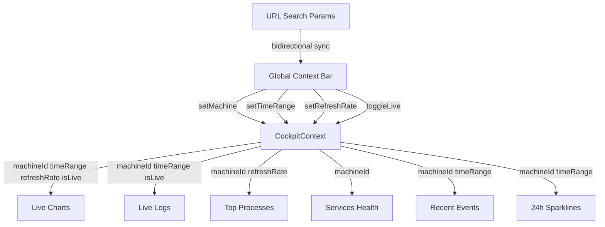

# MiniCluster UI Redesign: Operations Cockpit

## Executive Summary

This document proposes a complete reimagining of the MiniCluster UI following a **progressive disclosure** design philosophy:

1. **Single-Machine First**: Start with what MiniCluster can do on ONE machine (the free tier)
2. **Extend to Cluster**: Add multi-machine awareness when upgraded
3. **Scale to Fleet**: Full cluster management for enterprise deployments

The UI adapts gracefully based on deployment mode:
- **Single-Machine Mode**: Complete standalone operations tool with no cluster concepts
- **Multi-Machine Mode**: Same interface with fleet overview, machine selectors, and cross-machine operations

The current design treats monitoring as a separate page from the overview, creating cognitive overhead. The Operations Cockpit merges these into a single command center where operators can **Survey** the fleet, **Focus** on specific machines, **Act** with contextual tools, and **Analyze** trends.

---

## 1. Core Design Philosophy

### 1.1 Progressive Disclosure

MiniCluster serves three deployment scenarios:

| Scenario | Machines | UI Behavior |
|----------|----------|-------------|
| **Free Tier** | 1 machine | Complete standalone tool, no cluster concepts |
| **Small Cluster** | 2-5 machines | Fleet overview, machine selectors |
| **Enterprise Fleet** | 6+ machines | Full cluster management, cross-machine ops |

The UI should work naturally in all scenarios without feeling incomplete or overwhelming.

### 1.2 The Operations Cockpit Metaphor

Think of the UI as a **mission control center** where operators:
- **Survey** the entire fleet at a glance (or single system health)
- **Focus** on specific machines or services when issues arise
- **Act** quickly with contextual tools (terminal, files, logs)
- **Analyze** trends and patterns over time

This is not a dashboard you check occasionally—it's where you **live** during operations.

### 1.3 Machine Context as First-Class Citizen

Every piece of data in the system belongs to a machine. The UI should make this explicit:
- **Machine context** should be visible and switchable from any page (in multi-machine mode)
- **Cross-machine views** should be natural (cluster-wide metrics, side-by-side comparison)
- **Machine-specific tools** (terminal, explorer) should remember which machine you were using

In single-machine mode, machine context is implicit and hidden from the UI.

---

## 2. Single-Machine Foundation (Free Tier)

This section describes the complete MiniCluster experience for a single-machine deployment—the free tier. No cluster, no fleet, no remote agents. Everything runs on one machine.

### 2.1 What MiniCluster Agent Can Do

On a single machine, MiniCluster provides comprehensive operations capabilities:

**System Monitoring**:
- Real-time CPU, Memory, Disk, Network metrics
- Process list with CPU/Memory consumption
- Load average, context switches, interrupts
- Per-disk I/O statistics (read/write rates, IOPS)
- Per-interface network throughput
- Health timeline showing 24-hour resource trends

**Service Management**:
- Deploy and manage Process, Docker, and Podman services
- Start/Stop/Restart services with graceful shutdown
- Real-time service logs via SignalR streaming
- Service configuration management (env vars, ports, volumes)
- Health checks and auto-restart on failure
- Service sessions tracking (for web services)

**File Operations**:
- Full filesystem browsing with breadcrumb navigation
- View, edit, and delete files with syntax highlighting
- Upload and download files via drag-and-drop
- Search files by name or content
- File permissions display

**Terminal Access**:
- Interactive shell access via xterm.js
- Multiple terminal sessions (tabs)
- Command history and auto-complete
- Integration with file explorer ("Open Terminal Here")

**Application Organization**:
- Group related services into Apps
- App-level metrics aggregation (sum of all services)
- Shared configuration (environment variables)
- Unified log stream across all app services
- Service distribution visualization

**Authentication & Authorization**:
- User accounts with three roles: Admin, Operator, Viewer
- JWT authentication with automatic token refresh
- First-run setup wizard for initial admin creation
- Session management and security features

**Historical Data & Analytics**:
- Metrics collection with configurable retention
- Time-series exploration with adaptive bucket sizes
- Anomaly detection with severity classification
- Cross-entity comparison (services, time periods)
- Saved queries for recurring analysis

**Automation**:
- Cron job scheduling with human-readable expressions
- Job execution history and status tracking
- Per-machine or cluster-wide job targeting

### 2.2 Single-Machine Operations Cockpit (`/`)

The Operations Cockpit is the home page and primary workspace. It is an **information-dense, always-visible widget grid** — not a tabbed panel that hides data behind clicks. Every critical signal is visible at a glance, inspired by PM2's monit dashboard and Grafana's panel grids.

```
┌─────────────────────────────────────────────────────────────────────────────┐
│  HEADER: MiniCluster · 🟢 Connected · v1.4.2 · Uptime: 14d 3h             │
├─────────────────────────────────────────────────────────────────────────────┤
│  GLOBAL CONTEXT BAR                                                         │
│  [🖥 local]  [⏱ Last 1h ▾]  [🔄 5s ▾]  [🔴 LIVE]                        │
├─────────────────────────────────────────────────────────────────────────────┤
│  VITALS STRIP (always visible, compact)                                     │
│  CPU: 45% ████████░░  Mem: 62% ██████████░░  Disk: 38% ██████░░░░         │
│  Net: ↑12 MB/s ↓45 MB/s   Svc: 🟢12 🟡1 🔴1   Alerts: ⚠️ 2              │
├─────────────────────────────────────────────────────────────────────────────┤
│  QUICK ACTIONS                                                              │
│  [📁 Files] [💻 Terminal] [📊 Resources] [📈 Analytics] [🔧 Services]     │
│  [📋 Logs] [⏰ Automation] [🌐 Proxy]                                       │
├─────────────────────────────────────────────────────────────────────────────┤
│                                                                             │
│  WIDGET GRID (scrollable, always-visible, no tabs)                          │
│                                                                             │
│  ┌── LIVE CHARTS (2×2 grid) ─────────────────────────────────────────────┐ │
│  │  ┌─ CPU Usage ───────────────┐  ┌─ Memory Usage ────────────┐        │ │
│  │  │         ╭─╮               │  │      ▓▓▓▓▓▓▓▓▓▓▓▓        │        │ │
│  │  │   ╭─╮  ╭╯ ╰╮             │  │ ▓▓▓▓▓▓▓▓▓▓▓▓▓▓▓▓▓▓▓      │        │ │
│  │  │ ╭─╯ ╰──╯    ╰──          │  │ ▓▓▓▓▓▓▓▓▓▓▓▓▓▓▓▓▓▓▓      │        │ │
│  │  │ Avg: 45% │ Peak: 92%     │  │ Avg: 62% │ Peak: 81%      │        │ │
│  │  │ [View All →]             │  │ [View All →]              │        │ │
│  │  └──────────────────────────┘  └───────────────────────────┘        │ │
│  │  ┌─ Network I/O ─────────────┐  ┌─ Disk I/O ────────────────┐       │ │
│  │  │  ↑12 MB/s   ↓45 MB/s     │  │  R: 45 MB/s  W: 12 MB/s   │       │ │
│  │  │  [dual-line chart]        │  │  IOPS: 1,230              │       │ │
│  │  │  [View All →]             │  │  [View All →]             │       │ │
│  │  └──────────────────────────┘  └───────────────────────────┘       │ │
│  └──────────────────────────────────────────────────────────────────────┘ │
│                                                                             │
│  ┌── LIVE LOGS + TOP PROCESSES (side-by-side) ──────────────────────────┐ │
│  │  ┌─ Live Logs ─────────────────┐  ┌─ Top Processes (by CPU) ──────┐ │ │
│  │  │ 12:01:03 [api] INFO  Started│  │ node     23.4%  12.1%  api   │ │ │
│  │  │ 12:01:01 [db]  WARN  Slow  │  │ postgres 15.2%  28.3%  db    │ │ │
│  │  │ 12:00:58 [web] ERROR Conn  │  │ nginx    8.1%   2.4%   web   │ │ │
│  │  │ 12:00:55 [api] INFO  GET / │  │ redis    4.2%   1.8%   cache │ │ │
│  │  │ [View All Logs →]          │  │ [View All Processes →]      │ │ │
│  │  └────────────────────────────┘  └──────────────────────────────┘ │ │
│  └──────────────────────────────────────────────────────────────────────┘ │
│                                                                             │
│  ┌── SERVICES HEALTH + RECENT EVENTS (side-by-side) ────────────────────┐ │
│  │  ┌─ Services Health ───────────┐  ┌─ Recent Events ──────────────┐  │ │
│  │  │ 🟢 Running:    12           │  │ ⚠️ CPU spike to 92%  2h ago │  │ │
│  │  │ 🟡 Restarting:  1           │  │ ℹ️ Deploy completed  4h ago │  │ │
│  │  │ 🔴 Failed:      1           │  │ ⚠️ Memory warning    6h ago │  │ │
│  │  │ ⚫ Stopped:     1           │  │ 🔴 Service crash     1d ago │  │ │
│  │  │ [View All Services →]       │  │ [View All Events →]        │  │ │
│  │  └─────────────────────────────┘  └──────────────────────────────┘  │ │
│  └──────────────────────────────────────────────────────────────────────┘ │
│                                                                             │
│  ┌── 24h SPARKLINES (compact trend strip) ──────────────────────────────┐ │
│  │  CPU  ▁▂▃▅▇█▇▅▃▂▁▁▂▃▅▇█▇▅▃▂                                        │ │
│  │  Mem  ▅▅▅▆▆▇▇▇▆▅▅▅▆▆▇▇▇▆▅▅                                         │ │
│  │  Err  ▁▁▁▃▅▇▁▁▁▁▁▁▁▁▃▅▁▁▁                                         │ │
│  │  Req  ▂▃▅▅▇▇▅▃▂▂▃▅▅▇▇▅▃▂▂                                         │ │
│  │  Disk ▁▁▁▁▂▂▂▂▃▃▃▃▃▃▃▃▃▃▃                                         │ │
│  └──────────────────────────────────────────────────────────────────────┘ │
│                                                                             │
└─────────────────────────────────────────────────────────────────────────────┘
```

**Key Features in Single-Machine Mode**:
- **No machine selector** — only one machine, no selection needed (machine label shown as static text)
- **No Fleet Overview zone** — Vitals Strip replaces cluster health
- **Widget Grid is full-width** — uses space that would show machine grid in multi-machine mode
- **Everything visible at once** — no tabs, no hidden panels; scroll for more widgets
- **Quick Actions bar** — direct shortcuts to common tools
- **Global Context Bar** — time range, refresh rate, and live mode cascade to all widgets
- **Every widget has a deep-dive link** — "View All →" navigates to the corresponding detail page

### 2.3 Widget Grid Details

The Widget Grid replaces the tabbed Focus Panel. Every widget is always visible and reacts to the Global Context Bar settings via `CockpitContext`.

#### Live Charts Widget (2×2 Grid)

Four real-time charts arranged in a 2×2 grid, each using the [`RichChart`](ui/app/components/RichChart.tsx) component:

| Chart | Metric | Unit | Data Source |
|-------|--------|------|-------------|
| CPU Usage | `cpuUsagePercent` | % | [`useSystemMetricsHistory`](ui/app/hooks/useSystemMetricsHistory.ts) |
| Memory Usage | `memoryUsagePercent` | % | [`useSystemMetricsHistory`](ui/app/hooks/useSystemMetricsHistory.ts) |
| Network I/O | `networkSendRate`, `networkReceiveRate` | MB/s | [`useSystemMetricsHistory`](ui/app/hooks/useSystemMetricsHistory.ts) |
| Disk I/O | `diskReadRate`, `diskWriteRate` | MB/s | [`useSystemMetricsHistory`](ui/app/hooks/useSystemMetricsHistory.ts) |

**Chart Behavior**:
- **Live mode ON**: Sliding window — charts scroll left as new data arrives, time range from Global Context Bar
- **Live mode OFF**: Frozen window — charts show fixed historical range, no auto-update
- X-axis labels adapt to time range: `HH:mm:ss` for ≤15m, `HH:mm` for ≤6h, `ddd HH:mm` for ≤7d, `MM/dd` for 30d
- Crosshair tooltip shows exact values on hover
- Peak and average statistics shown below each chart
- "View All →" links to `/machines/local/resources`

#### Live Logs Widget

Streaming log feed via SignalR [`LogHub`](api-go/internal/hubs/log_hub.go):

```
┌─────────────────────────────────────────────────┐
│  FILTER: [All Levels ▾] [All Services ▾] [🔍]  │
│─────────────────────────────────────────────────│
│  12:01:03.412  [api]      INFO   Started req... │
│  12:01:01.201  [database] WARN   Slow query 2.. │
│  12:00:58.891  [web]      ERROR  Connection r.. │
│  12:00:55.102  [api]      INFO   GET /api/hea.. │
│  12:00:52.445  [worker]   DEBUG  Processing b.. │
│  ...                                             │
│  [View All Logs →]              [⏸ Pause] [⏬]  │
└─────────────────────────────────────────────────┘
```

**Features**:
- Auto-scrolling with pause-on-hover
- Filter by log level (DEBUG, INFO, WARN, ERROR, FATAL)
- Filter by service name
- Color-coded severity (green=INFO, yellow=WARN, red=ERROR)
- Timestamps respect Global Context Bar time range for historical view
- "View All Logs →" links to `/machines/local/logs`

#### Top Processes Widget

Compact process list showing the top 10 processes by CPU consumption:

```
┌─────────────────────────────────────────────────┐
│  SORT: [CPU% ▾]   VIEW: (● My Processes) ( All)│
│─────────────────────────────────────────────────│
│  Name        PID    CPU%    Mem%    State  Svc  │
│  node        1234   23.4 ▲  12.1    S      api  │
│  postgres    5678   15.2    28.3 ▲  S      db   │
│  nginx       9012   8.1     2.4     S      web  │
│  redis       3456   4.2     1.8     S      cache│
│  ...                                             │
│  [View All Processes →]        [Kill Selected]  │
└─────────────────────────────────────────────────┘
```

**Features**:
- Sortable by CPU%, Mem%, PID, Name
- Column header arrows indicate sort direction
- Service name linked to service workspace
- Right-click context menu: Kill, View Service, Send Signal
- Refreshes at Global Context Bar refresh rate
- "View All Processes →" links to `/machines/local/processes` (Machine Detail Processes tab)

#### Services Health Widget

Compact service status overview with mini-list:

```
┌─────────────────────────────────────────────────┐
│  STATUS: [All ▾]   APP: [All ▾]                 │
│─────────────────────────────────────────────────│
│  🟢 Running:     12                              │
│  🟡 Restarting:   1                              │
│  🔴 Failed:       1                              │
│  ⚫ Stopped:      1                              │
│─────────────────────────────────────────────────│
│  🔴 worker    restarting  0s uptime             │
│  🟡 scheduler restarting  0s uptime             │
│  [View All Services →]                          │
└─────────────────────────────────────────────────┘
```

**Features**:
- Status counts update in real-time
- Failed/restarting services highlighted at top of list
- Click any service to navigate to `/apps/:appSlug/services/:serviceSlug`
- "View All Services →" links to `/machines/local/services`

#### Recent Events Widget

Chronological event feed with severity badges:

```
┌─────────────────────────────────────────────────┐
│  SEVERITY: [All ▾]                               │
│─────────────────────────────────────────────────│
│  ⚠️  CPU spike to 92%              2h ago       │
│  ℹ️  Deployment completed          4h ago       │
│  ⚠️  Memory warning (78%)          6h ago       │
│  🔴  Service crash (api)           1d ago       │
│  ℹ️  Backup completed              1d ago       │
│  [View All Events →]                            │
└─────────────────────────────────────────────────┘
```

**Features**:
- Severity badges: 🔴 Critical, ⚠️ Warning, ℹ️ Info
- Relative timestamps ("2h ago") with absolute on hover
- Events respect Global Context Bar time range
- "View All Events →" links to Machine Detail Overview

#### 24h Sparklines Widget

Compact trend strip showing 24-hour patterns at a glance:

| Sparkline | Metric | What It Shows |
|-----------|--------|---------------|
| CPU | `cpuUsagePercent` | Usage pattern over 24h |
| Mem | `memoryUsagePercent` | Memory trend over 24h |
| Err | Error rate | Error frequency spikes |
| Req | Request rate | Traffic patterns |
| Disk | `diskUsagePercent` | Storage growth trend |

**Features**:
- Each sparkline is ~48 data points (30-minute buckets over 24h)
- Hover shows exact value and time at cursor position
- Color-coded: normal=blue, warning=amber (>75%), critical=red (>90%)
- Click any sparkline to navigate to `/analytics` with that metric pre-selected

#### Widget Common Behaviors

All widgets share these patterns:

| Behavior | Description |
|----------|-------------|
| **Loading skeleton** | Shimmer animation while data loads |
| **Error state** | "Failed to load" message with retry button |
| **Empty state** | "No data available" with contextual message |
| **Collapsible** | Click widget header to collapse to title-only |
| **CockpitContext-aware** | Reacts to machine, time range, refresh rate, live mode changes |
| **Deep-dive links** | "View All →" navigates to the corresponding detail page |
| **Responsive** | 2-column → 1-column on narrow viewports |

### 2.3b Global Context Bar

The Global Context Bar sits at the top of the Operations Cockpit, below the header. It provides controls that **cascade to every widget** in the grid simultaneously.

```
┌─────────────────────────────────────────────────────────────────────────────┐
│  [🖥 local]  [⏱ Last 1h ▾]  [🔄 5s ▾]  [🔴 LIVE]                        │
└─────────────────────────────────────────────────────────────────────────────┘
```

#### Machine Scope Selector

| Mode | Behavior |
|------|----------|
| **Single-machine** | Hidden entirely; shows static "local" label, no dropdown |
| **Multi-machine** | Dropdown with "All Machines (Cluster)" + individual machine names |

When a machine is selected, **all widgets** filter to show data for that machine only. When "All Machines" is selected, widgets show cluster-aggregate data (summed metrics, combined logs, all services).

#### Time Range Picker

| Option | Value | X-Axis Format | Log Window | Chart Bucket Size |
|--------|-------|---------------|------------|-------------------|
| Last 5 min | `5m` | `HH:mm:ss` | 5 min | 5s (raw) |
| Last 15 min | `15m` | `HH:mm:ss` | 15 min | 15s |
| Last 1 hour | `1h` | `HH:mm` | 1 hour | 1m |
| Last 6 hours | `6h` | `HH:mm` | 6 hours | 5m |
| Last 24 hours | `24h` | `HH:mm` | 24 hours | 15m |
| Last 7 days | `7d` | `ddd HH:mm` | 7 days | 1h |
| Last 30 days | `30d` | `MM/dd` | 30 days | 6h |
| Custom | `custom` | varies | varies | varies |

The selected time range propagates to:
- **Live Charts**: X-axis span and label format
- **Live Logs**: How far back to fetch historical logs
- **24h Sparklines**: Switches from 24h to the selected range
- **Recent Events**: Filters events within the time window

#### Refresh Rate Selector

Options: `Off` | `5s` | `15s` | `30s` | `1m`

Controls how often widgets poll for new data. "Off" disables auto-refresh entirely (manual refresh only).

#### Live Mode Toggle

| State | Behavior |
|-------|----------|
| **🔴 LIVE (ON)** | Sliding window — time range slides forward with each refresh tick. Charts always show the most recent data. |
| **⏸ FROZEN (OFF)** | Fixed window — time range is pinned. Charts show historical data and do not auto-advance. User must manually change the time range or click "Now" to jump to current. |

Live mode affects:
- **Live Charts**: Sliding vs frozen X-axis
- **Live Logs**: Auto-scroll vs manual scroll
- **Top Processes**: Auto-refresh vs frozen snapshot

#### URL State Sync

All Context Bar state persists in URL search params for shareability and bookmark-ability:

```
/?machine=local&range=1h&refresh=5s&live=true
/?machine=web-01&range=24h&refresh=off&live=false
```

This enables:
- Sharing a specific view with a colleague ("check this CPU spike")
- Bookmarking a monitoring configuration
- Browser back/forward navigation between context states

#### CockpitContext React Architecture

```typescript
interface TimeRange {
  type: 'relative' | 'absolute';
  value: string;  // '5m' | '15m' | '1h' | '6h' | '24h' | '7d' | '30d' | 'custom'
  from?: Date;    // Only for 'absolute' (custom) type
  to?: Date;      // Only for 'absolute' (custom) type
}

interface CockpitContextType {
  machineId: string;              // 'local' in single-machine, selected machine in multi-machine
  timeRange: TimeRange;
  refreshRate: number;            // milliseconds, 0 = off
  isLive: boolean;                // sliding window vs frozen
  setMachine: (id: string) => void;
  setTimeRange: (range: TimeRange) => void;
  setRefreshRate: (ms: number) => void;
  toggleLive: () => void;
}

const CockpitContext = createContext<CockpitContextType>({
  machineId: 'local',
  timeRange: { type: 'relative', value: '1h' },
  refreshRate: 5000,
  isLive: true,
  setMachine: () => {},
  setTimeRange: () => {},
  setRefreshRate: () => {},
  toggleLive: () => {},
});

function useCockpitContext(): CockpitContextType {
  return useContext(CockpitContext);
}
```

**Provider placement**: `CockpitContextProvider` wraps the entire Operations Cockpit page. All widgets are children and consume context via `useCockpitContext()`.

**Implementation pattern for widgets**:

```typescript
function LiveChartsWidget() {
  const { machineId, timeRange, refreshRate, isLive } = useCockpitContext();
  const { cpuHistory, memoryHistory, ... } = useSystemMetricsHistory(machineId, timeRange, refreshRate);
  // Render 2x2 chart grid...
}

function LiveLogsWidget() {
  const { machineId, timeRange, isLive } = useCockpitContext();
  const logs = useLogStream(machineId, timeRange, isLive);
  // Render streaming log feed...
}
```



### 2.4 Single-Machine Sidebar Navigation

```
┌─────────────────────────────────────────────────────────────┐
│  🏠 Cockpit                                                 │
│  📊 Analytics                                               │
│  📦 Apps                                                    │
│  🔧 Services                                                │
│  📁 Files                                                   │
│  💻 Terminal                                                │
│  🌐 Proxy                                                   │
│  ⏰ Automation                                              │
│  🌳 Hierarchy                                               │
│  ─────────────────────────────────────                      │
│  ⚙️ Settings                                                │
│     ├─ General                                              │
│     ├─ 👥 Users (Admin only)                                │
│     └─ System                                               │
└─────────────────────────────────────────────────────────────┘
```

**Note**: "Machines" link is **not shown** in single-machine mode—there's only one machine.

### 2.5 Single-Machine URL Structure

**Machine-first architecture**: All machine-scoped resources live under `/machines/:machineId/`. In single-machine mode, `:machineId` is always `local`.

| Route | Description |
|-------|-------------|
| `/` | Operations Cockpit |
| `/machines/local/explorer` | File browser |
| `/machines/local/terminal` | Terminal session |
| `/machines/local/resources` | Resource metrics (CPU, Memory, Disk, Network) |
| `/machines/local/services` | Services on this machine |
| `/machines/local/logs` | Machine-wide logs |
| `/machines/local/overview` | Machine overview (health, vitals, events) |
| `/apps` | App portfolio |
| `/apps/:appSlug` | App workspace |
| `/apps/:appSlug/services/:serviceSlug` | Service workspace |
| `/services` | Service catalog |
| `/analytics` | Historical data exploration |
| `/proxy` | Reverse proxy configuration |
| `/automation` | Cron jobs and scheduled tasks |
| `/hierarchy` | App hierarchy and snapshots |
| `/settings` | Settings (General tab) |
| `/settings/users` | User management (Admin only) |
| `/settings/system` | System information |

### 2.6 Single-Machine Detection

```typescript
// Hook to detect single-machine mode
function useIsSingleMachine(): boolean {
  const { data: machines } = useMachinesQuery();
  return machines?.length === 1;
}

// Usage in components for conditional rendering
function MachineSelector() {
  const isSingle = useIsSingleMachine();
  if (isSingle) return null; // Hide selector entirely
  return <select>...</select>;
}
```

### 2.7 Competitor Design Rationale

The Widget Grid and Global Context Bar design decisions are informed by analysis of four key competitors in the operations dashboard space. MiniCluster borrows the best patterns while exploiting gaps none of them fill.

#### What We Learned

| Design Decision | Learned From | What They Do | Why We Adopted It |
|-----------------|-------------|--------------|-------------------|
| Everything visible on one screen | **PM2 monit** | PM2's terminal dashboard shows all processes, CPU, memory, and logs simultaneously without tab switching | Operators need situational awareness without clicking. Our widget grid keeps all critical signals visible at once. |
| Global time range picker cascading to all widgets | **Grafana** | Grafana's global time picker in the top bar propagates to every panel on the dashboard | This is the gold standard for time-series UX. Changing the time range once updates every chart, log feed, and event list. |
| Machine scope selector cascading to all widgets | **Datadog** | Datadog's scope selectors (`host:web-01`, `env:production`) narrow all visualizations at once | Same pattern for machine scoping — select a machine and every widget filters to that context. |
| Live tail / live mode toggle | **Datadog** | Datadog's "Live Tail" button for logs lets operators switch between real-time streaming and historical analysis | Our Live Mode toggle serves the same purpose — slide forward in real-time or freeze for historical investigation. |
| Process list with inline CPU/memory metrics | **PM2 monit** | PM2 shows PID, name, CPU%, memory in a dense table with color-coded severity | Same pattern for our Top Processes widget — compact, sortable, with service linkage. |
| Simple status counts with process groups | **Supervisor** | Supervisor's web UI shows process groups with status badges (RUNNING, STOPPED, EXITED, FATAL) | Inspired our compact Services Health widget — status counts at a glance with failed services highlighted. |
| Auto-refresh rate control | **Grafana** | Grafana's auto-refresh dropdown (5s, 10s, 30s, 1m, 5m, off) is the standard pattern | Our Refresh Rate selector follows the exact same pattern with sensible defaults. |
| Widget "View All" deep-dive links | **Grafana + Datadog** | Both tools use drill-down from overview panels to detailed exploration views | Keeps the cockpit clean and scannable while maintaining instant access to depth when needed. |

#### Gaps We Exploit

| Competitor | What They Lack | How MiniCluster Fills the Gap |
|-----------|----------------|-------------------------------|
| **PM2** | No web UI — terminal only (`pm2 monit`) | Same information density in a browser with clickable navigation, filtering, and sharing |
| **PM2** | No historical data — only live snapshot | Full time-series storage with configurable retention, 24h sparklines, and historical chart replay |
| **PM2** | No multi-machine awareness | Single UI handles one machine or a fleet without switching tools |
| **Supervisor** | Read-only web UI — no actions | Quick Actions bar, Kill/Restart from any widget, right-click context menus |
| **Supervisor** | Basic HTML interface — no charts | Rich SVG charts with crosshair tooltips, sparklines, and adaptive time axes |
| **Supervisor** | No log streaming | Real-time SignalR log streaming with level filtering and service grouping |
| **Grafana** | Requires manual dashboard setup — not zero-config | Pre-built cockpit with all widgets configured out of the box |
| **Grafana** | Separate tool — not integrated with process/service management | Single binary: monitoring, process management, file explorer, terminal — all in one |
| **Datadog** | $15+/host/month — expensive at scale | Everything included in the free tier — no per-host pricing |
| **Datadog** | Cloud-only — no self-hosted option | Runs on your own hardware, behind your firewall |

#### Competitive Positioning Summary

```
┌─────────────────────────────────────────────────────────────────────────┐
│                    INFORMATION DENSITY                                    │
│  High ┤  ● PM2 monit                                                   │
│       │       ● MiniCluster Cockpit                                     │
│       │                    ● Grafana (after setup)                      │
│       │                                    ● Datadog                    │
│  Low ┤                                          ● Supervisor            │
│       └──────────────────────────────────────────────────────────────   │
│         Zero-config       Some setup       Full dashboard builder       │
│                         CONFIGURATION EFFORT                             │
└─────────────────────────────────────────────────────────────────────────┘
```

MiniCluster occupies a unique position: **PM2-level information density with Grafana-level visualization, delivered as a zero-config single binary.**

---

## 3. Extending to Cluster (Multi-Machine Mode)

When MiniCluster is upgraded from a single machine to a cluster (2+ machines), the UI reveals additional capabilities without requiring a redesign. The same interface adapts to show fleet-level information.

### 3.1 Multi-Machine Detection

Multi-machine mode is active when:
- `GET /api/machines` returns 2 or more machines

### 3.2 UI Changes in Multi-Machine Mode

| Feature | Single-Machine | Multi-Machine |
|---------|---------------|---------------|
| Sidebar "Machines" link | Hidden | **Shown** |
| Machine selector dropdown | Hidden | **Shown** |
| Fleet Overview zone | Hidden | **Shown** |
| Machine Grid | Hidden | **Shown** |
| Machine column in grids | Hidden | **Shown** |
| URL machine params | Absent | **Present** |
| Cluster scope in Analytics | Hidden | **Shown** |
| Cross-machine comparison | Hidden | **Shown** |

### 3.3 Operations Cockpit with Fleet Overview

In multi-machine mode, the Operations Cockpit gains a Fleet Overview zone and an active Machine Scope Selector in the Global Context Bar. The same Widget Grid from Section 2.2 adapts to show either cluster-aggregate data or machine-specific data based on the selected scope.

```
┌─────────────────────────────────────────────────────────────────────────────┐
│  HEADER: MiniCluster · 🟢 Connected · v1.4.2 · Fleet: 3/4 Online          │
├─────────────────────────────────────────────────────────────────────────────┤
│  GLOBAL CONTEXT BAR                                                         │
│  [▼ All Machines ▾]  [⏱ Last 1h ▾]  [🔄 5s ▾]  [🔴 LIVE]                │
├─────────────────────────────────────────────────────────────────────────────┤
│  VITALS STRIP (cluster aggregate or selected machine)                       │
│  CPU: 45% ████████░░  Mem: 62% ██████████░░  Disk: 38% ██████░░░░         │
│  Net: ↑12 MB/s ↓45 MB/s   Svc: 🟢12 🟡1 🔴1   Alerts: ⚠️ 2              │
├─────────────────────────────────────────────────────────────────────────────┤
│  QUICK ACTIONS                                                              │
│  [📁 Files] [💻 Terminal] [📊 Resources] [📈 Analytics] [🔧 Services]     │
│  [📋 Logs] [⏰ Automation] [🌐 Proxy]                                       │
├─────────────────────────────────────────────────────────────────────────────┤
│                                                                             │
│  ZONE 1: FLEET OVERVIEW                                                     │
│  ┌── MACHINE GRID ──────────────────────────────────────────────────────┐ │
│  │  ┌─────────────┐ ┌─────────────┐ ┌─────────────┐ ┌─────────────┐   │ │
│  │  │ 🟢 web-01   │ │ 🟡 web-02   │ │ 🟢 db-01    │ │ 🔴 cache-01 │   │ │
│  │  │ 45% CPU     │ │ 78% CPU ⚠️  │ │ 23% CPU     │ │ Offline     │   │ │
│  │  │ 62% Mem     │ │ 81% Mem ⚠️  │ │ 45% Mem     │ │             │   │ │
│  │  │ 5 services  │ │ 5 services  │ │ 3 services  │ │             │   │ │
│  │  │ [📁][💻][📊]│ │ [📁][💻][📊]│ │ [📁][💻][📊]│ │ [Diagnose]  │   │ │
│  │  │ [📈][🔧][📋]│ │ [📈][🔧][📋]│ │ [📈][🔧][📋]│ │             │   │ │
│  │  │ [View →]    │ │ [View →]    │ │ [View →]    │ │             │   │ │
│  │  └─────────────┘ └─────────────┘ └─────────────┘ └─────────────┘   │ │
│  └──────────────────────────────────────────────────────────────────────┘ │
│  ┌── ALERTS FEED ───────────────────────────────────────────────────────┐ │
│  │  ⚠️  web-02: CPU usage 78% (threshold: 75%)        [5m ago]          │ │
│  │  🔴  cache-01: Heartbeat lost                    [12m ago]           │ │
│  │  ℹ️  db-01: Backup completed successfully        [1h ago]            │ │
│  └──────────────────────────────────────────────────────────────────────┘ │
│                                                                             │
│  ZONE 2: WIDGET GRID (same widgets as single-machine, scoped by context)    │
│                                                                             │
│  ┌── LIVE CHARTS (2×2 grid) ─────────────────────────────────────────────┐ │
│  │  Shows cluster aggregate OR selected machine metrics                  │ │
│  │  (Same layout as Section 2.3 Live Charts Widget)                      │ │
│  └──────────────────────────────────────────────────────────────────────┘ │
│                                                                             │
│  ┌── LIVE LOGS + TOP PROCESSES ─────────────────────────────────────────┐ │
│  │  "All Machines": Combined log stream from all machines                │ │
│  │  Specific machine: That machine's logs only                           │ │
│  └──────────────────────────────────────────────────────────────────────┘ │
│                                                                             │
│  ┌── SERVICES HEALTH + RECENT EVENTS ───────────────────────────────────┐ │
│  │  "All Machines": Services across entire fleet                         │ │
│  │  Specific machine: That machine's services only                       │ │
│  └──────────────────────────────────────────────────────────────────────┘ │
│                                                                             │
│  ┌── 24h SPARKLINES ────────────────────────────────────────────────────┐ │
│  │  Same sparkline strip, scoped to selected machine or cluster sum      │ │
│  └──────────────────────────────────────────────────────────────────────┘ │
└─────────────────────────────────────────────────────────────────────────────┘
```

**Multi-Machine Behavior Changes**:

| Feature | Single-Machine | Multi-Machine |
|---------|---------------|---------------|
| Machine Scope Selector | Hidden (static "local" label) | **Active dropdown** with "All Machines" + individual machines |
| Fleet Overview zone | Hidden | **Shown** — machine grid + alerts feed |
| Widget Grid data source | Local machine only | Cluster aggregate OR selected machine |
| Live Logs | Single machine stream | Combined stream from all machines, or filtered to one |
| Services Health | Local services | All fleet services, or filtered to one machine |
| Quick Actions | Link to `/machines/local/*` | Link to `/machines/:selectedMachineId/*` |

**Machine Scope Cascade**:

When the user changes the Machine Scope Selector:
1. `CockpitContext.machineId` updates
2. All widgets re-fetch data for the new scope via `useCockpitContext()`
3. URL updates: `/?machine=web-01&range=1h&refresh=5s&live=true`
4. Vitals Strip shows metrics for the selected machine (or aggregate for "All Machines")
5. Widget deep-dive links update to point to the correct machine's detail pages

### 3.4 Machine Card with Quick Actions

Each machine card in the Fleet Overview provides quick-access shortcuts:

```
┌─────────────────────────────────────────┐
│ 🟢 web-01                    [⋮ Menu]  │
│ Ubuntu 22.04 · Agent v1.4.2 · 14d up   │
│                                         │
│ CPU: ████████░░░░ 45%   Net: ↑12 ↓45   │
│ Mem: ████████████░ 62%  Disk: 38%      │
│ Svc: 🟢5 🔴1 ⚫0                        │
│                                         │
│ Quick Actions:                          │
│ ┌─────────────────────────────────────┐ │
│ │ 📁  │ 💻  │ 📊  │ 📈  │ 🔧  │ 📋 │ │
│ │Files│Term │Stats│Anly │Svc  │Logs│ │
│ └─────────────────────────────────────┘ │
│                                         │
│ [View Detail →]                         │
└─────────────────────────────────────────┘
```

**Quick Action Shortcuts**:

| Action | Icon | Destination | Description |
|--------|------|-------------|-------------|
| Files | 📁 | `/machines/:machineId/explorer` | Browse machine filesystem |
| Terminal | 💻 | `/machines/:machineId/terminal` | Open terminal session |
| Stats | 📊 | `/machines/:machineId/resources` | View resource metrics |
| Analytics | 📈 | `/analytics?machine=:machineId` | Historical data |
| Services | 🔧 | `/machines/:machineId/services` | View services |
| Logs | 📋 | `/machines/:machineId/logs` | Machine-wide logs |
| Detail | → | `/machines/:machineId` | Full machine detail |

**Overflow Menu** (⋮):
- Restart Agent
- Drain Services (migrate to other machines)
- Decommission (remove from cluster)
- View Agent Logs

### 3.5 Machine Selector Behavior

The Machine Selector allows switching between cluster-wide and machine-specific views:

```
┌──────────────────────────────────────────────────────────────┐
│ Viewing: [▼ All Machines (Cluster)]                          │
└──────────────────────────────────────────────────────────────┘
```

**Dropdown Options**:
- **All Machines (Cluster)**: Shows cluster-wide aggregate metrics
- **web-01**: Shows metrics for web-01 only
- **web-02**: Shows metrics for web-02 only
- **db-01**: Shows metrics for db-01 only

**URL State Persistence**:
- `/` → Cluster view
- `/machines/web-01` → web-01 detail view
- `/machines/web-01/processes` → web-01 Processes tab

### 3.6 Multi-Machine Sidebar Navigation

```
┌─────────────────────────────────────────────────────────────┐
│  🏠 Cockpit                                                 │
│  🖥️ Machines                    ← NEW in multi-machine      │
│  📊 Analytics                                               │
│  📦 Apps                                                    │
│  🔧 Services                                                │
│  📁 Files                                                   │
│  💻 Terminal                                                │
│  🌐 Proxy                                                   │
│  ⏰ Automation                                              │
│  🌳 Hierarchy                                               │
│  ─────────────────────────────────────                      │
│  ⚙️ Settings                                                │
│     ├─ General                                              │
│     ├─ 👥 Users (Admin only)                                │
│     └─ System                                               │
└─────────────────────────────────────────────────────────────┘
```

---

## 4. Information Architecture

### 4.1 Proposed Route Structure

**Machine-first architecture**: All machine-scoped resources live under `/machines/:machineId/`. Single-machine mode uses `local` as the machineId.

```
/login                         → Login Page (public, no auth required)
/                              → Operations Cockpit (unified overview + monitor)
/machines                      → Machine Fleet Management (multi-machine only)
/machines/:machineId           → Machine Detail (health, services, resources)
/machines/:machineId/overview  → Machine Overview tab
/machines/:machineId/services  → Machine Services tab
/machines/:machineId/processes → Machine Processes tab
/machines/:machineId/resources → Machine Resources tab
/machines/:machineId/disks     → Machine Disks tab
/machines/:machineId/network   → Machine Network tab
/machines/:machineId/logs      → Machine Logs tab
/machines/:machineId/explorer/*path → File Explorer (machine-scoped)
/machines/:machineId/terminal  → Terminal (machine-scoped)
/analytics                     → Advanced Analytics & Historical Data
/apps                          → App Portfolio
/apps/:appSlug                 → App Workspace (per-app dashboard)
/apps/:appSlug/services/:serviceSlug → Service Workspace (per-service monitoring)
/services                      → Service Catalog
/proxy                         → Reverse Proxy
/automation                    → Cron & Automation
/hierarchy                     → Hierarchy & Snapshots
/settings                      → Settings (General tab)
/settings/users                → Settings - User Management (Admin only)
/settings/system               → Settings - System Information
```

### 4.2 Key Changes from Current

| Current | Proposed | Rationale |
|---------|----------|-----------|
| `/` (Home) + `/monitor` (Monitor) | `/` (Operations Cockpit) | Merged into unified command center |
| `/dashboard` | Removed | Redundant with Operations Cockpit |
| `/infrastructure` | `/machines` | Clearer naming for machine fleet |
| `/login` (basic form) | `/login` (OIDC-aware + first-run wizard) | Enhanced authentication |
| `/settings` (UserManagement embedded) | `/settings/users` (dedicated route) | Full user management |
| No App Workspace route | `/apps/:appSlug` | Per-app dashboard |
| No Service Workspace route | `/apps/:appSlug/services/:serviceSlug` | Per-service deep monitoring |
| No machine context in routes | `/machines/:machineId/*` | Machine-first architecture |
| `/explorer`, `/terminal` (resource-first) | `/machines/:machineId/explorer`, `/machines/:machineId/terminal` | Machine-scoped resources |

---

## 5. Machine Detail Page (`/machines/:machineId`)

The Machine Detail page is the **single-machine command center**. When you need to deeply investigate one machine, this is where you go. Every section is locked to that machine's context.

**In single-machine mode**: This page is hidden from sidebar navigation (replaced by Cockpit), but direct links still work.

### 5.1 Page Structure

```
┌─────────────────────────────────────────────────────────────────────────────┐
│  HEADER                                                                     │
│  ┌─────────────────────────────────────────────────────────────────────────┐│
│  │ 🟢 web-02                    [▼ Actions]    [Terminal] [Files] [Logs]  ││
│  │ Ubuntu 22.04 · 192.168.1.12 · Agent v1.4.2 · Uptime: 14d 3h           ││
│  └─────────────────────────────────────────────────────────────────────────┘│
├─────────────────────────────────────────────────────────────────────────────┤
│  TABS                                                                       │
│  [Overview] [Services] [Processes] [Resources] [Disks] [Network] [Logs]    │
├─────────────────────────────────────────────────────────────────────────────┤
│                                                                             │
│  TAB CONTENT (see sections below)                                           │
│                                                                             │
└─────────────────────────────────────────────────────────────────────────────┘
```

**Quick Action Buttons** in header:
- **Terminal**: Opens `/machines/:machineId/terminal`
- **Files**: Opens `/machines/:machineId/explorer`
- **Logs**: Jumps to `/machines/:machineId/logs`
- **Actions dropdown**: Restart agent, Drain services, Decommission

### 5.2 Overview Tab

The first thing you see when entering a machine. Designed for **10-second health assessment**.

```
┌─────────────────────────────────────────────────────────────────────────────┐
│  ┌─── VITALS (Live) ──────────────────┐  ┌─── HEALTH TIMELINE (24h) ─────┐ │
│  │                                    │  │                                │ │
│  │  CPU    ██████████░░░░░  45%       │  │  ▁▂▃▅▇█▇▅▃▂▁▁▂▃▅▇█▇▅▃▂▁▁▂  │ │
│  │  Memory ████████████░░░  78% ⚠️    │  │  00:00    06:00   12:00  18:00 │ │
│  │  Disk   ██████░░░░░░░░░  38%       │  │                                │ │
│  │  Net    ↑ 12 MB/s  ↓ 45 MB/s      │  │  Peak: 92% at 14:23            │ │
│  │                                    │  │  Avg: 54%                      │ │
│  └────────────────────────────────────┘  └────────────────────────────────┘ │
│                                                                             │
│  ┌─── SERVICES SUMMARY ──────────────┐  ┌─── RECENT EVENTS ─────────────┐ │
│  │ 🟢 Running: 5                     │  │ ⚠️ CPU spike to 92%    2h ago │ │
│  │ 🔴 Failed:  1                     │  │ ℹ️ Deployment completed  4h ago │ │
│  │ ⚫ Stopped: 0                     │  │ ⚠️ Memory warning       6h ago │ │
│  │                                   │  │ 🔴 Service crash (api)   1d ago │ │
│  │ [View All →]                      │  │ [View All →]                   │ │
│  └────────────────────────────────────┘  └────────────────────────────────┘ │
│                                                                             │
│  ┌─── TOP PROCESSES (by CPU) ─────────────────────────────────────────────┐ │
│  │ Name              PID    CPU%    Mem%    User        Service           │ │
│  │ node              1234   23.4    12.1    app         api               │ │
│  │ postgres          5678   15.2    28.3    postgres    database          │ │
│  │ nginx             9012   8.1     2.4     www         web               │ │
│  │ [View All Processes →]                                                 │ │
│  └────────────────────────────────────────────────────────────────────────┘ │
└─────────────────────────────────────────────────────────────────────────────┘
```

### 5.3 Services Tab

Shows all services deployed on this machine using the **Hivemind Grid** for powerful filtering and management.

```
┌─────────────────────────────────────────────────────────────────────────────┐
│  SEARCH: [🔍 Filter services...]   STATUS: [All ▼]   APP: [All ▼]          │
├─────────────────────────────────────────────────────────────────────────────┤
│  ┌───────────────────────────────────────────────────────────────────────┐ │
│  │ ● │ Name        │ App      │ Status    │ CPU%  │ Mem%  │ Uptime │ ⋯ │ │
│  ├───┼─────────────┼──────────┼───────────┼───────┼───────┼────────┼───│ │
│  │ ☐ │ api         │ myapp    │ 🟢 Running│ 23.4  │ 12.1  │ 3d 4h  │ … │ │
│  │ ☐ │ worker      │ myapp    │ 🟡 Restart│ 0.0   │ 0.0   │ 0s     │ … │ │
│  │ ☐ │ database    │ myapp    │ 🟢 Running│ 15.2  │ 28.3  │ 14d    │ … │ │
│  └───────────────────────────────────────────────────────────────────────┘ │
│  Showing 5 of 5 services                                    [Export CSV]   │
└─────────────────────────────────────────────────────────────────────────────┘
```

**Grid Column Definitions** (using `@hivemind/grid`):

| Column     | Type      | Sortable | Filterable | Notes                         |
|------------|-----------|----------|------------|-------------------------------|
| Name       | text      | ✅       | ✅         | Clickable → Service Workspace |
| App        | lookup    | ✅       | ✅         | Filter by app name            |
| Status     | status    | ✅       | ✅         | Color-coded badge             |
| CPU%       | float     | ✅       | ✅         | Format: `0.0`                 |
| Mem%       | float     | ✅       | ✅         | Format: `0.0`                 |
| Memory MB  | int       | ✅       | ✅         | Absolute memory usage         |
| Uptime     | text      | ✅       | ❌         | Human-readable duration       |
| Restarts   | int       | ✅       | ✅         | Restart count (24h)           |
| Version    | text      | ✅       | ✅         | Current deployed version      |
| Actions    | actions   | ❌       | ❌         | Start/Stop/Restart/Logs       |

**Row Actions**:
- Start / Stop / Restart (context-sensitive based on status)
- View Logs → opens Logs tab filtered to this service
- View Files → opens Explorer to service directory
- View History → opens Analytics page scoped to this service

### 5.4 Processes Tab

A powerful process explorer using **Hivemind Grid** with server-side sorting and filtering.

```
┌─────────────────────────────────────────────────────────────────────────────┐
│  SEARCH: [🔍 Find process by name, PID, user...]                            │
│  VIEW: (● My Processes) (  All Processes)    REFRESH: [Auto ✓] [Manual]    │
├─────────────────────────────────────────────────────────────────────────────┤
│  ┌───────────────────────────────────────────────────────────────────────┐ │
│  │ PID    │ Name            │ User     │ CPU%   │ Mem%   │ Mem MB│ State│ │
│  │────────┼─────────────────┼──────────┼────────┼────────┼───────┼──────│ │
│  │ 1234   │ node            │ app      │ 23.4 ▲ │ 12.1   │ 392   │ S    │ │
│  │ 5678   │ postgres        │ postgres │ 15.2   │ 28.3 ▲ │ 918   │ S    │ │
│  │ 9012   │ nginx           │ www      │ 8.1    │ 2.4    │ 78    │ S    │ │
│  └───────────────────────────────────────────────────────────────────────┘ │
│  Showing 1-50 of 142 processes            [Export] [Kill Selected] [⚙]    │
└─────────────────────────────────────────────────────────────────────────────┘
```

**Grid Column Definitions**:

| Column     | Type      | Sortable | Filterable | Notes                              |
|------------|-----------|----------|------------|------------------------------------|
| PID        | int       | ✅       | ✅         | Process ID                         |
| Name       | text      | ✅       | ✅         | Process name (searchable)          |
| User       | text      | ✅       | ✅         | OS user running process            |
| CPU%       | float     | ✅       | ✅         | Current CPU usage %                |
| CPU Avg    | float     | ✅       | ❌         | 5-minute rolling average           |
| Mem%       | float     | ✅       | ✅         | Memory usage %                     |
| Mem MB     | int       | ✅       | ✅         | Absolute memory in MB              |
| Threads    | int       | ✅       | ✅         | Thread count                       |
| State      | lookup    | ✅       | ✅         | S/R/Z/T (sleeping/run/zombie/stop) |
| Service    | text      | ✅       | ✅         | Associated service (or "—")        |
| Started    | datetime  | ✅       | ✅         | Process start time                 |

**Advanced Features**:
- **Multi-select rows** → Bulk actions (Kill, Signal, Trace)
- **Column pinning** → Pin PID + Name columns for scrolling
- **Saved filters** → "High CPU" filter: `CPU% > 50`
- **Process tree view** → Toggle to show parent-child hierarchy
- **Right-click context menu**:
  - Kill Process
  - Send Signal (SIGTERM, SIGKILL, SIGHUP)
  - View Service → jump to Service Workspace
  - Trace System Calls (future)

### 5.5 Resources Tab

Real-time and historical resource utilization charts.

```
┌─────────────────────────────────────────────────────────────────────────────┐
│  TIME RANGE: [1h] [6h] [24h] [7d] [30d] [Custom]    COMPARE: [Off ▼]      │
├─────────────────────────────────────────────────────────────────────────────┤
│                                                                             │
│  ┌─── CPU USAGE ──────────────────────────────────────────────────────────┐ │
│  │  100% ┤                                                                │ │
│  │       │          ╭─╮                                                   │ │
│  │   50% ┤    ╭─╮  ╭╯ ╰╮  ╭──╮                                    ╭──  │ │
│  │       │  ╭─╯ ╰──╯    ╰──╯  ╰──╮                          ╭──╮ ╭╯     │ │
│  │    0% ┤──╯                     ╰──────────────────────────╯  ╰─╯      │ │
│  │       └────────────────────────────────────────────────────────────── │ │
│  │       13:00   14:00   15:00   16:00   17:00   18:00   19:00   20:00   │ │
│  │  Avg: 45%  │  Peak: 92% (14:23)  │  P95: 78%                         │ │
│  └────────────────────────────────────────────────────────────────────────┘ │
│                                                                             │
│  ┌─── MEMORY USAGE ─────────────────┐  ┌─── MEMORY BREAKDOWN ────────────┐ │
│  │  100% ┤                          │  │                                 │ │
│  │       │        ▓▓▓▓▓▓▓▓▓▓▓▓     │  │  Used:    20.2 GB  (62%)       │ │
│  │   50% ┤  ▓▓▓▓▓▓▓▓▓▓▓▓▓▓▓▓▓▓▓   │  │  Cached:  10.4 GB  (32%)       │ │
│  │       │  ▓▓▓▓▓▓▓▓▓▓▓▓▓▓▓▓▓▓▓   │  │  Buffers: 0.7 GB   (2%)        │ │
│  │    0% ┤──────────────────────────│  │  Free:    9.6 GB   (29%)        │ │
│  │       └──────────────────────────│  │                                 │ │
│  └────────────────────────────────────┘  └─────────────────────────────────┘ │
│                                                                             │
│  ┌─── LOAD AVERAGE ──────────────────────────────────────────────────────┐ │
│  │  1m: 2.35  │  5m: 1.84  │  15m: 1.26                                 │ │
│  │  ▁▂▃▅▇█▇▅▃▂▁▁▂▃▅▇█▇▅▃▂▁▁▂▃▅▇█▇▅▃▂▁▁▂                                │ │
│  └────────────────────────────────────────────────────────────────────────┘ │
└─────────────────────────────────────────────────────────────────────────────┘
```

### 5.6 Disks Tab

```
┌─────────────────────────────────────────────────────────────────────────────┐
│  ┌─── DISK USAGE ────────────────────────────────────────────────────────┐ │
│  │                                                                       │ │
│  │  /dev/sda1  (/)          ████████████████░░░░░░░░  62%   186/300 GB   │ │
│  │  /dev/sda2  (/data)      ████████████░░░░░░░░░░░░  38%   380/1000 GB  │ │
│  │  /dev/sdb1  (/backup)    ██████░░░░░░░░░░░░░░░░░░  23%   460/2000 GB  │ │
│  │                                                                       │ │
│  └───────────────────────────────────────────────────────────────────────┘ │
│                                                                             │
│  ┌─── DISK I/O ──────────────────────────────────────────────────────────┐ │
│  │  /dev/sda:  Read: 45 MB/s  │  Write: 12 MB/s  │  IOPS: 1,230        │ │
│  │  /dev/sdb:  Read: 2 MB/s   │  Write: 0.5 MB/s │  IOPS: 45           │ │
│  └───────────────────────────────────────────────────────────────────────┘ │
│                                                                             │
│  ┌─── INODE USAGE ──────────────────────────────────────────────────────┐ │
│  │  /     234,567 / 19,531,248  (1.2%)                                   │ │
│  │  /data 12,345 / 65,104,128   (0.02%)                                  │ │
│  └───────────────────────────────────────────────────────────────────────┘ │
└─────────────────────────────────────────────────────────────────────────────┘
```

### 5.7 Network Tab

```
┌─────────────────────────────────────────────────────────────────────────────┐
│  ┌─── INTERFACES ────────────────────────────────────────────────────────┐ │
│  │  Interface │ IP Address       │ Status │ Rx Rate   │ Tx Rate   │ MTU │ │
│  │  ──────────┼─────────────────┼────────┼───────────┼───────────┼─────│ │
│  │  eth0      │ 192.168.1.12    │ UP     │ 45.2 MB/s │ 12.8 MB/s │1500 │ │
│  │  eth1      │ 10.0.0.12       │ UP     │ 2.1 MB/s  │ 0.8 MB/s  │9000 │ │
│  │  lo        │ 127.0.0.1       │ UP     │ 0.5 MB/s  │ 0.5 MB/s  │65536│ │
│  └───────────────────────────────────────────────────────────────────────┘ │
│                                                                             │
│  ┌─── THROUGHPUT (eth0) ────────────────────────────────────────────────┐ │
│  │  ↑ Tx                                                                │ │
│  │  100 MB/s ┤                                                          │ │
│  │           │     ╭──╮                                                 │ │
│  │   50 MB/s ┤  ╭──╯  ╰──╮  ╭──╮                              ╭──     │ │
│  │           │──╯         ╰──╯  ╰──────────────────────────────╯        │ │
│  │    0 MB/s ┤                                                          │ │
│  │  ↓ Rx                                                                │ │
│  │   50 MB/s ┤▓▓▓▓▓▓▓▓▓▓▓▓▓▓▓▓▓▓▓▓▓▓▓▓▓▓▓▓▓▓▓▓▓▓▓▓▓▓▓▓▓▓▓▓▓▓▓▓▓▓▓▓  │ │
│  │    0 MB/s ┤                                                          │ │
│  │           └──────────────────────────────────────────────────────────│ │
│  └───────────────────────────────────────────────────────────────────────┘ │
│                                                                             │
│  ┌─── ACTIVE CONNECTIONS ───────────────────────────────────────────────┐ │
│  │  Proto │ Local Address      │ Remote Address     │ State      │ PID  │ │
│  │  tcp   │ 0.0.0.0:8080      │ 0.0.0.0:*          │ LISTEN     │ 1234 │ │
│  │  tcp   │ 192.168.1.12:8080 │ 10.0.0.5:43210     │ ESTABLISHED│ 1234 │ │
│  │  [View All 45 connections →]                                         │ │
│  └───────────────────────────────────────────────────────────────────────┘ │
│                                                                             │
│  ┌─── STATISTICS ───────────────────────────────────────────────────────┐ │
│  │  Total Rx: 3.1 GB  │  Total Tx: 1.4 GB                               │ │
│  │  Errors In: 0      │  Errors Out: 0                                  │ │
│  │  Drops In: 0       │  Drops Out: 0                                   │ │
│  │  Total Connections: 45  │  Listening: 8                               │ │
│  └───────────────────────────────────────────────────────────────────────┘ │
└─────────────────────────────────────────────────────────────────────────────┘
```

### 5.8 Logs Tab

Aggregated logs from all services on this machine with real-time streaming.

```
┌─────────────────────────────────────────────────────────────────────────────┐
│  SEARCH: [🔍 Search logs...]                                                │
│  SERVICE: [All ▼]   LEVEL: [All ▼]   TIME: [Last 1h ▼]    [⏸ Pause]      │
├─────────────────────────────────────────────────────────────────────────────┤
│  ┌───────────────────────────────────────────────────────────────────────┐ │
│  │ 21:00:45.123  INFO   [api]      Request processed in 45ms            │ │
│  │ 21:00:44.891  WARN   [worker]   Queue depth exceeding threshold: 150 │ │
│  │ 21:00:44.567  INFO   [database] Query completed in 12ms              │ │
│  │ 21:00:44.234  ERROR  [api]      Connection timeout to cache-01       │ │
│  │ ...                                                                   │ │
│  └───────────────────────────────────────────────────────────────────────┘ │
│  [Auto-scroll ✓]   Showing last 1000 entries   [Export] [View Full Log]  │
└─────────────────────────────────────────────────────────────────────────────┘
```

**Features**:
- **Real-time streaming** via SignalR (LogHub)
- **Service filter**: Show logs from specific service only
- **Level filter**: ERROR / WARN / INFO / DEBUG
- **Time range**: Last 5m / 15m / 1h / 6h / 24h / Custom
- **Search**: Full-text search across log content
- **Pause/Resume**: Freeze scrolling for careful reading
- **Click log entry**: Expand to full detail
- **Export**: Download filtered logs as text file

---

## 6. File Explorer (`/machines/:machineId/explorer/*path`)

**Machine-first architecture**: The Explorer is always machine-scoped. In single-machine mode, `:machineId` is `local`.

### 6.1 Single-Machine Mode

In single-machine mode, the Explorer connects to the local filesystem via `/machines/local/explorer`:

```
┌─────────────────────────────────────────────────────────────┐
│  HEADER: Files · Breadcrumb Path                            │
├─────────────────────────────────────────────────────────────┤
│  SIDEBAR: Roots & Favorites                                 │
│  - C:\                                                      │
│  - /var/log                                                 │
│  - /home/user                                               │
├─────────────────────────────────────────────────────────────┤
│  MAIN: File listing                                         │
│  [Icon] Name        Size    Modified        Permissions     │
│  📁 docs            -       2024-06-10      drwxr-xr-x      │
│  📄 readme.md       4.2 KB  2024-06-14      -rw-r--r--      │
└─────────────────────────────────────────────────────────────┘
```

**URL Structure**:
- `/machines/local/explorer` → root path
- `/machines/local/explorer/home/user/docs` → specific path

### 6.2 Multi-Machine Mode

In multi-machine mode, the Explorer uses the machine ID from the URL:

```
┌─────────────────────────────────────────────────────────────┐
│  HEADER: [▼ Machine: web-01] + Breadcrumb Path              │
├─────────────────────────────────────────────────────────────┤
│  SIDEBAR: Roots & Favorites                                 │
│  - C:\ (web-01)                                             │
│  - /var/log (web-01)                                        │
│  - /home/user (web-01)                                      │
├─────────────────────────────────────────────────────────────┤
│  MAIN: File listing                                         │
│  [Icon] Name        Size    Modified        Permissions     │
│  📁 docs            -       2024-06-10      drwxr-xr-x      │
│  📄 readme.md       4.2 KB  2024-06-14      -rw-r--r--      │
└─────────────────────────────────────────────────────────────┘
```

**Machine Selector**:
- Dropdown at top to switch machines
- Changing machine navigates to `/machines/:newMachineId/explorer`
- Remembers last visited path per machine (localStorage)

**URL Structure**:
- `/machines/web-01/explorer` → web-01 machine, root path
- `/machines/web-01/explorer/home/user/docs` → web-01 machine, specific path

### 6.3 Key Features

**Path Encoding**:
- Natural filesystem paths (no URL encoding)
- Windows: `/machines/web-01/explorer/C:/Users/docs`
- Linux: `/machines/web-01/explorer/home/user/docs`

**Context Menu**:
- "Open in Terminal" → opens `/machines/:machineId/terminal` with `cd` to current path
- "View Logs" (for log files) → opens log viewer with file path pre-loaded
- "Edit" → opens inline editor for text files

### 6.4 User Journey: Editing Config File

1. User opens Explorer, selects `web-02` from machine dropdown (multi-machine only)
2. Navigates to `/etc/myapp/config.yaml`
3. Right-clicks file → "Edit" opens inline editor
4. Makes changes, saves → file updated on web-02
5. Clicks "Restart Service" button (appears for config files) → service restarts on web-02

---

## 7. Terminal (`/machines/:machineId/terminal`)

**Machine-first architecture**: The Terminal is always machine-scoped. In single-machine mode, `:machineId` is `local`.

### 7.1 Single-Machine Mode

In single-machine mode, the Terminal connects to the local shell via `/machines/local/terminal`:

```
┌─────────────────────────────────────────────────────────────┐
│  HEADER: Terminal · [Shell 1: bash] [Shell 2: logs] [+]     │
├─────────────────────────────────────────────────────────────┤
│                                                             │
│  TERMINAL CONTENT (xterm.js)                                │
│                                                             │
│  user@minicluster:~$ tail -f /var/log/myapp.log            │
│  2024-06-14 13:10:00 INFO Request processed                 │
│  2024-06-14 13:10:01 INFO Request processed                 │
│                                                             │
└─────────────────────────────────────────────────────────────┘
```

**URL Structure**:
- `/machines/local/terminal` → local machine, shell 1
- `/machines/local/terminal?tab=2` → local machine, shell 2 active

### 7.2 Multi-Machine Mode

In multi-machine mode, the Terminal uses the machine ID from the URL:

```
┌─────────────────────────────────────────────────────────────┐
│  HEADER: [▼ Machine: web-01] + Terminal Tabs                │
│  [Shell 1: bash] [Shell 2: logs] [+]                        │
├─────────────────────────────────────────────────────────────┤
│                                                             │
│  TERMINAL CONTENT (xterm.js)                                │
│                                                             │
│  user@web-01:~$ tail -f /var/log/myapp.log                  │
│  2024-06-14 13:10:00 INFO Request processed                 │
│  2024-06-14 13:10:01 INFO Request processed                 │
│                                                             │
└─────────────────────────────────────────────────────────────┘
```

**Machine Selector**:
- Dropdown to switch machines (same as Explorer)
- Changing machine creates new terminal session on that machine
- Previous sessions preserved in tabs

**URL Structure**:
- `/machines/web-01/terminal` → web-01 machine

### 7.3 Key Features

**Tab Management**:
- Multiple terminal sessions per machine
- Tabs persist across machine switches (each tab tagged with machine ID)

**Integration with Explorer**:
- "Open Terminal Here" from Explorer navigates to `/machines/:machineId/terminal` with `cd` to current path

### 7.4 User Journey: Debugging Service

1. User notices service error in Cockpit alerts
2. Clicks "View Logs" → opens Terminal on that machine with `tail -f /var/log/service.log`
3. Identifies issue, needs to check config
4. Opens new tab, navigates to `/machines/web-01/explorer/etc/service/config.yaml`
5. Edits config, returns to terminal, restarts service

---

## 8. Services Page (`/services`)

### 8.1 Single-Machine Mode

In single-machine mode, the Services page shows all services without machine filtering:

```
┌─────────────────────────────────────────────────────────────┐
│  HEADER: Services                                            │
├─────────────────────────────────────────────────────────────┤
│  FILTERS: [Status ▼] [App ▼] [Search]                       │
├─────────────────────────────────────────────────────────────┤
│  GROUP BY: [None] [App] [Status]                            │
├─────────────────────────────────────────────────────────────┤
│                                                             │
│  SERVICE CARDS                                              │
│  ┌─────────────┐ ┌─────────────┐ ┌─────────────┐           │
│  │ 🟢 api      │ │ 🟡 worker   │ │ 🟢 web      │           │
│  │ myapp       │ │ myapp       │ │ myapp       │           │
│  │ Running     │ │ Restarting  │ │ Running     │           │
│  └─────────────┘ └─────────────┘ └─────────────┘           │
│                                                             │
└─────────────────────────────────────────────────────────────┘
```

### 8.2 Multi-Machine Mode

In multi-machine mode, the Services page adds machine filtering and grouping:

```
┌─────────────────────────────────────────────────────────────┐
│  HEADER: Services + [Filter by Machine ▼]                   │
├─────────────────────────────────────────────────────────────┤
│  FILTERS: [Status ▼] [App ▼] [Machine ▼] [Search]          │
├─────────────────────────────────────────────────────────────┤
│  GROUP BY: [None] [App] [Machine] [Status]                  │
├─────────────────────────────────────────────────────────────┤
│                                                             │
│  SERVICE CARDS                                              │
│  ┌─────────────┐ ┌─────────────┐ ┌─────────────┐           │
│  │ 🟢 api      │ │ 🟡 worker   │ │ 🟢 web      │           │
│  │ web-01      │ │ web-02      │ │ db-01       │           │
│  │ myapp       │ │ myapp       │ │ myapp       │           │
│  │ Running     │ │ Restarting  │ │ Running     │           │
│  └─────────────┘ └─────────────┘ └─────────────┘           │
│                                                             │
└─────────────────────────────────────────────────────────────┘
```

### 8.3 Key Features

**Machine Filter** (multi-machine only):
- Filter services by machine (All, specific machine, multiple selection)
- "Show only on web-02" quick filter

**Group by Machine** (multi-machine only):
- Group service cards by machine for fleet-wide view
- Collapsible sections per machine

**Service Card Enhancements**:
- Show machine name/badge on each card (multi-machine only)
- Quick actions: Start/Stop/Restart (executed on correct machine)
- Click to open Service Workspace

---

## 9. Apps Page (`/apps`)

### 9.1 Single-Machine Mode

In single-machine mode, the Apps page shows all apps and their services:

```
┌─────────────────────────────────────────────────────────────┐
│  APP: myapp                                                 │
│  Services: 5 (3 running, 1 stopped, 1 error)                │
├─────────────────────────────────────────────────────────────┤
│  SERVICE LIST:                                              │
│  🟢 api        🟢 web        🔴 worker                      │
│  🟢 database   🟢 scheduler                                 │
└─────────────────────────────────────────────────────────────┘
```

### 9.2 Multi-Machine Mode

In multi-machine mode, the Apps page shows service distribution across machines:

```
┌─────────────────────────────────────────────────────────────┐
│  APP: myapp                                                 │
│  Services: 5 (3 running, 1 stopped, 1 error)                │
├─────────────────────────────────────────────────────────────┤
│  DISTRIBUTION MAP:                                          │
│  web-01: [api] [web]                                        │
│  web-02: [worker]                                           │
│  db-01: [database]                                          │
├─────────────────────────────────────────────────────────────┤
│  SERVICE LIST:                                              │
│  🟢 api (web-01)     🟢 web (web-01)    🔴 worker (web-02) │
│  🟢 database (db-01)                                        │
└─────────────────────────────────────────────────────────────┘
```

### 9.3 Key Features

**Distribution Visualization** (multi-machine only):
- Show which machines host which services
- Visual indicator for unhealthy services per machine

**Machine-Aware Actions** (multi-machine only):
- "Deploy to Machine" button for adding services to new machines
- "Scale Out" action to replicate service to additional machines

---

## 10. Advanced Analytics & Historical Data Exploration (`/analytics`)

The Analytics page is the **deep-dive command center** for historical data exploration. It leverages the **Hivemind React Grid** (`@hivemind/grid`) for powerful filtering, sorting, searching, and GraphQL integration.

### 10.1 Single-Machine Mode

In single-machine mode, Analytics focuses on the local machine and its services:

```
┌─────────────────────────────────────────────────────────────────────────────┐
│  HEADER: Analytics                                                          │
│  SCOPE: [Machine]  APP: [All ▼]  SERVICE: [All ▼]                         │
│  (Note: "Cluster" scope hidden in single-machine mode)                      │
├─────────────────────────────────────────────────────────────────────────────┤
│  TIME RANGE: [1h] [6h] [24h] [7d] [30d] [90d] [Custom]                    │
│  BUCKET: [Auto] [1m] [5m] [15m] [1h] [1d] [1w]                           │
├─────────────────────────────────────────────────────────────────────────────┤
│  TABS: [Metrics Explorer] [Comparison] [Anomalies] [Saved Queries]         │
└─────────────────────────────────────────────────────────────────────────────┘
```

**Simplifications**:
- Scope selector hides "Cluster" option—only Machine/Service/App available
- Comparison tab hides "Compare Machines"—only Services and Time Periods available
- Anomalies tab hides Machine column in grid (always this machine)

### 10.2 Multi-Machine Mode

In multi-machine mode, Analytics adds cluster-wide analysis:

```
┌─────────────────────────────────────────────────────────────────────────────┐
│  HEADER: Analytics                                                          │
│  SCOPE: [Cluster ▼]  MACHINE: [All ▼]  APP: [All ▼]  SERVICE: [All ▼]     │
├─────────────────────────────────────────────────────────────────────────────┤
│  TIME RANGE: [1h] [6h] [24h] [7d] [30d] [90d] [Custom]                    │
│  BUCKET: [Auto] [1m] [5m] [15m] [1h] [1d] [1w]                           │
├─────────────────────────────────────────────────────────────────────────────┤
│  TABS: [Metrics Explorer] [Comparison] [Anomalies] [Saved Queries]         │
└─────────────────────────────────────────────────────────────────────────────┘
```

### 10.3 Metrics Explorer Tab

The core analytics workspace. Users select metrics and explore them in charts and grids.

```
┌─────────────────────────────────────────────────────────────────────────────┐
│  METRIC SELECTOR                                                            │
│  ┌───────────────────────────────────────────────────────────────────────┐ │
│  │ ▼ CPU Metrics                                                         │ │
│  │   ☑ cpu_usage_percent          ☑ cpu_load1m                           │ │
│  │   ☐ cpu_load5m                 ☐ cpu_load15m                          │ │
│  │   ☐ cpu_context_switches       ☐ cpu_interrupts                       │ │
│  │                                                                       │ │
│  │ ▼ Memory Metrics                                                      │ │
│  │   ☑ memory_usage_percent       ☐ used_physical_memory                 │ │
│  │   ☐ available_memory           ☐ cached_memory                        │ │
│  │                                                                       │ │
│  │ ▼ Network Metrics                                                     │ │
│  │   ☑ network_receive_rate       ☑ network_send_rate                    │ │
│  │   ☐ network_bytes_received     ☐ network_bytes_sent                   │ │
│  │   ☐ network_errors_in          ☐ network_errors_out                   │ │
│  │                                                                       │ │
│  │ ▼ Disk Metrics                                                        │ │
│  │   ☐ disk_read_rate             ☐ disk_write_rate                      │ │
│  │   ☐ disk_usage_percent         ☐ used_disk_space                      │ │
│  └───────────────────────────────────────────────────────────────────────┘ │
│                                                                             │
│  COMPARISON: [Off ▼]   AGGREGATION: [Avg ▼]   [📊 Chart] [📋 Grid] [Both] │
├─────────────────────────────────────────────────────────────────────────────┤
│                                                                             │
│  ┌─── CHARTS (Selected Metrics) ─────────────────────────────────────────┐ │
│  │  [Charts showing selected metrics with adaptive X-axis labels]        │ │
│  └───────────────────────────────────────────────────────────────────────┘ │
│                                                                             │
│  ┌─── DATA GRID (Hivemind Grid) ────────────────────────────────────────┐ │
│  │  [Grid showing metric data points with advanced filtering]            │ │
│  └───────────────────────────────────────────────────────────────────────┘ │
└─────────────────────────────────────────────────────────────────────────────┘
```

**Grid Column Definitions** (using `@hivemind/grid`):

| Column      | Type     | Sortable | Filterable | Notes                              |
|-------------|----------|----------|------------|------------------------------------|
| Timestamp   | datetime | ✅       | ✅         | Format: `yyyy-MM-dd HH:mm`         |
| Machine     | lookup   | ✅       | ✅         | Machine name (hidden in single-machine) |
| cpu_usage%  | float    | ✅       | ✅         | Format: `0.0`, conditional color   |
| mem_usage%  | float    | ✅       | ✅         | Format: `0.0`, conditional color   |
| net_rx      | float    | ✅       | ✅         | Network receive rate (MB/s)        |
| net_tx      | float    | ✅       | ✅         | Network send rate (MB/s)           |
| disk_read   | float    | ✅       | ✅         | Disk read rate (MB/s)              |
| disk_write  | float    | ✅       | ✅         | Disk write rate (MB/s)             |

### 10.4 Comparison Tab

Compare metrics across machines, services, or time periods.

```
┌─────────────────────────────────────────────────────────────────────────────┐
│  COMPARISON MODE                                                            │
│  TYPE: (● Machines) (  Services) (  Time Periods)                          │
│  (Note: "Machines" hidden in single-machine mode)                           │
├─────────────────────────────────────────────────────────────────────────────┤
│  ┌─── SELECT ENTITIES ───────────────────────────────────────────────────┐ │
│  │  ENTITY A: [web-01 ▼]          ENTITY B: [web-02 ▼]                   │ │
│  │  METRIC: [cpu_usage_percent ▼]                                        │ │
│  │  TIME RANGE: [Last 24h ▼]      BUCKET: [5m ▼]                        │ │
│  └───────────────────────────────────────────────────────────────────────┘ │
│                                                                             │
│  ┌─── COMPARISON CHART ──────────────────────────────────────────────────┐ │
│  │  [Overlay chart comparing two entities]                               │ │
│  └───────────────────────────────────────────────────────────────────────┘ │
│                                                                             │
│  ┌─── STATISTICS TABLE ──────────────────────────────────────────────────┐ │
│  │  Entity  │ Avg    │ Peak   │ P95    │ P99    │ StdDev │ Trend        │ │
│  │  web-01  │ 45.2%  │ 78.3%  │ 72.1%  │ 76.8%  │ 12.3   │ ↗ +5% (24h) │ │
│  │  web-02  │ 72.8%  │ 92.1%  │ 88.4%  │ 91.2%  │ 8.7    │ → 0% (24h)  │ │
│  │  Diff    │ +27.6% │ +13.8% │ +16.3% │ +14.4% │ -3.6   │              │ │
│  └───────────────────────────────────────────────────────────────────────┘ │
└─────────────────────────────────────────────────────────────────────────────┘
```

**Comparison Modes**:
1. **Machines**: Compare same metric across different machines (multi-machine only)
2. **Services**: Compare same metric across different services
3. **Time Periods**: Compare same entity/metric across different time ranges

### 10.5 Anomalies Tab

Detect and explore anomalies and outliers in historical data.

```
┌─────────────────────────────────────────────────────────────────────────────┐
│  ANOMALY DETECTION                                                          │
│  SENSITIVITY: [Low] [Medium ●] [High]    METRIC: [All ▼]                   │
├─────────────────────────────────────────────────────────────────────────────┤
│  ┌─── ANOMALY TIMELINE ──────────────────────────────────────────────────┐ │
│  │  🔴 5 critical anomalies  │  🟡 12 warnings  │  ℹ️ 28 info           │ │
│  │  [Timeline visualization with anomaly markers]                        │ │
│  └───────────────────────────────────────────────────────────────────────┘ │
│                                                                             │
│  ┌─── ANOMALY LIST (Hivemind Grid) ─────────────────────────────────────┐ │
│  │  [Grid showing anomalies with severity, timestamps, affected entity]  │ │
│  └───────────────────────────────────────────────────────────────────────┘ │
└─────────────────────────────────────────────────────────────────────────────┘
```

### 10.6 Saved Queries Tab

Save and reuse complex analytics queries.

```
┌─────────────────────────────────────────────────────────────────────────────┐
│  SAVED QUERIES                                           [+ New Query]      │
├─────────────────────────────────────────────────────────────────────────────┤
│  ┌───────────────────────────────────────────────────────────────────────┐ │
│  │ Name                      │ Scope    │ Metrics │ Updated    │ Actions │ │
│  │ High CPU Analysis         │ Machine  │ 3       │ 2h ago     │ [▶] [✎] │ │
│  │ Weekly Memory Trend       │ Cluster  │ 2       │ 1d ago     │ [▶] [✎] │ │
│  │ Service Performance       │ Service  │ 5       │ 3d ago     │ [▶] [✎] │ │
│  └───────────────────────────────────────────────────────────────────────┘ │
└─────────────────────────────────────────────────────────────────────────────┘
```

### 10.7 Timeline & X-Axis Behavior

All time-series charts share a consistent X-axis system. The labels and granularity change dynamically based on the selected **time range** and **bucket size**.

#### X-Axis Label Matrix

| Time Range | Bucket: auto | Bucket: 1m | Bucket: 5m | Bucket: 15m | Bucket: 1h | Bucket: 1d | Bucket: 1w |
|------------|-------------|-----------|-----------|------------|-----------|-----------|-----------|
| 1h         | HH:mm       | HH:mm:ss  | HH:mm     | HH:mm      | HH:mm     | N/A       | N/A       |
| 6h         | HH:mm       | HH:mm     | HH:mm     | HH:mm      | HH:mm     | N/A       | N/A       |
| 24h        | HH:mm       | N/A       | HH:mm     | HH:mm      | HH:mm     | N/A       | N/A       |
| 7d         | dd MMM HH   | N/A       | N/A       | dd MMM HH  | dd MMM HH | dd MMM    | N/A       |
| 30d        | dd MMM      | N/A       | N/A       | N/A        | dd MMM    | dd MMM    | dd MMM    |
| 90d        | dd MMM      | N/A       | N/A       | N/A        | N/A       | dd MMM    | dd MMM    |

#### Auto Bucket Resolution

When bucket size is set to **auto**, the system selects the optimal bucket based on the time range:

```
Time Range    → Auto Bucket    → Data Points
─────────────────────────────────────────────
1h            → 1m             → ~60 points
6h            → 5m             → ~72 points
24h           → 15m            → ~96 points
7d            → 1h             → ~168 points
30d           → 1h             → ~720 points
90d           → 1d             → ~90 points
```

### 10.8 Chart Type Library

Different metrics benefit from different visualizations:

| Chart Type | Best For | Default For |
|------------|----------|-------------|
| Line | Trends over time, comparisons | Rate metrics (cpu_usage%, mem_usage%) |
| Area (stacked) | Cumulative values, breakdowns | Memory breakdown (used/cached/free) |
| Bar | Discrete comparisons, rankings | Top processes by CPU |
| Heatmap | Patterns across time-of-day | Anomaly patterns, load patterns |
| Gauge | Single current value with thresholds | Overview tab vitals, disk usage |
| Sparkline | Inline trend indicators | Machine cards, service rows |
| Small Multiples | Same metric across multiple entities | All machines CPU at once |
| Histogram | Distribution analysis | Response time distribution |

---

## 11. Cluster Management (Multi-Machine Only)

This section is only visible when MiniCluster is running with 2 or more machines.

### 11.1 Machines Page (`/machines`)

The Machines page provides fleet-wide management:

```
┌─────────────────────────────────────────────────────────────────────────────┐
│  HEADER: Machines · [+ Add Machine]                                         │
├─────────────────────────────────────────────────────────────────────────────┤
│  FILTERS: [Status ▼] [Search]                                               │
├─────────────────────────────────────────────────────────────────────────────┤
│                                                                             │
│  ┌─── MACHINE CARDS ──────────────────────────────────────────────────────┐ │
│  │                                                                         │ │
│  │  ┌─────────────────────────────────────────────────────────────────┐  │ │
│  │  │ 🟢 web-01                          [⋮ Menu]                    │  │ │
│  │  │ Ubuntu 22.04 · 192.168.1.10 · Agent v1.4.2 · Uptime: 14d 3h    │  │ │
│  │  │                                                                 │  │ │
│  │  │ CPU: ████████░░░░ 45%    Memory: ████████████░ 62% ⚠️          │  │ │
│  │  │ Disk: ██████░░░░░░░ 38%  Network: ↑12 MB/s ↓45 MB/s           │  │ │
│  │  │ Services: 🟢5 🔴1 ⚫0                                          │  │ │
│  │  │                                                                 │  │ │
│  │  │ [📁 Files] [💻 Terminal] [📊 Stats] [📈 Analytics]             │  │ │
│  │  │ [🔧 Services] [📋 Logs] [→ Detail]                             │  │ │
│  │  └─────────────────────────────────────────────────────────────────┘  │ │
│  │                                                                         │ │
│  │  ┌─────────────────────────────────────────────────────────────────┐  │ │
│  │  │ 🔴 cache-01                        [⋮ Menu]                    │  │ │
│  │  │ Status: Offline · Last seen: 12 minutes ago                    │  │ │
│  │  │                                                                 │  │ │
│  │  │ [Diagnose] [View Agent Logs] [Restart Agent]                   │  │ │
│  │  └─────────────────────────────────────────────────────────────────┘  │ │
│  │                                                                         │ │
│  └───────────────────────────────────────────────────────────────────────┘ │
└─────────────────────────────────────────────────────────────────────────────┘
```

### 11.2 Add Machine Flow

**Step 1**: Click "Add Machine" button

**Step 2**: Generate registration token
```
┌─────────────────────────────────────────────────────────────────────────────┐
│  Add Machine to Cluster                                                     │
│                                                                             │
│  Machine Name:                                                              │
│  ┌─────────────────────────────────────────────────────────────────────┐   │
│  │ web-03                                                              │   │
│  └─────────────────────────────────────────────────────────────────────┘   │
│                                                                             │
│  Registration Token (valid for 24 hours):                                   │
│  ┌─────────────────────────────────────────────────────────────────────┐   │
│  │ mc_reg_abc123...xyz789                                     [Copy]   │   │
│  └─────────────────────────────────────────────────────────────────────┘   │
│                                                                             │
│  Installation Command:                                                      │
│  ┌─────────────────────────────────────────────────────────────────────┐   │
│  │ curl -fsSL https://get.minicluster.local | \                       │   │
│  │   MC_CONTROLLER_URL=https://192.168.1.10:5000 \                    │   │
│  │   MC_REG_TOKEN=mc_reg_abc123...xyz789 \                            │   │
│  │   bash -s -- install-agent                                         │   │
│  └─────────────────────────────────────────────────────────────────────┘   │
│  [Copy Command]                                                             │
│                                                                             │
│  Waiting for agent to connect...                                            │
│  ┌─────────────────────────────────────────────────────────────────────┐   │
│  │ ░░░░░░░░░░░░░░░░░░░░░░░░░░░░░░░░░░░░░░░░░░░░░░░░░░░░░░░░░░░░░░ │   │
│  └─────────────────────────────────────────────────────────────────────┘   │
└─────────────────────────────────────────────────────────────────────────────┘
```

**Step 3**: Agent connects and is registered

### 11.3 Machine Actions (Overflow Menu)

| Action | Description | Confirmation |
|--------|-------------|--------------|
| Restart Agent | Remotely restart the agent service | Yes |
| Drain Services | Gracefully migrate services to other machines | Yes |
| Decommission | Remove machine from cluster (requires service migration) | Yes, with warning |
| View Agent Logs | Stream the agent's own logs | No |
| Update Agent | Upgrade agent to latest version | Yes |

### 11.4 Offline Machine Handling

When a machine goes offline:

```
┌─────────────────────────────────────────────────────────────────────────────┐
│ 🔴 cache-01                                    [⋮ Menu]                    │
│ Status: Offline · Last seen: 12 minutes ago                                │
│ IP: 192.168.1.15 · Agent: v1.4.2                                          │
│                                                                             │
│ Last Known State:                                                           │
│ CPU: 12%  │  Memory: 45%  │  Services: 3 running                          │
│                                                                             │
│ Actions:                                                                    │
│ [Diagnose] [View Agent Logs] [Restart Agent] [Decommission]                │
└─────────────────────────────────────────────────────────────────────────────┘
```

**Diagnose** shows:
- Network connectivity check
- Last heartbeat timestamp
- Agent process status (if reachable)
- Suggested actions

---

## 12. Automation & Cron (`/automation`)

### 12.1 Page Structure

```
┌─────────────────────────────────────────────────────────────────────────────┐
│  HEADER: Automation · [+ Create Job]                                        │
├─────────────────────────────────────────────────────────────────────────────┤
│  FILTERS: [Status ▼] [Machine ▼] [Search]                                  │
├─────────────────────────────────────────────────────────────────────────────┤
│                                                                             │
│  ┌─── SCHEDULED JOBS ────────────────────────────────────────────────────┐ │
│  │                                                                         │ │
│  │  ┌─────────────────────────────────────────────────────────────────┐  │ │
│  │  │ Name              │ Schedule      │ Next Run    │ Status │ Last │  │ │
│  │  │───────────────────┼───────────────┼─────────────┼────────┼──────│  │ │
│  │  │ Database Backup   │ 0 2 * * *     │ Tomorrow 2am│ 🟢 Act │ ✓ OK │  │ │
│  │  │                   │ "Daily at 2am"│             │        │      │  │ │
│  │  │ Log Rotation      │ 0 0 * * 0     │ Sun midnight│ 🟢 Act │ ✓ OK │  │ │
│  │  │                   │ "Weekly Sun"  │             │        │      │  │ │
│  │  │ Health Check      │ */5 * * * *   │ 3 min       │ 🟢 Act │ ✓ OK │  │ │
│  │  │                   │ "Every 5 min" │             │        │      │  │ │
│  │  │ Temp Cleanup      │ 0 */6 * * *   │ 4 hours     │ 🟡 Paus│ -    │  │ │
│  │  │                   │ "Every 6 hrs" │             │        │      │  │ │
│  │  └─────────────────────────────────────────────────────────────────┘  │ │
│  │                                                                         │ │
│  └───────────────────────────────────────────────────────────────────────┘ │
│                                                                             │
│  ┌─── RECENT EXECUTIONS ─────────────────────────────────────────────────┐ │
│  │ Job             │ Started         │ Duration │ Status │ Output         │ │
│  │ Database Backup │ Today 2:00am    │ 4m 23s   │ ✓ OK   │ [View]        │ │
│  │ Health Check    │ Today 1:55am    │ 2s       │ ✓ OK   │ [View]        │ │
│  │ Log Rotation    │ Yesterday 12am  │ 12s      │ ✓ OK   │ [View]        │ │
│  └─────────────────────────────────────────────────────────────────────────┘ │
└─────────────────────────────────────────────────────────────────────────────┘
```

### 12.2 Create/Edit Job

```
┌─────────────────────────────────────────────────────────────────────────────┐
│  Create Scheduled Job                                                       │
├─────────────────────────────────────────────────────────────────────────────┤
│                                                                             │
│  Name:                                                                      │
│  ┌─────────────────────────────────────────────────────────────────────┐   │
│  │ Database Backup                                                     │   │
│  └─────────────────────────────────────────────────────────────────────┘   │
│                                                                             │
│  Schedule (Cron Expression):                                                │
│  ┌─────────────────────────────────────────────────────────────────────┐   │
│  │ 0 2 * * *                                                           │   │
│  └─────────────────────────────────────────────────────────────────────┘   │
│  Human-readable: "At 2:00 AM every day"                                    │
│                                                                             │
│  Command:                                                                   │
│  ┌─────────────────────────────────────────────────────────────────────┐   │
│  │ /usr/local/bin/backup.sh --database=myapp --output=/backup/        │   │
│  └─────────────────────────────────────────────────────────────────────┘   │
│                                                                             │
│  Target Machine:                                                            │
│  ┌─────────────────────────────────────────────────────────────────────┐   │
│  │ [▼ db-01]                                                           │   │
│  │ (Options: This machine, All machines, Specific machine)             │   │
│  └─────────────────────────────────────────────────────────────────────┘   │
│                                                                             │
│  Timeout:                                                                   │
│  ┌─────────────────────────────────────────────────────────────────────┐   │
│  │ 30 minutes                                                          │   │
│  └─────────────────────────────────────────────────────────────────────┘   │
│                                                                             │
│  Notifications:                                                             │
│  [✓] Notify on failure                                                     │
│  [ ] Notify on success                                                     │
│  [ ] Notify on timeout                                                     │
│                                                                             │
│  ┌──────────┐ ┌────────────┐                                               │
│  │  Cancel  │ │ Create Job │                                               │
│  └──────────┘ └────────────┘                                               │
└─────────────────────────────────────────────────────────────────────────────┘
```

### 12.3 Job Actions

| Action | Description |
|--------|-------------|
| Run Now | Execute job immediately |
| Pause | Temporarily disable job |
| Resume | Re-enable paused job |
| Edit | Modify job configuration |
| Delete | Remove job permanently |
| View History | Show execution history |

---

## 13. Reverse Proxy (`/proxy`)

### 13.1 Page Structure

```
┌─────────────────────────────────────────────────────────────────────────────┐
│  HEADER: Reverse Proxy · [+ Add Rule]                                       │
├─────────────────────────────────────────────────────────────────────────────┤
│  FILTERS: [Status ▼] [Search]                                               │
├─────────────────────────────────────────────────────────────────────────────┤
│                                                                             │
│  ┌─── PROXY RULES ───────────────────────────────────────────────────────┐ │
│  │                                                                         │ │
│  │  ┌─────────────────────────────────────────────────────────────────┐  │ │
│  │  │ Domain           │ Target              │ SSL │ Status │ Actions │  │ │
│  │  │──────────────────┼─────────────────────┼─────┼────────┼─────────│  │ │
│  │  │ api.example.com  │ localhost:8080      │ ✓   │ 🟢 Act │ [✎][🗑] │  │ │
│  │  │ app.example.com  │ localhost:3000      │ ✓   │ 🟢 Act │ [✎][🗑] │  │ │
│  │  │ admin.local      │ localhost:5000      │     │ 🟢 Act │ [✎][🗑] │  │ │
│  │  └─────────────────────────────────────────────────────────────────┘  │ │
│  │                                                                         │ │
│  └───────────────────────────────────────────────────────────────────────┘ │
│                                                                             │
│  ┌─── SSL CERTIFICATES ──────────────────────────────────────────────────┐ │
│  │ Domain           │ Issuer    │ Expires      │ Status                  │ │
│  │ api.example.com  │ Let's Enc │ 2024-09-15   │ 🟢 Valid (93 days)     │ │
│  │ app.example.com  │ Let's Enc │ 2024-09-15   │ 🟢 Valid (93 days)     │ │
│  └─────────────────────────────────────────────────────────────────────────┘ │
└─────────────────────────────────────────────────────────────────────────────┘
```

### 13.2 Add/Edit Rule

```
┌─────────────────────────────────────────────────────────────────────────────┐
│  Add Proxy Rule                                                             │
├─────────────────────────────────────────────────────────────────────────────┤
│                                                                             │
│  Domain:                                                                    │
│  ┌─────────────────────────────────────────────────────────────────────┐   │
│  │ api.example.com                                                     │   │
│  └─────────────────────────────────────────────────────────────────────┘   │
│                                                                             │
│  Target (Host:Port):                                                        │
│  ┌─────────────────────────────────────────────────────────────────────┐   │
│  │ localhost:8080                                                      │   │
│  └─────────────────────────────────────────────────────────────────────┘   │
│                                                                             │
│  SSL Certificate:                                                           │
│  (●) Auto (Let's Encrypt)                                                  │
│  ( ) Upload custom certificate                                             │
│  ( ) No SSL (HTTP only)                                                    │
│                                                                             │
│  Advanced Options:                                                          │
│  [ ] Enable WebSocket support                                              │
│  [ ] Strip prefix: /api                                                    │
│  [ ] Custom headers                                                        │
│                                                                             │
│  ┌──────────┐ ┌──────────┐                                                 │
│  │  Cancel  │ │ Add Rule │                                                 │
│  └──────────┘ └──────────┘                                                 │
└─────────────────────────────────────────────────────────────────────────────┘
```

---

## 14. Navigation & Layout

### 14.1 Sidebar Navigation

**Single-Machine Mode**:
```
┌─────────────────────────────────────────────────────────────┐
│  🏠 Cockpit                                                 │
│  📊 Analytics                                               │
│  📦 Apps                                                    │
│  🔧 Services                                                │
│  📁 Files                                                   │
│  💻 Terminal                                                │
│  🌐 Proxy                                                   │
│  ⏰ Automation                                              │
│  🌳 Hierarchy                                               │
│  ─────────────────────────────────────                      │
│  ⚙️ Settings                                                │
│     ├─ General                                              │
│     ├─ 👥 Users (Admin only)                                │
│     └─ System                                               │
└─────────────────────────────────────────────────────────────┘
```

**Multi-Machine Mode**:
```
┌─────────────────────────────────────────────────────────────┐
│  🏠 Cockpit                                                 │
│  🖥️ Machines                    ← Added in multi-machine    │
│  📊 Analytics                                               │
│  📦 Apps                                                    │
│  🔧 Services                                                │
│  📁 Files                                                   │
│  💻 Terminal                                                │
│  🌐 Proxy                                                   │
│  ⏰ Automation                                              │
│  🌳 Hierarchy                                               │
│  ─────────────────────────────────────                      │
│  ⚙️ Settings                                                │
│     ├─ General                                              │
│     ├─ 👥 Users (Admin only)                                │
│     └─ System                                               │
└─────────────────────────────────────────────────────────────┘
```

### 14.2 Global Machine Context Indicator

In multi-machine mode, a persistent element in the header shows current machine context:

```
┌─────────────────────────────────────────────────────────────┐
│  MiniCluster  |  Viewing: [▼ web-01]  |  🟢 Connected       │
└─────────────────────────────────────────────────────────────┘
```

**Behavior**:
- On Cockpit page: Defaults to "All Machines (Cluster)"
- On Machine Detail: Locked to that machine
- On Explorer/Terminal: Reflects current machine selection
- On Services/Apps: Shows filter context

In single-machine mode, this indicator is hidden.

### 14.3 Breadcrumb Navigation

For pages with hierarchical context:

```
Cockpit > Apps > myapp > api (web-01)
```

In single-machine mode, machine name is omitted:

```
Cockpit > Apps > myapp > api
```

---

## 15. Responsive Design Considerations

### 15.1 Desktop (1920px+)

- Full three-zone Cockpit layout (multi-machine)
- Side-by-side panels (Explorer + Terminal)
- Machine grid shows 4-6 cards per row

### 15.2 Laptop (1366px-1919px)

- Two-zone Cockpit (Fleet Overview collapsible)
- Tabbed interface for panels
- Machine grid shows 3-4 cards per row

### 15.3 Tablet (768px-1365px)

- Single-column layout
- Cockpit zones as collapsible sections
- Machine grid shows 2 cards per row
- Sidebar collapses to icon-only

### 15.4 Mobile (<768px)

- Not primary target, but basic functionality
- Cockpit shows only alerts + machine list
- Explorer/Terminal as full-screen modals

### 15.5 Single-Machine Responsive Notes

In single-machine mode:
- **No Fleet Overview zone** to collapse—Focus Panel occupies full height at all breakpoints
- **Machine grid** is absent
- **Sidebar** is simplified (fewer items)
- **Analytics** Comparison tab has fewer options

---

## 16. URL State Persistence

### 16.1 Operations Cockpit

**Single-Machine**:
```
/                              → Performance tab (overview of local machine)
/?tab=processes                → Processes tab
```

**Multi-Machine**:
```
/                              → Cluster view, Performance tab
/machines/web-01               → web-01 detail, Overview tab
/machines/web-01/processes     → web-01 detail, Processes tab
```

### 16.2 Explorer (machine-scoped)

**Single-Machine** (`local` as machineId):
```
/machines/local/explorer                      → root path
/machines/local/explorer/home/user            → /home/user path
```

**Multi-Machine**:
```
/machines/web-01/explorer                     → web-01 machine, root path
/machines/web-01/explorer/home/user           → web-01 machine, /home/user path
```

### 16.3 Terminal (machine-scoped)

**Single-Machine** (`local` as machineId):
```
/machines/local/terminal                      → shell 1
/machines/local/terminal?tab=2                → shell 2 active
```

**Multi-Machine**:
```
/machines/web-01/terminal                     → web-01 machine, shell 1
/machines/web-01/terminal?tab=2               → web-01 machine, shell 2 active
```

### 16.4 Services

**Single-Machine**:
```
/services                      → All services, no filters
/services?status=running       → Running services only
/services?app=myapp            → Services for myapp
/machines/local/services       → Services on local machine (same data)
```

**Multi-Machine**:
```
/services                      → All services across cluster, no filters
/machines/web-01/services      → Services on web-01 only
/services?status=running       → Running services only
/services?app=myapp            → Services for myapp
```

### 16.5 Machine Detail

**Single-Machine** (`local` as machineId):
```
/machines/local                → Machine detail, Overview tab
/machines/local/overview       → Machine overview tab
/machines/local/services       → Services tab
/machines/local/processes      → Processes tab
/machines/local/resources      → Resources tab
/machines/local/disks          → Disks tab
/machines/local/network        → Network tab
/machines/local/logs           → Logs tab
```

**Multi-Machine**:
```
/machines/web-01               → web-01 detail, Overview tab
/machines/web-01/resources     → web-01 Resources tab
/machines/web-01/logs          → web-01 Logs tab
```

---

## 17. Component Hierarchy

```
App
├── AuthProvider                               ← JWT token management, auto-refresh
│   ├── LoginPage (public)                     ← Section 20
│   │   ├── LoginForm                          ← username/password
│   │   ├── OIDCLoginButton                    ← future: OIDC redirect
│   │   └── FirstRunSetupWizard                ← shown when no admin exists
│   │
│   └── ProtectedRoute
│       └── Layout
│           ├── Header
│           │   ├── Logo
│           │   ├── GlobalMachineContextIndicator  ← hidden in single-machine
│           │   ├── ConnectionStatus
│           │   └── UserMenu                   ← logout, profile, change password
│           ├── Sidebar
│           │   └── NavigationLinks            ← role-aware, machine-aware
│           └── MainContent
│               └── Outlet (route-specific page)
│
├── Shared Chart Components                    ← used across all pages
│   ├── TimelineAxis                           ← X-axis with adaptive labels
│   ├── ChartTypeSelector                      ← Line/Bar/Area/Heatmap/Gauge/Spark
│   ├── CrosshairTooltip                       ← vertical crosshair + value tooltip
│   ├── TimeRangeControl                       ← 1h/6h/24h/7d/30d/90d/Custom
│   ├── BucketSizeSelector                     ← auto/1m/5m/15m/1h/1d/1w
│   ├── LiveModeIndicator                      ← LIVE badge + pause button
│   ├── ChartCard                              ← wrapper with title, stats, chart type
│   └── SingleMachineGuard                     ← conditional render wrapper
│
├── Pages
│   ├── OperationsCockpit                      ← merged Home+Monitor
│   │   ├── SystemHealthSummary                ← single-machine mode
│   │   ├── QuickActions                       ← shortcut buttons
│   │   ├── FleetOverview                      ← multi-machine only
│   │   │   ├── ClusterHealthSummary
│   │   │   ├── MachineGrid
│   │   │   │   └── MachineCard (multiple)     ← with quick actions
│   │   │   └── AlertsFeed
│   │   └── FocusPanel
│   │       ├── MachineContextSelector         ← hidden in single-machine
│   │       └── TabbedMetrics
│   │           ├── PerformanceTab
│   │           ├── ProcessesTab
│   │           ├── DisksTab
│   │           ├── NetworkTab
│   │           └── HistoryTab
│   │
│   ├── MachinesPage                           ← multi-machine only
│   │   ├── MachineFilters
│   │   ├── MachineGrid
│   │   │   └── MachineCard (detailed)
│   │   └── AddMachineModal
│   │
│   ├── MachineDetail                          ← single-machine deep dive
│   │   ├── MachineHeader
│   │   └── MachineTabs
│   │       ├── OverviewTab
│   │       ├── ServicesTab                    ← 🔷 Hivemind Grid
│   │       ├── ProcessesTab                   ← 🔷 Hivemind Grid
│   │       ├── ResourcesTab
│   │       ├── DisksTab
│   │       ├── NetworkTab
│   │       └── LogsTab
│   │
│   ├── Analytics
│   │   ├── ScopeSelector                      ← hides Cluster in single-machine
│   │   ├── TimeRangeControl
│   │   ├── BucketSizeSelector
│   │   ├── ChartTypeSelector
│   │   └── AnalyticsTabs
│   │       ├── MetricsExplorerTab             ← 🔷 Hivemind Grid
│   │       ├── ComparisonTab
│   │       ├── AnomaliesTab                   ← 🔷 Hivemind Grid
│   │       └── SavedQueriesTab
│   │
│   ├── Automation
│   │   ├── JobList                            ← 🔷 Hivemind Grid
│   │   ├── JobFilters
│   │   ├── CreateJobModal
│   │   └── ExecutionHistory
│   │
│   ├── Proxy
│   │   ├── RuleList                           ← 🔷 Hivemind Grid
│   │   ├── CertificateList
│   │   └── AddRuleModal
│   │
│   ├── AppWorkspace
│   │   ├── AppHeader
│   │   └── AppTabs
│   │       ├── ServicesTab
│   │       ├── LogsTab
│   │       ├── MetricsTab
│   │       ├── ConfigTab
│   │       ├── SnapshotsTab
│   │       └── SettingsTab
│   │
│   ├── ServiceWorkspace
│   │   ├── ServiceHeader
│   │   └── ServiceTabs
│   │       ├── ConsoleTab
│   │       ├── LogsTab
│   │       ├── SessionsTab
│   │       ├── MetricsTab
│   │       ├── FilesTab
│   │       ├── ConfigTab
│   │       └── EnvironmentTab
│   │
│   ├── Explorer
│   │   ├── MachineSelector                    ← hidden in single-machine
│   │   ├── BreadcrumbPath
│   │   ├── SidebarRoots
│   │   └── FileListing
│   │
│   ├── Terminal
│   │   ├── MachineSelector                    ← hidden in single-machine
│   │   ├── TerminalTabs
│   │   └── TerminalInstance (xterm.js)
│   │
│   ├── Services
│   │   ├── ServiceFilters                     ← hides Machine in single-machine
│   │   ├── ServiceGrid
│   │   └── ServiceDetailModal
│   │
│   ├── Apps
│   │   ├── AppGrid
│   │   └── AppWorkspace
│   │
│   └── Settings
│       ├── GeneralTab
│       ├── UserManagementTab                  ← Admin only
│       │   ├── 🔷 Hivemind Grid (users table)
│       │   ├── AddUserModal
│       │   ├── EditUserModal
│       │   ├── RoleCapabilitiesTable
│       │   ├── ActiveSessionsView
│       │   ├── ApiKeyManager
│       │   └── AuditLogView
│       └── SystemTab
```

---

## 18. Data Flow & Real-Time Updates

### 18.1 SignalR Connections

**Operations Cockpit**:
- Connect to `/hubs/metrics` for live metrics
- Subscribe to machine-specific channels when a machine is selected (multi-machine)
- Receive alerts/events via `/hubs/events`

**Machine Detail**:
- Connect to machine-specific SignalR channel
- Receive service status updates, resource metrics, logs

**Explorer/Terminal**:
- No SignalR for file operations (REST only)
- SignalR for terminal I/O

**Single-Machine Mode**:
- Operations Cockpit connects directly to local machine's SignalR channel
- No machine-specific channel switching needed

### 18.2 Polling Strategy

**Reduce polling where SignalR exists**:
- Cockpit: SignalR for live metrics, no polling
- Machine Detail: SignalR for service status, no polling
- Services: SignalR for status updates, no polling

**Retain polling where necessary**:
- Explorer directory listings (REST only)
- Historical data queries (REST with caching)
- Automation job status (REST with periodic refresh)

---

## 19. Accessibility Considerations

- **Keyboard navigation**: All interactive elements accessible via Tab/Enter
- **Screen reader support**: ARIA labels for charts, status indicators
- **Color blindness**: Not rely solely on color for status (use icons + text)
- **Motion sensitivity**: Option to disable animations/transitions

---

## 20. Implementation Priorities

### Phase 1: Single-Machine Foundation (Free Tier)

The first phase ensures MiniCluster works as a complete, standalone single-machine deployment.

1. Build Operations Cockpit (`/`) in single-machine mode
   - System health summary (CPU, Memory, Disk, Network gauges)
   - Quick Actions bar with shortcuts
   - Focus Panel with all tabs (Performance, Processes, Disks, Network, History)
2. Build Login page (`/login`) with username/password auth + first-run setup wizard
3. Build Machine Detail page (`/machines/:machineId`) with path-segment tabs (overview, services, processes, resources, disks, network, logs)
   - Integrate Hivemind Grid for Services, Processes, and Logs tabs
4. Build File Explorer (`/machines/local/explorer`) using machine-first URL
5. Build Terminal (`/machines/local/terminal`) using machine-first URL
6. Build Services page (`/services`) without machine filtering
7. Build Apps page (`/apps`) and App Workspace (`/apps/:appSlug`)
8. Build Service Workspace (`/apps/:appSlug/services/:serviceSlug`)
9. Build Settings page with User Management tab
10. Implement shared chart components

**Deliverable**: A fully functional single-machine operations tool.

### Phase 2: Analytics & Historical Data

11. Build Analytics page (`/analytics`) with Metrics Explorer, Comparison, Anomalies, Saved Queries
12. Wire Hivemind Grid `useGridGraphQL` hook to aggregated metrics API
13. Implement X-axis adaptive label behavior across all chart views
14. Implement chart type auto-selection with manual override

### Phase 3: Automation & Proxy

15. Build Automation page (`/automation`) with job management
16. Build Proxy page (`/proxy`) with rule management
17. Implement cron expression parser and scheduler

### Phase 4: Multi-Machine Awareness

18. Enable machine-aware routing in Explorer and Terminal (switch from `local` to actual machine IDs)
19. Add machine filters to Services page
20. Build Fleet Overview components (MachineGrid, ClusterHealthSummary, AlertsFeed)
21. Build Machines page (`/machines`) with Add Machine flow
22. Implement global machine context selector in header
23. Add Cluster scope to Analytics scope selector
24. Add Machine Quick Actions to machine cards

### Phase 5: Enhanced Features

25. Add cross-machine comparison views in Analytics
26. Build saved queries persistence and sharing
27. Add Active Sessions management to User Management
28. Add API Key management to User Management
29. Add Audit Log view to Settings
30. Add App Workspace distribution visualization

### Phase 6: Polish & Enterprise

31. OIDC integration (Authorization Code + PKCE flow)
32. External OIDC provider support (Azure AD, Auth0, Keycloak)
33. App Workspace Snapshots (backup/restore)
34. Responsive design optimizations
35. Accessibility improvements (WCAG 2.1 AA)
36. Performance tuning (virtualization for large machine grids)

---

## 21. Open Questions for Discussion

1. **Cluster Aggregate Calculation**: Should cluster-wide metrics be calculated client-side (from individual machine data) or server-side (new API endpoint)?

2. **Machine Offline Handling**: How should the UI behave when a machine goes offline? Gray out cards? Show last known data? Alert banner?

3. **Default Machine Context**: When user first lands on Cockpit (multi-machine), should it default to "All Machines" or "Last Viewed Machine"?

4. **Explorer Favorites**: Should favorites be per-machine or global (with machine prefix)?

5. **Terminal Session Persistence**: Should terminal sessions persist across browser refresh (via server-side session management)?

6. **Alert Routing**: Should alerts appear in a global notification dropdown, or only in the Cockpit alerts feed?

7. **Single-Machine Detection Caching**: The `useIsSingleMachine()` hook calls `GET /api/machines` on every page load. Should the result be cached in localStorage with a TTL?

8. **X-Axis Timezone Handling**: When users in different timezones view the same historical data, should X-axis labels display in the user's local timezone, the machine's timezone, or UTC?

9. **First-Run Setup Security**: The first-run setup wizard allows creating an admin account without authentication. Should we add additional security measures?

10. **OIDC Provider Fallback**: If the configured OIDC provider is unavailable, should the login page fall back to local username/password authentication?

11. **API Key Permissions Granularity**: Should we support fine-grained permissions (e.g., read-only for specific apps)?

12. **App Workspace Metrics Aggregation**: When an app has services running on multiple machines, how should we aggregate metrics?

13. **Service Session Definition**: What constitutes a "session" for different service types (web servers vs background workers)?

---

## 22. Hivemind Grid Integration Summary

The `@hivemind/grid` package is used throughout the UI:

| Page | Tab | Grid Purpose | Data Source |
|------|-----|-------------|-------------|
| Machine Detail | Services | List services on machine | REST / SignalR |
| Machine Detail | Processes | System processes | SignalR live stream |
| Machine Detail | Logs | Structured log entries | REST + SignalR |
| Analytics | Metrics Explorer | Metric data points | GraphQL (`useGridGraphQL`) |
| Analytics | Anomalies | Detected anomalies | GraphQL (`useGridGraphQL`) |
| Analytics | Saved Queries | Saved queries | REST |
| Services | (main page) | All services | REST / SignalR |
| Settings | User Management | Users table | REST |
| Settings | Audit Log | Security events | REST |
| User Management | Active Sessions | Session list | REST |
| App Workspace | Metrics | Service breakdown | REST |
| Automation | Job List | Scheduled jobs | REST |
| Proxy | Rule List | Proxy rules | REST |
| Machines | Machine List | Fleet machines | REST / SignalR |

**Key Hivemind Grid features leveraged**:
- Server-side pagination
- Column types (status, datetime, float, tags)
- Advanced filtering (gt, lt, contains, between)
- Server-side sorting
- Full-text search
- Virtual scrolling
- Dark/midnight themes
- Column pinning
- Row selection

---

## 23. Login & Authentication

### 23.1 Page Structure

**Route**: `/login` (public, no authentication required)

```
┌─────────────────────────────────────────────────────────────────┐
│                     [MiniCluster Logo]                          │
│                                                                 │
│  ┌───────────────────────────────────────────────────────────┐ │
│  │  Username or Email                                        │ │
│  │  ┌─────────────────────────────────────────────────────┐ │ │
│  │  │                                                     │ │ │
│  │  └─────────────────────────────────────────────────────┘ │ │
│  │                                                           │ │
│  │  Password                                    [👁 Show]    │ │
│  │  ┌─────────────────────────────────────────────────────┐ │ │
│  │  │                                                     │ │ │
│  │  └─────────────────────────────────────────────────────┘ │ │
│  │  [☐] Remember me for 30 days                            │ │
│  │                                                           │ │
│  │           [Sign In to MiniCluster]                        │ │
│  │                                                           │ │
│  │  ── OR ──                                                 │ │
│  │                                                           │ │
│  │           [🔐 Sign in with OIDC Provider]                 │ │
│  │                                                           │ │
│  │  Forgot password? Contact administrator                  │ │
│  └───────────────────────────────────────────────────────────┘ │
│                                                                 │
│  First time setup? Ask your administrator for credentials      │
│  Version: v1.2.3 (Build abc123)                                │
└─────────────────────────────────────────────────────────────────┘
```

### 23.2 Authentication Flows

#### Flow 1: Username/Password (Current - Spec 003)

1. User enters credentials
2. Frontend calls `POST /api/auth/login` with `{ username, password }`
3. Backend validates credentials with bcrypt (cost factor 12+)
4. On success: Returns `{ accessToken, refreshToken, user: { id, username, email, role } }`
5. Frontend stores tokens, redirects to `/`

#### Flow 2: OIDC Authorization Code + PKCE (Future - Spec 017)

1. User clicks "Sign in with OIDC Provider"
2. Frontend generates PKCE challenge
3. Redirects to OIDC provider
4. User authenticates with provider
5. Provider redirects back with auth code
6. Frontend exchanges code for tokens

#### Flow 3: First-Run Setup Wizard

**Detection**: On first launch, check if any admin users exist in database.

**If no admin users**:
1. Show "Welcome to MiniCluster" setup wizard
2. Prompt to create first admin account
3. Create admin user
4. Auto-login with new credentials
5. Redirect to Operations Cockpit

### 23.3 Role-Based Access Control

| Role | Permissions |
|------|-------------|
| Admin | Full access (user management, settings, all operations) |
| Operator | Manage apps/services/logs/files, no user/settings write |
| Viewer | Read-only (GET/HEAD requests only) |

---

## 24. User Management

### 24.1 Page Structure

**Route**: `/settings/users` (Admin role required)

```
┌─────────────────────────────────────────────────────────────────────────┐
│ Settings                                                                │
│ ┌──────────┬──────────┬──────────┐                                      │
│ │ General  │ [Users]  │ System   │                                      │
│ └──────────┴──────────┴──────────┘                                      │
│                                                                         │
│ Users & Access Control                                                  │
│ ┌─────────────────────────────────────────────────────────────────────┐│
│ │ [+ Add User]  [🔍 Search users...]                                  ││
│ └─────────────────────────────────────────────────────────────────────┘│
│                                                                         │
│ ┌─────────────────────────────────────────────────────────────────────┐│
│ │  Avatar │ Username │ Email          │ Role     │ Status │ Last Login││
│ │   A     │ admin    │ admin@mc.local │ [Admin]  │ ● Active│ Today    ││
│ │   J     │ john.doe │ john@corp.com  │[Operator]│ ● Active│ Yesterday││
│ │   S     │ sarah    │ sarah@mc.local │ [Viewer] │ ○ Inact│ Never    ││
│ └─────────────────────────────────────────────────────────────────────┘│
│                                                                         │
│ Role Capabilities                                                       │
│ ┌─────────────────────────────────────────────────────────────────────┐│
│ │  Capability              │ Admin │ Operator │ Viewer                 ││
│ │  View all pages          │  ✅   │   ✅     │   ✅                    ││
│ │  Manage apps & services  │  ✅   │   ✅     │   ❌                    ││
│ │  View logs & metrics     │  ✅   │   ✅     │   ✅                    ││
│ │  Manage users            │  ✅   │   ❌     │   ❌                    ││
│ │  System settings         │  ✅   │   ❌     │   ❌                    ││
│ │  API key management      │  ✅   │   ❌     │   ❌                    ││
│ └─────────────────────────────────────────────────────────────────────┘│
└─────────────────────────────────────────────────────────────────────────┘
```

### 24.2 User Table (Hivemind Grid)

**Column Definitions**:
- Avatar (custom render with initial)
- Username (text, searchable)
- Email (text, searchable)
- Role (tags, filterable)
- Status (status badge)
- Last Login (datetime, sortable)
- Actions (edit, delete)

### 24.3 Active Sessions (Future)

Track and manage active user sessions with ability to revoke.

### 24.4 API Keys (Future)

Create and manage API keys for CLI and automation authentication.

### 24.5 Audit Log (Future)

Track security-relevant events (login, logout, user changes, settings changes).

---

## 25. App Workspace (`/apps/:appSlug`)

### 25.1 Page Structure

```
┌─────────────────────────────────────────────────────────────────────────┐
│ ← Back to Apps                                                          │
│                                                                         │
│ 🛒 E-Commerce Platform                                                  │
│ ┌─────────────────────────────────────────────────────────────────────┐│
│ │ Status: ● Healthy  Environment: Production  Machine: web-01         ││
│ │ Services: 5 running, 1 stopped, 0 failed                            ││
│ └─────────────────────────────────────────────────────────────────────┘│
│                                                                         │
│ [Services] [Logs] [Metrics] [Config] [Snapshots] [Settings]            │
└─────────────────────────────────────────────────────────────────────────┘
```

### 25.2 Services Tab

Show all services belonging to this app with live metrics and quick actions.

### 25.3 Logs Tab

Aggregated logs from all app services with unified log stream.

### 25.4 Metrics Tab

App-level performance metrics (aggregated from all services).

### 25.5 Config Tab

App-level configuration (shared environment variables, volumes).

### 25.6 Snapshots Tab (Future)

Backup and restore app state.

### 25.7 Settings Tab

App metadata and advanced settings.

### 25.8 Single-Machine Mode

- No machine selector in header
- No machine column in service cards
- No distribution view

---

## 26. Service Workspace (`/apps/:appSlug/services/:serviceSlug`)

### 26.1 Page Structure

```
┌─────────────────────────────────────────────────────────────────────────┐
│ ← Back to E-Commerce Platform                                          │
│                                                                         │
│ 🌐 api-gateway                                                          │
│ ┌─────────────────────────────────────────────────────────────────────┐│
│ │ Status: ● Running  Type: Docker  Image: nginx:alpine                ││
│ │ Machine: web-01  Uptime: 3d 4h 22m  PID: 12345                      ││
│ │ [⬛ Stop] [🔄 Restart] [📊 Metrics] [⚙ Config]                      ││
│ └─────────────────────────────────────────────────────────────────────┘│
│                                                                         │
│ [Console] [Logs] [Sessions] [Metrics] [Files] [Config] [Environment]   │
└─────────────────────────────────────────────────────────────────────────┘
```

### 26.2 Console Tab

Interactive terminal attached to service (PTY via SignalR).

### 26.3 Logs Tab

Service-specific log viewer with real-time streaming.

### 26.4 Sessions Tab

Active and historical sessions (for services that support sessions).

### 26.5 Metrics Tab

Service-specific performance metrics with time ranges and session scoping.

### 26.6 Files Tab

Browse and manage files in service's working directory.

### 26.7 Config Tab

Service-specific configuration (name, type, image, env vars, ports, volumes).

### 26.8 Environment Tab

View merged environment variables with source indicators.

### 26.9 Single-Machine Mode

- No machine selector in header
- No machine column in service header

---

## 27. Summary

This redesign transforms MiniCluster into a cohesive **Operations Cockpit** that adapts to deployment scale:

### Single-Machine Mode (Free Tier)
- Complete standalone operations tool
- No cluster concepts exposed
- System health summary with quick actions
- Full-featured Explorer, Terminal, Services, Apps
- Rich analytics and historical data
- User management and authentication

### Multi-Machine Mode (Cluster/Fleet)
- Same interface, enhanced with fleet awareness
- Fleet Overview with machine grid and quick actions
- Machine selectors throughout
- Cross-machine comparison and analytics
- Cluster management capabilities
- Service distribution visualization

### Key Design Decisions
1. **Progressive Disclosure**: Features appear only when relevant to deployment mode
2. **Machine Context**: First-class citizen in multi-machine, implicit in single-machine
3. **Quick Actions**: Direct shortcuts on machine cards for common operations
4. **Unified Cockpit**: Merged Home + Monitor into single command center
5. **Hivemind Grid**: Consistent data grid experience across 14+ views
6. **Adaptive Charts**: X-axis labels and chart types adapt to data and context

The result is a UI that scales seamlessly from a single-machine free tier to an enterprise fleet—without requiring users to learn a new interface when they upgrade.
