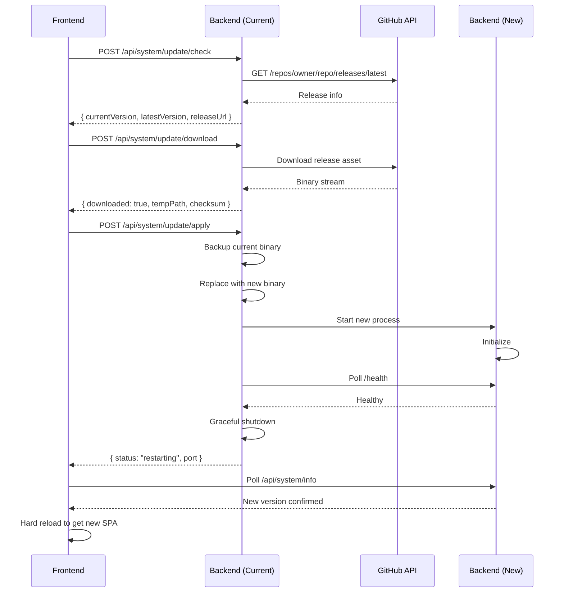
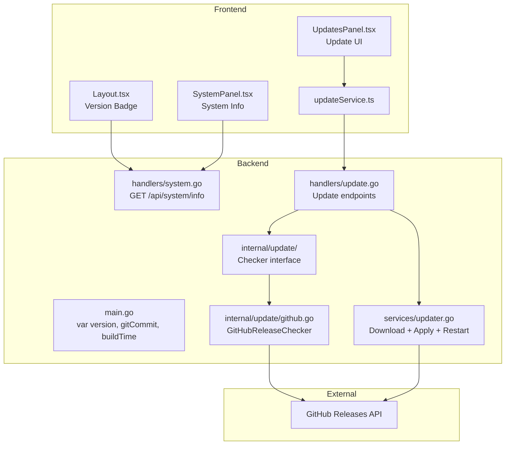

# Version Display & Auto-Update Plan

## Overview

Add version number display to the MiniCluster UI and implement an auto-update mechanism that checks GitHub Releases for new versions, downloads them, and performs a graceful self-restart.

**Key Architectural Decisions:**
- Single version for the whole app (FE SPA is embedded in the Go binary)
- GitHub Releases as the initial update source (isolated behind an interface)
- Graceful self-restart of the backend after downloading a new binary

---

## Phase 1 — Version Display

### 1.1 Add Version Variable to Backend

**File:** [`api-go/cmd/server/main.go`](api-go/cmd/server/main.go) (or new `api-go/cmd/server/version.go`)

Add package-level variables that the ldflags inject during build:

```go
package main

var (
    version   = "dev"
    gitCommit = "unknown"
    buildTime = "unknown"
)
```

The Makefile [`api-go/Makefile:4`](api-go/Makefile:4) already has:
```makefile
VERSION  ?= $(shell git describe --tags --always --dirty 2>/dev/null || echo "dev")
LDFLAGS  := -ldflags "-X main.version=$(VERSION) -s -w"
```

We need to extend LDFLAGS to also inject `gitCommit` and `buildTime`.

### 1.2 Expose Version in /api/system/info

**File:** [`api-go/internal/handlers/system.go`](api-go/internal/handlers/system.go)

Modify the `GetInfo` handler to include version fields in the response map:

```go
writeJSON(w, http.StatusOK, map[string]interface{}{
    "os":           runtime.GOOS,
    "arch":         runtime.GOARCH,
    "runtime":      "go",
    "isService":    isService,
    "serviceType":  serviceType,
    "serviceName":  "MiniCluster",
    "version":      version,     // new
    "gitCommit":    gitCommit,   // new
    "buildTime":    buildTime,   // new
})
```

**Problem:** `version`, `gitCommit`, `buildTime` are in the `main` package but `system.go` is in the `handlers` package.

**Solution:** Either:
- **Option A:** Pass version strings into the `SystemHandler` struct (via constructor injection)
- **Option B:** Store version in the database settings or a config file

**Recommendation: Option A** — inject them via `NewSystemHandler()`:

```go
type SystemHandler struct {
    isServiceFn        func() bool
    installServiceFn   func(exePath string) error
    uninstallServiceFn func() error
    version            string
    gitCommit          string
    buildTime          string
}

func NewSystemHandler(
    isServiceFn func() bool,
    installServiceFn func(exePath string) error,
    uninstallServiceFn func() error,
    version, gitCommit, buildTime string,
) *SystemHandler { ... }
```

In [`main.go:185`](api-go/cmd/server/main.go:185):
```go
systemHandler := handlers.NewSystemHandler(
    IsWindowsServiceActive, InstallWindowsService, UninstallWindowsService,
    version, gitCommit, buildTime,
)
```

### 1.3 Update Frontend SystemInfo Type

**File:** [`ui/app/services/systemService.ts`](ui/app/services/systemService.ts)

Add version fields to the interface:

```typescript
export interface SystemInfo {
  os: string;
  arch: string;
  runtime: string;
  isService: boolean;
  serviceType: "windows" | "systemd" | "none";
  serviceName: string;
  version: string;
  gitCommit: string;
  buildTime: string;
}
```

### 1.4 Display Version in SystemPanel

**File:** [`ui/app/routes/settings/SystemPanel.tsx`](ui/app/routes/settings/SystemPanel.tsx)

Add two new rows to the System Information card (around line 94-106):

```tsx
{ label: "Version",         value: info.version },
{ label: "Git Commit",      value: info.gitCommit?.substring(0, 7) },
```

### 1.5 Compact Version Badge in Header

**File:** [`ui/app/components/Layout.tsx`](ui/app/components/Layout.tsx)

Add a version badge next to the brand name in the header (around line 69-73):

```tsx
<div>
  <h1 className="text-lg font-bold bg-gradient-to-r from-cyan-400 to-blue-500 bg-clip-text text-transparent">
    MiniCluster
  </h1>
  <p className="text-xs text-slate-500 -mt-0.5 hidden sm:block">
    v{version} &middot; Control Center
  </p>
</div>
```

The version would need to be fetched from `/api/system/info` on app load or via the connection context.

---

## Phase 2 — Update Check Backend

### 2.1 Create Isolated Update Package

**New File:** [`api-go/internal/update/checker.go`](api-go/internal/update/checker.go)

Define an interface to make the update source swappable:

```go
package update

// ReleaseInfo represents a available release from any source.
type ReleaseInfo struct {
    Version     string `json:"version"`
    ReleaseURL  string `json:"releaseUrl"`
    ReleaseNotes string `json:"releaseNotes"`
    PublishedAt string `json:"publishedAt"`
    AssetURL    string `json:"assetUrl"`     // download URL for the binary
    AssetName   string `json:"assetName"`    // e.g. minicluster-linux-amd64.tar.gz
    Checksum    string `json:"checksum"`     // SHA256 checksum
}

// Checker defines the interface for checking latest releases.
// Implementations can be swapped (GitHub, custom registry, etc.)
type Checker interface {
    // CheckLatest returns the latest release newer than currentVersion.
    // Returns nil if no update is available.
    CheckLatest(ctx context.Context, currentVersion string) (*ReleaseInfo, error)
}
```

### 2.2 Implement GitHubReleaseChecker

**New File:** [`api-go/internal/update/github.go`](api-go/internal/update/github.go)

```go
package update

type GitHubConfig struct {
    Owner     string // e.g. "innovatek"
    Repo      string // e.g. "minicluster"
    AssetPattern string // e.g. "minicluster-*-linux-amd64.tar.gz"
}

type GitHubReleaseChecker struct {
    config GitHubConfig
    client *http.Client
    cache  *releaseCache
}

func (g *GitHubReleaseChecker) CheckLatest(ctx context.Context, currentVersion string) (*ReleaseInfo, error) {
    // 1. Check cache first
    // 2. GET https://api.github.com/repos/{owner}/{repo}/releases/latest
    // 3. Parse semver tag
    // 4. Compare with currentVersion
    // 5. Find matching asset by pattern
    // 6. Return ReleaseInfo or nil
}
```

### 2.3 Add Caching

**New File:** [`api-go/internal/update/cache.go`](api-go/internal/update/cache.go)

Simple in-memory cache with TTL to avoid hitting GitHub API rate limits (60 req/hr for unauthenticated):

```go
type releaseCache struct {
    mu       sync.RWMutex
    entry    *ReleaseInfo
    cachedAt time.Time
    ttl      time.Duration // default 30 minutes
}
```

### 2.4 API Endpoints

**New File:** [`api-go/internal/handlers/update.go`](api-go/internal/handlers/update.go)

A new handler for update-related endpoints:

```go
type UpdateHandler struct {
    checker   update.Checker
    currentVersion string
    // for download/apply
}

func (h *UpdateHandler) Routes() chi.Router {
    r := chi.NewRouter()
    r.Get("/check", h.check)
    // Phase 3:
    r.Post("/download", h.download)
    r.Post("/apply", h.apply)
    r.Get("/status", h.status)
    return r
}
```

Mount in [`main.go`](api-go/cmd/server/main.go) under `/api/system/update`:

```go
updateHandler := handlers.NewUpdateHandler(checker, version)
r.Mount("/system/update", updateHandler.Routes())
```

### 2.5 Config Section

**File:** [`api-go/internal/config/config.go`](api-go/internal/config/config.go)

Add update configuration:

```go
type UpdateConfig struct {
    Enabled        bool   `yaml:"enabled"`
    GitHubOwner    string `yaml:"githubOwner"`
    GitHubRepo     string `yaml:"githubRepo"`
    CheckInterval  int    `yaml:"checkIntervalMinutes"` // default 60
    AssetPattern   string `yaml:"assetPattern"`         // e.g. "minicluster-{os}-{arch}.tar.gz"
}
```

---

## Phase 3 — Download & Self-Restart

### 3.1 Download Endpoint

`POST /api/system/update/download`

1. Accept `{ version: "v1.2.3" }` in body
2. Find the matching release asset URL
3. Stream download to a temp file (e.g., `/tmp/minicluster-update-<version>`)
4. Verify checksum if available
5. Return `{ downloaded: true, tempPath: "/tmp/...", version: "v1.2.3" }`

### 3.2 Apply Endpoint

`POST /api/system/update/apply`

1. Accept `{ tempPath: "/tmp/minicluster-update-..." }`
2. Back up the current binary (`/usr/local/bin/minicluster` → `/usr/local/bin/minicluster.bak`)
3. Replace the binary
4. Start the new binary as a child process
5. Poll `/health` on the new binary until healthy (timeout: 30s)
6. If healthy: send graceful shutdown signal to old process
7. If unhealthy: restore backup, clean up temp file, return error



### 3.3 Graceful Restart Implementation

**Key considerations:**
- Use `exec.Command` to spawn the new binary with same env vars and args
- Pass a file descriptor or use a socket for seamless handoff (optional)
- Simple approach: start new binary on a different port, then swap
- On Windows: different process management approach needed

**File:** [`api-go/internal/services/updater.go`](api-go/internal/services/updater.go)

```go
func ApplyUpdate(currentExe, newExe, dataDir string, currentPort int) error {
    // 1. Verify new binary works
    // 2. Backup old binary
    // 3. Replace old with new
    // 4. Start new binary with updated env vars
    // 5. Wait for health check
    // 6. Signal old process to shut down
    // 7. Return nil on success
}
```

### 3.4 Status Endpoint

`GET /api/system/update/status`

Returns the current state of any in-progress update:

```json
{
  "state": "idle" | "downloading" | "downloaded" | "applying" | "restarting" | "failed",
  "progress": 45,
  "currentVersion": "v1.0.0",
  "targetVersion": "v1.2.0",
  "error": null
}
```

---

## Phase 4 — Update UI

### 4.1 Create UpdatesPanel Component

**New File:** [`ui/app/routes/settings/UpdatesPanel.tsx`](ui/app/routes/settings/UpdatesPanel.tsx)

A settings panel section with:

```
┌─────────────────────────────────────────┐
│  🔄  Updates                            │
│       Check for new versions            │
│                                          │
│  Current Version:  v1.0.0               │
│  Build:             2026-06-17           │
│  Git Commit:        a1b2c3d             │
│                                          │
│  [Check for Updates]  [Last checked: --] │
│                                          │
│  (if update available)                   │
│  ┌────────────────────────────────────┐  │
│  │  Update Available: v1.2.0         │  │
│  │  Released: June 15, 2026          │  │
│  │  [View Release Notes ↗]           │  │
│  │                                    │  │
│  │  [Download & Install]             │  │
│  └────────────────────────────────────┘  │
│                                          │
│  (during download/apply)                 │
│  ┌────────────────────────────────────┐  │
│  │  Downloading... ████████░░ 80%    │  │
│  │  Applying update... ████░░ 40%    │  │
│  │  Restarting server...             │  │
│  └────────────────────────────────────┘  │
└─────────────────────────────────────────┘
```

### 4.2 API Service for Updates

**New File:** [`ui/app/services/updateService.ts`](ui/app/services/updateService.ts)

```typescript
export interface UpdateCheckResult {
  currentVersion: string;
  latestVersion: string | null;
  releaseUrl: string | null;
  releaseNotes: string | null;
  publishedAt: string | null;
}

export const updateService = {
  async check(): Promise<UpdateCheckResult> {
    return (await apiClient.get("/api/system/update/check")).data;
  },
  async download(version: string): Promise<{ tempPath: string }> {
    return (await apiClient.post("/api/system/update/download", { version })).data;
  },
  async apply(tempPath: string): Promise<{ status: string }> {
    return (await apiClient.post("/api/system/update/apply", { tempPath })).data;
  },
  async status(): Promise<UpdateStatus> {
    return (await apiClient.get("/api/system/update/status")).data;
  }
};
```

### 4.3 Integration in Settings

**File:** [`ui/app/routes/settings.tsx`](ui/app/routes/settings.tsx)

Add "Updates" tab to the settings navigation alongside System, Users, etc.

**File:** [`ui/app/routes/settings/SystemPanel.tsx`](ui/app/routes/settings/SystemPanel.tsx)

Alternatively, incorporate version info and update check directly in the SystemPanel as a new card.

### 4.4 Auto-Reload After Update

When the apply endpoint returns `{ status: "restarting" }`:
1. Show a countdown overlay: "Server is restarting with new version..."
2. Poll `/api/system/info` every 2 seconds until it responds
3. Compare the new version — if different (or if commit changes), hard-reload the page
4. This ensures the fresh SPA bundle (embedded in the new binary) is loaded

---

## Architecture Diagram



---

## Files Changed / Created Summary

| File | Action | Description |
|------|--------|-------------|
| `api-go/cmd/server/version.go` | **Create** | Version variables injected by ldflags |
| `api-go/cmd/server/main.go` | **Modify** | Inject version into handler constructors, mount update routes |
| `api-go/Makefile` | **Modify** | Extend ldflags to include gitCommit and buildTime |
| `api-go/internal/handlers/system.go` | **Modify** | Accept and return version fields |
| `api-go/internal/handlers/update.go` | **Create** | Update check/download/apply/status endpoints |
| `api-go/internal/update/checker.go` | **Create** | Checker interface |
| `api-go/internal/update/github.go` | **Create** | GitHub Releases implementation |
| `api-go/internal/update/cache.go` | **Create** | Cache with TTL |
| `api-go/internal/services/updater.go` | **Create** | Binary download, replace, restart logic |
| `api-go/internal/config/config.go` | **Modify** | Add update config section |
| `ui/app/services/systemService.ts` | **Modify** | Add version fields to SystemInfo |
| `ui/app/services/updateService.ts` | **Create** | Update API client |
| `ui/app/routes/settings/SystemPanel.tsx` | **Modify** | Display version, gitCommit, buildTime |
| `ui/app/routes/settings/UpdatesPanel.tsx` | **Create** | Full update UI component |
| `ui/app/routes/settings.tsx` | **Modify** | Add Updates tab |
| `ui/app/components/Layout.tsx` | **Modify** | Add compact version badge |
